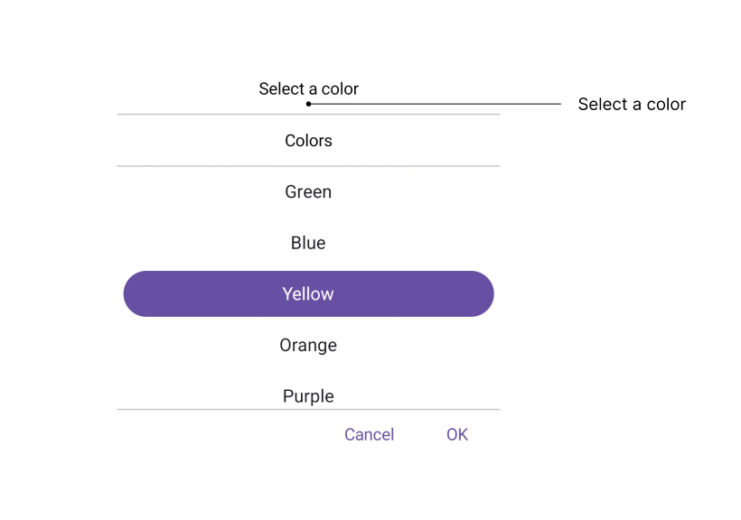
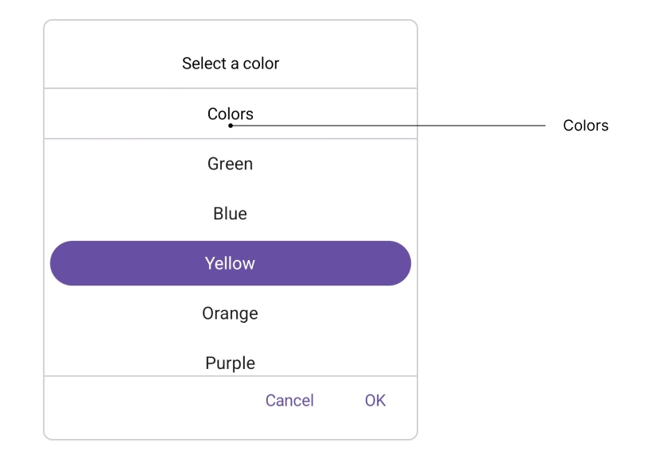
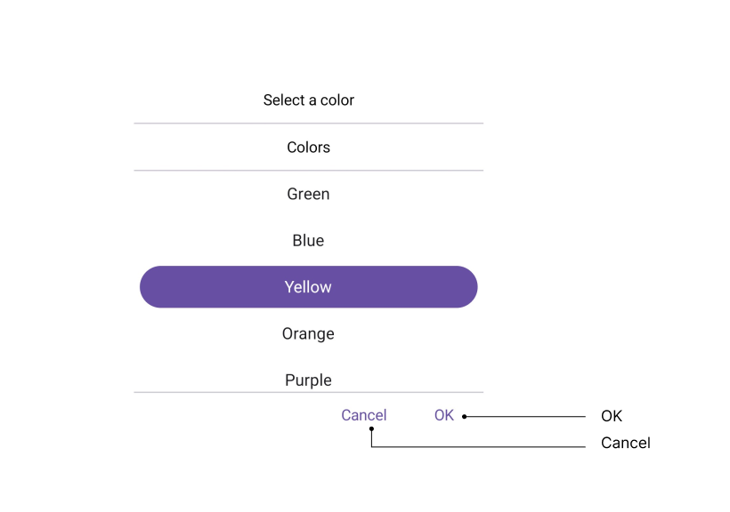
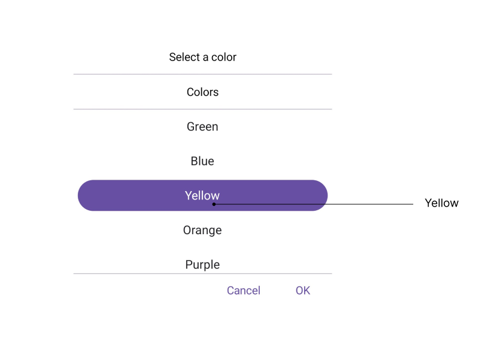

# Accessibility in .NET MAUI Picker (SfPicker)

The [.NET MAUI Picker](https://www.syncfusion.com/maui-controls/maui-picker) control has interact with the `Header`, `Column Header`, `Footer`, and `Picker Items`.

## Header Layout

The SfPicker control has interact [Header Text](https://help.syncfusion.com/cr/maui/Syncfusion.Maui.Picker.PickerHeaderView.html#Syncfusion_Maui_Picker_PickerHeaderView_Text) with localization of header layout.

## Column Header Layout

The SfPicker control has interact [Column Header Text](https://help.syncfusion.com/cr/maui/Syncfusion.Maui.Picker.PickerColumn.html#Syncfusion_Maui_Picker_PickerColumn_HeaderTextProperty) with localization of column header layout.

## Footer Layout

The SfPicker control has interact validation buttons (OK and Cancel) with localization of footer layout. The Default value of the [OkButtonText](https://help.syncfusion.com/cr/maui/Syncfusion.Maui.Picker.PickerFooterView.html#Syncfusion_Maui_Picker_PickerFooterView_OkButtonText) property is "OK", and [CancelButtonText](https://help.syncfusion.com/cr/maui/Syncfusion.Maui.Picker.PickerFooterView.html#Syncfusion_Maui_Picker_PickerFooterView_CancelButtonText) is "Cancel".

## Picker Items

The SfPicker control has interact with the [Item Source](https://help.syncfusion.com/cr/maui/Syncfusion.Maui.Picker.PickerColumn.html#Syncfusion_Maui_Picker_PickerColumn_ItemsSourceProperty) in picker items.

## Keyboard
`SfPicker` supports selection using keyboard interactions.

<table>
<tr>
<th>
Key
</th>
<th>
Description
</th>
</tr>
<tr>
<td>
Tab
</td>
<td>
Focus the picker.
</td>
</tr>
<tr>
<td>
Enter
</td>
<td>
Opens the selected picker.
</td>
</tr>
<tr>
<td>
DownArrow
</td>
<td>
Selects an item from the currently expanded list by moving downwards.
</td>
</tr>
<tr>
<td>
UpArrow
</td>
<td>
Selects an item from the currently expanded list by moving upwards.
</td>
</tr>
<tr>
<td>
RightArrow/Tab
</td>
<td>
Navigates through the selected item in the right direction.
</td>
</tr>
<tr>
<td>
LeftArrow/Shift+Tab
</td>
<td>
Navigates through the selected item in the left direction.
</td>
</tr>
<tr>
<td>
Esc/Enter
</td>
<td>
Exit and commit selection.
</td>
</tr>
</table>
