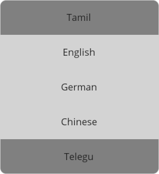

# DataTemplateSelector in .NET MAUI Picker (SfPicker)

The DataTemplateSelector feature of `SfPicker` allows selecting a DataTemplate based on the data object provided.




<Grid>
    <Grid.Resources>
        <DataTemplate x:Key="indianLanguage">
            <Grid>
                <Label Grid.Column="1" HorizontalTextAlignment="Center" BackgroundColor="#808080" VerticalTextAlignment="Center" Text="{Binding Data}"/>
            </Grid>
        </DataTemplate>
        <DataTemplate x:Key="otherLanguage">
            <Grid>
                <Label HorizontalTextAlignment="Center" VerticalTextAlignment="Center" BackgroundColor="#D3D3D3" Text="{Binding Data}"/>
            </Grid>
        </DataTemplate>
        <local:PickerTemplate x:Key="pickerTemplate"
                                IndianLanguages="{StaticResource indianLanguage}" 
                                OtherLanguages="{StaticResource otherLanguage}"/>
    </Grid.Resources>
    <sfPicker:SfPicker x:Name="picker" ItemTemplate="{StaticResource pickerTemplate}">
    </sfPicker:SfPicker>
</Grid>




    ObservableCollection<string> languages = new ObservableCollection<string> { "Spanish", "French", "Tamil", "English", "German", "Chinese", "Telugu", "Japanese", "Arabic", "Russian", "Portuguese", "Italian" };
    PickerColumn pickerColumn = new PickerColumn()
    {
        HeaderText = "Select Languages",
        ItemsSource = languages,
        SelectedIndex = 1,
    };
    this.picker.Columns.Add(pickerColumn);




    public class PickerTemplate : DataTemplateSelector
    {
        public DataTemplate IndianLanguages { get; set; }
        public DataTemplate OtherLanguages { get; set; }
        protected override DataTemplate OnSelectTemplate(object item, BindableObject container)
        {
            PickerItemDetails pickerItemDetails = item as PickerItemDetails;
            string language = pickerItemDetails.Data.ToString();
            if (language == "Tamil" || language == "Telugu")
            {
                return this.IndianLanguages;
            }
            else
            {
                return this.OtherLanguages;
            }
        }
    }




   