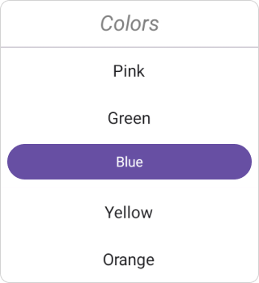
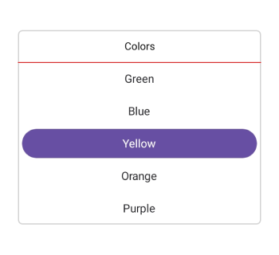

# Dealing with Column Header in .NET MAUI Picker (SfPicker)

This section explains the column header customization of picker control.

## Column header view

The SfPicker enables or disables the column header section by setting the SfPicker.ColumnHeaderView.Height property to a value greater than 0. The default value of the [Height](https://help.syncfusion.com/cr/maui/Syncfusion.Maui.Picker.PickerColumnHeaderView.html#Syncfusion_Maui_Picker_PickerColumnHeaderView_Height) property is 0.




    <sfPicker:SfPicker x:Name="picker">
        <sfPicker:SfPicker.ColumnHeaderView>
            <sfPicker:PickerColumnHeaderView Height="40"/>
        </sfPicker:SfPicker.ColumnHeaderView>
    </sfPicker:SfPicker>




    this.picker.ColumnHeaderView.Height= 40;




   

## Column header customization

Enhancing Column Header with `Height`, `Text Style`, `Background`, and `DividerColor` Properties.

### Background

The column header [Background](https://help.syncfusion.com/cr/maui/Syncfusion.Maui.Picker.PickerColumnHeaderView.html#Syncfusion_Maui_Picker_PickerColumnHeaderView_Background) color can be customized by setting the SfPicker.ColumnHeaderView.Background property.




    <sfPicker:SfPicker x:Name="picker">
        <sfPicker:SfPicker.ColumnHeaderView>
            <sfPicker:PickerColumnHeaderView Background="#E5E4E2"/>
        </sfPicker:SfPicker.ColumnHeaderView>
    </sfPicker:SfPicker>




    this.picker.ColumnHeaderView.Background = Color.FromArgb("#E5E4E2"),




   

### Column header text style

The .NET MAUI Picker control and column header [TextStyle](https://help.syncfusion.com/cr/maui/Syncfusion.Maui.Picker.PickerColumnHeaderView.html#Syncfusion_Maui_Picker_PickerColumnHeaderView_TextStyle) such as text color, font size, font family, and font attributes can be customized as shown in the following code.




    <sfPicker:SfPicker x:Name="picker">
      <sfPicker:SfPicker.ColumnHeaderView>
          <sfPicker:PickerColumnHeaderView>
              <sfPicker:PickerColumnHeaderView.TextStyle>
                  <sfPicker:PickerTextStyle TextColor="Gray" 
                  FontSize="18" 
                  FontAttributes="Italic"/>
              </sfPicker:PickerColumnHeaderView.TextStyle>
          </sfPicker:PickerColumnHeaderView>
      </sfPicker:SfPicker.ColumnHeaderView>
    </sfPicker:SfPicker>




    this.picker.ColumnHeaderView.TextStyle = new PickerTextStyle()
    {
        TextColor = Colors.Gray,
        FontSize = 18,
        FontAttributes = FontAttributes.Italic
    };




   

### Divider color

The .NET MAUI Picker control, Separator line background customized by setting `SfPicker.ColumnHeaderView.DividerColor` property.




    <sfPicker:SfPicker x:Name="picker">
        <sfPicker:SfPicker.ColumnHeaderView>
            <sfPicker:PickerColumnHeaderView DividerColor="Red"/>
        </sfPicker:SfPicker.ColumnHeaderView>
    </sfPicker:SfPicker>




    this.picker.ColumnHeaderView.DividerColor = Colors.Red;




   