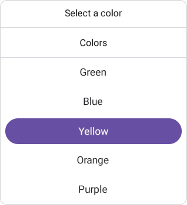
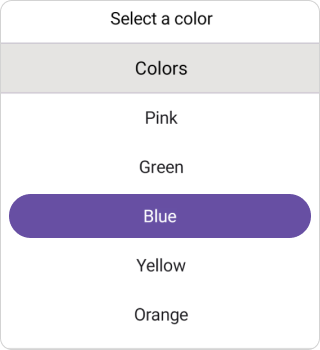
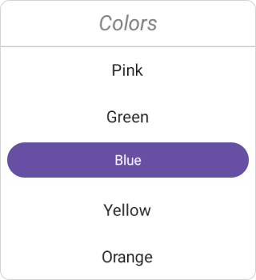
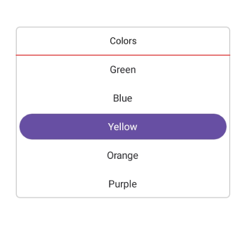
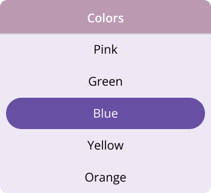

# Dealing with Column Header in .NET MAUI Picker (SfPicker)

This section explains the column header customization of picker control.

## Column header view

The SfPicker enables or disables the column header section via the [Height](https://help.syncfusion.com/cr/maui/Syncfusion.Maui.Picker.PickerColumnHeaderView.html#Syncfusion_Maui_Picker_PickerColumnHeaderView_Height) property of the column header view. Set the property to a value greater than 0 to display the column header; the default value is 0.




<ContentPage
    . . .
    xmlns:picker="clr-namespace:Syncfusion.Maui.Picker;assembly=Syncfusion.Maui.Picker">
    <picker:SfPicker x:Name="picker">
        <picker:SfPicker.ColumnHeaderView>
            <picker:PickerColumnHeaderView Height="40"/>
        </picker:SfPicker.ColumnHeaderView>
    </picker:SfPicker>
</ContentPage>




using Syncfusion.Maui.Picker;
. . .

SfPicker picker = new SfPicker();
picker.ColumnHeaderView.Height = 40;

this.Content = picker;




## Column header customization

Customize the column header using the `Height`, `TextStyle`, `Background`, and `DividerColor` properties.

### Background

The column header [Background](https://help.syncfusion.com/cr/maui/Syncfusion.Maui.Picker.PickerColumnHeaderView.html#Syncfusion_Maui_Picker_PickerColumnHeaderView_Background) color can be customized by setting the column header view's `Background` property.




<ContentPage
    . . .
    xmlns:picker="clr-namespace:Syncfusion.Maui.Picker;assembly=Syncfusion.Maui.Picker">
    <picker:SfPicker x:Name="picker">
        <picker:SfPicker.ColumnHeaderView>
            <picker:PickerColumnHeaderView Background="#E5E4E2"/>
        </picker:SfPicker.ColumnHeaderView>
    </picker:SfPicker>
</ContentPage>




using Syncfusion.Maui.Picker;
. . .

SfPicker picker = new SfPicker();
picker.ColumnHeaderView.Background = Color.FromArgb("#E5E4E2");

this.Content = picker;




   

### Column header text style

Customize the column header [TextStyle](https://help.syncfusion.com/cr/maui/Syncfusion.Maui.Picker.PickerColumnHeaderView.html#Syncfusion_Maui_Picker_PickerColumnHeaderView_TextStyle) — including `TextColor`, `FontSize`, `FontFamily`, and `FontAttributes` — as shown in the following code.




<ContentPage
    . . .
    xmlns:picker="clr-namespace:Syncfusion.Maui.Picker;assembly=Syncfusion.Maui.Picker">
    <picker:SfPicker x:Name="picker">
        <picker:SfPicker.ColumnHeaderView>
            <picker:PickerColumnHeaderView>
                <picker:PickerColumnHeaderView.TextStyle>
                    <picker:PickerTextStyle TextColor="Gray"
                                            FontSize="18"
                                            FontAttributes="Italic"/>
                </picker:PickerColumnHeaderView.TextStyle>
            </picker:PickerColumnHeaderView>
        </picker:SfPicker.ColumnHeaderView>
    </picker:SfPicker>
</ContentPage>




using Syncfusion.Maui.Picker;
. . .

SfPicker picker = new SfPicker();
picker.ColumnHeaderView.TextStyle = new PickerTextStyle()
{
    TextColor = Colors.Gray,
    FontSize = 18,
    FontAttributes = FontAttributes.Italic
};

this.Content = picker;




   

### Divider color

The column header separator line is customized by setting the `SfPicker.ColumnHeaderView.DividerColor` property.




<ContentPage
    . . .
    xmlns:picker="clr-namespace:Syncfusion.Maui.Picker;assembly=Syncfusion.Maui.Picker">
    <picker:SfPicker x:Name="picker">
        <picker:SfPicker.ColumnHeaderView>
            <picker:PickerColumnHeaderView DividerColor="Red"/>
        </picker:SfPicker.ColumnHeaderView>
    </picker:SfPicker>
</ContentPage>




using Syncfusion.Maui.Picker;
. . .

SfPicker picker = new SfPicker();
picker.ColumnHeaderView.DividerColor = Colors.Red;

this.Content = picker;




   

### Custom Column Header Appearance using Data template

You can customize the picker column header appearance by using the [ColumnHeaderTemplate](https://help.syncfusion.com/cr/maui/Syncfusion.Maui.Picker.PickerBase.html#Syncfusion_Maui_Picker_PickerBase_ColumnHeaderTemplate) property in the [SfPicker](https://help.syncfusion.com/cr/maui/Syncfusion.Maui.Picker.SfPicker.html).





<ContentPage
    . . .
    xmlns:picker="clr-namespace:Syncfusion.Maui.Picker;assembly=Syncfusion.Maui.Picker">
    <picker:SfPicker x:Name="picker">
        <picker:SfPicker.ColumnHeaderTemplate>
            <DataTemplate>
                <Grid BackgroundColor="#BB9AB1">
                    <Label Text="Colors" TextColor="White" HorizontalTextAlignment="Center" VerticalTextAlignment="Center"/>
                </Grid>
            </DataTemplate>
        </picker:SfPicker.ColumnHeaderTemplate>
    </picker:SfPicker>
</ContentPage>





N> If a template is applied to the column header in the [PickerColumnHeaderView](https://help.syncfusion.com/cr/maui/Syncfusion.Maui.Picker.PickerColumnHeaderView.html), the remaining column header properties will not have any effect, except for the [DividerColor](https://help.syncfusion.com/cr/maui/Syncfusion.Maui.Picker.PickerColumnHeaderView.html#Syncfusion_Maui_Picker_PickerColumnHeaderView_DividerColor) Property.

### Custom Column Header appearance using DataTemplateSelector

You can customize the picker column header appearance by using the [ColumnHeaderTemplate](https://help.syncfusion.com/cr/maui/Syncfusion.Maui.Picker.PickerBase.html#Syncfusion_Maui_Picker_PickerBase_ColumnHeaderTemplate) property in the [SfPicker](https://help.syncfusion.com/cr/maui/Syncfusion.Maui.Picker.SfPicker.html). The DataTemplateSelector allows you to choose a DataTemplate at runtime based on the value bound to the picker column header. This lets you apply a custom data template to the column header and customize its appearance based on specific conditions.





<ContentPage
    . . .
    xmlns:picker="clr-namespace:Syncfusion.Maui.Picker;assembly=Syncfusion.Maui.Picker">
    <Grid.Resources>
        <DataTemplate x:Key="selectedItemTemplate">
            <Grid Background="LightBlue">
                <Label Text="Colors" HorizontalOptions="Center" VerticalOptions="Center" TextColor="Red"/>
            </Grid>
        </DataTemplate>
        <DataTemplate x:Key="nonSelectedItemTemplate">
            <Grid Background="LightGreen">
                <Label Text="Colors" HorizontalOptions="Center" VerticalOptions="Center" TextColor="Orange"/>
            </Grid>
        </DataTemplate>
        <local:PickerTemplateSelector x:Key="columnHeaderTemplateSelector" SelectedItemTemplate="{StaticResource selectedItemTemplate}" NonSelectedItemTemplate="{StaticResource nonSelectedItemTemplate}"/>
        <picker:SfPicker x:Name="picker" ColumnHeaderTemplate="{StaticResource columnHeaderTemplateSelector}">
        </picker:SfPicker>
    </Grid.Resources>
</ContentPage>





public class PickerTemplateSelector : DataTemplateSelector
{
    public PickerTemplateSelector()
    {
    }
    public DataTemplate SelectedItemTemplate { get; set; }
    public DataTemplate NonSelectedItemTemplate { get; set; }
    protected override DataTemplate OnSelectTemplate(object item, BindableObject container)
    {
        var Details = item as PickerColumn;
        if (Details != null)
        {
            if (Details.SelectedIndex <= 4)
                return SelectedItemTemplate;
        }
        return NonSelectedItemTemplate;
    }
}




