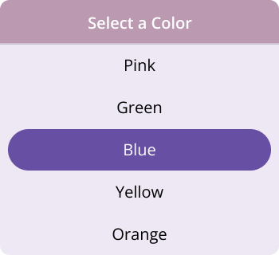

# Dealing with Header, Footer and Selection in MAUI Picker (SfPicker)

This section explains the header, footer and selection view customization of picker control.

## Enable or disable header

SfPicker enables or disables the header section by setting the `SfPicker.HeaderView.Height` property to a value greater than 0. The default value of the [Height](https://help.syncfusion.com/cr/maui/Syncfusion.Maui.Picker.PickerHeaderView.html#Syncfusion_Maui_Picker_PickerHeaderView_Height) property is 0.




<sfPicker:SfPicker x:Name="picker">
    <sfPicker:SfPicker.HeaderView>
        <sfPicker:PickerHeaderView Height="40"/>
    </sfPicker:SfPicker.HeaderView>
</sfPicker:SfPicker>




    this.picker.HeaderView.Height= 40;




   

## CloseButtonIcon

### Enable CloseButton

You can enable the CloseButton in the [SfPicker](https://help.syncfusion.com/cr/maui/Syncfusion.Maui.Picker.SfPicker.html) header by using the [ShowCloseButton](https://help.syncfusion.com/cr/maui/Syncfusion.Maui.Picker.PickerBase.html#Syncfusion_Maui_Picker_PickerBase_ShowCloseButton) property. The default value is false.





<Grid>
    <picker:SfPicker x:Name="picker" Mode="Dialog" ShowCloseButton="True">
        <picker:SfPicker.HeaderView >
            <picker:PickerHeaderView Height="40" Text="Date Picker"/>
        </picker:SfPicker.HeaderView>
    </picker:SfPicker>
    <Button Text="Open Picker" 
            x:Name="pickerButton"
            Clicked="Button_Clicked"
            HorizontalOptions="Center"
            VerticalOptions="Center"
            HeightRequest="50" 
            WidthRequest="150">
    </Button>
</Grid>





private void Button_Clicked(object sender, EventArgs e)
{
    picker.IsOpen = true;
}





N>For the CloseButton to render properly, the header view must be present; otherwise, it will not function.

### Enable CloseButtonIcon

You can enable the CloseButtonIcon in the [SfPicker](https://help.syncfusion.com/cr/maui/Syncfusion.Maui.Picker.SfPicker.html) header by assigning a value to the [CloseButtonIcon](https://help.syncfusion.com/cr/maui/Syncfusion.Maui.Picker.PickerBase.html#Syncfusion_Maui_Picker_PickerBase_CloseButtonIcon) property. The default value is false.





<Grid>
    <picker:SfTimePicker x:Name="timePicker" ShowCloseButton="True" Mode="Dialog" CloseButtonIcon="closeicon.png">
        <picker:SfTimePicker.HeaderView >
            <picker:PickerHeaderView Height="40" Text="Date Picker"/>
        </picker:SfTimePicker.HeaderView>
    </picker:SfTimePicker>
    <Button Text="Open Picker" 
            x:Name="pickerButton"
            Clicked="Button_Clicked"
            HorizontalOptions="Center"
            VerticalOptions="Center"
            HeightRequest="50" 
            WidthRequest="150">
    </Button>
</Grid>





private void Button_Clicked(object sender, EventArgs e)
{
    timePicker.IsOpen = true;
}





N>The ShowCloseButton property must be set to true for the close button icon to be displayed.

## Header customization

SfPicker allows customizing background, text style.

### Background

The Header’s [Background](https://help.syncfusion.com/cr/maui/Syncfusion.Maui.Picker.PickerHeaderView.html#Syncfusion_Maui_Picker_PickerHeaderView_Background) color can be customized by setting the `SfPicker.HeaderView.Background` property.




<sfPicker:SfPicker x:Name="picker">
    <sfPicker:SfPicker.HeaderView>
        <sfPicker:PickerHeaderView Background="#D3D3D3"/>
    </sfPicker:SfPicker.HeaderView>
</sfPicker:SfPicker>




    this.picker.HeaderView.Background = Color.FromArgb("#6750A4");




   

### Header text style

The .NET MAUI Picker control and header [TextStyle](https://help.syncfusion.com/cr/maui/Syncfusion.Maui.Picker.PickerHeaderView.html#Syncfusion_Maui_Picker_PickerHeaderView_TextStyle) such as `TextColor`, `FontSize`, `FontFamily`, and `FontAttributes` can be customized as shown in the following code.




<sfPicker:SfPicker x:Name="picker">
    <sfPicker:SfPicker.HeaderView>
        <sfPicker:PickerHeaderView>
            <sfPicker:PickerHeaderView.TextStyle>
                <sfPicker:PickerTextStyle TextColor="Gray" 
                FontSize="18" 
                FontAttributes="Italic"/>
            </sfPicker:PickerHeaderView.TextStyle>
        </sfPicker:PickerHeaderView>
    </sfPicker:SfPicker.HeaderView>
</sfPicker:SfPicker>




    this.picker.HeaderView.TextStyle = new PickerTextStyle()
    {
        TextColor = Colors.Gray,
        FontSize = 18,
        FontAttributes = FontAttributes.Italic
    };




   

### Divider color

The Header’s [DividerColor](https://help.syncfusion.com/cr/maui/Syncfusion.Maui.Picker.PickerHeaderView.html#Syncfusion_Maui_Picker_PickerHeaderView_DividerColor) color can be customized by setting the `SfPicker.HeaderView.DividerColor` property.




<sfPicker:SfPicker x:Name="picker">
    <sfPicker:SfPicker.HeaderView>
        <sfPicker:PickerHeaderView DividerColor="Red"/>
    </sfPicker:SfPicker.HeaderView>
</sfPicker:SfPicker>




    this.picker.HeaderView.DividerColor = Colors.Red;




   

### Custom Header Appearance using Datatemplate

You can customize the picker header appearance by using the [HeaderTemplate](https://help.syncfusion.com/cr/maui/Syncfusion.Maui.Picker.PickerBase.html#Syncfusion_Maui_Picker_PickerBase_HeaderTemplate) property in the [SfPicker](https://help.syncfusion.com/cr/maui/Syncfusion.Maui.Picker.SfPicker.html).





<Picker:SfPicker x:Name="picker" >
    <picker:SfPicker.HeaderTemplate>
        <DataTemplate>
            <Grid BackgroundColor="#BB9AB1">
                <Label HorizontalOptions="Center" VerticalOptions="Center" Text="Select a Color" TextColor="White"/>
            </Grid>
        </DataTemplate>
    </picker:SfPicker.HeaderTemplate>
</Picker:SfPicker>





N> If a template is applied to the header in the [PickerHeaderView](https://help.syncfusion.com/cr/maui/Syncfusion.Maui.Picker.PickerHeaderView.html), the remaining header properties will not have any effect, except for the [DividerColor](https://help.syncfusion.com/cr/maui/Syncfusion.Maui.Picker.PickerHeaderView.html#Syncfusion_Maui_Picker_PickerHeaderView_DividerColor) Property.

### Custom Header appearance using DataTemplateSelector

You can customize the picker header appearance by using the [HeaderTemplate](https://help.syncfusion.com/cr/maui/Syncfusion.Maui.Picker.PickerBase.html#Syncfusion_Maui_Picker_PickerBase_HeaderTemplate) property in the [SfPicker](https://help.syncfusion.com/cr/maui/Syncfusion.Maui.Picker.SfPicker.html). The DataTemplateSelector allows you to choose a DataTemplate at runtime based on the value bound to the picker header. This lets you apply a custom data template to the header and customize its appearance based on specific conditions.





<Grid.Resources>
    <DataTemplate x:Key="selectedItemTemplate">
    <Grid Background = "LightBlue" >
        <Label Text="Select a Color"  HorizontalOptions="Center" VerticalOptions="Center" TextColor="Red"/>
    </Grid>
</DataTemplate>
<DataTemplate x:Key="nonSelectedItemTemplate">
    <Grid Background="LightGreen" >
        <Label Text="Select a Color"  HorizontalOptions="Center" VerticalOptions="Center" TextColor="Orange"/>
    </Grid>
</DataTemplate>
    <local:PickerTemplateSelector x:Key="headerTemplateSelector" SelectedItemTemplate="{StaticResource selectedItemTemplate}"  NonSelectedItemTemplate="{StaticResource nonSelectedItemTemplate}"/>
    <picker:SfPicker x:Name="picker" HeaderTemplate="{StaticResource headerTemplateSelector}">
    </picker:SfPicker>
</Grid.Resources>





public class PickerTemplateSelector : DataTemplateSelector
{
    public PickerTemplateSelector()
    {
    }
    public DataTemplate SelectedItemTemplate { get; set; }
    public DataTemplate NonSelectedItemTemplate { get; set; }
    protected override DataTemplate OnSelectTemplate(object item, BindableObject container)
    {      
        var Details = item as PickerColumn;
        if (Details != null)
        {
            if (Details.SelectedIndex <= 4)
                return SelectedItemTemplate;
        }
        return NonSelectedItemTemplate;
    }
}





## Enable or disable footer

SfPicker enables or disables the footer section by setting the `SfPicker.FooterView.Height` property to a value greater than 0. The default value of the [Height](https://help.syncfusion.com/cr/maui/Syncfusion.Maui.Picker.PickerFooterView.html#Syncfusion_Maui_Picker_PickerFooterView_Height) property is 0.




<sfPicker:SfPicker x:Name="picker">
    <sfPicker:SfPicker.FooterView>
        <sfPicker:PickerFooterView Height="40"/>
    </sfPicker:SfPicker.FooterView>
</sfPicker:SfPicker>




    this.picker.FooterView.Height= 40;




   

## Footer view customization

SfPicker allows customizing the background, text, and text style of the `ok` and `cancel` buttons and the visibility of the ok button.

### Background

The Header’s [Background](https://help.syncfusion.com/cr/maui/Syncfusion.Maui.Picker.PickerFooterView.html#Syncfusion_Maui_Picker_PickerFooterView_Background) color can be customized by setting the `SfPicker.HeaderView.Background` property.




<sfPicker:SfPicker x:Name="picker">
    <sfPicker:SfPicker.FooterView>
        <sfPicker:PickerFooterView Background="#D3D3D3"/>
    </sfPicker:SfPicker.FooterView>
</sfPicker:SfPicker>




    this.picker.FooterView.Background = Color.FromArgb("#6750A4");




   

### Buttons customization

SfPicker enables or disables the `ok` button by setting the `SfPicker.FooterView.ShowOkButton` property to true or false. The default value of the [ShowOkButton](https://help.syncfusion.com/cr/maui/Syncfusion.Maui.Picker.PickerFooterView.html#Syncfusion_Maui_Picker_PickerFooterView_ShowOkButton) property is true. Customize the text of the `ok` and `cancel` buttons using the [OkButtonText](https://help.syncfusion.com/cr/maui/Syncfusion.Maui.Picker.PickerFooterView.html#Syncfusion_Maui_Picker_PickerFooterView_OkButtonText) and [CancelButtonText](https://help.syncfusion.com/cr/maui/Syncfusion.Maui.Picker.PickerFooterView.html#Syncfusion_Maui_Picker_PickerFooterView_CancelButtonText) property.




<sfPicker:SfPicker x:Name="picker">
    <sfPicker:SfPicker.FooterView>
        <sfPicker:PickerFooterView 
            ShowOkButton="False" 
            OkButtonText="Done" 
            CancelButtonText="Exit"/>
    </sfPicker:SfPicker.FooterView>
</sfPicker:SfPicker>




    this.picker.FooterView.OkButtonShow = false;
    this.picker.FooterView.OkButtonText= "Done";
    this.picker.FooterView.CancelButtonText= "Exit";
  



   

### Footer text style

The .NET MAUI Picker control and footer [TextStyle](https://help.syncfusion.com/cr/maui/Syncfusion.Maui.Picker.PickerFooterView.html#Syncfusion_Maui_Picker_PickerFooterView_TextStyle) such as `TextColor`, `FontSize`, `FontFamily`, and `FontAttributes` can be customized as shown in the following code.




<sfPicker:SfPicker>
<sfPicker:SfPicker.FooterView>
    <sfPicker:PickerFooterView>
    <sfPicker:PickerFooterView.TextStyle>
        <sfPicker:PickerTextStyle TextColor="Gray" FontSize="18" FontAttributes="Italic"/>
    </sfPicker:PickerFooterView.TextStyle>
    </sfPicker:PickerFooterView>
</sfPicker:SfPicker.FooterView>
</sfPicker:SfPicker>




    this.picker.FooterView.TextStyle = new PickerTextStyle()
    {
        TextColor = Colors.Gray,
        FontSize = 18,
        FontAttributes = FontAttributes.Italic
    };




   

### Divider color

The Footer’s [DividerColor](https://help.syncfusion.com/cr/maui/Syncfusion.Maui.Picker.PickerFooterView.html#Syncfusion_Maui_Picker_PickerFooterView_DividerColor) color can be customized by setting the `SfPicker.FooterView.DividerColor` property.




<sfPicker:SfPicker x:Name="picker">
    <sfPicker:SfPicker.FooterView>
        <sfPicker:PickerFooterView DividerColor="Red"/>
    </sfPicker:SfPicker.FooterView>
</sfPicker:SfPicker>




    this.picker.FooterView.DividerColor = Colors.Red;




   

### Custom Footer Appearance using Datatemplate

You can customize the picker footer appearance by using the [FooterTemplate](https://help.syncfusion.com/cr/maui/Syncfusion.Maui.Picker.PickerBase.html#Syncfusion_Maui_Picker_PickerBase_FooterTemplate) property in the [SfPicker](https://help.syncfusion.com/cr/maui/Syncfusion.Maui.Picker.SfPicker.html).





<Picker:SfPicker x:Name="picker" >
    <picker:SfPicker.FooterTemplate>
        <DataTemplate>
            <Grid BackgroundColor="#BB9AB1">
                <Grid.ColumnDefinitions>
                    <ColumnDefinition/>
                    <ColumnDefinition/>
                </Grid.ColumnDefinitions>
                <Button Grid.Column="0" Text="Decline" TextColor="White" Background="Transparent" />
                <Button Grid.Column="1" Text="Accept" TextColor="White" Background="Transparent" />
            </Grid>
        </DataTemplate>
    </picker:SfPicker.FooterTemplate>
</Picker:SfPicker>





N> If a template is applied to the footer in the [PickerFooterView](https://help.syncfusion.com/cr/maui/Syncfusion.Maui.Picker.PickerFooterView.html), the remaining footer properties will not have any effect, except for the [DividerColor](https://help.syncfusion.com/cr/maui/Syncfusion.Maui.Picker.PickerFooterView.html#Syncfusion_Maui_Picker_PickerFooterView_DividerColor) Property.

### Custom Footer appearance using DataTemplateSelector

You can customize the picker footer appearance by using the [FooterTemplate](https://help.syncfusion.com/cr/maui/Syncfusion.Maui.Picker.PickerBase.html#Syncfusion_Maui_Picker_PickerBase_FooterTemplate) property in the [SfPicker](https://help.syncfusion.com/cr/maui/Syncfusion.Maui.Picker.SfPicker.html). The DataTemplateSelector allows you to choose a DataTemplate at runtime based on the value bound to the picker footer. This lets you apply a custom data template to the footer and customize its appearance based on specific conditions.





<Grid.Resources>
    <DataTemplate x:Key="selectedItemTemplate">
        <Grid Background = "LightBlue" >
            <Grid.ColumnDefinitions>
                <ColumnDefinition/>
                <ColumnDefinition/>
            </Grid.ColumnDefinitions>
                <Button Grid.Column="0" Text="Decline" TextColor="White" Background="Transparent" />
                <Button Grid.Column="1" Text="Accept" TextColor="White" Background="Transparent" /> 
        </Grid>
    </DataTemplate>
    <DataTemplate x:Key="nonSelectedItemTemplate">
        <Grid Background="LightGreen" >
            <Grid.ColumnDefinitions>
                <ColumnDefinition/>
                <ColumnDefinition/>
            </Grid.ColumnDefinitions>
                <Button Grid.Column="0" Text="Decline" TextColor="White" Background="Transparent" />
                <Button Grid.Column="1" Text="Accept" TextColor="White" Background="Transparent" />
            </Grid>
    </DataTemplate>
    <local:PickerTemplateSelector x:Key="footerTemplateSelector" SelectedItemTemplate="{StaticResource selectedItemTemplate}"  NonSelectedItemTemplate="{StaticResource nonSelectedItemTemplate}"/>
    <picker:SfPicker x:Name="picker" FooterTemplate="{StaticResource footerTemplateSelector}">
    </picker:SfPicker>
</Grid.Resources>





public class PickerTemplateSelector : DataTemplateSelector
{
    public PickerTemplateSelector()
    {
    }
    public DataTemplate SelectedItemTemplate { get; set; }
    public DataTemplate NonSelectedItemTemplate { get; set; }
    protected override DataTemplate OnSelectTemplate(object item, BindableObject container)
    {
        var Details = item as PickerColumn;
        if (Details != null)
        {
            if (Details.SelectedIndex <= 4)
                return SelectedItemTemplate;
        }
        return NonSelectedItemTemplate;
    }
}





## Perform validation with default validation button

Picker allows validation based on the OK or Cancel button by hooking into the `SfPicker.OkButtonClicked` and `SfPicker.CancelButtonClicked` In this event, from the `SelectionChangedEvent` argument, current selected items can be obtained.




    <sfPicker:SfPicker x:Name="picker"
                       OkButtonClicked="SfPicker_OkButtonClicked"
                       CancelButtonClicked="SfPicker_CancelButtonClicked">
    </sfPicker:SfPicker>




    this.picker.OkButtonClicked += SfPicker_OkButtonClicked;
    this.picker.CancelButtonClicked += SfPicker_CancelButtonClicked;
    private void SfPicker_OkButtonClicked(object sender, EventArgs e)
    {
      //// Perform any operation.
    }

    private void SfPicker_CancelButtonClicked(object sender, EventArgs e)
    {
      //// Perform any operation.
    }
    



## Selection view customization

Customize the picker selection view by using the SelectionView property of the SfPicker.

### Background and selection shape customization

In the SfPicker control, the corner radius, stroke, background and padding can be customized by setting the [CornerRadius](https://help.syncfusion.com/cr/maui/Syncfusion.Maui.Picker.PickerSelectionView.html#Syncfusion_Maui_Picker_PickerSelectionView_CornerRadius), [Stroke](https://help.syncfusion.com/cr/maui/Syncfusion.Maui.Picker.PickerSelectionView.html#Syncfusion_Maui_Picker_PickerSelectionView_Stroke), [Background](https://help.syncfusion.com/cr/maui/Syncfusion.Maui.Picker.PickerSelectionView.html#Syncfusion_Maui_Picker_PickerSelectionView_Background) and [Padding](https://help.syncfusion.com/cr/maui/Syncfusion.Maui.Picker.PickerSelectionView.html#Syncfusion_Maui_Picker_PickerSelectionView_Padding) properties in the [PickerSelectionView](https://help.syncfusion.com/cr/maui/Syncfusion.Maui.Picker.PickerSelectionView.html).




<picker:SfPicker x:Name="picker" >
    <picker:SfPicker.SelectionView >
        <picker:PickerSelectionView CornerRadius="10" Stroke="#36454F" Padding="10, 5, 10, 5" Background="#808080" />
    </picker:SfPicker.SelectionView>
</picker:SfPicker>




SfPicker picker = new SfPicker();
picker.SelectionView = new PickerSelectionView()
{
    CornerRadius = 10,
    Stroke = Color.FromArgb("#36454F"),
    Padding = new Thickness(10, 5, 10, 5),
    Background = Color.FromArgb("#808080"),
};

this.Content = picker;




   
