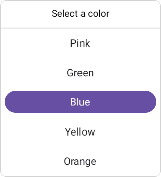
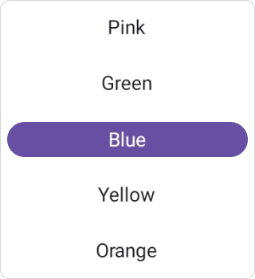
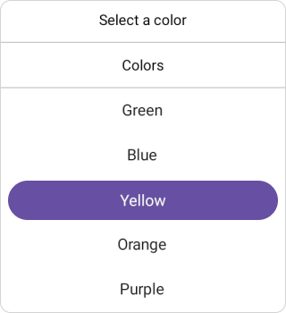

> **Notice**: After **Volume 3 2025 (Mid of Sep 2025)**, feature enhancements for this control will no longer be available in the Syncfusion® package. Please switch to the **Syncfusion® Toolkit for .NET MAUI** for continued support. For a smooth transition refer this [migration document](https://help.syncfusion.com/maui-toolkit/migration).

# Getting started with .NET MAUI Picker
This section explains how to add the [.NET MAUI Picker](https://www.syncfusion.com/maui-controls/maui-picker) control. It covers only the basic features needed to get started with the Syncfusion Picker. Follow the steps below to add a .NET MAUI Picker control to your project.

To get start quickly with our .NET MAUI Picker, you can check the below video.






## Prerequisites

Before proceeding, ensure the following are set up:
1. Install .NET SDK
  - [.NET 9 SDK](https://dotnet.microsoft.com/en-us/download/dotnet/9.0) or later must be installed.
2. Set up a .NET MAUI Environment with Visual Studio. Supported Visual Studio Versions:
  - Visual Studio 2022: Version 17.13 or later (e.g., 17.14.7) for .NET 9 development.
  - Visual Studio 2026: Required for .NET 10 development.

## Step 1: Create a New .NET MAUI Project

1. Go to **File > New > Project** and choose the **.NET MAUI App** template.
2. Name the project and choose a location. Then click **Next**.
3. Select the .NET framework version and click **Create**.

## Step 2: Install the Syncfusion&reg; .NET MAUI Picker NuGet Package

1. In **Solution Explorer,** right-click the project and choose **Manage NuGet Packages.**
2. Search for [Syncfusion.Maui.Picker](https://www.nuget.org/packages/Syncfusion.Maui.Picker/) and install the latest version.
3. Ensure the necessary dependencies are installed correctly, and the project is restored.

## Step 3: Register the handler

The [Syncfusion.Maui.Core](https://www.nuget.org/packages/Syncfusion.Maui.Core/) NuGet is a dependent package for all Syncfusion&reg; controls of .NET MAUI. In the **MauiProgram.cs** file, register the handler for Syncfusion&reg; core.




using Syncfusion.Maui.Core.Hosting;
namespace GettingStarted
{
    public static class MauiProgram
    {
        public static MauiApp CreateMauiApp()
        {
            var builder = MauiApp.CreateBuilder();

            builder.ConfigureSyncfusionCore();
            builder
            .UseMauiApp<App>()
            .ConfigureFonts(fonts =>
            {
                fonts.AddFont("OpenSans-Regular.ttf", "OpenSansRegular");
            });

            return builder.Build();
        }
    }
}




## Step 4: Add .NET MAUI Picker control

1. To initialize the control, import the `Syncfusion.Maui.Picker` namespace into your code.
2. Initialize [SfPicker](https://help.syncfusion.com/cr/maui/Syncfusion.Maui.Picker.SfPicker.html).




<ContentPage   
    . . .
    xmlns:picker="clr-namespace:Syncfusion.Maui.Picker;assembly=Syncfusion.Maui.Picker">

    <picker:SfPicker />
</ContentPage>




using Syncfusion.Maui.Picker;
. . .

public partial class MainPage : ContentPage
{
    public MainPage()
    {
        InitializeComponent();
        SfPicker picker = new SfPicker();
        this.Content = picker;
    }
}







## Prerequisites

Before proceeding, ensure the following are set up:
1. Install [.NET 9 SDK](https://dotnet.microsoft.com/en-us/download/dotnet/9.0) or later is installed.
2. Set up a .NET MAUI environment with Visual Studio Code. 
3. Ensure that the .NET MAUI extension is installed and configured as described [here.](https://learn.microsoft.com/en-us/dotnet/maui/get-started/installation?view=net-maui-8.0&tabs=visual-studio-code)

## Step 1: Create a New .NET MAUI Project
1. Open the command palette by pressing `Ctrl+Shift+P` and type **.NET:New Project** and enter.
2. Choose the **.NET MAUI App** template.
3. Select the project location, type the project name and press **Enter**.
4. Then choose **Create project.**

## Step 2: Install the Syncfusion&reg; .NET MAUI Picker NuGet Package

1. Press <kbd>Ctrl</kbd> + <kbd>`</kbd> (backtick) to open the integrated terminal in Visual Studio Code.
2. Ensure you're in the project root directory where your .csproj file is located.
3. Run the command `dotnet add package Syncfusion.Maui.Maps` to install the Syncfusion® .NET MAUI Maps NuGet package.
4. To ensure all dependencies are installed, run `dotnet restore`.

## Step 3: Register the handler

The [Syncfusion.Maui.Core](https://www.nuget.org/packages/Syncfusion.Maui.Core/) NuGet is a dependent package for all Syncfusion&reg; controls of .NET MAUI. In the **MauiProgram.cs** file, register the handler for Syncfusion&reg; core.




using Syncfusion.Maui.Core.Hosting;
namespace GettingStarted
{
    public static class MauiProgram
    {
        public static MauiApp CreateMauiApp()
        {
            var builder = MauiApp.CreateBuilder();

            builder.ConfigureSyncfusionCore();
            builder
            .UseMauiApp<App>()
            .ConfigureFonts(fonts =>
            {
                fonts.AddFont("OpenSans-Regular.ttf", "OpenSansRegular");
            });

            return builder.Build();
        }
    }
}




## Step 4: Add .NET MAUI Picker control

1. To initialize the control, import the `Syncfusion.Maui.Picker` namespace into your code.
2. Initialize [SfPicker](https://help.syncfusion.com/cr/maui/Syncfusion.Maui.Picker.SfPicker.html).




<ContentPage   
    . . .
    xmlns:picker="clr-namespace:Syncfusion.Maui.Picker;assembly=Syncfusion.Maui.Picker">

    <picker:SfPicker />
</ContentPage>




using Syncfusion.Maui.Picker;
. . .

public partial class MainPage : ContentPage
{
    public MainPage()
    {
        InitializeComponent();
        SfPicker picker = new SfPicker();
        this.Content = picker;
    }
}








## Prerequisites

Before proceeding, ensure the following are set up:

1. Ensure you have the latest version of JetBrains Rider.
2. Install [.NET 9 SDK](https://dotnet.microsoft.com/en-us/download/dotnet/9.0) or later is installed.
3. Make sure the MAUI workloads are installed and configured as described [here.](https://www.jetbrains.com/help/rider/MAUI.html#before-you-start)

## Step 1: Create a new .NET MAUI Project

1. Go to **File > New Solution,** Select .NET (C#) and choose the .NET MAUI App template.
2. Enter the Project Name, Solution Name, and Location.
3. Select the .NET framework version and click Create.

## Step 2: Install the Syncfusion® MAUI Picker NuGet Package

1. In **Solution Explorer,** right-click the project and choose **Manage NuGet Packages.**
2. Search for [Syncfusion.Maui.Picker](https://www.nuget.org/packages/Syncfusion.Maui.Picker/) and install the latest version.
3. Ensure the necessary dependencies are installed correctly, and the project is restored. If not, Open the Terminal in Rider and manually run: `dotnet restore`

## Step 3: Register the handler

The [Syncfusion.Maui.Core](https://www.nuget.org/packages/Syncfusion.Maui.Core/) NuGet is a dependent package for all Syncfusion&reg; controls of .NET MAUI. In the **MauiProgram.cs** file, register the handler for Syncfusion&reg; core.




using Syncfusion.Maui.Core.Hosting;
namespace GettingStarted
{
    public static class MauiProgram
    {
        public static MauiApp CreateMauiApp()
        {
            var builder = MauiApp.CreateBuilder();

            builder.ConfigureSyncfusionCore();
            builder
            .UseMauiApp<App>()
            .ConfigureFonts(fonts =>
            {
                fonts.AddFont("OpenSans-Regular.ttf", "OpenSansRegular");
            });

            return builder.Build();
        }
    }
}




## Step 4: Add .NET MAUI Picker control

1. To initialize the control, import the `Syncfusion.Maui.Picker` namespace into your code.
2. Initialize [SfPicker](https://help.syncfusion.com/cr/maui/Syncfusion.Maui.Picker.SfPicker.html).




<ContentPage   
    . . .
    xmlns:picker="clr-namespace:Syncfusion.Maui.Picker;assembly=Syncfusion.Maui.Picker">

    <picker:SfPicker />
</ContentPage>




using Syncfusion.Maui.Picker;
. . .

public partial class MainPage : ContentPage
{
    public MainPage()
    {
        InitializeComponent();
        SfPicker picker = new SfPicker();
        this.Content = picker;
    }
}






## Set header to the Picker

The SfPicker control allows you to add the header text by setting the [Text](https://help.syncfusion.com/cr/maui/Syncfusion.Maui.Picker.PickerHeaderView.html#Syncfusion_Maui_Picker_PickerHeaderView_Text) property in the [PickerHeaderView](https://help.syncfusion.com/cr/maui/Syncfusion.Maui.Picker.PickerHeaderView.html). To enable the header view by setting the [Height](https://help.syncfusion.com/cr/maui/Syncfusion.Maui.Picker.PickerHeaderView.html#Syncfusion_Maui_Picker_PickerHeaderView_HeightProperty) property in the [PickerHeaderView](https://help.syncfusion.com/cr/maui/Syncfusion.Maui.Picker.PickerHeaderView.html).




<picker:SfPicker x:Name="picker">
    <picker:SfPicker.HeaderView>
        <picker:PickerHeaderView Text="Select a color" Height="40" />
    </picker:SfPicker.HeaderView>
</picker:SfPicker>




SfPicker picker = new SfPicker();
picker.HeaderView = new PickerHeaderView()
{
    Text = "Select a color",
    Height = 40,
};

this.Content = picker;




## Add picker items to the picker

The .NET MAUI Picker control is a data-bound control. Hence, you must create a data collection and bind it to the picker control.

* Create a simple Observable Collection of data for the picker,




public class ItemInfo
{
    private ObservableCollection<object> dataSource = new ObservableCollection<object>()
    {
        "Pink", "Green", "Blue", "Yellow", "Orange", "Purple", "SkyBlue", "PaleGreen"
    };

    public ObservableCollection<object> DataSource
    {
        get
        {
            return dataSource;
        }
        set
        {
            dataSource = value;
        }
    }

    public ItemInfo()
    {

    }
}




* Bind the Collection to picker

The Picker control allows you to bind data collection by setting the [ItemsSource](https://help.syncfusion.com/cr/maui/Syncfusion.Maui.Picker.PickerColumn.html#Syncfusion_Maui_Picker_PickerColumn_ItemsSourceProperty) property from the [PickerColumn](https://help.syncfusion.com/cr/maui/Syncfusion.Maui.Picker.PickerColumn.html). Bind data collection in both XAML and C#.




<picker:SfPicker x:Name="picker">
    <picker:SfPicker.HeaderView>
        <picker:PickerHeaderView Text="Select a color" Height="40" />
    </picker:SfPicker.HeaderView>
    <picker:SfPicker.Columns>
        <picker:PickerColumn ItemsSource="{Binding DataSource}" />
    </picker:SfPicker.Columns>
</picker:SfPicker>

<ContentPage.BindingContext>
    <local:ItemInfo />
</ContentPage.BindingContext>




ItemInfo itemInfo = new ItemInfo();
SfPicker picker = new SfPicker()
{
    Columns = new ObservableCollection<PickerColumn>()
    {
        new PickerColumn()
        {
            ItemsSource = itemInfo.DataSource,
        }
    }
};

this.Content = picker;




## Set footer to the Picker

In SfPicker control, validation buttons (OK and Cancel) can be customized by setting the [OkButtonText](https://help.syncfusion.com/cr/maui/Syncfusion.Maui.Picker.PickerFooterView.html#Syncfusion_Maui_Picker_PickerFooterView_OkButtonText) and [CancelButtonText](https://help.syncfusion.com/cr/maui/Syncfusion.Maui.Picker.PickerFooterView.html#Syncfusion_Maui_Picker_PickerFooterView_CancelButtonText) properties in the [PickerFooterView](https://help.syncfusion.com/cr/maui/Syncfusion.Maui.Picker.PickerFooterView.html). It allows you to confirm or cancel the selected item. The `OkButtonText` can be enabled using the [ShowOkButton](https://help.syncfusion.com/cr/maui/Syncfusion.Maui.Picker.PickerFooterView.html#Syncfusion_Maui_Picker_PickerFooterView_ShowOkButton) property in the [PickerFooterView](https://help.syncfusion.com/cr/maui/Syncfusion.Maui.Picker.PickerFooterView.html).




<picker:SfPicker x:Name="picker">
    <picker:SfPicker.FooterView>
        <picker:PickerFooterView ShowOkButton="True" Height="40" />
    </picker:SfPicker.FooterView>
</picker:SfPicker>




SfPicker picker = new SfPicker();
picker.FooterView= new PickerFooterView()
{  
    ShowOkButton = true,
    Height = 40,
};

this.Content = picker;

  


## Set column header to the Picker items

The SfPicker control allows you to add the column header text by setting the [HeaderText](https://help.syncfusion.com/cr/maui/Syncfusion.Maui.Picker.PickerColumn.html#Syncfusion_Maui_Picker_PickerColumn_HeaderText) property in the [PickerColumn](https://help.syncfusion.com/cr/maui/Syncfusion.Maui.Picker.PickerColumn.html), and you need to add the column header height by setting the [Height](https://help.syncfusion.com/cr/maui/Syncfusion.Maui.Picker.PickerColumnHeaderView.html#Syncfusion_Maui_Picker_PickerColumnHeaderView_Height) property in the [PickerColumnHeaderView](https://help.syncfusion.com/cr/maui/Syncfusion.Maui.Picker.PickerColumnHeaderView.html). Its text style and background color are customizable.




<picker:SfPicker x:Name="picker">
<picker:SfPicker.HeaderView>
    <picker:PickerHeaderView Text="Select a color" Height="40" />
</picker:SfPicker.HeaderView>

<picker:SfPicker.Columns>
    <picker:PickerColumn HeaderText="Colors" 
                         ItemsSource="{Binding DataSource}" />
</picker:SfPicker.Columns>

<picker:SfPicker.ColumnHeaderView>
    <picker:PickerColumnHeaderView Height="40" />
</picker:SfPicker.ColumnHeaderView>
</picker:SfPicker>




ItemInfo itemInfo = new ItemInfo();
SfPicker picker = new SfPicker()
{
    HeaderView = new PickerHeaderView()
    {
        Text = "Select a color",
        Height = 40,
    },

    Columns = new ObservableCollection<PickerColumn>()
    {
        new PickerColumn()
        {
            HeaderText = "Colors",
            ItemsSource = itemInfo.DataSource,
        }
    },

    ColumnHeaderView = new PickerColumnHeaderView()
    {
        Height = 40,
    },
};

this.Content = picker;

  


## Set height and width to the Picker

The SfPicker control allows you to change the height and width by using the [HeightRequest] and [WidthRequest] properties in the [SfPicker](https://help.syncfusion.com/cr/maui/Syncfusion.Maui.Picker.SfPicker.html).




<picker:SfPicker x:Name="picker" 
                    HeightRequest="280" 
                    WidthRequest="300">
</picker:SfPicker>




SfPicker picker = new SfPicker()
{
    HeightRequest = 280,
    WidthRequest = 300,
};

this.Content = picker;

  


N> You can refer to our [.NET MAUI Picker](https://www.syncfusion.com/maui-controls/maui-picker) feature tour page for its groundbreaking feature representations. You can also explore our [.NET MAUI Picker Example](https://github.com/syncfusion/maui-demos/tree/master/MAUI/Picker) that shows you how to render and configure the Picker in .NET MAUI.