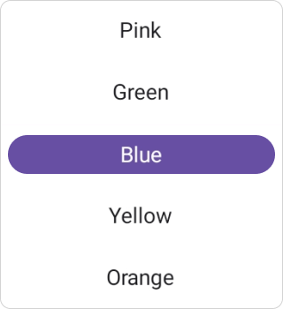

# Getting started with .NET MAUI Picker
This section explains how to add the [.NET MAUI Picker](https://www.syncfusion.com/maui-controls/maui-picker) control. It covers only the basic features needed to get started with the Syncfusion Picker. Follow the steps below to add a .NET MAUI Picker control to your project.

To get start quickly with our .NET MAUI Picker, you can check the below video.






## Prerequisites

Before proceeding, ensure the following are set up:

1. Install [.NET 9 SDK](https://dotnet.microsoft.com/en-us/download/dotnet/9.0) or later.
2. Set up a .NET MAUI environment with Visual Studio 2022 v17.12 or later.

## Step 1: Create a new .NET MAUI project

1. Go to **File > New > Project** and choose the **.NET MAUI App** template.
2. Name the project and choose a location. Then, click **Next**.
3. Select the .NET framework version and click **Create**.

## Step 2: Install the Syncfusion® MAUI Picker NuGet package

1. In **Solution Explorer**, right-click the project and choose **Manage NuGet Packages**.
2. Search for [Syncfusion.Maui.Picker](https://www.nuget.org/packages/Syncfusion.Maui.Picker/) and install the latest version.
3. Ensure the necessary dependencies are installed correctly, and the project is restored.




## Prerequisites

Before proceeding, ensure the following are set up:

1. Install [.NET 9 SDK](https://dotnet.microsoft.com/en-us/download/dotnet/9.0) or later.
2. Set up a .NET MAUI environment with Visual Studio Code.
3. Ensure that the .NET MAUI workloads are installed and configured as described [here](https://learn.microsoft.com/en-us/dotnet/maui/get-started/installation?view=net-maui-9.0&tabs=visual-studio-code).

## Step 1: Create a new .NET MAUI project

1. Open the Command Palette by pressing **Ctrl+Shift+P** and type **.NET:New Project** and press Enter.
2. Choose the **.NET MAUI App** template.
3. Select the project location, type the project name and press Enter.
4. Then choose **Create project**

## Step 2: Install the Syncfusion® MAUI Picker NuGet package

1. Press <kbd>Ctrl</kbd> + <kbd>`</kbd> (backtick) to open the integrated terminal in Visual Studio Code.
2. Ensure you're in the project root directory where your .csproj file is located.
3. Run the command `dotnet add package Syncfusion.Maui.Picker` to install the Syncfusion® .NET MAUI Picker package.
4. To ensure all dependencies are installed, run `dotnet restore`.




## Prerequisites

Before proceeding, ensure the following are set up:

1. Install [.NET 9 SDK](https://dotnet.microsoft.com/en-us/download/dotnet/9.0) or later.
2. Set up a .NET MAUI environment with JetBrains Rider 2024.3 or later.
3. Make sure the MAUI workloads are installed and configured as described [here.](https://www.jetbrains.com/help/rider/MAUI.html#before-you-start)

## Step 1: Create a new .NET MAUI project

1. Go to **File > New Solution,** Select .NET (C#) and choose the .NET MAUI App template.
2. Enter the Project Name, Solution Name, and Location.
3. Select the .NET framework version and click Create.

## Step 2: Install the Syncfusion® MAUI Picker NuGet package

1. In **Solution Explorer,** right-click the project and choose **Manage NuGet Packages.**
2. Search for [Syncfusion.Maui.Picker](https://www.nuget.org/packages/Syncfusion.Maui.Picker/) and install the latest version.
3. Ensure the necessary dependencies are installed correctly, and the project is restored. If not, Open the Terminal in Rider and manually run: `dotnet restore`




## Step 3: Register Syncfusion handler

Make sure to add the namespace.
 


using Syncfusion.Maui.Core.Hosting;


 
Register the Syncfusion core handler in your `CreateMauiApp` method of `MauiProgram.cs` file to use Syncfusion controls.
 


builder.ConfigureSyncfusionCore();



## Step 4: Add picker items to the picker

The .NET MAUI Picker control is a data-bound control. Create a data collection and bind it to the picker control.

Create a simple `ObservableCollection` for the picker.




using System.Collections.ObjectModel;

public class ItemInfo
{
    private ObservableCollection<object> dataSource = new ObservableCollection<object>()
    {
        "Pink", "Green", "Blue", "Yellow", "Orange", "Purple", "SkyBlue", "PaleGreen"
    };

    public ObservableCollection<object> DataSource
    {
        get{ return dataSource; }
        set{ dataSource = value; }
    }
    public ItemInfo()
    {

    }
}




## Step 5: Import the Picker namespace
 
Add the following namespace in your XAML or C#.
 


 
xmlns:picker="clr-namespace:Syncfusion.Maui.Picker;assembly=Syncfusion.Maui.Picker"
 


 
using Syncfusion.Maui.Picker;
 



## Step 6: Add a Picker component

Initialize the [SfPicker](https://help.syncfusion.com/cr/maui/Syncfusion.Maui.Picker.SfPicker.html) control and it allows you to bind data collection by setting the [ItemsSource](https://help.syncfusion.com/cr/maui/Syncfusion.Maui.Picker.PickerColumn.html#Syncfusion_Maui_Picker_PickerColumn_ItemsSourceProperty) property from the [PickerColumn](https://help.syncfusion.com/cr/maui/Syncfusion.Maui.Picker.PickerColumn.html). Bind data collection in both XAML and C#.




<ContentPage
    . . .
    xmlns:picker="clr-namespace:Syncfusion.Maui.Picker;assembly=Syncfusion.Maui.Picker">
    <picker:SfPicker x:Name="picker">
        <picker:SfPicker.HeaderView>
            <picker:PickerHeaderView Text="Select a color" Height="40" />
        </picker:SfPicker.HeaderView>
        <picker:SfPicker.Columns>
            <picker:PickerColumn ItemsSource="{Binding DataSource}" />
        </picker:SfPicker.Columns>
    </picker:SfPicker>
</ContentPage>




using Syncfusion.Maui.Picker;
. . .

ItemInfo itemInfo = new ItemInfo();
SfPicker picker = new SfPicker()
{
    Columns = new ObservableCollection<PickerColumn>()
    {
        new PickerColumn()
        {
            ItemsSource = itemInfo.DataSource,
        }
    }
};

this.Content = picker;




You can download the Picker Getting Started sample from [GitHub](https://github.com/SyncfusionExamples/How-to-load-data-in-the-.NET-MAUI-Picker-SfPicker).

N> You can refer to our [.NET MAUI Picker](https://www.syncfusion.com/maui-controls/maui-picker) feature tour page for its groundbreaking feature representations. You can also explore our [.NET MAUI Picker Example](https://github.com/syncfusion/maui-demos/tree/master/MAUI/Picker) that shows you how to render and configure the Picker in .NET MAUI.