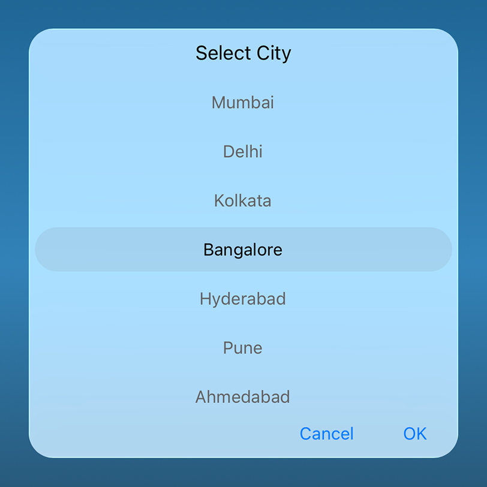

# Liquid Glass Effect in .NET MAUI Picker (SfPicker)

The Liquid Glass Effect introduces a modern, translucent design with adaptive color tinting and light refraction, creating a sleek, glass like user experience that remains clear and accessible. This section explains how to enable and customize the effect in the Syncfusion® .NET MAUI Picker (SfPicker) control.

## Apply liquid glass effect

Follow these steps to enable and configure the Liquid Glass Effect in the Picker control:

### Step 1: Wrap the control inside glass effect view

To apply the Liquid Glass Effect to Syncfusion® .NET MAUI [Picker](https://help.syncfusion.com/cr/maui/Syncfusion.Maui.Picker.SfPicker.html) control, wrap the control inside the [SfGlassEffectView](https://help.syncfusion.com/cr/maui/Syncfusion.Maui.Core.SfGlassEffectView.html) class.

For more details, refer to the [Liquid Glass Getting Started documentation](https://help.syncfusion.com/maui/liquid-glass-ui/getting-started).

### Step 2: Enable the liquid glass effect on Picker

Set the [EnableLiquidGlassEffect](https://help.syncfusion.com/cr/maui/Syncfusion.Maui.Picker.PickerBase.html#Syncfusion_Maui_Picker_PickerBase_EnableLiquidGlassEffect) property to `true` in the [SfPicker](https://help.syncfusion.com/cr/maui/Syncfusion.Maui.Picker.SfPicker.html) control to apply the Liquid Glass Effect. When enabled, the effect is also applied to its dependent controls and provides responsive interaction for a smooth and engaging user experience.

### Step 3: Customize the background

To achieve a glass like background in the Picker, set the `Background` property to `Transparent`. The background will then be treated as a tinted color, ensuring a consistent glass effect across the controls.

The following code snippet demonstrates how to apply the Liquid Glass Effect to the [SfPicker](https://help.syncfusion.com/cr/maui/Syncfusion.Maui.Picker.SfPicker.html) control:




<ContentPage
    xmlns="http://schemas.microsoft.com/dotnet/2021/maui"
    xmlns:x="http://schemas.microsoft.com/winfx/2009/xaml"
    xmlns:picker="clr-namespace:Syncfusion.Maui.Picker;assembly=Syncfusion.Maui.Picker"
    xmlns:core="clr-namespace:Syncfusion.Maui.Core;assembly=Syncfusion.Maui.Core"
    x:Class="AcrylicPickerPage">
    <Grid>
        <Grid.Background>
            <LinearGradientBrush StartPoint="0,0"
                                 EndPoint="0,1">
                <GradientStop Color="#0F4C75"
                              Offset="0.0"/>
                <GradientStop Color="#3282B8"
                              Offset="0.5"/>
                <GradientStop Color="#1B262C"
                              Offset="1.0"/>
            </LinearGradientBrush>
        </Grid.Background>
        <Grid>
            <core:SfGlassEffectView
                EffectType="Regular"
                CornerRadius="20"
                WidthRequest="350"
                HeightRequest="350">
                <picker:SfPicker x:Name="picker"
                                 EnableLiquidGlassEffect="True"
                                 Background="Transparent">
                    <picker:SfPicker.HeaderView>
                        <picker:PickerHeaderView Height="40"
                                Text="Select City"
                                Background="Transparent"/>
                    </picker:SfPicker.HeaderView>
                </picker:SfPicker>
            </core:SfGlassEffectView>
 
        </Grid>
    </Grid>
</ContentPage>




// Outer grid with gradient background
var mainGrid = new Grid()
{
    Background = new LinearGradientBrush()
    {
        StartPoint = new Point(0, 0),
        EndPoint = new Point(0, 1),
        GradientStops =
        {
            new GradientStop { Color = Color.FromArgb("#0F4C75"), Offset = 0.0f },
            new GradientStop { Color = Color.FromArgb("#3282B8"), Offset = 0.5f },
            new GradientStop { Color = Color.FromArgb("#1B262C"), Offset = 1.0f }
        }
    }
};

// Inner grid container
var innerGrid = new Grid();

var glassView = new SfGlassEffectView()
{
    EffectType = GlassEffectType.Regular,
    CornerRadius = 20,
    WidthRequest = 350,
    HeightRequest = 350
};

var picker = new SfPicker()
{
    EnableLiquidGlassEffect = true,
    Background = Colors.Transparent,
    HeaderView = new PickerHeaderView()
    {
        HeightRequest = 40,
        Text = "Select City",
        Background = Colors.Transparent
    }
};

ObservableCollection<object> cityName = new ObservableCollection<object>();
cityName.Add("Chennai");
cityName.Add("Mumbai");
cityName.Add("Delhi");
cityName.Add("Kolkata");
cityName.Add("Bangalore");
cityName.Add("Hyderabad");
cityName.Add("Pune");
cityName.Add("Ahmedabad");
cityName.Add("Jaipur");
cityName.Add("Lucknow");
cityName.Add("Chandigarh");
PickerColumn pickerColumn = new PickerColumn()
{
    ItemsSource = cityName,
};

picker.Columns.Add(pickerColumn);

glassView.Content = picker;
innerGrid.Children.Add(glassView);
mainGrid.Children.Add(innerGrid);
this.Content = mainGrid;




N>
* Supported on `macOS 26 or higher` and `iOS 26 or higher`.
* This feature is available only in `.NET 10.`
