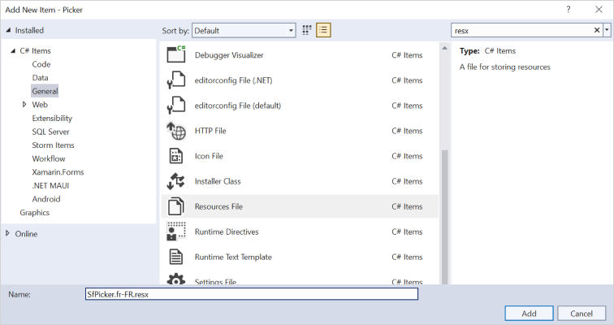
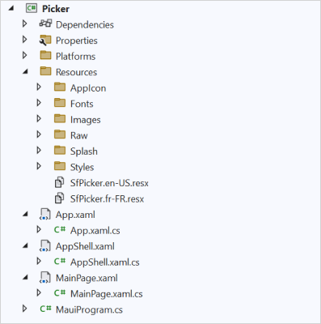
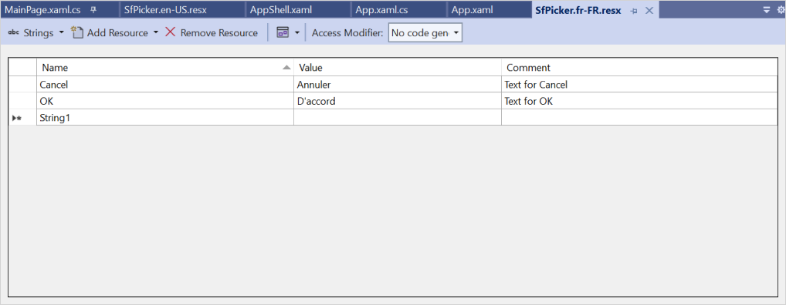

# Localization in .NET MAUI Picker (SfPicker)

Localization is the process of translating the application resources into different language for the specific cultures. The SfPicker can be localized by adding resource file.

## Setting CurrentUICulture to the application

Application culture can be changed by setting CurrentUICulture. in App.xaml.cs file.




using System.Resources;
using System.Globalization;
using Syncfusion.Maui.Picker;

namespace Picker;
public partial class App : Application
{
    public App()
    {
        InitializeComponent();

        //// ResXPath => Full path of the resx file; For example : // SfPickerResources.ResourceManager = new ResourceManager
("Picker.Resources.SfPicker", Application.Current.GetType().Assembly);
        CultureInfo.CurrentUICulture = new CultureInfo("fr-FR");
        SfPickerResources.ResourceManager = new ResourceManager("ResxPath", Application.Current.GetType().Assembly);
        MainPage = new AppShell();
    }
}




   

N>
The required `resx` files with `Build Action` as `EmbeddedResource` (File name should contain culture code) into the `Resources` folder.

## Localize application level

To localize the `Picker` based on `CurrentUICulture` using `resource` files, follow the below steps.

   1. Create new folder, named as `Resources` in the application.

   2. Right-click on the `Resources` folder, select `Add` and then `NewItem.`

   3. In Add New Item wizard, select the Resource File option and name the filename as `SfPicker.<culture name>.resx.` For example, give the name as `SfPicker.fr-FR.resx` for French culture.

   4. The culture name indicates the name of the language and country.

        

   5. Now, select `Add` option to add the resource file in **Resources** folder.

        

   6. Add the Name/Value pair in Resource Designer of `SfPicker.fr-FR.resx` file and change its corresponding value to corresponding culture.

   