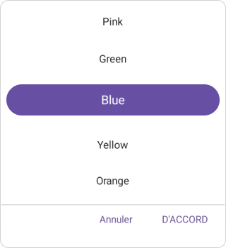
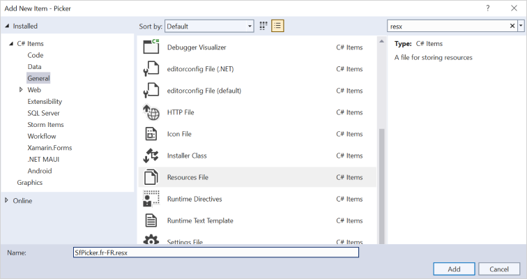
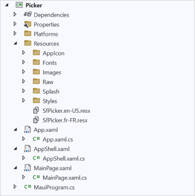
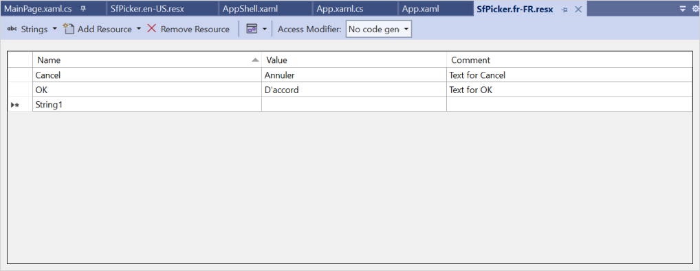

# Localization in .NET MAUI Picker (SfPicker)

Localization translates application resources for specific cultures. The SfPicker can be localized by adding a resource file.

## Setting CurrentUICulture to the application

Set the application culture in `App.xaml.cs` by assigning `CurrentUICulture`.




using System.Resources;
using System.Globalization;
using Syncfusion.Maui.Picker;

namespace Picker;
public partial class App : Application
{
    public App()
    {
        InitializeComponent();

        //// ResXPath => Full path of the resx file; For example : // SfPickerResources.ResourceManager = new ResourceManager
("Picker.Resources.SfPicker", Application.Current.GetType().Assembly);
        CultureInfo.CurrentUICulture = new CultureInfo("fr-FR");
        SfPickerResources.ResourceManager = new ResourceManager("ResxPath", Application.Current.GetType().Assembly);
        MainPage = new AppShell();
    }
}




   

N> The required `resx` files with `Build Action` as `EmbeddedResource` (file name should contain the culture code) must be added to the `Resources` folder.

## Localize at the application level

To localize the `SfPicker` based on `CurrentUICulture` using resource files, follow these steps.

   1. Create a new folder named `Resources` in the application.

   2. Right-click on the `Resources` folder, select `Add` and then `NewItem.`

   3. In Add New Item wizard, select the Resource File option and name the filename as `SfPicker.<culture name>.resx.` For example, give the name as `SfPicker.fr-FR.resx` for French culture.

   4. The culture name indicates the name of the language and country.

        

   5. Now, select `Add` option to add the resource file in **Resources** folder.

        

   6. Add the Name/Value pair in Resource Designer of `SfPicker.fr-FR.resx` file and change its corresponding value to corresponding culture.

   