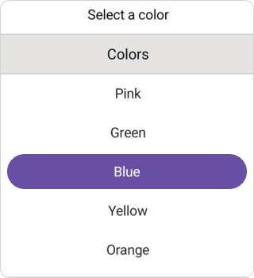
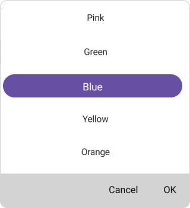
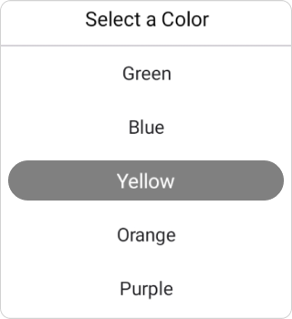
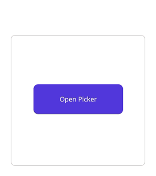
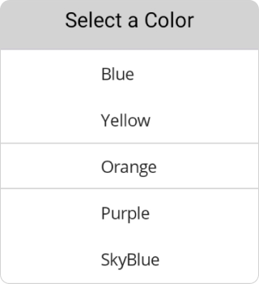

> **Notice**: After **Volume 3 2025 (Mid of Sep 2025)**, feature enhancements for this control will no longer be available in the Syncfusion® package. Please switch to the **Syncfusion® Toolkit for .NET MAUI** for continued support. For a smooth transition refer this [migration document](https://help.syncfusion.com/maui-toolkit/migration).

# Overview of .NET MAUI Picker (SfPicker)

Syncfusion .NET MAUI Picker (SfPicker) control allows you to select an item and visualize its items inside a popup or a drop-down UI element. It supports multiple-column layout, header, footer, and selection view customizations. It provides customization as a date picker, time picker, date-time picker, country picker, color picker, and more.

## Key features

* **Header view**: The .NET MAUI Picker allows users to add and customize the header text.

   

* **Column header view**: The .NET MAUI Picker supports a customizable column header view to separate headings for each column.

   

* **Footer view**: Provides validation buttons (OK and Cancel) in the footer view. The footer text and background color can be customized.

   

* **Selection view**: The selection view is used to show the selected item, and it can be customized.

   

* **Picker mode**: Show the picker in a Popup with a dialog mode. The relative dialog mode is used to align the picker in a specific position.

   

* **Picker interactions**: The .NET MAUI Picker allows you to select an item through tap and scroll interaction.

   

* **Item template**: Customize the picker using item template support.

   
