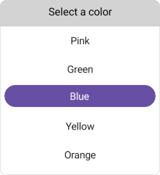
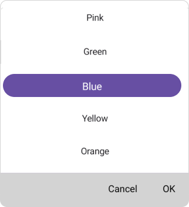
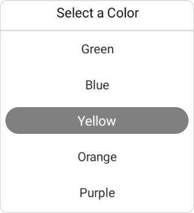
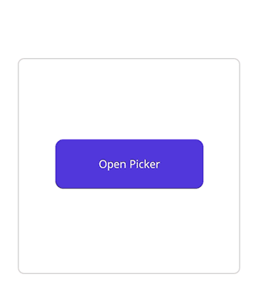
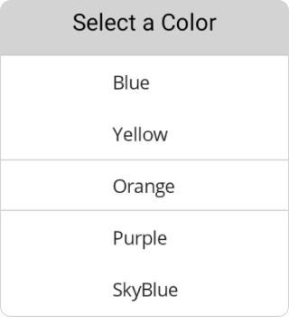

# Overview of .NET MAUI Picker (SfPicker)

Syncfusion .NET MAUI Picker (SfPicker) control allows you to select an item and visualize its items inside a popup or a drop-down UI element. It supports multiple-column layout, header, footer, and selection view customizations. It provides customization as a date picker, time picker, date-time picker, country picker, color picker, and more.

## Business use cases

- Form-based applications that require **selecting values such as country, category, or options from predefined lists**.  
- Scheduling and booking systems that use **custom picker configurations for date, time, or combined inputs**.  
- Business applications that require **multi-column selection for hierarchical or grouped data**.  
- Mobile applications that need **user-friendly and customizable selection UI for various input scenarios**. 

## Key features

- **Header view** allows adding and customizing header text to provide context for the picker. 

   

- **Column header view** allows separating multiple columns with distinct headers for better clarity.

   

- **Footer view** allows displaying validation buttons such as OK and Cancel with customizable appearance. 

   

- **Selection view** allows showing the selected item in a configurable display area.  

   

- **Picker mode** allows displaying the picker in popup or dialog mode with flexible positioning.

   

- **User interaction** allows selecting items through tap and scroll gestures.  

   

- **Item template support** allows customizing how items are displayed within the picker. 

    

## Globalization

The following table summarizes the globalization support available in the [SfPicker](https://www.syncfusion.com/maui-controls/maui-picker) control.

 Full Support   
 Not Applicable

<table>
<tr>
<th align="center">Control</th>
<th align="center">Localization</th>
<th align="center">RTL</th>
<th align="center">Time zone</th>
<th align="center">Screen reader</th>
<th align="center">Keyboard navigation</th>
</tr>
<tr>
<td><a href="/maui/picker/overview">Picker</a></td>
<td align="center"></td>
<td align="center"></td>
<td align="center"></td>
<td align="center"></td>
<td align="center"></td>
</tr> 
</table>

## Related controls

- **[DatePicker](https://help.syncfusion.com/maui/datepicker/overview)** for selecting date values using a specialized picker interface.  
- **[DateTimePicker](https://help.syncfusion.com/maui/datetimepicker/overview)** for selecting combined date and time values.
- **[ComboBox](https://help.syncfusion.com/maui/combobox/overview)** for searchable dropdown-based selection with text input.  

## Next steps

Explore further resources:

- [Getting Started](https://help.syncfusion.com/maui/picker/getting-started) - step-by-step guide to begin using the Picker control.
- [Mode](https://help.syncfusion.com/maui/picker/picker-mode) - choose between default, dialog, or custom display styles.
- [Columns Header](https://help.syncfusion.com/maui/picker/dealing-with-column-header) - add and customize headers for better clarity in multi‑column pickers.
- [UI Kit](https://www.syncfusion.com/demos/maui#maui-ui-control) - explore interactive demos and ready‑made UI examples.

## Learnings

<!-- Card 1 -->
<a href="https://www.syncfusion.com/blogs/category/net-maui" class="form-card" target="_blank">
  

    <h3 class="form-title">Explore Blogs</h3>
    

      Read insights, tutorials, and developer journeys.
    

  

</a>
<!-- Card 2 -->
<a href="https://support.syncfusion.com/kb/cross-platforms/category/76" class="form-card" target="_blank">
  

    <h3 class="form-title">Explore KB's</h3>
    

      Find quick solutions and step‑by‑step guidance.
    

  

</a>
<!-- Card 3 -->
<a href="https://www.syncfusion.com/maui-controls/maui-picker" class="form-card" target="_blank">
  

    <h3 class="form-title">Feature Tour</h3>
    

      Walk through highlights and core capabilities.
    

  

</a>
<!-- Card 4 -->
<a href="https://github.com/syncfusion/maui-demos/tree/master/MAUI/Picker" class="form-card" target="_blank">
  

    <h3 class="form-title">Showcase Samples</h3>
    

      Explore sample scenarios for real apps.
    

  

</a>
<!-- Card 5 -->
<a href="https://www.syncfusion.com/tutorial-videos/maui/picker" class="form-card" target="_blank">
  

    <h3 class="form-title">Tutorial Videos</h3>
    

      Step‑by‑step guidance through video tutorials.
    

  

</a>
