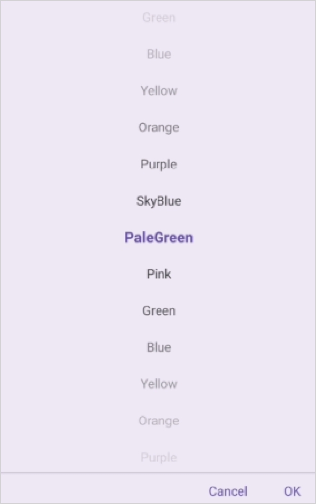
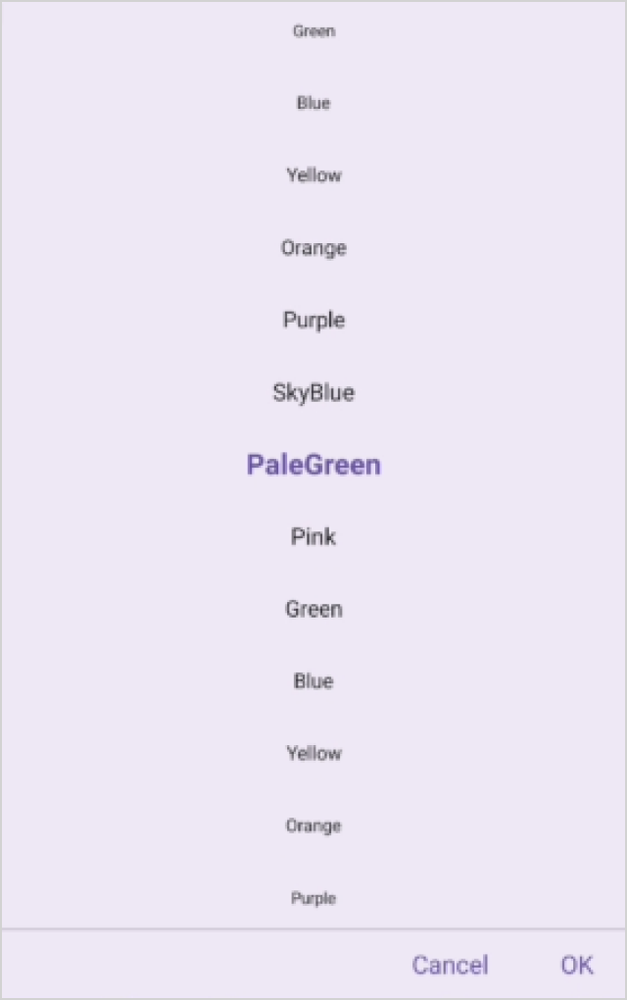
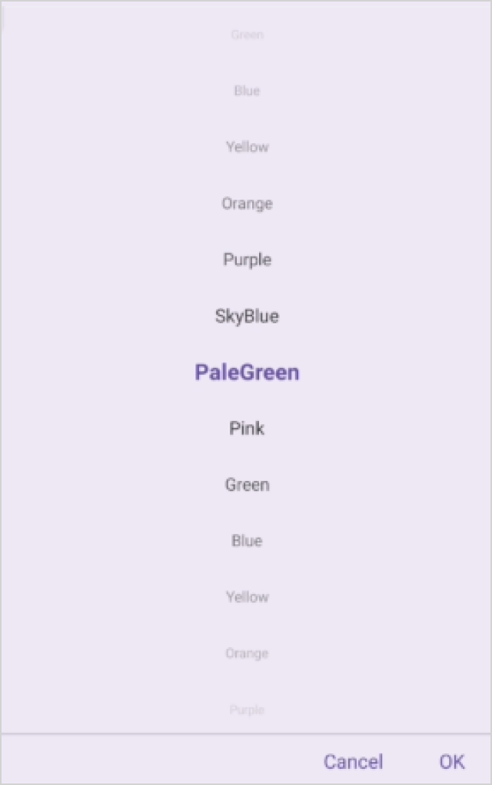

# Picker Text display mode in .NET MAUI Picker (SfPicker)

The picker text display mode is specified in the picker property enumeration, which is used to display the picker items based on the modes. It offers four modes: `Default`, `Fade`, `Shrink` and `FadeAndShrink`. The default picker text display mode is `Default` in the `SfPicker`.

## Fade Mode

The fade mode in the picker gradually decreases the visibility of unselected items relative to the selected item. This effect is achieved by setting the `TextDisplayMode` property to `Fade` in `SfPicker`.





<picker:SfPicker x:Name="Picker"
                 TextDisplayMode="Fade"/>





SfPicker picker = new SfPicker()
{
    TextDisplayMode = PickerTextDisplayMode.Fade
};

this.Content = picker;





## Shrink Mode

The shrink mode is used to display the font size of picker items decreased from the selected item by setting the `TextDisplayMode` property to `Shrink` in `SfPicker`.





<picker:SfPicker x:Name="Picker"
                 TextDisplayMode="Shrink"/>





SfPicker picker = new SfPicker()
{
    TextDisplayMode = PickerTextDisplayMode.Shrink
};

this.Content = picker;





## FadeAndShrink Mode

The fade and shrink mode are used to decrease the opacity and font size of picker items from the selected item by setting the `TextDisplayMode` property to `FadeAndShrink` in `SfPicker`.





<picker:SfPicker x:Name="Picker"
                 TextDisplayMode="FadeAndShrink"/>





SfPicker picker = new SfPicker()
{
    TextDisplayMode = PickerTextDisplayMode.FadeAndShrink
};

this.Content = picker;





