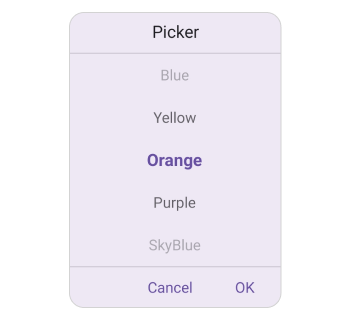
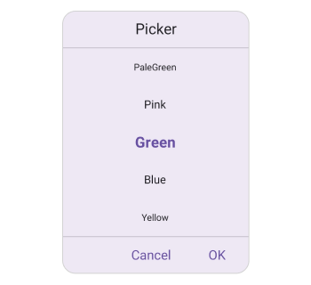
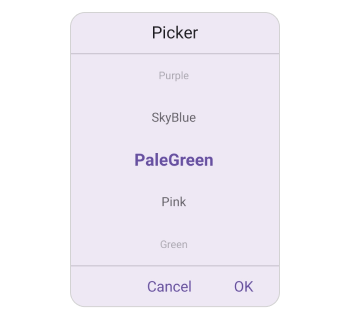

# Picker Text display mode in .NET MAUI Picker (SfPicker)

The picker text display mode determines how picker items are rendered relative to the selected item. It offers four modes: [Default](https://help.syncfusion.com/cr/maui/Syncfusion.Maui.Picker.PickerTextDisplayMode.html#Syncfusion_Maui_Picker_PickerTextDisplayMode_Default), [Fade](https://help.syncfusion.com/cr/maui/Syncfusion.Maui.Picker.PickerTextDisplayMode.html#Syncfusion_Maui_Picker_PickerTextDisplayMode_Fade), [Shrink](https://help.syncfusion.com/cr/maui/Syncfusion.Maui.Picker.PickerTextDisplayMode.html#Syncfusion_Maui_Picker_PickerTextDisplayMode_Shrink) and [FadeAndShrink](https://help.syncfusion.com/cr/maui/Syncfusion.Maui.Picker.PickerTextDisplayMode.html#Syncfusion_Maui_Picker_PickerTextDisplayMode_FadeAndShrink). The default picker text display mode is [Default](https://help.syncfusion.com/cr/maui/Syncfusion.Maui.Picker.PickerTextDisplayMode.html#Syncfusion_Maui_Picker_PickerTextDisplayMode_Default) in the [SfPicker](https://help.syncfusion.com/cr/maui/Syncfusion.Maui.Picker.SfPicker.html).

## Default Mode

The default mode displays all time picker items at the same opacity and font size. This is the default value of the [TextDisplayMode](https://help.syncfusion.com/cr/maui/Syncfusion.Maui.Picker.PickerBase.html#Syncfusion_Maui_Picker_PickerBase_TextDisplayMode) property in [SfPicker](https://help.syncfusion.com/cr/maui/Syncfusion.Maui.Picker.SfPicker.html) and requires no additional configuration.

## Fade Mode

The fade mode in the picker gradually decreases the visibility of unselected items relative to the selected item. This effect is achieved by setting the [TextDisplayMode](https://help.syncfusion.com/cr/maui/Syncfusion.Maui.Picker.PickerBase.html#Syncfusion_Maui_Picker_PickerBase_TextDisplayMode) property to [Fade](https://help.syncfusion.com/cr/maui/Syncfusion.Maui.Picker.PickerTextDisplayMode.html#Syncfusion_Maui_Picker_PickerTextDisplayMode_Fade) in [SfPicker](https://help.syncfusion.com/cr/maui/Syncfusion.Maui.Picker.SfPicker.html).





<picker:SfPicker x:Name="picker"
                 TextDisplayMode="Fade"/>





SfPicker picker = new SfPicker()
{
    TextDisplayMode = PickerTextDisplayMode.Fade
};

this.Content = picker;





## Shrink Mode

The shrink mode is used to display the font size of picker items decreased from the selected item by setting the [TextDisplayMode](https://help.syncfusion.com/cr/maui/Syncfusion.Maui.Picker.PickerBase.html#Syncfusion_Maui_Picker_PickerBase_TextDisplayMode) property to [Shrink](https://help.syncfusion.com/cr/maui/Syncfusion.Maui.Picker.PickerTextDisplayMode.html#Syncfusion_Maui_Picker_PickerTextDisplayMode_Shrink) in [SfPicker](https://help.syncfusion.com/cr/maui/Syncfusion.Maui.Picker.SfPicker.html).





<picker:SfPicker x:Name="picker"
                 TextDisplayMode="Shrink"/>





SfPicker picker = new SfPicker()
{
    TextDisplayMode = PickerTextDisplayMode.Shrink
};

this.Content = picker;





## FadeAndShrink Mode

The fade and shrink mode are used to decrease the opacity and font size of picker items from the selected item by setting the [TextDisplayMode](https://help.syncfusion.com/cr/maui/Syncfusion.Maui.Picker.PickerBase.html#Syncfusion_Maui_Picker_PickerBase_TextDisplayMode) property to [FadeAndShrink](https://help.syncfusion.com/cr/maui/Syncfusion.Maui.Picker.PickerTextDisplayMode.html#Syncfusion_Maui_Picker_PickerTextDisplayMode_FadeAndShrink) in [SfPicker](https://help.syncfusion.com/cr/maui/Syncfusion.Maui.Picker.SfPicker.html).





<picker:SfPicker x:Name="picker"
                 TextDisplayMode="FadeAndShrink"/>





SfPicker picker = new SfPicker()
{
    TextDisplayMode = PickerTextDisplayMode.FadeAndShrink
};

this.Content = picker;





