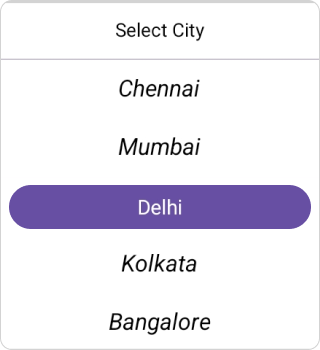
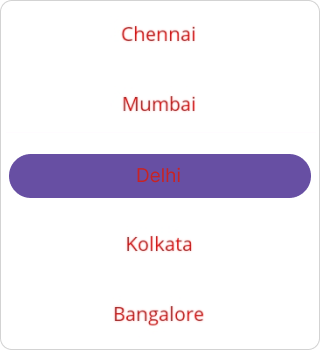

# Populating Items in MAUI Picker (SfPicker)

In .NET MAUI, you can bind a Picker control to an external data source by setting its ItemsSource property to an ObservableCollection. This enables the Picker to display and update data from the collection.

Set the [ItemSource](https://help.syncfusion.com/cr/maui/Syncfusion.Maui.Picker.PickerColumn.html#Syncfusion_Maui_Picker_PickerColumn_ItemsSource) property in the [PickerColumn](https://help.syncfusion.com/cr/maui/Syncfusion.Maui.Picker.PickerColumn.html) class as shown in the following code to bind the item source in the picker.




    <sfPicker:SfPicker x:Name="picker">
    </sfPicker:SfPicker>




    ObservableCollection<object> cityName = new ObservableCollection<object>();
    cityName.Add("Chennai");
    cityName.Add("Mumbai");
    cityName.Add("Delhi");
    cityName.Add("Kolkata");
    cityName.Add("Bangalore");
    cityName.Add("Hyderabad");
    cityName.Add("Pune");
    cityName.Add("Ahmedabad");
    cityName.Add("Jaipur");
    cityName.Add("Lucknow");
    cityName.Add("Chandigarh");
    PickerColumn pickerColumn = new PickerColumn()
    {
        HeaderText = "Select City",
        ItemsSource = cityName,
        SelectedIndex = 1,
    };
    this.picker.Columns.Add(pickerColumn);




   

## Multi-column items

The picker populates the items as Multi-column based on the columns value.

Collection of items can be created and assigned to a Collection based on index value, and each index is a column of picker.

The following code example encapsulate how to populate Country and Cities in each column of picker.




    <sfPicker:SfPicker x:Name="picker">
    </sfPicker:SfPicker>




    ObservableCollection<object> countryName = new ObservableCollection<object>();
    countryName.Add("Canada");
    countryName.Add("United States");
    countryName.Add("India");
    countryName.Add("United Kingdom");
    countryName.Add("Australia");
    countryName.Add("Germany");
    countryName.Add("France");
    countryName.Add("Japan");
    countryName.Add("China");
    countryName.Add("Brazil");
    PickerColumn countryColumn = new PickerColumn()
    {
        HeaderText = "Select Country",
        ItemsSource = countryName,
        SelectedIndex = 1,
    };
    ObservableCollection<object> cityName = new ObservableCollection<object>();
    cityName.Add("Chennai");
    cityName.Add("Mumbai");
    cityName.Add("Delhi");
    cityName.Add("Kolkata");
    cityName.Add("Bangalore");
    cityName.Add("Hyderabad");
    cityName.Add("Pune");
    cityName.Add("Ahmedabad");
    cityName.Add("Jaipur");
    cityName.Add("Lucknow");
    cityName.Add("Chandigarh");
    PickerColumn cityColumn = new PickerColumn()
    {
        HeaderText = "Select City",
        ItemsSource = cityName,
        SelectedIndex = 1,
    };
    this.picker.Columns.Add(countryColumn);
    this.picker.Columns.Add(cityColumn);




   

## Set items text style customization

The .NET MAUI Picker control, selected and unselected items, `TextColor`, `FontSize`, `FontFamily`, and `FontAttributes` can be customized as shown in the following code.

The .NET MAUI Picker control, selected and unselected items, `TextColor`, `FontSize`, `FontFamily`, and `FontAttributes` can be customized as shown in the following code.

### Selected item customization

The selected item [SelectedTextStyle](https://help.syncfusion.com/cr/maui/Syncfusion.Maui.Picker.PickerBase.html#Syncfusion_Maui_Picker_PickerBase_SelectedTextStyle) can be customized by setting the `SfPicker.SelectedTextStyle` property.




    <sfPicker:SfPicker x:Name="picker">
        <sfPicker:SfPicker.SelectedTextStyle>
            <sfPicker:PickerTextStyle FontSize="16" FontAttributes="Bold" TextColor="White">
            </sfPicker:PickerTextStyle>
        </sfPicker:SfPicker.SelectedTextStyle>
    </sfPicker:SfPicker>




    this.picker.SelectedTextStyle.FontSize = 16;
    this.picker.SelectedTextStyle.FontAttributes = FontAttributes.Bold;
    this.picker.SelectedTextStyle.TextColor = Colors.White;




   

### Unselected item customization

The unselected item [TextStyle](https://help.syncfusion.com/cr/maui/Syncfusion.Maui.Picker.PickerBase.html#Syncfusion_Maui_Picker_PickerBase_TextStyle) can be customized by setting the `SfPicker.TextStyle` property.




    <sfPicker:SfPicker x:Name="picker">
        <sfPicker:SfPicker.TextStyle>
            <sfPicker:PickerTextStyle FontSize="16" FontAttributes="Italic" TextColor="Black">
            </sfPicker:PickerTextStyle>
        </sfPicker:SfPicker.TextStyle>
    </sfPicker:SfPicker>




    this.picker.TextStyle.FontSize = 16;
    this.picker.TextStyle.FontAttributes = FontAttributes.Italic;
    this.picker.TextStyle.TextColor = Colors.Black;




   

## Adding custom view to items

In picker control, the items can be customized with a custom view of all items by the [ItemTemplate](https://help.syncfusion.com/cr/maui/Syncfusion.Maui.Picker.SfPicker.html#Syncfusion_Maui_Picker_SfPicker_ItemTemplate) and assign a custom view to the `ItemTemplate`.




    <Grid>
        <Grid.Resources>
            <DataTemplate x:Key="customView">
                <Grid>
                    <Label HorizontalTextAlignment="Center" VerticalTextAlignment="Center" TextColor="Red" Text="{Binding Data}"/>    
                </Grid>
            </DataTemplate>
        </Grid.Resources>
    <sfPicker:SfPicker x:Name="picker" ItemTemplate="{StaticResource customView}">
    </sfPicker:SfPicker>
    </Grid>




    DataTemplate customView = new DataTemplate(() =>
    {
        Grid grid = new Grid
        {
            Padding = new Thickness(0, 1, 0, 1),
        };

        Label label = new Label
        {
            HorizontalOptions = LayoutOptions.Center,
            VerticalOptions = LayoutOptions.Center,
            HorizontalTextAlignment = TextAlignment.Center,
            VerticalTextAlignment = TextAlignment.Center,
            TextColor = Colors.Black,
        };

        label.SetBinding(Label.TextProperty, new Binding("Data"));
        grid.Children.Add(label);
        return grid;
    });
    
    this.picker.ItemTemplate = customView;




   