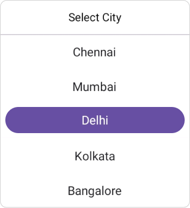
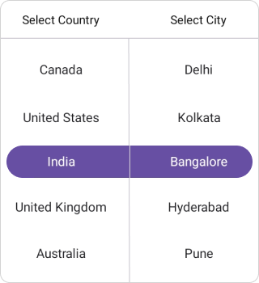
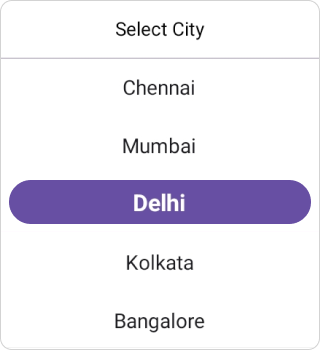
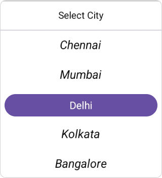
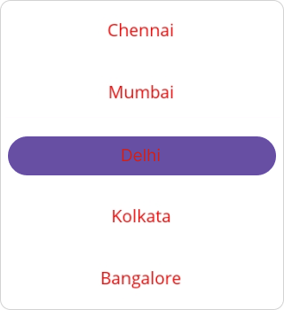

# Populating Items in .NET MAUI Picker (SfPicker)

In .NET MAUI, you can bind the SfPicker control to an external data source by setting its `ItemsSource` property to an `ObservableCollection`. This enables the picker to display and update data from the collection.

Set the [ItemsSource](https://help.syncfusion.com/cr/maui/Syncfusion.Maui.Picker.PickerColumn.html#Syncfusion_Maui_Picker_PickerColumn_ItemsSource) property in the [PickerColumn](https://help.syncfusion.com/cr/maui/Syncfusion.Maui.Picker.PickerColumn.html) class as shown in the following code to bind the item source in the picker.




<ContentPage
    . . .
    xmlns:picker="clr-namespace:Syncfusion.Maui.Picker;assembly=Syncfusion.Maui.Picker">
    <picker:SfPicker x:Name="picker">
    </picker:SfPicker>
</ContentPage>




using Syncfusion.Maui.Picker;
. . .

SfPicker picker = new SfPicker();
ObservableCollection<object> cityName = new ObservableCollection<object>();
cityName.Add("Chennai");
cityName.Add("Mumbai");
cityName.Add("Delhi");
cityName.Add("Kolkata");
cityName.Add("Bangalore");
cityName.Add("Hyderabad");
cityName.Add("Pune");
cityName.Add("Ahmedabad");
cityName.Add("Jaipur");
cityName.Add("Lucknow");
cityName.Add("Chandigarh");
PickerColumn pickerColumn = new PickerColumn()
{
    HeaderText = "Select City",
    ItemsSource = cityName,
    SelectedIndex = 1,
};
picker.Columns.Add(pickerColumn);

this.Content = picker;




   

## Multi-column items

The picker populates items as multi-column data based on the number of `Columns`.

A collection of items can be created and assigned to a Collection based on the index value, where each index represents a column in the picker.

The following sample code demonstrates how to populate `Countries` and `Cities` in each column of the picker.




<ContentPage
    . . .
    xmlns:picker="clr-namespace:Syncfusion.Maui.Picker;assembly=Syncfusion.Maui.Picker">
    <picker:SfPicker x:Name="picker">
    </picker:SfPicker>
</ContentPage>




using Syncfusion.Maui.Picker;
. . .

SfPicker picker = new SfPicker();
ObservableCollection<object> countryName = new ObservableCollection<object>();
countryName.Add("Canada");
countryName.Add("United States");
countryName.Add("India");
countryName.Add("United Kingdom");
countryName.Add("Australia");
countryName.Add("Germany");
countryName.Add("France");
countryName.Add("Japan");
countryName.Add("China");
countryName.Add("Brazil");
PickerColumn countryColumn = new PickerColumn()
{
    HeaderText = "Select Country",
    ItemsSource = countryName,
    SelectedIndex = 1,
};
ObservableCollection<object> cityName = new ObservableCollection<object>();
cityName.Add("Chennai");
cityName.Add("Mumbai");
cityName.Add("Delhi");
cityName.Add("Kolkata");
cityName.Add("Bangalore");
cityName.Add("Hyderabad");
cityName.Add("Pune");
cityName.Add("Ahmedabad");
cityName.Add("Jaipur");
cityName.Add("Lucknow");
cityName.Add("Chandigarh");
PickerColumn cityColumn = new PickerColumn()
{
    HeaderText = "Select City",
    ItemsSource = cityName,
    SelectedIndex = 1,
};
picker.Columns.Add(countryColumn);
picker.Columns.Add(cityColumn);

this.Content = picker;




   

## Customizing text style of items

The .NET MAUI Picker control allows customization of the selected and unselected item appearance, including `TextColor`, `FontSize`, `FontFamily`, and `FontAttributes`, as shown in the following code.

### Selected item customization

The selected item [SelectedTextStyle](https://help.syncfusion.com/cr/maui/Syncfusion.Maui.Picker.PickerBase.html#Syncfusion_Maui_Picker_PickerBase_SelectedTextStyle) can be customized by setting the `SfPicker.SelectedTextStyle` property.




<ContentPage
    . . .
    xmlns:picker="clr-namespace:Syncfusion.Maui.Picker;assembly=Syncfusion.Maui.Picker">
    <picker:SfPicker x:Name="picker">
        <picker:SfPicker.SelectedTextStyle>
            <picker:PickerTextStyle FontSize="16" FontAttributes="Bold" TextColor="White">
            </picker:PickerTextStyle>
        </picker:SfPicker.SelectedTextStyle>
    </picker:SfPicker>
</ContentPage>




using Syncfusion.Maui.Picker;
. . .

SfPicker picker = new SfPicker();
picker.SelectedTextStyle.FontSize = 16;
picker.SelectedTextStyle.FontAttributes = FontAttributes.Bold;
picker.SelectedTextStyle.TextColor = Colors.White;

this.Content = picker;




   

### Unselected item customization

The unselected item [TextStyle](https://help.syncfusion.com/cr/maui/Syncfusion.Maui.Picker.PickerBase.html#Syncfusion_Maui_Picker_PickerBase_TextStyle) can be customized by setting the `SfPicker.TextStyle` property.




<ContentPage
    . . .
    xmlns:picker="clr-namespace:Syncfusion.Maui.Picker;assembly=Syncfusion.Maui.Picker">
    <picker:SfPicker x:Name="picker">
        <picker:SfPicker.TextStyle>
            <picker:PickerTextStyle FontSize="16" FontAttributes="Italic" TextColor="Black">
            </picker:PickerTextStyle>
        </picker:SfPicker.TextStyle>
    </picker:SfPicker>
</ContentPage>




using Syncfusion.Maui.Picker;
. . .

SfPicker picker = new SfPicker();
picker.TextStyle.FontSize = 16;
picker.TextStyle.FontAttributes = FontAttributes.Italic;
picker.TextStyle.TextColor = Colors.Black;

this.Content = picker;




   

## Adding custom view to items

In the picker control, items can be customized with a custom view for all items by using the [ItemTemplate](https://help.syncfusion.com/cr/maui/Syncfusion.Maui.Picker.SfPicker.html#Syncfusion_Maui_Picker_SfPicker_ItemTemplate) property and assigning a custom view to it.




<ContentPage
    . . .
    xmlns:picker="clr-namespace:Syncfusion.Maui.Picker;assembly=Syncfusion.Maui.Picker">
    <Grid>
        <Grid.Resources>
            <DataTemplate x:Key="customView">
                <Grid>
                    <Label HorizontalTextAlignment="Center" VerticalTextAlignment="Center" TextColor="Red" Text="{Binding Data}"/>
                </Grid>
            </DataTemplate>
        </Grid.Resources>
        <picker:SfPicker x:Name="picker" ItemTemplate="{StaticResource customView}">
        </picker:SfPicker>
    </Grid>
</ContentPage>




using Syncfusion.Maui.Picker;
. . .

SfPicker picker = new SfPicker();

DataTemplate customView = new DataTemplate(() =>
{
    Grid grid = new Grid
    {
        Padding = new Thickness(0, 1, 0, 1),
    };

    Label label = new Label
    {
        HorizontalOptions = LayoutOptions.Center,
        VerticalOptions = LayoutOptions.Center,
        HorizontalTextAlignment = TextAlignment.Center,
        VerticalTextAlignment = TextAlignment.Center,
        TextColor = Colors.Black,
    };

    label.SetBinding(Label.TextProperty, new Binding("Data"));
    grid.Children.Add(label);
    return grid;
});

picker.ItemTemplate = customView;

this.Content = picker;




   