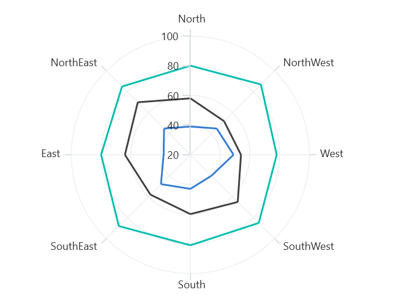
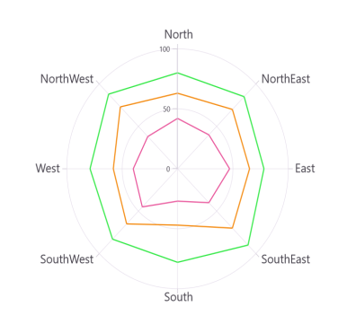
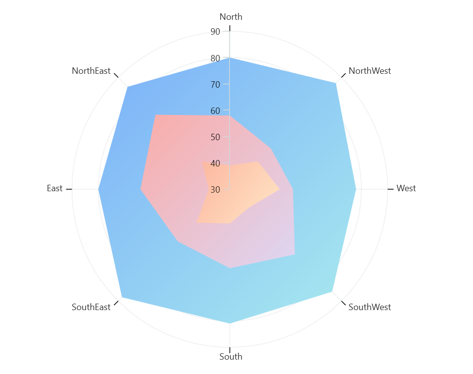
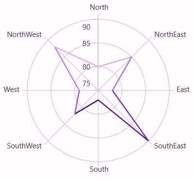
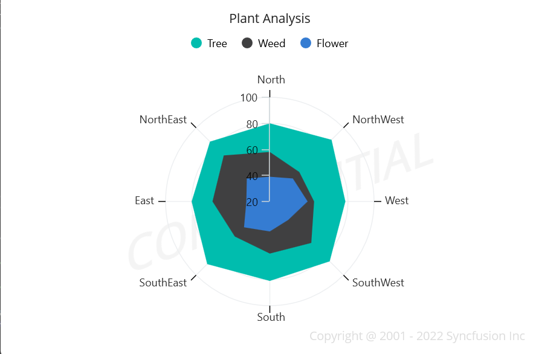

# Appearance in .NET MAUI Polar Chart

The appearance of [SfPolarChart](https://help.syncfusion.com/cr/maui/Syncfusion.Maui.Charts.SfPolarChart.html) can be customized using the predefined brushes, custom brushes, and gradient, which allows for the enrichment of the application.

N> **Prerequisite:** Ensure that the required NuGet package is installed, the necessary namespaces are imported, and the **SfPolarChart** control is properly configured in your application. For detailed setup and configuration instructions, refer to the **[Getting Started](https://help.syncfusion.com/maui/polar-charts/getting-started)** guide.

## Default PaletteBrushes for chart

By default, the chart applies a set of predefined brushes to the series in a specific order. The following screenshot displays the default appearance of multiple series.





<chart:SfPolarChart> 
    <!-- code omitted for brevity -->
    <chart:PolarLineSeries ItemsSource = "{Binding PlantDetails}" XBindingPath = "Direction" YBindingPath = "Tree"/> 
    <chart:PolarLineSeries ItemsSource = "{Binding PlantDetails}" XBindingPath = "Direction" YBindingPath = "Weed"/> 
    <chart:PolarLineSeries ItemsSource = "{Binding PlantDetails}" XBindingPath = "Direction" YBindingPath = "Flower"/>
</chart:SfPolarChart>





SfPolarChart chart = new SfPolarChart();
// code omitted for brevity
PolarLineSeries series1 = new PolarLineSeries()
{
    ItemsSource = new PlantViewModel().PlantDetails,
    XBindingPath = "Direction",
    YBindingPath = "Tree"
};

PolarLineSeries series2 = new PolarLineSeries()
{
    ItemsSource = new PlantViewModel().PlantDetails,
    XBindingPath = "Direction",
    YBindingPath = "Weed"
};

PolarLineSeries series3 = new PolarLineSeries()
{
    ItemsSource = new PlantViewModel().PlantDetails,
    XBindingPath = "Direction",
    YBindingPath = "Flower"
};

chart.Series.Add(series1);
chart.Series.Add(series2);
chart.Series.Add(series3);
this.Content = chart;





### Custom PaletteBrushes

The [SfPolarChart](https://help.syncfusion.com/cr/maui/Syncfusion.Maui.Charts.SfPolarChart.html) provides support for defining custom brushes for the chart in a preferred order using the [PaletteBrushes](https://help.syncfusion.com/cr/maui/Syncfusion.Maui.Charts.SfPolarChart.html#Syncfusion_Maui_Charts_SfPolarChart_PaletteBrushes) property, as illustrated in the following code example.





<chart:SfPolarChart x:Name = "chart" PaletteBrushes = "{Binding CustomBrushes}">
    <!-- code omitted for brevity -->
</chart:SfPolarChart>





SfPolarChart chart = new SfPolarChart();
List<Brush> CustomBrushes = new List<Brush>()
{
    new SolidColorBrush(Color.FromArgb("#25E739")),
    new SolidColorBrush(Color.FromArgb("#F4890B")),
    new SolidColorBrush(Color.FromArgb("#E2227E"))
};

this.chart.PaletteBrushes = CustomBrushes;
// code omitted for brevity
this.Content = chart;





## Applying Gradient

The gradient for the chart can be set using the [PaletteBrushes](https://help.syncfusion.com/cr/maui/Syncfusion.Maui.Charts.ChartSeries.html#Syncfusion_Maui_Charts_ChartSeries_PaletteBrushes) property with the help of `LinearGradientBrush` or `RadialGradientBrush`.

The following code sample and screenshot illustrates how to apply the gradient brushes for the series using the [PaletteBrushes](https://help.syncfusion.com/cr/maui/Syncfusion.Maui.Charts.ChartSeries.html#Syncfusion_Maui_Charts_ChartSeries_PaletteBrushes) property.





<chart:SfPolarChart PaletteBrushes = "{Binding CustomBrushes}">
    <!-- code omitted for brevity -->
    <chart:PolarAreaSeries ItemsSource = "{Binding PlantDetails}" XBindingPath = "Direction" YBindingPath = "Tree"/>
    <chart:PolarAreaSeries ItemsSource = "{Binding PlantDetails}" XBindingPath = "Direction" YBindingPath = "Weed"/>
    <chart:PolarAreaSeries ItemsSource = "{Binding PlantDetails}" XBindingPath = "Direction" YBindingPath = "Flower"/>
</chart:SfPolarChart>





public class ViewModel
{
	public ObservableCollection<Model> Data { get; set; }
	public List<Brush> CustomBrushes { get; set; }
	public ViewModel()
	{
		CustomBrushes = new List<Brush>();
		LinearGradientBrush gradientColor1 = new LinearGradientBrush();
		gradientColor1.GradientStops = new GradientStopCollection()
		{
			new GradientStop() { Offset = 1, Color = Color.FromRgb(168, 234, 238) },
			new GradientStop() { Offset = 0, Color = Color.FromRgb(123, 176, 249) }
		};

		LinearGradientBrush gradientColor2 = new LinearGradientBrush();
		gradientColor2.GradientStops = new GradientStopCollection()
		{
			new GradientStop() { Offset = 1, Color = Color.FromRgb(221, 214, 243) },
			new GradientStop() { Offset = 0, Color = Color.FromRgb(250, 172, 168) }
		};

		LinearGradientBrush gradientColor3 = new LinearGradientBrush();
		gradientColor3.GradientStops = new GradientStopCollection()
		{
			new GradientStop() { Offset = 1, Color = Color.FromRgb(255, 231, 199) },
			new GradientStop() { Offset = 0, Color = Color.FromRgb(252, 182, 159) }
		};

		LinearGradientBrush gradientColor4 = new LinearGradientBrush();
		gradientColor4.GradientStops = new GradientStopCollection()
		{
			new GradientStop() { Offset = 1, Color = Color.FromRgb(255, 231, 199) },
			new GradientStop() { Offset = 0, Color = Color.FromRgb(252, 182, 159) }
		};

		LinearGradientBrush gradientColor5 = new LinearGradientBrush();
		gradientColor5.GradientStops = new GradientStopCollection()
		{
			new GradientStop() { Offset = 1, Color = Color.FromRgb(250, 221, 125) },
			new GradientStop() { Offset = 0, Color = Color.FromRgb(252, 204, 45) }
		};

		CustomBrushes.Add(gradientColor1);
		CustomBrushes.Add(gradientColor2);
		CustomBrushes.Add(gradientColor3);
		CustomBrushes.Add(gradientColor4);
		CustomBrushes.Add(gradientColor5);
	}
	// code omitted for brevity
}





## Point Color Path

The [SfPolarChart](https://help.syncfusion.com/cr/maui/Syncfusion.Maui.Charts.SfPolarChart.html) supports using the [PointColorPath](https://help.syncfusion.com/cr/maui/Syncfusion.Maui.Charts.ChartSeries.html#Syncfusion_Maui_Charts_ChartSeries_PointColorPath) property to assign different colors to each data point. By binding this property to a color field in the data source, each segment can be dynamically styled with its own color.

The following code example demonstrates how to define a data model with a `PointColor` property and bind it to the chart series.





public class PointColorViewModel
{
    public ObservableCollection<Model> Data { get; set; }

    public PointColorViewModel()
    {
        Data = new ObservableCollection<Model>()
        {
            new(){ XValue = "North", YValue = 80, PointColor = Color.FromArgb("#cbb4e0")},
            new(){ XValue = "NorthEast", YValue = 85, PointColor = Color.FromArgb("#ab80d8")},
            new(){ XValue = "East", YValue = 78, PointColor = Color.FromArgb("#8238c2")},
            new(){ XValue = "SouthEast", YValue = 90, PointColor = Color.FromArgb("#5f209d")},
            new(){ XValue = "South", YValue = 78, PointColor = Color.FromArgb("#441372")},
            new(){ XValue = "SouthWest", YValue = 83, PointColor = Color.FromArgb("#a256de")},
            new(){ XValue = "West", YValue = 79, PointColor = Color.FromArgb("#ba93df")},
            new(){ XValue = "NorthWest", YValue = 88, PointColor = Color.FromArgb("#e1aeff")}
        };
    }
}

public class Model
{
    public string? XValue { get; set; }
    public double YValue { get; set; }
    public Color? PointColor { get; set; }
}





Set `ItemsSource` to your data collection and map `XBindingPath`, `YBindingPath`, and `PointColorPath` to the corresponding model properties.





<chart:SfPolarChart>
    <!-- code omitted for brevity -->
    <chart:PolarLineSeries ItemsSource = "{Binding Data}"
                           XBindingPath = "XValue"
                           YBindingPath = "YValue"
                           PointColorPath = "PointColor"/>
</chart:SfPolarChart>





SfPolarChart chart = new SfPolarChart();
<!-- code omitted for brevity -->
PolarLineSeries series = new PolarLineSeries()
{
    ItemsSource = new PointColorViewModel().Data,
    XBindingPath = "XValue",
    YBindingPath = "YValue",
    PointColorPath = "PointColor"
};

chart.Series.Add(series);
this.Content = chart;





N> The property is not applicable to the `PolarAreaSeries` type.

N> The priority for color assignment is as follows: `Fill`>`PointColorPath`>`PaletteBrushes`.

## Plotting Area Customization:

[SfPolarChart](https://help.syncfusion.com/cr/maui/Syncfusion.Maui.Charts.SfPolarChart.html) allows you to add any view to the chart plot area, which is useful for adding any relevant data, a watermark, or a color gradient to the background of the chart.





<chart:SfPolarChart>
   <chart:SfPolarChart.PlotAreaBackgroundView>
    	<AbsoluteLayout>
      		<Label Text = "Copyright @ 2001 - 2024 Syncfusion Inc"
		           FontSize = "18"
				   AbsoluteLayout.LayoutBounds = "1,1,-1,-1"
		           AbsoluteLayout.LayoutFlags = "PositionProportional"
		           Opacity = "0.4"/>
       		<Label Text = "CONFIDENTIAL" 
			       Rotation = "340" 
				   FontSize = "80"
		           FontAttributes = "Bold"
				   TextColor = "Gray" 
				   Margin = "10,0,0,0"
	               AbsoluteLayout.LayoutBounds = "0.5,0.5,-1,-1"
		           AbsoluteLayout.LayoutFlags = "PositionProportional"
		           Opacity = "0.3"/>
    	</AbsoluteLayout>
   </chart:SfPolarChart.PlotAreaBackgroundView>
</chart:SfPolarChart>





SfPolarChart chart = new SfPolarChart();
AbsoluteLayout absoluteLayout = new AbsoluteLayout();
var copyRight = new Label()
{
    Text = "Copyright @ 2001 - 2024 Syncfusion Inc",
    FontSize = 18,
    Opacity = 0.4
};

AbsoluteLayout.SetLayoutBounds(copyRight, new Rect(1, 1, -1, -1));
AbsoluteLayout.SetLayoutFlags(copyRight, Microsoft.Maui.Layouts.AbsoluteLayoutFlags.PositionProportional);
absoluteLayout.Children.Add(copyRight);
var watermark = new Label()
{
    Text = "CONFIDENTIAL",
    Rotation = 340,
    FontSize = 80,
    FontAttributes = FontAttributes.Bold,
    TextColor = Colors.Gray,
    Opacity = 0.3
};

AbsoluteLayout.SetLayoutBounds(watermark, new Rect(0.5, 0.5, -1, -1));
AbsoluteLayout.SetLayoutFlags(watermark, Microsoft.Maui.Layouts.AbsoluteLayoutFlags.PositionProportional);
absoluteLayout.Children.Add(watermark);
chart.PlotAreaBackgroundView = absoluteLayout;
this.Content = chart;





## Add a title

The title of the chart provides quick information to the user about the data being plotted in the chart. The [Title](https://help.syncfusion.com/cr/maui/Syncfusion.Maui.Charts.ChartBase.html#Syncfusion_Maui_Charts_ChartBase_Title) property is used to set the title for the chart as follows.

 



<chart:SfPolarChart>
    <chart:SfPolarChart.Title>
        <Label Text = "Plant Analysis" HorizontalTextAlignment = "Center"/>
    </chart:SfPolarChart.Title> 
</chart:SfPolarChart>





SfPolarChart chart = new SfPolarChart();
chart.Title = new Label()
{
    Text = "Plant Analysis",
    HorizontalTextAlignment = TextAlignment.Center
};
this.Content = chart;



  
