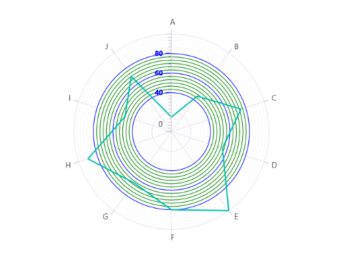

# Axis Range Styles in .NET MAUI Polar Chart

The [RangeStyles]() property allows you to customize the appearance of individual axis elements within a specified range.

The following axis elements can be customized using [ChartAxisRangeStyle]():

- [MajorGridLineStyle]()
- [MinorGridLineStyle]()
- [MajorTickStyle]()
- [MinorTickStyle]()
- [LabelStyle]()

The following example demonstrates how to customize major and minor grid lines within specific axis ranges.





<chart:SfPolarChart>
    <chart:SfPolarChart.SecondaryAxis>
        <chart:NumericalAxis>
            <chart:NumericalAxis.RangeStyles>
                <chart:ChartAxisRangeStyle Start="20" End="40">
                    <chart:ChartAxisRangeStyle.MajorGridLineStyle>
                        <chart:ChartLineStyle
                            Stroke="Blue"
                            StrokeWidth="2" />
                    </chart:ChartAxisRangeStyle.MajorGridLineStyle>
                </chart:ChartAxisRangeStyle>
                <chart:ChartAxisRangeStyle Start="40" End="60">
                    <chart:ChartAxisRangeStyle.MinorGridLineStyle>
                        <chart:ChartLineStyle
                            Stroke="Green"
                            StrokeWidth="1"
                            StrokeDashArray="4,2" />
                    </chart:ChartAxisRangeStyle.MinorGridLineStyle>
                </chart:ChartAxisRangeStyle>
            </chart:NumericalAxis.RangeStyles>
        </chart:NumericalAxis>
    </chart:SfPolarChart.SecondaryAxis>
</chart:SfPolarChart>





SfPolarChart chart = new SfPolarChart();

NumericalAxis axis = new NumericalAxis();

axis.RangeStyles.Add(new ChartAxisRangeStyle()
{
    Start = 20,
    End = 40,
    MajorGridLineStyle = new ChartLineStyle()
    {
        Stroke = Colors.Blue,
        StrokeWidth = 2
    }
});

axis.RangeStyles.Add(new ChartAxisRangeStyle()
{
    Start = 40,
    End = 60,
    MinorGridLineStyle = new ChartLineStyle()
    {
        Stroke = Colors.Green,
        StrokeWidth = 1,
        StrokeDashArray = new double[] { 4, 2 }
    }
});

chart.SecondaryAxis = axis;
// code omitted for brevity
this.Content = chart;





