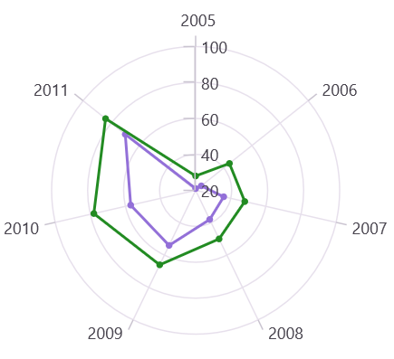

# Axis labels in .NET MAUI Polar Chart

Axis labels are used to display the units, measures, or category values of an axis in a user-friendly way. They are generated based on the range and the values bound to the [XBindingPath](https://help.syncfusion.com/cr/maui/Syncfusion.Maui.Charts.ChartSeries.html#Syncfusion_Maui_Charts_ChartSeries_XBindingPath) or [YBindingPath](https://help.syncfusion.com/cr/maui/Syncfusion.Maui.Charts.XYDataSeries.html#Syncfusion_Maui_Charts_XYDataSeries_YBindingPath) properties of the series.

N> **Prerequisite:** Ensure that the required NuGet package is installed, the necessary namespaces are imported, and the **SfPolarChart** control is properly configured in your application. For detailed setup and configuration instructions, refer to the **[Getting Started](https://help.syncfusion.com/maui/polar-charts/getting-started)** guide.

## Positioning the labels

The [LabelsPosition](https://help.syncfusion.com/cr/maui/Syncfusion.Maui.Charts.ChartAxis.html#Syncfusion_Maui_Charts_ChartAxis_LabelsPosition) property is used to position the axis labels inside or outside the chart area. The default value of [LabelsPosition](https://help.syncfusion.com/cr/maui/Syncfusion.Maui.Charts.ChartAxis.html#Syncfusion_Maui_Charts_ChartAxis_LabelsPosition) is `AxisElementPosition.Outside`.

N> This is only applicable to the secondary axis of Polar chart.





<chart:SfPolarChart>
    <!-- code omitted for brevity -->
    <chart:SfPolarChart.SecondaryAxis>
        <chart:NumericalAxis LabelsPosition = "Inside"/>
    </chart:SfPolarChart.SecondaryAxis>
</chart:SfPolarChart>





SfPolarChart chart = new SfPolarChart();
// code omitted for brevity
NumericalAxis axis = new NumericalAxis()
{
    LabelsPosition = AxisElementPosition.Inside
};
chart.SecondaryAxis = axis;

this.Content = chart;





## Label customization

The [LabelStyle](https://help.syncfusion.com/cr/maui/Syncfusion.Maui.Charts.ChartAxis.html#Syncfusion_Maui_Charts_ChartAxis_LabelStyle) property of the axis provides options to customize the font family, font size, font attributes, and text color of axis labels. The axis labels can be customized using the following properties:

* `Background`, of type `Brush`, specifies the background color of the labels.
* `CornerRadius`, of type `CornerRadius`, defines the rounded corners for labels.
* `FontAttributes`, of type `FontAttributes`, specifies the font style for the label.
* `FontFamily`, of type `string`, specifies the font family name for the label.
* `FontSize`, of type `double`, specifies the font size for the label.
* `Margin`, of type `Thickness`, specifies the margin of the label to customize the appearance of the label.
* `Stroke`, of type `Brush`, specifies the border stroke color of the labels.
* `StrokeWidth`, of type `double`, specifies the border thickness of the label.
* `TextColor`, of type `Color`, specifies the color for the text of the label.
* `LabelFormat`, of type `string`, specifies the label format. This property is used to set numeric or date-time format to the chart axis label.
* `LabelAlignment`, of type `ChartAxisLabelAlignment`, specifies the axis label at start, end, and center positions.

## Edge labels drawing mode

The chart axis supports customizing the rendering position of the edge labels using the [EdgeLabelsDrawingMode](https://help.syncfusion.com/cr/maui/Syncfusion.Maui.Charts.ChartAxis.html#Syncfusion_Maui_Charts_ChartAxis_EdgeLabelsDrawingMode) property. The default value of the [EdgeLabelsDrawingMode](https://help.syncfusion.com/cr/maui/Syncfusion.Maui.Charts.ChartAxis.html#Syncfusion_Maui_Charts_ChartAxis_EdgeLabelsDrawingMode) property is `Shift`. The [EdgeLabelsDrawingMode](https://help.syncfusion.com/cr/maui/Syncfusion.Maui.Charts.ChartAxis.html#Syncfusion_Maui_Charts_ChartAxis_EdgeLabelsDrawingMode) enum supports the following values:

| Value | Description |
|--|--|
| Center | Indicates that the edge label should appear at the center of its grid lines. |
| Fit | Indicates that the edge labels should be fit within the area of `SfPolarChart`. |
| Hide | Indicates that the edge labels will be hidden. |
| Shift | Indicates that edge labels should be shifted to either left or right so that they come within the area of the chart. |





<chart:SfPolarChart>
    <!-- code omitted for brevity -->
    <chart:SfPolarChart.SecondaryAxis>
        <chart:DateTimeAxis EdgeLabelsDrawingMode = "Center"/>
    </chart:SfPolarChart.SecondaryAxis>
</chart:SfPolarChart>





SfPolarChart chart = new SfPolarChart();
// code omitted for brevity
DateTimeAxis secondaryAxis = new DateTimeAxis()
{
    EdgeLabelsDrawingMode = EdgeLabelsDrawingMode.Center
};
chart.SecondaryAxis = secondaryAxis;

this.Content = chart;





## Edge labels visibility

The visibility of the edge labels of the axis can be controlled using the [EdgeLabelsVisibilityMode](https://help.syncfusion.com/cr/maui/Syncfusion.Maui.Charts.RangeAxisBase.html#Syncfusion_Maui_Charts_RangeAxisBase_EdgeLabelsVisibilityMode) property. The default value of [EdgeLabelsVisibilityMode](https://help.syncfusion.com/cr/maui/Syncfusion.Maui.Charts.RangeAxisBase.html#Syncfusion_Maui_Charts_RangeAxisBase_EdgeLabelsVisibilityMode) is `Default`, which displays the edge label based on auto interval calculations. The [EdgeLabelsVisibilityMode](https://help.syncfusion.com/cr/maui/Syncfusion.Maui.Charts.RangeAxisBase.html#Syncfusion_Maui_Charts_RangeAxisBase_EdgeLabelsVisibilityMode) enum supports the following values:

| Value | Description |
|--|--|
| `Default` | Displays the edge labels based on auto interval calculations. |
| `AlwaysVisible` | Displays the edge labels even when the chart area is in a zoomed state. |
| `Visible` | Displays the edge labels irrespective of the auto interval calculation until zooming (i.e., in the normal state). |

N> `EdgeLabelsDrawingMode` and `EdgeLabelsVisibilityMode` can only be customized for the secondary axis.

**Always Visible**

The `AlwaysVisible` option in [EdgeLabelsVisibilityMode](https://help.syncfusion.com/cr/maui/Syncfusion.Maui.Charts.RangeAxisBase.html#Syncfusion_Maui_Charts_RangeAxisBase_EdgeLabelsVisibilityMode) is used to display the edge labels even when the chart area is in a zoomed state.





<chart:SfPolarChart>
    <!-- code omitted for brevity -->
    <chart:SfPolarChart.SecondaryAxis>
        <chart:NumericalAxis EdgeLabelsVisibilityMode = "AlwaysVisible"/>
    </chart:SfPolarChart.SecondaryAxis>
</chart:SfPolarChart>





SfPolarChart chart = new SfPolarChart();
// code omitted for brevity
NumericalAxis secondaryAxis = new NumericalAxis()
{
    EdgeLabelsVisibilityMode = EdgeLabelsVisibilityMode.AlwaysVisible
};
chart.SecondaryAxis = secondaryAxis;

this.Content = chart;





**Visible**

The `Visible` option in [EdgeLabelsVisibilityMode](https://help.syncfusion.com/cr/maui/Syncfusion.Maui.Charts.RangeAxisBase.html#Syncfusion_Maui_Charts_RangeAxisBase_EdgeLabelsVisibilityMode) is used to display the edge labels irrespective of the auto interval calculation until zooming (i.e., in the normal state).





<chart:SfPolarChart>
    <!-- code omitted for brevity -->
    <chart:SfPolarChart.SecondaryAxis>
        <chart:NumericalAxis EdgeLabelsVisibilityMode = "Visible"/>
    </chart:SfPolarChart.SecondaryAxis>
</chart:SfPolarChart>





SfPolarChart chart = new SfPolarChart();
// code omitted for brevity
NumericalAxis secondaryAxis = new NumericalAxis()
{
    EdgeLabelsVisibilityMode = EdgeLabelsVisibilityMode.Visible
};
chart.SecondaryAxis = secondaryAxis;

this.Content = chart;



