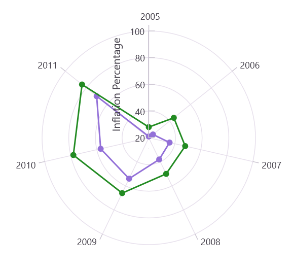

# Tick Lines in .NET MAUI Chart

Tick lines are the small lines which is drawn on the axis line representing the axis labels. By default, tick lines are drawn outside of the axis.

Minor tick lines can be added to the axis by defining the [MinorTicksPerInterval](https://help.syncfusion.com/cr/maui/Syncfusion.Maui.Charts.RangeAxisBase.html#Syncfusion_Maui_Charts_RangeAxisBase_MinorTicksPerInterval) property. This property will add the minor tick lines to every interval based on value.

N> For category axis, minor tick lines are not applicable as it is rendered based on index positions.





<chart:SfPolarChart>
. . .
    <chart:SfPolarChart.PrimaryAxis>
        <chart:NumericalAxis />
    </chart:SfPolarChart.PrimaryAxis>

    <chart:SfPolarChart.SecondaryAxis>
        <chart:NumericalAxis MinorTicksPerInterval="4"/>
    </chart:SfPolarChart.SecondaryAxis>
</chart:SfPolarChart>





SfPolarChart chart = new SfPolarChart();
. . .
NumericalAxis primaryAxis = new NumericalAxis()
chart.PrimaryAxis = primaryAxis;
NumericalAxis secondaryAxis = new NumericalAxis()
{
    MinorTicksPerInterval = 4 
};

chart.SecondaryAxis = secondaryAxis;





## Positioning the ticklines

The positioning of tick lines inside or outside the chart area can be controlled using the [TickPosition]() property. By default, the tick lines are positioned outside of the chart area. 

N> Polar chart supports TickPosition for secondary axis only.





<chart:SfPolarChart>
. . .

    <chart:SfPolarChart.SecondaryAxis>
        <chart:NumericalAxis TickPosition="Inside"/>
    </chart:SfPolarChart.SecondaryAxis>

    . . .
</chart:SfPolarChart>





SfPolarChart chart = new SfPolarChart();
. . .

NumericalAxis secondaryAxis = new NumericalAxis()
{
    TickPosition = AxisElementPosition.Inside
};

chart.SecondaryAxis = secondaryAxis;





## Customization

Both major and minor tick lines can be customized using the [MajorTickStyle](https://help.syncfusion.com/cr/maui/Syncfusion.Maui.Charts.ChartAxis.html#Syncfusion_Maui_Charts_ChartAxis_MajorTickStyle) and [MinorTickStyle](https://help.syncfusion.com/cr/maui/Syncfusion.Maui.Charts.RangeAxisBase.html#Syncfusion_Maui_Charts_RangeAxisBase_MinorTickStyle) properties respectively. They provide options to change the [StrokeWidth](https://help.syncfusion.com/cr/maui/Syncfusion.Maui.Charts.ChartAxisTickStyle.html#Syncfusion_Maui_Charts_ChartAxisTickStyle_StrokeWidth), [TickSize](https://help.syncfusion.com/cr/maui/Syncfusion.Maui.Charts.ChartAxisTickStyle.html#Syncfusion_Maui_Charts_ChartAxisTickStyle_TickSize), [Stroke](https://help.syncfusion.com/cr/maui/Syncfusion.Maui.Charts.ChartAxisTickStyle.html#Syncfusion_Maui_Charts_ChartAxisTickStyle_Stroke) of tick lines. By default, minor tick lines will not be visible.





<chart:SfPolarChart>
. . .
    <chart:SfPolarChart.PrimaryAxis>
        <chart:NumericalAxis />
    </chart:SfPolarChart.PrimaryAxis>

    <chart:SfPolarChart.SecondaryAxis>
        <chart:NumericalAxis MinorTicksPerInterval="4">
            <chart:NumericalAxis.MajorTickStyle>
                <chart:ChartAxisTickStyle Stroke="Red" StrokeWidth="1" TickSize="10"/>
            </chart:NumericalAxis.MajorTickStyle>            
            <chart:NumericalAxis.MinorTickStyle>
                <chart:ChartAxisTickStyle Stroke="Red" StrokeWidth="1"/>
            </chart:NumericalAxis.MinorTickStyle>
        </chart:NumericalAxis>
    </chart:SfPolarChart.SecondaryAxis>
</chart:SfPolarChart>





SfPolarChart chart = new SfPolarChart();
. . .
NumericalAxis primaryAxis = new NumericalAxis();
chart.PrimaryAxis = primaryAxis;
NumericalAxis secondaryAxis = new NumericalAxis();
numerical.MajorTickStyle.StrokeWidth = 1;
numerical.MajorTickStyle.Stroke = Colors.Red;
numerical.MajorTickStyle.TickSize = 10;
numerical.MinorTicksPerInterval = 4;
numerical.MinorTickStyle.StrokeWidth = 1;
numerical.MinorTickStyle.Stroke = Colors.Red;
chart.SecondaryAxis = secondaryAxis;



