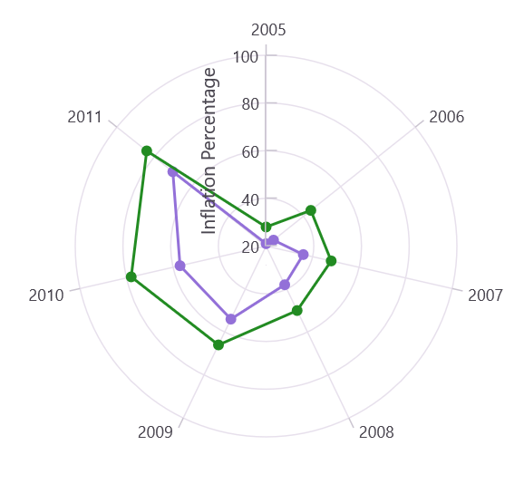

# Tick lines in .NET MAUI Polar Chart

Tick lines are the small lines drawn on the axis line to represent the axis labels. By default, tick lines are drawn outside of the axis.

Minor tick lines can be added to the axis by defining the [MinorTicksPerInterval](https://help.syncfusion.com/cr/maui/Syncfusion.Maui.Charts.RangeAxisBase.html#Syncfusion_Maui_Charts_RangeAxisBase_MinorTicksPerInterval) property. This property adds the minor tick lines to every interval based on the value.

N> **Prerequisite:** Ensure that the required NuGet package is installed, the necessary namespaces are imported, and the **SfPolarChart** control is properly configured in your application. For detailed setup and configuration instructions, refer to the **[Getting Started](https://help.syncfusion.com/maui/polar-charts/getting-started)** guide.

N> For category axis, minor tick lines are not applicable as it is rendered based on index positions.





<chart:SfPolarChart>
    <!-- code omitted for brevity -->
    <chart:SfPolarChart.PrimaryAxis>
        <chart:NumericalAxis/>
    </chart:SfPolarChart.PrimaryAxis>

    <chart:SfPolarChart.SecondaryAxis>
        <chart:NumericalAxis MinorTicksPerInterval = "4"/>
    </chart:SfPolarChart.SecondaryAxis>
</chart:SfPolarChart>





SfPolarChart chart = new SfPolarChart();
// code omitted for brevity
NumericalAxis primaryAxis = new NumericalAxis();
chart.PrimaryAxis = primaryAxis;

NumericalAxis secondaryAxis = new NumericalAxis()
{
    MinorTicksPerInterval = 4
};
chart.SecondaryAxis = secondaryAxis;

this.Content = chart;





## Positioning the ticks

The tick lines can be positioned inside or outside the chart area using the [TickPosition](https://help.syncfusion.com/cr/maui/Syncfusion.Maui.Charts.ChartAxis.html#Syncfusion_Maui_Charts_ChartAxis_TickPosition) property. The default value of [TickPosition](https://help.syncfusion.com/cr/maui/Syncfusion.Maui.Charts.ChartAxis.html#Syncfusion_Maui_Charts_ChartAxis_TickPosition) is `AxisElementPosition.Outside`.

N> This is only applicable to the secondary axis of Polar chart.





<chart:SfPolarChart>
    <!-- code omitted for brevity -->
    <chart:SfPolarChart.SecondaryAxis>
        <chart:NumericalAxis TickPosition = "Inside"/>
    </chart:SfPolarChart.SecondaryAxis>
</chart:SfPolarChart>





SfPolarChart chart = new SfPolarChart();
// code omitted for brevity
NumericalAxis secondaryAxis = new NumericalAxis()
{
    TickPosition = AxisElementPosition.Inside
};
chart.SecondaryAxis = secondaryAxis;

this.Content = chart;





## Customization

Both major and minor tick lines can be customized using the [MajorTickStyle](https://help.syncfusion.com/cr/maui/Syncfusion.Maui.Charts.ChartAxis.html#Syncfusion_Maui_Charts_ChartAxis_MajorTickStyle) and [MinorTickStyle](https://help.syncfusion.com/cr/maui/Syncfusion.Maui.Charts.RangeAxisBase.html#Syncfusion_Maui_Charts_RangeAxisBase_MinorTickStyle) properties respectively. They provide options to change the [StrokeWidth](https://help.syncfusion.com/cr/maui/Syncfusion.Maui.Charts.ChartAxisTickStyle.html#Syncfusion_Maui_Charts_ChartAxisTickStyle_StrokeWidth), [TickSize](https://help.syncfusion.com/cr/maui/Syncfusion.Maui.Charts.ChartAxisTickStyle.html#Syncfusion_Maui_Charts_ChartAxisTickStyle_TickSize), and [Stroke](https://help.syncfusion.com/cr/maui/Syncfusion.Maui.Charts.ChartAxisTickStyle.html#Syncfusion_Maui_Charts_ChartAxisTickStyle_Stroke) of tick lines. By default, minor tick lines will not be visible.





<chart:SfPolarChart>
    <!-- code omitted for brevity -->
    <chart:SfPolarChart.PrimaryAxis>
        <chart:NumericalAxis/>
    </chart:SfPolarChart.PrimaryAxis>

    <chart:SfPolarChart.SecondaryAxis>
        <chart:NumericalAxis MinorTicksPerInterval = "4">
            <chart:NumericalAxis.MajorTickStyle>
                <chart:ChartAxisTickStyle Stroke = "Red" StrokeWidth = "1" TickSize = "10"/>
            </chart:NumericalAxis.MajorTickStyle>            
            <chart:NumericalAxis.MinorTickStyle>
                <chart:ChartAxisTickStyle Stroke = "Red" StrokeWidth = "1"/>
            </chart:NumericalAxis.MinorTickStyle>
        </chart:NumericalAxis>
    </chart:SfPolarChart.SecondaryAxis>
</chart:SfPolarChart>





SfPolarChart chart = new SfPolarChart();
// code omitted for brevity
NumericalAxis primaryAxis = new NumericalAxis();
chart.PrimaryAxis = primaryAxis;

NumericalAxis secondaryAxis = new NumericalAxis()
{
    MajorTickStyle = new ChartAxisTickStyle()
    {
        StrokeWidth = 1,
        Stroke = Colors.Red,
        TickSize = 10
    },
    MinorTicksPerInterval = 4,
    MinorTickStyle = new ChartAxisTickStyle()
    {
        StrokeWidth = 1,
        Stroke = Colors.Red
    }
};
chart.SecondaryAxis = secondaryAxis;

this.Content = chart;



