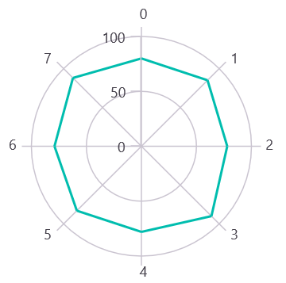
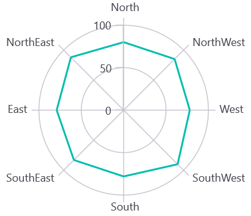
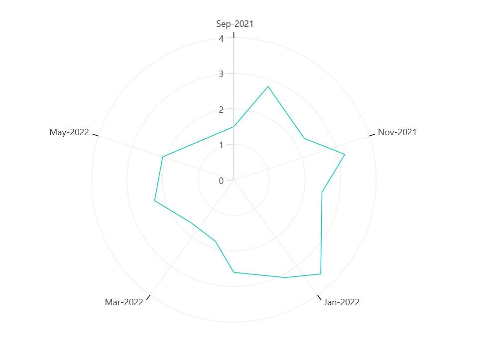
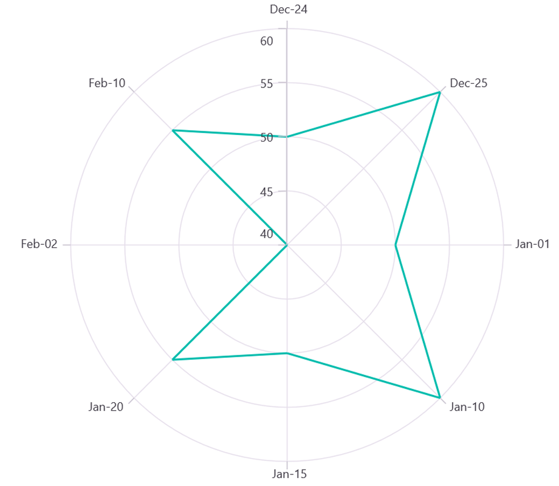

# Types of axis in .NET MAUI Polar Chart

Polar chart supports the following types of chart axis:

* NumericalAxis
* CategoryAxis
* DateTimeAxis
* DateTimeCategoryAxis

N> **Prerequisite:** Ensure that the required NuGet package is installed, the necessary namespaces are imported, and the **SfPolarChart** control is properly configured in your application. For detailed setup and configuration instructions, refer to the **[Getting Started](https://help.syncfusion.com/maui/polar-charts/getting-started)** guide.

## Numerical axis

[NumericalAxis](https://help.syncfusion.com/cr/maui/Syncfusion.Maui.Charts.NumericalAxis.html) is used to plot numerical values to the chart. [NumericalAxis](https://help.syncfusion.com/cr/maui/Syncfusion.Maui.Charts.NumericalAxis.html) can be defined for both [PrimaryAxis](https://help.syncfusion.com/cr/maui/Syncfusion.Maui.Charts.SfPolarChart.html#Syncfusion_Maui_Charts_SfPolarChart_PrimaryAxis) and [SecondaryAxis](https://help.syncfusion.com/cr/maui/Syncfusion.Maui.Charts.SfPolarChart.html#Syncfusion_Maui_Charts_SfPolarChart_SecondaryAxis).





<chart:SfPolarChart>
    <!-- code omitted for brevity -->
    <chart:SfPolarChart.PrimaryAxis>
        <chart:NumericalAxis/>
    </chart:SfPolarChart.PrimaryAxis>

    <chart:SfPolarChart.SecondaryAxis>
        <chart:NumericalAxis/>
    </chart:SfPolarChart.SecondaryAxis>
</chart:SfPolarChart>





SfPolarChart chart = new SfPolarChart();
// code omitted for brevity
NumericalAxis primaryAxis = new NumericalAxis();
chart.PrimaryAxis = primaryAxis;

NumericalAxis secondaryAxis = new NumericalAxis();
chart.SecondaryAxis = secondaryAxis;

this.Content = chart;





### Interval

Axis interval can be customized by using the [Interval](https://help.syncfusion.com/cr/maui/Syncfusion.Maui.Charts.NumericalAxis.html#Syncfusion_Maui_Charts_NumericalAxis_Interval) property. By default, the interval is calculated based on the minimum and maximum value of the provided data.





<chart:SfPolarChart>
    <!-- code omitted for brevity -->
    <chart:SfPolarChart.PrimaryAxis>
        <chart:NumericalAxis Interval = "10"/>
    </chart:SfPolarChart.PrimaryAxis>

    <chart:SfPolarChart.SecondaryAxis>
        <chart:NumericalAxis/>
    </chart:SfPolarChart.SecondaryAxis>
</chart:SfPolarChart>





SfPolarChart chart = new SfPolarChart();
// code omitted for brevity
NumericalAxis primaryAxis = new NumericalAxis()
{
    Interval = 10 
};
chart.PrimaryAxis = primaryAxis;

NumericalAxis secondaryAxis = new NumericalAxis();
chart.SecondaryAxis = secondaryAxis;

this.Content = chart;





### Customizing the Range

The [Maximum](https://help.syncfusion.com/cr/maui/Syncfusion.Maui.Charts.NumericalAxis.html#Syncfusion_Maui_Charts_NumericalAxis_Maximum) and [Minimum](https://help.syncfusion.com/cr/maui/Syncfusion.Maui.Charts.NumericalAxis.html#Syncfusion_Maui_Charts_NumericalAxis_Minimum) properties of the axis are used to set the maximum and minimum values of the axis range, respectively.

N> If either the minimum or maximum value is set, the other value is calculated internally by default.





<chart:SfPolarChart>
    <!-- code omitted for brevity -->
    <chart:SfPolarChart.SecondaryAxis>
        <chart:NumericalAxis Maximum = "100" Minimum = "0" Interval = "20"/>
    </chart:SfPolarChart.SecondaryAxis>
</chart:SfPolarChart>





SfPolarChart chart = new SfPolarChart();
// code omitted for brevity
NumericalAxis secondaryAxis = new NumericalAxis()
{
    Maximum = 100,
    Minimum = 0,
    Interval = 20
};
chart.SecondaryAxis = secondaryAxis;

this.Content = chart;





## Category axis

The [CategoryAxis](https://help.syncfusion.com/cr/maui/Syncfusion.Maui.Charts.CategoryAxis.html) is an index-based axis that plots values based on the index of the data point collection. The points are equally spaced along the axis.





<chart:SfPolarChart>
    <!-- code omitted for brevity -->
    <chart:SfPolarChart.PrimaryAxis>
        <chart:CategoryAxis/>
    </chart:SfPolarChart.PrimaryAxis>
</chart:SfPolarChart>





SfPolarChart chart = new SfPolarChart();
// code omitted for brevity
CategoryAxis primaryAxis = new CategoryAxis();
chart.PrimaryAxis = primaryAxis;

this.Content = chart;





### Interval

By default, the [CategoryAxis](https://help.syncfusion.com/cr/maui/Syncfusion.Maui.Charts.CategoryAxis.html) labels are displayed with a fixed interval of `1`. This can be customized by using the [Interval](https://help.syncfusion.com/cr/maui/Syncfusion.Maui.Charts.CategoryAxis.html#Syncfusion_Maui_Charts_CategoryAxis_Interval) property of the axis.





<chart:SfPolarChart>
    <!-- code omitted for brevity -->
    <chart:SfPolarChart.PrimaryAxis>
        <chart:CategoryAxis Interval = "2"/>
    </chart:SfPolarChart.PrimaryAxis>

    <chart:SfPolarChart.SecondaryAxis>
        <chart:NumericalAxis/>
    </chart:SfPolarChart.SecondaryAxis>
</chart:SfPolarChart>





SfPolarChart chart = new SfPolarChart();
// code omitted for brevity
CategoryAxis primaryAxis = new CategoryAxis()
{
    Interval = 2
};
chart.PrimaryAxis = primaryAxis;

NumericalAxis secondaryAxis = new NumericalAxis();
chart.SecondaryAxis = secondaryAxis;

this.Content = chart;





## Date time axis

[DateTimeAxis](https://help.syncfusion.com/cr/maui/Syncfusion.Maui.Charts.DateTimeAxis.html) is used to plot `DateTime` values. The [DateTimeAxis](https://help.syncfusion.com/cr/maui/Syncfusion.Maui.Charts.DateTimeAxis.html) is widely used to make financial charts in places like the Stock Market, where index plotting is done every day.





<chart:SfPolarChart>
    <!-- code omitted for brevity -->
    <chart:SfPolarChart.PrimaryAxis>
        <chart:DateTimeAxis/>
    </chart:SfPolarChart.PrimaryAxis>
</chart:SfPolarChart>





SfPolarChart chart = new SfPolarChart();
// code omitted for brevity
DateTimeAxis primaryAxis = new DateTimeAxis();
chart.PrimaryAxis = primaryAxis;

this.Content = chart;





### Interval

In [DateTimeAxis](https://help.syncfusion.com/cr/maui/Syncfusion.Maui.Charts.DateTimeAxis.html), intervals can be customized using the [Interval](https://help.syncfusion.com/cr/maui/Syncfusion.Maui.Charts.DateTimeAxis.html#Syncfusion_Maui_Charts_DateTimeAxis_Interval) and [IntervalType](https://help.syncfusion.com/cr/maui/Syncfusion.Maui.Charts.DateTimeAxis.html#Syncfusion_Maui_Charts_DateTimeAxis_IntervalType) properties. For example, setting [Interval](https://help.syncfusion.com/cr/maui/Syncfusion.Maui.Charts.DateTimeAxis.html#Syncfusion_Maui_Charts_DateTimeAxis_Interval) as 6 and [IntervalType](https://help.syncfusion.com/cr/maui/Syncfusion.Maui.Charts.DateTimeAxis.html#Syncfusion_Maui_Charts_DateTimeAxis_IntervalType) as [Months](https://help.syncfusion.com/cr/maui/Syncfusion.Maui.Charts.DateTimeIntervalType.html#Syncfusion_Maui_Charts_DateTimeIntervalType_Months) will consider 6 months as interval.





<chart:SfPolarChart>
    <!-- code omitted for brevity -->
    <chart:SfPolarChart.PrimaryAxis>
        <chart:DateTimeAxis Interval = "6" IntervalType = "Months"/>
    </chart:SfPolarChart.PrimaryAxis>

    <chart:SfPolarChart.SecondaryAxis>
        <chart:NumericalAxis/>
    </chart:SfPolarChart.SecondaryAxis>
</chart:SfPolarChart>





SfPolarChart chart = new SfPolarChart();
// code omitted for brevity
DateTimeAxis primaryAxis = new DateTimeAxis()
{
    Interval = 6,
    IntervalType = DateTimeIntervalType.Months
};
chart.PrimaryAxis = primaryAxis;

NumericalAxis secondaryAxis = new NumericalAxis();
chart.SecondaryAxis = secondaryAxis;

this.Content = chart;





### Customizing the range

The [Minimum](https://help.syncfusion.com/cr/maui/Syncfusion.Maui.Charts.DateTimeAxis.html#Syncfusion_Maui_Charts_DateTimeAxis_Minimum) and [Maximum](https://help.syncfusion.com/cr/maui/Syncfusion.Maui.Charts.DateTimeAxis.html#Syncfusion_Maui_Charts_DateTimeAxis_Maximum) properties behave the same way as in [NumericalAxis](https://help.syncfusion.com/cr/maui/Syncfusion.Maui.Charts.NumericalAxis.html) except that date time values are used instead of numerical values.





<chart:SfPolarChart>
    <!-- code omitted for brevity -->
    <chart:SfPolarChart.PrimaryAxis>
        <chart:DateTimeAxis Minimum = "2021/05/10" Maximum = "2021/11/01"/>
    </chart:SfPolarChart.PrimaryAxis>
</chart:SfPolarChart>





SfPolarChart chart = new SfPolarChart();
// code omitted for brevity
DateTimeAxis primaryAxis = new DateTimeAxis()
{
    Minimum = new DateTime(2021, 05, 10),
    Maximum = new DateTime(2021, 11, 01)
};
chart.PrimaryAxis = primaryAxis;

this.Content = chart;





## DateTime category axis

The `DateTimeCategoryAxis` is a specialized type of axis primarily used with financial series. Similar to the [CategoryAxis](https://help.syncfusion.com/cr/maui/Syncfusion.Maui.Charts.CategoryAxis.html), all data points are plotted with equal spacing, eliminating gaps for missing dates. The intervals and ranges for this axis are calculated similarly to the [DateTimeAxis](https://help.syncfusion.com/cr/maui/Syncfusion.Maui.Charts.DateTimeAxis.html). There are no visual gaps between points, even if the difference between two points exceeds a year.





<chart:SfPolarChart>
    <!-- code omitted for brevity -->
    <chart:SfPolarChart.PrimaryAxis>
        <chart:DateTimeCategoryAxis/>
    </chart:SfPolarChart.PrimaryAxis>
    <!-- code omitted for brevity -->
</chart:SfPolarChart>





SfPolarChart chart = new SfPolarChart();
// code omitted for brevity
DateTimeCategoryAxis primaryAxis = new DateTimeCategoryAxis();
chart.PrimaryAxis = primaryAxis;
// code omitted for brevity
this.Content = chart;





### Interval

In `DateTimeCategoryAxis`, intervals can be customized by using the `Interval` and `IntervalType` properties, similar to [DateTimeAxis](https://help.syncfusion.com/cr/maui/Syncfusion.Maui.Charts.DateTimeAxis.html). For example, setting `Interval` to `3` and `IntervalType` to `Months` will consider 3 months as the interval.





<chart:SfPolarChart>
    <!-- code omitted for brevity -->
    <chart:SfPolarChart.PrimaryAxis>
        <chart:DateTimeCategoryAxis Interval = "3"
                                    IntervalType = "Months"/>
    </chart:SfPolarChart.PrimaryAxis>
    <!-- code omitted for brevity -->
</chart:SfPolarChart>





SfPolarChart chart = new SfPolarChart();
// code omitted for brevity
DateTimeCategoryAxis primaryAxis = new DateTimeCategoryAxis()
{
    Interval = 3,
    IntervalType = DateTimeIntervalType.Months
};
chart.PrimaryAxis = primaryAxis;
// code omitted for brevity
this.Content = chart;





## Inversed axis

The axis can be inverted by using the [IsInversed](https://help.syncfusion.com/cr/maui/Syncfusion.Maui.Charts.ChartAxis.html#Syncfusion_Maui_Charts_ChartAxis_IsInversed) property. The default value of this property is `false`.





<chart:SfPolarChart>
    <!-- code omitted for brevity -->
    <chart:SfPolarChart.SecondaryAxis>
        <chart:NumericalAxis IsInversed = "True"/>
    </chart:SfPolarChart.SecondaryAxis>
</chart:SfPolarChart>





SfPolarChart chart = new SfPolarChart();
// code omitted for brevity
NumericalAxis secondaryAxis = new NumericalAxis()
{
    IsInversed = true
};
chart.SecondaryAxis = secondaryAxis;

this.Content = chart;





## Events

### ActualRangeChanged

The [ActualRangeChanged](https://help.syncfusion.com/cr/maui/Syncfusion.Maui.Charts.ActualRangeChangedEventArgs.html) event is triggered when the actual range of the axis is changed. The argument contains the following information:

* [ActualMinimum](https://help.syncfusion.com/cr/maui/Syncfusion.Maui.Charts.ActualRangeChangedEventArgs.html#Syncfusion_Maui_Charts_ActualRangeChangedEventArgs_ActualMinimum) - used to get the actual minimum value of the axis.
* [ActualMaximum](https://help.syncfusion.com/cr/maui/Syncfusion.Maui.Charts.ActualRangeChangedEventArgs.html#Syncfusion_Maui_Charts_ActualRangeChangedEventArgs_ActualMaximum) - used to get the actual maximum value of the axis.

### LabelCreated

The [LabelCreated](https://help.syncfusion.com/cr/maui/Syncfusion.Maui.Charts.ChartAxis.html#Syncfusion_Maui_Charts_ChartAxis_LabelCreated) event is triggered when the axis label is created. The argument contains the following information:

* [Label](https://help.syncfusion.com/cr/maui/Syncfusion.Maui.Charts.ChartAxisLabelEventArgs.html#Syncfusion_Maui_Charts_ChartAxisLabelEventArgs_Label) - used to get or set the text of the axis label.
* [Position](https://help.syncfusion.com/cr/maui/Syncfusion.Maui.Charts.ChartAxisLabelEventArgs.html#Syncfusion_Maui_Charts_ChartAxisLabelEventArgs_Position) - used to get the position of the label.
* [LabelStyle](https://help.syncfusion.com/cr/maui/Syncfusion.Maui.Charts.ChartAxisLabelEventArgs.html#Syncfusion_Maui_Charts_ChartAxisLabelEventArgs_LabelStyle) - used to customize the appearance of the axis labels.