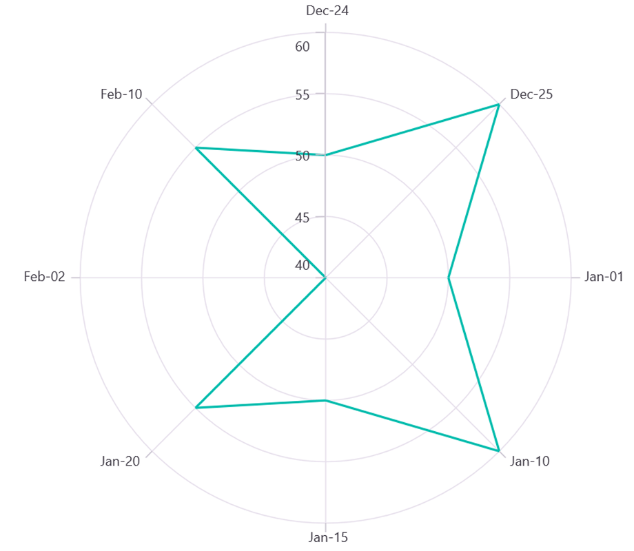

# Types of Axis in .NET MAUI Chart

Polar chart supports the following types of chart axis.

* NumericalAxis
* CategoryAxis
* DateTimeAxis
* DateTimeCategoryAxis

## Numerical Axis

[NumericalAxis](https://help.syncfusion.com/cr/maui/Syncfusion.Maui.Charts.NumericalAxis.html) is used to plot numerical values to the chart. [NumericalAxis](https://help.syncfusion.com/cr/maui/Syncfusion.Maui.Charts.NumericalAxis.html) can be defined for both [PrimaryAxis](https://help.syncfusion.com/cr/maui/Syncfusion.Maui.Charts.SfPolarChart.html#Syncfusion_Maui_Charts_SfPolarChart_PrimaryAxis) and [SecondaryAxis](https://help.syncfusion.com/cr/maui/Syncfusion.Maui.Charts.SfPolarChart.html#Syncfusion_Maui_Charts_SfPolarChart_SecondaryAxis).





<chart:SfPolarChart>
    . . .
    <chart:SfPolarChart.PrimaryAxis>
        <chart:NumericalAxis/>
    </chart:SfPolarChart.PrimaryAxis>

    <chart:SfPolarChart.SecondaryAxis>
        <chart:NumericalAxis/>
    </chart:SfPolarChart.SecondaryAxis>
</chart:SfPolarChart>





SfPolarChart chart = new SfPolarChart();
. . .
NumericalAxis primaryAxis = new NumericalAxis();
chart.PrimaryAxis = primaryAxis;

NumericalAxis secondaryAxis = new NumericalAxis();
chart.SecondaryAxis = secondaryAxis;

this.Content = chart;





### Interval

Axis interval can be customized by using the [Interval](https://help.syncfusion.com/cr/maui/Syncfusion.Maui.Charts.NumericalAxis.html#Syncfusion_Maui_Charts_NumericalAxis_Interval) property. By default, interval will be calculated based on the minimum and maximum value of the provided data.





<chart:SfPolarChart>
    . . .
    <chart:SfPolarChart.PrimaryAxis>
        <chart:NumericalAxis Interval="10"/>
    </chart:SfPolarChart.PrimaryAxis>

    <chart:SfPolarChart.SecondaryAxis>
        <chart:NumericalAxis/>
    </chart:SfPolarChart.SecondaryAxis>
</chart:SfPolarChart>





SfPolarChart chart = new SfPolarChart();
. . .
NumericalAxis primaryAxis = new NumericalAxis()
{
    Interval = 10 
};
chart.PrimaryAxis = primaryAxis;

NumericalAxis secondaryAxis = new NumericalAxis();
chart.SecondaryAxis = secondaryAxis;

this.Content = chart;





### Customizing the Range

[Maximum](https://help.syncfusion.com/cr/maui/Syncfusion.Maui.Charts.NumericalAxis.html#Syncfusion_Maui_Charts_NumericalAxis_Maximum) and [Minimum](https://help.syncfusion.com/cr/maui/Syncfusion.Maui.Charts.NumericalAxis.html#Syncfusion_Maui_Charts_NumericalAxis_Minimum) properties of axis is used for setting the maximum and minimum value of the axis range respectively.

N> If  minimum or maximum value is set, the other value is calculated by default internally.





<chart:SfPolarChart>
    . . .
    <chart:SfPolarChart.SecondaryAxis>
        <chart:NumericalAxis Maximum="100" Minimum="0" Interval="20"/>
    </chart:SfPolarChart.SecondaryAxis>
</chart:SfPolarChart>





SfPolarChart chart = new SfPolarChart();
. . .
NumericalAxis secondaryAxis = new NumericalAxis()
{
    Maximum = 100,
    Minimum = 0,
    Interval = 20
};
chart.SecondaryAxis = secondaryAxis;

this.Content = chart;





## Category Axis

The [CategoryAxis](https://help.syncfusion.com/cr/maui/Syncfusion.Maui.Charts.CategoryAxis.html) is an indexed based axis that plots values based on the index of the data point collection. The points are equally spaced here.





<chart:SfPolarChart>
    . . .
    <chart:SfPolarChart.PrimaryAxis>
        <chart:CategoryAxis/>
    </chart:SfPolarChart.PrimaryAxis>
</chart:SfPolarChart>





SfPolarChart chart = new SfPolarChart();
. . .
CategoryAxis primaryAxis = new CategoryAxis();
chart.PrimaryAxis = primaryAxis;

this.Content = chart;





### Interval

By default, the [CategoryAxis](https://help.syncfusion.com/cr/maui/Syncfusion.Maui.Charts.CategoryAxis.html) axis labels are display with fixed interval 1. It can customized by using the [Interval](https://help.syncfusion.com/cr/maui/Syncfusion.Maui.Charts.CategoryAxis.html#Syncfusion_Maui_Charts_CategoryAxis_Interval) property of axis.





<chart:SfPolarChart>
    . . .
    <chart:SfPolarChart.PrimaryAxis>
        <chart:CategoryAxis Interval="2"/>
    </chart:SfPolarChart.PrimaryAxis>

    <chart:SfPolarChart.SecondaryAxis>
        <chart:NumericalAxis/>
    </chart:SfPolarChart.SecondaryAxis>
</chart:SfPolarChart>





SfPolarChart chart = new SfPolarChart();
. . .
CategoryAxis primaryAxis = new CategoryAxis()
{
    Interval = 2
};
chart.PrimaryAxis = primaryAxis;

NumericalAxis secondaryAxis = new NumericalAxis();
chart.SecondaryAxis = secondaryAxis;

this.Content = chart;





## DateTime Axis

[DateTimeAxis](https://help.syncfusion.com/cr/maui/Syncfusion.Maui.Charts.DateTimeAxis.html) is used to plot `DateTime` values. The [DateTimeAxis](https://help.syncfusion.com/cr/maui/Syncfusion.Maui.Charts.DateTimeAxis.html) is widely used to make financial charts in places like the Stock Market, where index plotting is done every day.





<chart:SfPolarChart>
    . . .
    <chart:SfPolarChart.PrimaryAxis>
        <chart:DateTimeAxis/>
    </chart:SfPolarChart.PrimaryAxis>
</chart:SfPolarChart>





SfPolarChart chart = new SfPolarChart();
. . .
DateTimeAxis primaryAxis = new DateTimeAxis();
chart.PrimaryAxis = primaryAxis;

this.Content = chart;





### Interval

In [DateTimeAxis](https://help.syncfusion.com/cr/maui/Syncfusion.Maui.Charts.DateTimeAxis.html), intervals can be customized using the [Interval](https://help.syncfusion.com/cr/maui/Syncfusion.Maui.Charts.DateTimeAxis.html#Syncfusion_Maui_Charts_DateTimeAxis_Interval) and [IntervalType](https://help.syncfusion.com/cr/maui/Syncfusion.Maui.Charts.DateTimeAxis.html#Syncfusion_Maui_Charts_DateTimeAxis_IntervalType) properties. For example, setting [Interval](https://help.syncfusion.com/cr/maui/Syncfusion.Maui.Charts.DateTimeAxis.html#Syncfusion_Maui_Charts_DateTimeAxis_Interval) as 6 and [IntervalType](https://help.syncfusion.com/cr/maui/Syncfusion.Maui.Charts.DateTimeAxis.html#Syncfusion_Maui_Charts_DateTimeAxis_IntervalType) as [Months](https://help.syncfusion.com/cr/maui/Syncfusion.Maui.Charts.DateTimeIntervalType.html#Syncfusion_Maui_Charts_DateTimeIntervalType_Months) will consider 6 months as interval.





<chart:SfPolarChart>
    ...
    <chart:SfPolarChart.PrimaryAxis>
        <chart:DateTimeAxis Interval="6" IntervalType="Months"/>
    </chart:SfPolarChart.PrimaryAxis>

    <chart:SfPolarChart.SecondaryAxis>
        <chart:NumericalAxis/>
    </chart:SfPolarChart.SecondaryAxis>
</chart:SfPolarChart>





SfPolarChart chart = new SfPolarChart();
. . .
DateTimeAxis primaryAxis = new DateTimeAxis()
{
    Interval = 6, 
    IntervalType = DateTimeIntervalType.Months
};
chart.PrimaryAxis = primaryAxis;

NumericalAxis secondaryAxis = new NumericalAxis();
chart.SecondaryAxis = secondaryAxis;

this.Content = chart;





### Customizing the Range

[Minimum](https://help.syncfusion.com/cr/maui/Syncfusion.Maui.Charts.DateTimeAxis.html#Syncfusion_Maui_Charts_DateTimeAxis_Minimum) and [Maximum](https://help.syncfusion.com/cr/maui/Syncfusion.Maui.Charts.DateTimeAxis.html#Syncfusion_Maui_Charts_DateTimeAxis_Maximum) properties behavior is same as in [NumericalAxis](https://help.syncfusion.com/cr/maui/Syncfusion.Maui.Charts.NumericalAxis.html) instead of setting numerical value, have to set date time values.





<chart:SfPolarChart>
    . . .
    <chart:SfPolarChart.PrimaryAxis>
        <chart:DateTimeAxis Minimum="2021/05/10" Maximum="2021/11/01"/>
    </chart:SfPolarChart.PrimaryAxis>
</chart:SfPolarChart>





SfPolarChart chart = new SfPolarChart();
. . .
DateTimeAxis primaryAxis = new DateTimeAxis()
{
    Minimum = new DateTime(2021,05,10),
    Maximum = new DateTime(2021,11,01)
};
chart.PrimaryAxis = primaryAxis;

this.Content = chart;





## DateTimeCategoryAxis

The `DateTimeCategoryAxis` is a specialized type of axis primarily used with financial series. Similar to the [CategoryAxis](https://help.syncfusion.com/cr/maui/Syncfusion.Maui.Charts.CategoryAxis.html), all data points are plotted with equal spacing, eliminating gaps for missing dates. The intervals and ranges for this axis are calculated similarly to the [DateTimeAxis](https://help.syncfusion.com/cr/maui/Syncfusion.Maui.Charts.DateTimeAxis.html). There are no visual gaps between points, even if the difference between two points exceeds a year.





<chart:SfPolarChart>
    . . .
    <chart:SfPolarChart.PrimaryAxis>
        <chart:DateTimeCategoryAxis/>
    </chart:SfPolarChart.PrimaryAxis>
    . . .
</chart:SfPolarChart>





SfPolarChart chart = new SfPolarChart(); 
. . . 
// Create an instance of the DateTimeCategoryAxis, used for displaying DateTime values as categories 
DateTimeCategoryAxis primaryAxis = new DateTimeCategoryAxis(); 
// Add the DateTimeCategoryAxis instance to the chart's XAxes collection 
chart.PrimaryAxis.Add(primaryAxis);
. . .
this.Content = chart; 





### Interval

In `DateTimeCategoryAxis`, intervals can be customized by using the Interval and IntervalType properties, similar to [DateTimeAxis](https://help.syncfusion.com/cr/maui/Syncfusion.Maui.Charts.DateTimeAxis.html). For example, setting `Interval` as 3 and `IntervalType` as `Months` will consider 3 months as interval.





<chart:SfPolarChart> 
    . . .
        <chart:SfPolarChart.PrimaryAxis>
            <chart:DateTimeCategoryAxis Interval="3" 
                                        IntervalType="Months"/> 
        </chart:SfPolarChart.PrimaryAxis> 
    . . .
</chart:SfPolarChart>





SfPolarChart chart = new SfPolarChart(); 
. . .
DateTimeCategoryAxis primaryAxis = new DateTimeCategoryAxis() 
{ 
    Interval = 3, 
    IntervalType = DateTimeIntervalType.Months 
}; 
chart.PrimaryAxis.Add(primaryAxis);
. . .
this.Content = chart; 





## Inversed

Axis can be inverted using the [IsInversed](https://help.syncfusion.com/cr/maui/Syncfusion.Maui.Charts.ChartAxis.html#Syncfusion_Maui_Charts_ChartAxis_IsInversed) property. The default value of this property is `False`.





<chart:SfPolarChart>
    . . .
    <chart:SfPolarChart.SecondaryAxis>
        <chart:NumericalAxis IsInversed="True"/>
    </chart:SfPolarChart.SecondaryAxis>
</chart:SfPolarChart>





SfPolarChart chart = new SfPolarChart();
. . .
NumericalAxis secondaryAxis = new NumericalAxis()
{
    IsInversed = true,
};
chart.SecondaryAxis = secondaryAxis;

this.Content = chart;





## Events

### ActualRangeChanged

The [ActualRangeChanged](https://help.syncfusion.com/cr/maui/Syncfusion.Maui.Charts.ActualRangeChangedEventArgs.html) event is triggered when the actual range of the axis is changed. The argument contains the following information:

* [ActualMinimum](https://help.syncfusion.com/cr/maui/Syncfusion.Maui.Charts.ActualRangeChangedEventArgs.html#Syncfusion_Maui_Charts_ActualRangeChangedEventArgs_ActualMinimum) - used to get the actual minimum value of the axis.
* [ActualMaximum](https://help.syncfusion.com/cr/maui/Syncfusion.Maui.Charts.ActualRangeChangedEventArgs.html#Syncfusion_Maui_Charts_ActualRangeChangedEventArgs_ActualMaximum) - used to get the actual maximum value of the axis.

### LabelCreated

The [LabelCreated](https://help.syncfusion.com/cr/maui/Syncfusion.Maui.Charts.ChartAxis.html#Syncfusion_Maui_Charts_ChartAxis_LabelCreated) event is triggered when the axis label is created. The argument contains the following information:

* [Label](https://help.syncfusion.com/cr/maui/Syncfusion.Maui.Charts.ChartAxisLabelEventArgs.html#Syncfusion_Maui_Charts_ChartAxisLabelEventArgs_Label) - Used to get or set the text of axis label.
* [Position](https://help.syncfusion.com/cr/maui/Syncfusion.Maui.Charts.ChartAxisLabelEventArgs.html#Syncfusion_Maui_Charts_ChartAxisLabelEventArgs_Position) - Used to get the position of label.
* [LabelStyle](https://help.syncfusion.com/cr/maui/Syncfusion.Maui.Charts.ChartAxisLabelEventArgs.html#Syncfusion_Maui_Charts_ChartAxisLabelEventArgs_LabelStyle) - Used to customize the appearance of axis labels.