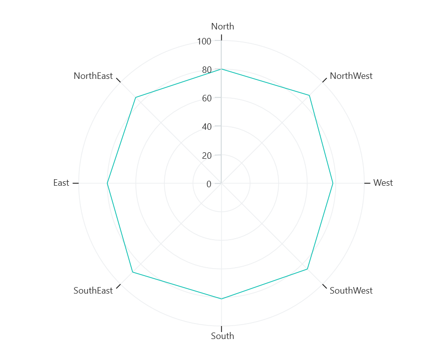

# Types of Axis in .NET MAUI Chart

Polar chart supports the following types of chart axis.

* NumericalAxis
* CategoryAxis
* DateTimeAxis

## Numerical Axis

[NumericalAxis]() is used to plot numerical values to the chart. [NumericalAxis]() can be defined for both [PrimaryAxis]() and [SecondaryAxis]().





<chart:SfPolarChart>
    . . .
    <chart:SfPolarChart.PrimaryAxis>
        <chart:NumericalAxis/>
    </chart:SfPolarChart.PrimaryAxis>
    <chart:SfPolarChart.SecondaryAxis>
        <chart:NumericalAxis/>
    </chart:SfPolarChart.SecondaryAxis>

</chart:SfPolarChart>





SfPolarChart chart = new SfPolarChart();
. . .
NumericalAxis primaryAxis = new NumericalAxis();
chart.PrimaryAxis.Add(primaryAxis);

NumericalAxis secondaryAxis = new NumericalAxis();
chart.SecondaryAxis.Add(secondaryAxis);





### Interval

Axis interval can be customized by using the [Interval]() property. By default, interval will be calculated based on the minimum and maximum value of the provided data.





<chart:SfPolarChart>
. . .
<chart:SfPolarChart.PrimaryAxis>
    <chart:NumericalAxis Interval="10" />
</chart:SfPolarChart.PrimaryAxis>
<chart:SfPolarChart.SecondaryAxis>
    <chart:NumericalAxis/>
</chart:SfPolarChart.SecondaryAxis>

</chart:SfPolarChart>





SfPolarChart chart = new SfPolarChart();
. . .
NumericalAxis primaryAxis = new NumericalAxis()
{
    Interval = 10, 
};
chart.PrimaryAxis.Add(primaryAxis);

NumericalAxis secondaryAxis = new NumericalAxis();
chart.SecondaryAxis.Add(secondaryAxis);





### Customizing the Range

[Maximum]() and [Minimum]() properties of axis is used for setting the maximum and minimum value of the axis range respectively.

N> If  minimum or maximum value is set, the other value is calculated by default internally.





<chart:SfPolarChart.SecondaryAxis>
    <chart:NumericalAxis Maximum="100" Minimum="0" Interval="20"/>
</chart:SfPolarChart.SecondaryAxis>





NumericalAxis secondaryAxis = new NumericalAxis()
{
    Maximum = 100,
    Minimum = 0,
    Interval = 20
};
chart.SecondaryAxis.Add(secondaryAxis);





## Category Axis

The [CategoryAxis]() is an indexed based axis that plots values based on the index of the data point collection. The points are equally spaced here.





<chart:SfPolarChart>
. . .
<chart:SfPolarChart.PrimaryAxis>
    <chart:CategoryAxis/>
</chart:SfPolarChart.PrimaryAxis>

</chart:SfPolarChart>





SfPolarChart chart = new SfPolarChart();
. . .
CategoryAxis primaryAxis = new CategoryAxis();
chart.PrimaryAxis.Add(primaryAxis);





### Label placement

The [LabelPlacement]() property in [CategoryAxis]() is used to placed the axis labels based on ticks and between ticks. The default value of [LabelPlacement]() is [OnTicks]().





<chart:SfPolarChart>
    . . .
    <chart:SfPolarChart.PrimaryAxis>
        <chart:CategoryAxis LabelPlacement="BetweenTicks"/>
    </chart:SfPolarChart.PrimaryAxis>

</chart:SfPolarChart>





SfPolarChart chart = new SfPolarChart();
. . .
CategoryAxis primaryAxis = new CategoryAxis()
{
    LabelPlacement = LabelPlacement.BetweenTicks
};
chart.PrimaryAxis.Add(primaryAxis);





### Interval

By default, the [CategoryAxis]() axis labels are display with fixed interval 1. It can customized by using the [Interval]() property of axis.





<chart:SfPolarChart>
    . . .
    <chart:SfPolarChart.PrimaryAxis>
        <chart:CategoryAxis Interval="2" />
    </chart:SfPolarChart.PrimaryAxis>
    <chart:SfPolarChart.SecondaryAxis>
        <chart:NumericalAxis/>
    </chart:SfPolarChart.SecondaryAxis>

</chart:SfPolarChart>





SfPolarChart chart = new SfPolarChart();
. . .
CategoryAxis primaryAxis = new CategoryAxis()
{
    Interval = 2, 
};
chart.PrimaryAxis.Add(primaryAxis);

NumericalAxis secondaryAxis = new NumericalAxis();
chart.SecondaryAxis.Add(secondaryAxis);





### Indexed category axis

In Polar Charts, the [ArrangeByIndex]() property is used to determine how the items in a category axis are arranged. 

If [ArrangeByIndex]() is set to true, then the items in the category axis will be arranged according to their index values.

If [ArrangeByIndex]() is set to false, then the items in the category axis will be arranged according to their values. By default, [ArrangeByIndex]() is true.

The following code illustrates how to define the property [ArrangeByIndex]() in chart.





    <chart:SfPolarChart>
        . . .
        <chart:SfPolarChart.PrimaryAxis>
            <chart:CategoryAxis ArrangeByIndex="False" />
        </chart:SfPolarChart.PrimaryAxis>
        <chart:SfPolarChart.SecondaryAxis>
            <chart:NumericalAxis/>
        </chart:SfPolarChart.SecondaryAxis>

        <chart:PolarAreaSeries ItemsSource="{Binding PlantDetails}"
                            XBindingPath="Direction"
                            YBindingPath="Tree"/>

        <chart:PolarAreaSeries ItemsSource="{Binding PlantDetails}"
                            XBindingPath="Direction"
                            YBindingPath="Flower"/>

        </chart:SfPolarChart>





    SfPolarChart chart = new SfPolarChart();
    . . .
    CategoryAxis primaryAxis = new CategoryAxis()
    {
        ArrangeByIndex = false, 
    };
    chart.PrimaryAxis.Add(primaryAxis);

    NumericalAxis secondaryAxis = new NumericalAxis();
    chart.SecondaryAxis.Add(secondaryAxis);  

    PolarAreaSeries series1 = new PolarAreaSeries();
    series1.ItemsSource = ItePlantDetailsms; 
    series1.XBindingPath = "Direction";
    series1.YBindingPath = "Tree";

    PolarAreaSeries series2 = new PolarAreaSeries();
    series2.ItemsSource = PlantDetails;  
    series2.XBindingPath = "Direction";
    series2.YBindingPath = "Flower";

    chart.Series.Add(series1);
    chart.Series.Add(series2);  



    

## DateTime Axis

[DateTimeAxis]() is used to plot `DateTime` values. The [DateTimeAxis]() is widely used to make financial charts in places like the Stock Market, where index plotting is done every day.





<chart:SfPolarChart>
    . . .
    <chart:SfPolarChart.PrimaryAxis>
        <chart:DateTimeAxis/>
    </chart:SfPolarChart.PrimaryAxis>

</chart:SfPolarChart>





SfPolarChart chart = new SfPolarChart();
. . .
DateTimeAxis primaryAxis = new DateTimeAxis();
chart.PrimaryAxis.Add(primaryAxis);





### Interval

In [DateTimeAxis](), intervals can be customized by using the [Interval]() and [IntervalType]() properties. For example, setting [Interval]() as 6 and [IntervalType]() as [Months]() will consider 6 months as interval.





<chart:SfPolarChart>
    ...
    <chart:SfPolarChart.PrimaryAxis>
        <chart:DateTimeAxis Interval="6" IntervalType="Months"/>
    </chart:SfPolarChart.PrimaryAxis>
    <chart:SfPolarChart.SecondaryAxis>
        <chart:NumericalAxis/>
    </chart:SfPolarChart.SecondaryAxis>

</chart:SfPolarChart>





SfPolarChart chart = new SfPolarChart();
. . .
DateTimeAxis primaryAxis = new DateTimeAxis()
{
    Interval = 6, 
    IntervalType = DateTimeIntervalType.Months
};
chart.PrimaryAxis.Add(primaryAxis);

NumericalAxis secondaryAxis = new NumericalAxis();
chart.SecondaryAxis.Add(secondaryAxis);





### Customizing the Range

[Minimum]() and [Maximum]() properties behavior is same as in [NumericalAxis]() instead of setting numerical value, have to set date time values.





<chart:SfPolarChart>
    . . .
    <chart:SfPolarChart.PrimaryAxis>
        <chart:DateTimeAxis Minimum="2021/05/10" Maximum="2021/11/01"/>
    </chart:SfPolarChart.PrimaryAxis>

</chart:SfPolarChart>





SfPolarChart chart = new SfPolarChart();
. . .
DateTimeAxis primaryAxis = new DateTimeAxis()
{
    Minimum = new DateTime(2021,05,10),
    Maximum = new DateTime(2021,11,01),
};
chart.PrimaryAxis.Add(primaryAxis);





## Inversed

Axis can be inverted by using the [IsInversed]() property. The default value of this property is `False`.





<chart:SfPolarChart>
    . . .
    <chart:SfPolarChart.SecondaryAxis>
        <chart:NumericalAxis IsInversed="True"/>
    </chart:SfPolarChart.SecondaryAxis>

</chart:SfPolarChart>





SfPolarChart chart = new SfPolarChart();
. . .
NumericalAxis secondaryAxis = new NumericalAxis();
secondaryAxis.IsInversed = true;
chart.SecondaryAxis.Add(secondaryAxis);





## Axis Visibility

Axis visibility can be controlled using the [IsVisible]() property of axis. Default value of [IsVisible]() property is `True`.





<chart:SfPolarChart.SecondaryAxis>
    <chart:NumericalAxis IsVisible="False"/>
</chart:SfPolarChart.SecondaryAxis>





SfPolarChart chart = new SfPolarChart();
. . .
NumericalAxis secondaryAxis = new NumericalAxis() { IsVisible = false };
chart.SecondaryAxis.Add(secondaryAxis);





## Events

### ActualRangeChanged

The [ActualRangeChanged]() event is triggered when the actual range of the axis is changed. The argument contains the following information:

* [ActualMinimum]() - used to get the actual minimum value of the axis.
* [ActualMaximum]() - used to get the actual maximum value of the axis.

N> The actual range is changed by specifying the [ZoomPosition]() and [ZoomFactor]() properties or zooming the chart interactively.

### LabelCreated

The [LabelCreated]() event is triggered when the axis label is created. The argument contains the following information:

* [Label]() - Used to get or set the text of axis label.
* [Position]() - Used to get the position of label.
* [LabelStyle]() - Used to customize the appearance of axis labels.