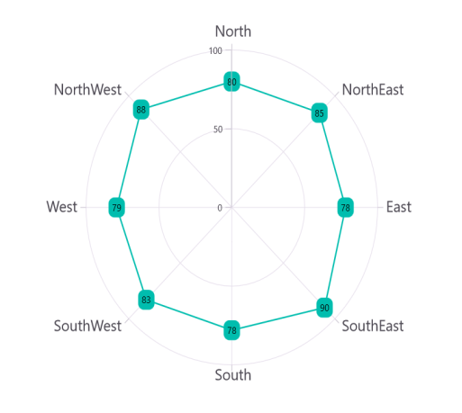
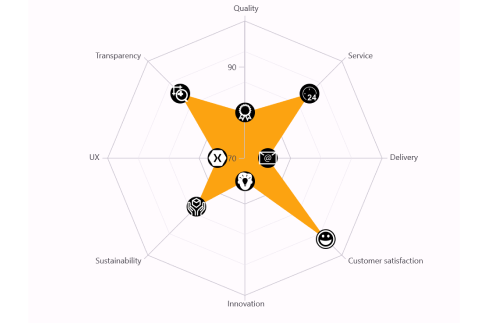

# Data Label in .NET MAUI Chart

Data labels are used to display values related to a chart segment. Values from a data point(x, y) or other custom properties from a data source can be displayed. 

Each data label can be represented by the following:

* Label - displays the segment label content at the (X, Y) point.

## Enable Data Label 

The [ShowDataLabels]() property of a series is used to enable the data labels.





<chart:SfPolarChart>
    . . .
    <chart:PolarLineSeries ItemsSource="{Binding PlantDetails}" 
                        XBindingPath="Direction"
                        YBindingPath="Tree" ShowDataLabels="True">
        </chart:PolarLineSeries>
</chart:SfPolarChart>





SfPolarChart chart = new SfPolarChart();
. . .
PolarLineSeries series = new PolarLineSeries()
{
    ItemsSource = viewModel.PlantDetails,
    XBindingPath = "Direction",
    YBindingPath = "Tree",
    ShowDataLabels = true
};

chart.Series.Add(series);





Data labels can be customized by using the [DataLabelSettings]() property of chart series. To customize them, you need to create an instance of [PolarDataLabelSettings]() and set it to the [DataLabelSettings]() property. The following properties available in [PolarDataLabelSettings]() can be used to customize the data labels.

* [BarAlignment]() - Gets or sets the data label alignment top, middle or bottom.
* [LabelPlacement]() - Gets or sets the data label position inside, outside or default.
* [LabelStyle]() - Gets or sets the options for customizing the data labels. 
* [UseSeriesPalette]() - Gets or sets a value indicating whether the data label should reflect the series interior.

## Data Label Alignment

The alignment of data labels inside the series is defined by using the [BarAlignment]() property. 

* [Top]() - Positions the data label at the top edge point of a chart segment.
* [Middle]() - Positions the data label at the center point of a chart segment.
* [Bottom]() - Positions the data label at the bottom edge point of a chart segment.

N> This behavior varies based on the chart series type.





<chart:SfPolarChart>
    . . .
    <chart:PolarLineSeries ShowDataLabels="True">
        <chart:PolarLineSeries.DataLabelSettings>
            <chart:PolarDataLabelSettings BarAlignment="Middle"/>
        </chart:PolarLineSeries.DataLabelSettings>
    </chart:PolarLineSeries>
</chart:SfPolarChart>





SfPolarChart chart = new SfPolarChart();
PolarLineSeries series = new PolarLineSeries();
. . .
series.DataLabelSettings = new PolarDataLabelSettings()
{
    BarAlignment = DataLabelAlignment.Middle,
};

chart.Series.Add(series);





## LabelPlacement

In addition to the alignment options mentioned above, the Chart provides additional customization options for positioning the data labels.

The [LabelPlacement]() property is used to position the data labels at [Center](), [Inner]() and [Outer]() positions relative to the actual data point position. By default, labels are positioned based on the series types for better readability.

## Applying Series Brush

The [UseSeriesPalette]() property is used to set the interior of the series to the data marker background.





<chart:SfPolarChart>
    . . .
    <chart:PolarLineSeries ShowDataLabels="True">
        <chart:PolarLineSeries.DataLabelSettings>
            <chart:PolarDataLabelSettings  UseSeriesPalette="False"/>
        </chart:PolarLineSeries.DataLabelSettings>
    </chart:PolarLineSeries>
</chart:SfPolarChart>





SfPolarChart chart = new SfPolarChart();
PolarLineSeries series = new PolarLineSeries();
. . .
series.DataLabelSettings = new PolarDataLabelSettings()
{
    UseSeriesPalette = false,
};

chart.Series.Add(series);





## LabelTemplate

The [SfPolarChart]() provides support to customize the appearance of the datalabel by using the [LabelTemplate]() property.





    <chart:SfPolarChart>
        
        <chart:SfPolarChart.Resources>
            <DataTemplate x:Key="LabelTemplate1">
                <StackLayout>
                    <Frame CornerRadius="50" BorderColor="Black" BackgroundColor="White"
                           WidthRequest="40" HeightRequest="40" Padding="10">
                        <Label Text="{Binding Item.Tree}" HorizontalOptions="Center" VerticalOptions="Center" />
                    </Frame>
                </StackLayout>
            </DataTemplate>
        </chart:SfPolarChart.Resources>
        . . .
        <chart:PolarAreaSeries ItemsSource="{Binding PlantDetails}" 
                               LabelTemplate="{StaticResource LabelTemplate1}"
                               ShowDataLabels="True"
                               XBindingPath="Direction"                               
                               YBindingPath="Tree" />
    </chart:SfPolarChart>





    SfPolarChart chart = new SfPolarChart();
    . . .
    PolarAreaSeries series = new PolarAreaSeries();
    series.ItemsSource = viewModel.Data;
    series.ShowDataLabels = true;
    series.XBindingPath="Direction"                               
    series.YBindingPath="Tree"

    DataTemplate LabelTemplate1 = new DataTemplate(() =>
    {
        StackLayout stackLayout = new StackLayout();
        var frame = new Frame
        {
            CornerRadius = 50,
            BorderColor = Color.Black,
            BackgroundColor = Color.White,
            WidthRequest = 40,
            HeightRequest = 40,
            Padding = new Thickness(10)
        };

        var label = new Label
        {
            HorizontalOptions = LayoutOptions.Center,
            VerticalOptions = LayoutOptions.Center
        };
        label.SetBinding(Label.TextProperty, "Tree"); // Assuming "Tree" is a property in your binding context

        frame.Content = label;
        stackLayout.Children.Add(frame);
        return stackLayout;
    });

    series.LabelTemplate1 = LabelTemplate1;
    chart.Series.Add(series);
    this.Content = chart;
        




## Formatting Label Context

The content of the label can be customized using the [LabelContext]() property. Following are the two options that are supported now,

* [Percentage]() - This will show the percentage value of corresponding data point Y value

* [YValue]() - This will show the corresponding Y value.





    <chart:SfPolarChart>
        . . .
        <chart:PolarAreaSeries ItemsSource="{Binding PlantDetails}" 
                               LabelContext="Percentage"
                               ShowDataLabels="True"
                               XBindingPath="Direction"                               
                               YBindingPath="Tree" />
    </chart:SfPolarChart>





    SfPolarChart chart = new SfPolarChart();
    . . .
    PolarAreaSeries series = new PolarAreaSeries()
    {
        ItemsSource = new ViewModel().Data,
        XBindingPath="Direction",                              
        YBindingPath="Tree",
        ShowDataLabels = true,
        LabelContext = LabelContext.Percentage
    };

    chart.Series.Add(series);
    this.Content = chart;
        




