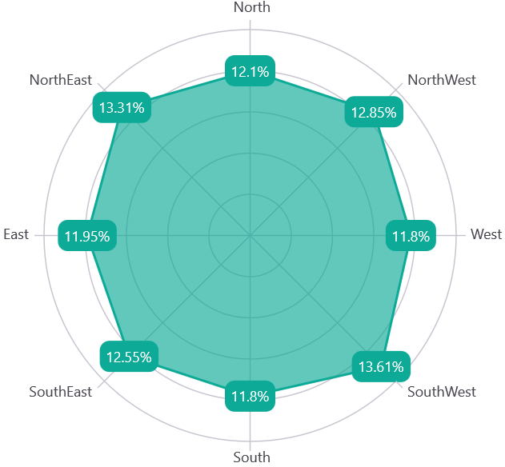

# Data Labels in .NET MAUI Chart

Data labels are used to display values related to a chart segment. Values from a data point(x, y) or other custom properties from a data source can be displayed. 

Each data label can be represented by the following:

* Label - displays the segment label content at the (X, Y) point.

## Enable Data Label 

The [ShowDataLabels](https://help.syncfusion.com/cr/maui/Syncfusion.Maui.Charts.ChartSeries.html#Syncfusion_Maui_Charts_ChartSeries_ShowDataLabels) property of a series is used to enable the data labels.





<chart:SfPolarChart>
    . . .
    <chart:PolarLineSeries ItemsSource="{Binding PlantDetails}"  XBindingPath="Direction" YBindingPath="Tree" 
                ShowDataLabels="True" />
</chart:SfPolarChart>





SfPolarChart chart = new SfPolarChart();
. . .
PolarLineSeries series = new PolarLineSeries()
{
    ItemsSource = viewModel.PlantDetails,
    XBindingPath = "Direction",
    YBindingPath = "Tree",
    ShowDataLabels = true
};

chart.Series.Add(series);





Data labels can be customized using the [DataLabelSettings]() property of chart series. To customize them, you need to create an instance of [PolarDataLabelSettings]() and set it to the [DataLabelSettings]() property. The following properties available in [PolarDataLabelSettings]() can be used to customize the data labels.

* [LabelStyle](https://help.syncfusion.com/cr/maui/Syncfusion.Maui.Charts.ChartDataLabelSettings.html#Syncfusion_Maui_Charts_ChartDataLabelSettings_LabelStyle) - Gets or sets the options for customizing the data labels. 
* [UseSeriesPalette](https://help.syncfusion.com/cr/maui/Syncfusion.Maui.Charts.ChartDataLabelSettings.html#Syncfusion_Maui_Charts_ChartDataLabelSettings_UseSeriesPalette) - Gets or sets a value indicating whether the data label should reflect the series interior.

## Applying Series Brush

The [UseSeriesPalette](https://help.syncfusion.com/cr/maui/Syncfusion.Maui.Charts.ChartDataLabelSettings.html#Syncfusion_Maui_Charts_ChartDataLabelSettings_UseSeriesPalette) property is used to set the interior of the series to the data marker background.





<chart:SfPolarChart>
    . . .
    <chart:PolarLineSeries ShowDataLabels="True">
        <chart:PolarLineSeries.DataLabelSettings>
            <chart:PolarDataLabelSettings  UseSeriesPalette="False"/>
        </chart:PolarLineSeries.DataLabelSettings>
    </chart:PolarLineSeries>
</chart:SfPolarChart>





SfPolarChart chart = new SfPolarChart();
PolarLineSeries series = new PolarLineSeries();
. . .
series.DataLabelSettings = new PolarDataLabelSettings()
{
    UseSeriesPalette = false,
};

chart.Series.Add(series);





## Formatting Label Context

The content of the label can be customized using the [LabelContext]() property. Following are the two options that are supported now,

* [Percentage]() - This will show the percentage value of corresponding data point Y value

* [YValue]() - This will show the corresponding Y value.





<chart:SfPolarChart>
    . . .
    <chart:PolarAreaSeries ItemsSource="{Binding PlantDetails}" XBindingPath="Direction" YBindingPath="Tree" 
                    ShowDataLabels="True" LabelContext="Percentage" />
</chart:SfPolarChart>





SfPolarChart chart = new SfPolarChart();
. . .
PolarAreaSeries series = new PolarAreaSeries()
{
    ItemsSource = new ViewModel().PlantDetails,
    XBindingPath = "Direction",
    YBindingPath = "Tree",
    ShowDataLabels = true,
    LabelContext = LabelContext.Percentage
};

chart.Series.Add(series);
this.Content = chart;
        




## LabelTemplate

The [SfPolarChart]() provides support to customize the appearance of the datalabel using the [LabelTemplate]() property.





    <chart:SfPolarChart >
        <chart:SfPolarChart.Resources>
            <DataTemplate x:Key="labelTemplate">
                <HorizontalStackLayout Spacing="5">
                    <Label Text="{Binding Item.Values}" VerticalOptions="Center" FontSize = "15"/>
                    <Image Source="arrow.png" WidthRequest="15" HeightRequest="15"/>
                </HorizontalStackLayout>
            </DataTemplate>
        </chart:SfPolarChart.Resources>
        . . .
        <chart:PolarAreaSeries ItemsSource="{Binding Data}" XBindingPath="Category" YBindingPath="Values" 
        ShowDataLabels="True" LabelTemplate="{StaticResource labelTemplate}"/>
    </chart:SfPolarChart>





SfPolarChart chart = new SfPolarChart();
. . .
PolarAreaSeries series = new PolarAreaSeries();
series.ItemsSource = new ViewModel().Data;
series.XBindingPath = "Category";
series.YBindingPath = "Values";
series.ShowDataLabels = true;

DataTemplate labelTemplate = new DataTemplate(() =>
{
    var image = new Image
    {
        Source = "arrow.png",
        WidthRequest = 15,
        HeightRequest = 15
    };
    
    return image;
});

series.LabelTemplate = labelTemplate;
chart.Series.Add(series);
this.Content = chart;
        



