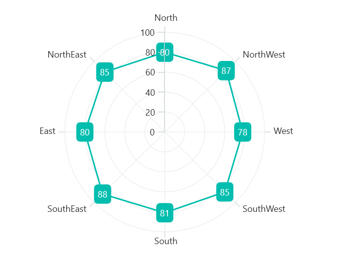

# Data Label in .NET MAUI Chart

Data labels are used to display values related to a chart segment. Values from a data point(x, y) or other custom properties from a data source can be displayed. 

Each data label can be represented by the following:

* Label - displays the segment label content at the (X, Y) point.

## Enable Data Label 

The [ShowDataLabels]() property of a series is used to enable the data labels.





<chart:SfPolarChart>
    . . .
    <chart:PolarLineSeries ItemsSource="{Binding PlantDetails}" 
                        XBindingPath="Direction"
                        YBindingPath="Tree" ShowDataLabels="True">
        </chart:PolarLineSeries>
</chart:SfPolarChart>





SfPolarChart chart = new SfPolarChart();
. . .
PolarLineSeries series = new PolarLineSeries()
{
    ItemsSource = viewModel.PlantDetails,
    XBindingPath = "Direction",
    YBindingPath = "Tree",
    ShowDataLabels = true
};

chart.Series.Add(series);





Data labels can be customized by using the [DataLabelSettings]() property of chart series. To customize them, you need to create an instance of [PolarDataLabelSettings]() and set it to the [DataLabelSettings]() property. The following properties available in [PolarDataLabelSettings]() can be used to customize the data labels.

* [BarAlignment]() - Gets or sets the data label alignment top, middle or bottom.
* [LabelPlacement]() - Gets or sets the data label position inside, outside or default.
* [LabelStyle]() - Gets or sets the options for customizing the data labels. 
* [UseSeriesPalette]() - Gets or sets a value indicating whether the data label should reflect the series interior.

## Data Label Alignment

The alignment of data labels inside the series is defined by using the [BarAlignment]() property. 

* [Top]() - Positions the data label at the top edge point of a chart segment.
* [Middle]() - Positions the data label at the center point of a chart segment.
* [Bottom]() - Positions the data label at the bottom edge point of a chart segment.

N> This behavior varies based on the chart series type.





<chart:SfPolarChart>
    . . .
    <chart:PolarLineSeries ShowDataLabels="True">
        <chart:PolarLineSeries.DataLabelSettings>
            <chart:PolarDataLabelSettings BarAlignment="Middle"/>
        </chart:PolarLineSeries.DataLabelSettings>
    </chart:PolarLineSeries>
</chart:SfPolarChart>





SfPolarChart chart = new SfPolarChart();
PolarLineSeries series = new PolarLineSeries();
. . .
series.DataLabelSettings = new PolarDataLabelSettings()
{
    BarAlignment = DataLabelAlignment.Middle,
};

chart.Series.Add(series);





## LabelPlacement

In addition to the alignment options mentioned above, the Chart provides additional customization options for positioning the data labels.

The [LabelPlacement]() property is used to position the data labels at [Center](), [Inner]() and [Outer]() positions relative to the actual data point position. By default, labels are positioned based on the series types for better readability.

## Applying Series Brush

The [UseSeriesPalette]() property is used to set the interior of the series to the data marker background.





<chart:SfPolarChart>
    . . .
    <chart:PolarLineSeries ShowDataLabels="True">
        <chart:PolarLineSeries.DataLabelSettings>
            <chart:PolarDataLabelSettings  UseSeriesPalette="False"/>
        </chart:PolarLineSeries.DataLabelSettings>
    </chart:PolarLineSeries>
</chart:SfPolarChart>





SfPolarChart chart = new SfPolarChart();
PolarLineSeries series = new PolarLineSeries();
. . .
series.DataLabelSettings = new PolarDataLabelSettings()
{
    UseSeriesPalette = false,
};

chart.Series.Add(series);



