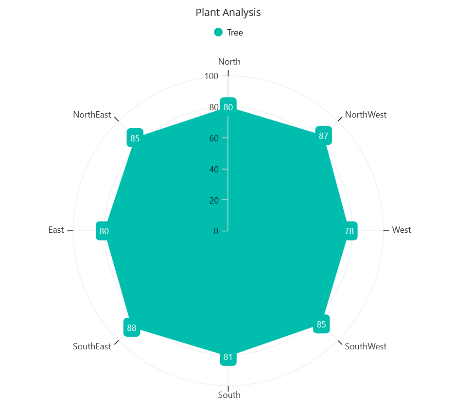

# Getting Started with .NET MAUI Chart

This section explains how to populate the Polar chart with data, a title, data labels, a legend, tooltips and markers. It also covers the essential aspects of getting started with the chart.

## Creating an application with .NET MAUI chart

1. Create a new .NET MAUI application in Visual Studio.
2. Syncfusion .NET MAUI components are available on [nuget.org](https://www.nuget.org/). To add SfPolarChart to your project, open the NuGet package manager in Visual Studio, search for Syncfusion.Maui.Charts, and then install it.
3. To initialize the control, import the Chart namespace.
4. Initialize the [SfPolarChart]().

 



    <ContentPage
        . . .    
        xmlns:chart="clr-namespace:Syncfusion.Maui.Charts;assembly=Syncfusion.Maui.Charts">
        <Grid>
            <chart:SfPolarChart/>
        </Grid>
    </ContentPage>
    




    using Syncfusion.Maui.Charts;
    namespace ChartGettingStarted
    {
        public partial class MainPage : ContentPage
        {
            public MainPage()
            {
                InitializeComponent();           
                SfPolarChart chart = new SfPolarChart(); 
            }
        }   
    }





## Register the handler

Syncfusion.Maui.Core NuGet package is a dependent package for all Syncfusion controls in .NET MAUI. In the MauiProgram.cs file, register the handler for Syncfusion core.



    using Microsoft.Maui;
    using Microsoft.Maui.Hosting;
    using Microsoft.Maui.Controls.Compatibility;
    using Microsoft.Maui.Controls.Hosting;
    using Microsoft.Maui.Controls.Xaml;
    using Syncfusion.Maui.Core.Hosting;

    namespace ChartGettingStarted
    {
        public static class MauiProgram
        {
            public static MauiApp CreateMauiApp()
            {
                var builder = MauiApp.CreateBuilder();
                builder
                .UseMauiApp<App>()
                .ConfigureSyncfusionCore()
                .ConfigureFonts(fonts =>
                {
                    fonts.AddFont("OpenSans-Regular.ttf", "OpenSansRegular");
                });

                return builder.Build();
            }
        }
    }

 

## Initialize view model

Now, let us define a simple data model that represents a data point on the chart.

  



    public class PlantData   
    {   
        public string Direction  { get; set; }
        public double Tree  { get; set; }
    }

 

 

Next, create a view model class and initialize a list of `PlantData` objects as follows.

  



    public class ViewModel  
    {
        public List<PlantData> PlantDetails { get; set; }      

        public ViewModel()       
        {
            PlantDetails  = new List<PlantData>()
            {
                new PlantData { Direction = "North", Tree = 80 },
                new PlantData { Direction = "NorthWest", Tree = 87 },
                new PlantData { Direction = "West", Tree = 78 },
                new PlantData { Direction = "SouthWest", Tree = 85 },
                new PlantData { Direction = "South", Tree = 81 },
                new PlantData { Direction = "SouthEast", Tree = 88},
                new PlantData { Direction = "East", Tree = 80},
                new PlantData { Direction = "NorthEast", Tree = 85}
            }; 
        }
    }

 

 

Create a `ViewModel` instance and set it as the chart's `BindingContext`. This enables property binding from `ViewModel` class.
 
N> Add the namespace of the `ViewModel` class to your XAML page, if you prefer to set the `BindingContext` in XAML.

 

 

<ContentPage
    xmlns="http://schemas.microsoft.com/dotnet/2021/maui"
    xmlns:x="http://schemas.microsoft.com/winfx/2009/xaml"
    x:Class="ChartGettingStarted.MainPage"
    xmlns:chart="clr-namespace:Syncfusion.Maui.Charts;assembly=Syncfusion.Maui.Charts"
    xmlns:model="clr-namespace:ChartGettingStarted">

    <ContentPage.BindingContext>
        <model:ViewModel></model:ViewModel>
    </ContentPage.BindingContext>
</ContentPage>



 

    this.BindingContext = new ViewModel();



 

## Initialize Chart axis

[ChartAxis]() is used to locate the data points inside the chart area. The [PrimaryAxis]() and [SecondaryAxis]() properties of the chart are used to initialize the axis for the chart.

 

 

    <chart:SfPolarChart>                            
        <chart:SfPolarChart.PrimaryAxis>
            <chart:CategoryAxis/>
        </chart:SfPolarChart.PrimaryAxis>
        <chart:SfPolarChart.SecondaryAxis>
            <chart:NumericalAxis/>
        </chart:SfPolarChart.SecondaryAxis>                       
    </chart:SfPolarChart>



 

    SfPolarChart chart = new SfPolarChart();
    CategoryAxis primaryAxis = new CategoryAxis();
    chart.PrimaryAxis = primaryAxis;
    NumericalAxis secondaryAxis = new NumericalAxis();
    chart.SecondaryAxis = secondaryAxis;



 

## Populate Chart with data

To create a polar chart, you can add a [PolarAreaSeries]() to the polar chart [Series]() property of the chart, and  then bind the `PlantData` property of the above `ViewModel` to the `PolarAreaSeries.ItemsSource` as follows.

N> In order to plot the series, the [XBindingPath]() and [YBindingPath]() properties need to be configured correctly. These properties allow the chart to retrieve values from the corresponding properties in the data model.

   



    <chart:SfPolarChart>
        <chart:SfPolarChart.PrimaryAxis>
            <chart:CategoryAxis>
            </chart:CategoryAxis>
        </chart:SfPolarChart.PrimaryAxis>
        <chart:SfPolarChart.SecondaryAxis>
            <chart:NumericalAxis>
            </chart:NumericalAxis>
        </chart:SfPolarChart.SecondaryAxis>

        <chart:PolarAreaSeries ItemsSource="{Binding PlantDetails}" 
                               XBindingPath="Direction" 
                               YBindingPath="Tree" />
    </chart:SfPolarChart>





    SfPolarChart chart = new SfPolarChart();

    // Initializing primary axis
    CategoryAxis primaryAxis = new CategoryAxis();
    chart.PrimaryAxis = primaryAxis;

    //Initializing secondary Axis
    NumericalAxis secondaryAxis = new NumericalAxis();
    chart.SecondaryAxis = secondaryAxis;

    //Initialize the series
    PolarAreaSeries series = new PolarAreaSeries();
    series.ItemsSource = (new ViewModel()).PlantDetails;
    series.XBindingPath = "Direction";
    series.YBindingPath = "Tree";

    //Adding Series to the Chart Series Collection
    chart.Series.Add(series);



 

## Add a title

The title of the chart provides quick information to the user about the data being plotted in the chart. The [Title]() property is used to set the title for the chart as follows.

 



    <Grid>
        <chart:SfPolarChart>
            <chart:SfPolarChart.Title>
                <Label Text="Plant Analysis" />
            </chart:SfPolarChart.Title> 
        </chart:SfPolarChart>
    </Grid>





    SfPolarChart chart = new SfPolarChart();
    chart.Title = new Label
    {
        Text = "Plant Analysis"
    };



  

## Enable the data labels

The [ShowDataLabels]() property of series can be used to enable the data labels to enhance the readability of the chart. The label visibility is set to `False` by default.

 



    <chart:SfPolarChart>
        . . . 
        <chart:PolarAreaSeries ShowDataLabels="True">
        </chart:PolarAreaSeries>
    </chart:SfPolarChart>





    SfPolarChart chart = new SfPolarChart()
    . . .
    PolarAreaSeries series = new PolarAreaSeries();
    series.ShowDataLabels = true;
    chart.Series.Add(series);



  

## Enable a legend

The legend provides information about the data point displayed in the chart. The [Legend]() property of the chart was used to enable it.

 



    <chart:SfPolarChart >
        . . .
        <chart:SfPolarChart.Legend>
            <chart:ChartLegend/>
        </chart:SfPolarChart.Legend>
        . . .
    </chart:SfPolarChart>





    SfPolarChart chart = new SfPolarChart();
    chart.Legend = new ChartLegend(); 



  

N> Additionally, set a label for each series using the `Label` property of the chart series, which will be displayed in the corresponding legend.

 



    <chart:SfPolarChart>
        . . .
        <chart:PolarAreaSeries Label="Tree"
                               ItemsSource="{Binding PlantDetails}"
                               XBindingPath="Direction"
                               YBindingPath="Tree"/>
    </chart:SfPolarChart>





    PolarAreaSeries series = new PolarAreaSeries (); 
    series.ItemsSource = (new ViewModel()).PlantDetails;
    series.XBindingPath = "Direction"; 
    series.YBindingPath = "Tree"; 
    series.Label = "Tree";



  

## Enable tooltip

Tooltips are used to display information about a segment when a user hovers over it. Enable the tooltip by setting the series [EnableTooltip]() property to true.

 



    <chart:SfPolarChart>
        ...
        <chart:PolarAreaSeries EnableTooltip="True"
                               ItemsSource="{Binding PlantDetails}"
                               XBindingPath="Direction"
                               YBindingPath="Tree"/>
        ...
    </chart:SfPolarChart> 





    PolarAreaSeries series = new PolarAreaSeries();
    series.ItemsSource = (new ViewModel()).PlantDetails;
    series.XBindingPath = "Direction";          
    series.YBindingPath = "Tree";
    series.EnableTooltip = true;





The following code example gives you the complete code of above configurations.

 



<ContentPage
    xmlns="http://schemas.microsoft.com/dotnet/2021/maui"
    xmlns:x="http://schemas.microsoft.com/winfx/2009/xaml"
    x:Class="ChartGettingStarted.MainPage"
    xmlns:chart="clr-namespace:Syncfusion.Maui.Charts;assembly=Syncfusion.Maui.Charts"
    xmlns:model="clr-namespace:ChartGettingStarted">

    <ContentPage.BindingContext>
    <model:ViewModel></model:ViewModel>
    </ContentPage.BindingContext>

    <ContentPage.Content>
        <Grid>
            <chart:SfPolarChart>
                <chart:SfPolarChart.Title>
                    <Label Text="Plant Analysis"/>
                </chart:SfPolarChart.Title>

                <chart:SfPolarChart.Legend>
                    <chart:ChartLegend/>
                </chart:SfPolarChart.Legend>
    
                <chart:SfPolarChart.PrimaryAxis>
                    <chart:CategoryAxis/>                    
                </chart:SfPolarChart.PrimaryAxis>

                <chart:SfPolarChart.SecondaryAxis>
                    <chart:NumericalAxis/>                   
                </chart:SfPolarChart.SecondaryAxis>

            <chart:PolarAreaSeries Label="Tree" 
                                   EnableTooltip="True"
                                   ShowDataLabels="True"
                                   ItemsSource="{Binding PlantDetails}"
                                   XBindingPath="Direction" YBindingPath="Tree">
                <chart:PolarAreaSeries.DataLabelSettings>
                    <chart:PolarDataLabelSettings LabelPlacement="Auto"/>
                </chart:PolarAreaSeries.DataLabelSettings>
            </chart:PolarAreaSeries>
            </chart:SfPolarChart>
        </Grid>
    </ContentPage.Content>
</ContentPage>
 




    using Syncfusion.Maui.Charts;
    namespace ChartGettingStarted
    {
        public partial class MainPage : ContentPage
        {
            public MainPage()
            {
                InitializeComponent();            
                SfPolarChart chart = new SfPolarChart();

                chart.Title = new Label
                {
                    Text = "Plant Analysis"
                };

                CategoryAxis primaryAxis = new CategoryAxis();
                chart.PrimaryAxis = primaryAxis;

                NumericalAxis secondaryAxis = new NumericalAxis();
                chart.SecondaryAxis = secondaryAxis;

                PolarAreaSeries series = new PolarAreaSeries()
                {
                    Label = "Tree",
                    ShowDataLabels = true,
                    ItemsSource = (new ViewModel()).PlantDetails,
                    XBindingPath = "Direction",
                    YBindingPath = "Tree",
                    DataLabelSettings = new PolarDataLabelSettings
                    {
                        LabelPlacement = DataLabelPlacement.Auto
                    }              
                };  

                chart.Series.Add(series);
                this.Content = chart;
            }
        }   
    }





The following chart is created as a result of the previous codes.

You can find the complete getting started sample from this [link](https://github.com/SyncfusionExamples/Creating-a-Getting-Started-application-for-NET-MAUI-Polar-Chart).
