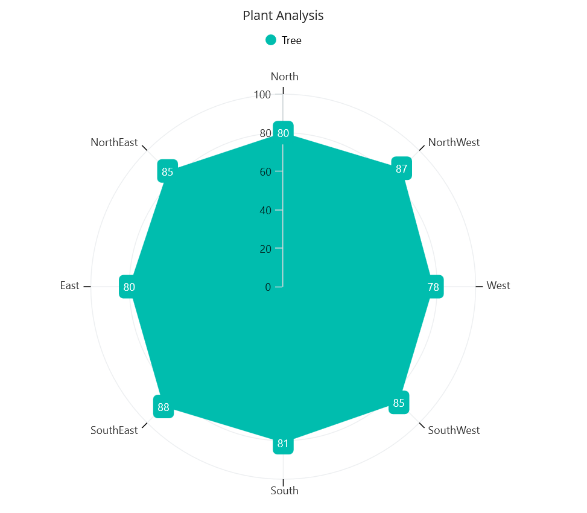

# Getting Started with .NET MAUI Polar Chart

This section explains how to populate the Polar chart with data, a title, data labels, a legend, tooltips, and markers. It also covers the essential aspects of getting started with the chart.

To get start quickly with our [.NET MAUI Polar Chart](https://help.syncfusion.com/cr/maui/Syncfusion.Maui.Charts.SfPolarChart.html), you can check the below video.






## Prerequisites

Before proceeding, ensure the following are set up:

1. Install [.NET 9 SDK](https://dotnet.microsoft.com/en-us/download/dotnet/9.0) or later.
2. Set up a .NET MAUI environment with Visual Studio 2022 v17.12 or later.

## Step 1: Create a New MAUI Project

1. Go to **File > New > Project** and choose the **.NET MAUI App** template.
2. Name the project and choose a location. Then, click **Next**.
3. Select the .NET framework version and click **Create**.

## Step 2: Install the Syncfusion® MAUI Charts NuGet Package

1. In **Solution Explorer**, right-click the project and choose **Manage NuGet Packages**.
2. Search for [Syncfusion.Maui.Charts](https://www.nuget.org/packages/Syncfusion.Maui.Charts/) and install the latest version.
3. Ensure the necessary dependencies are installed correctly, and the project is restored.




## Prerequisites

Before proceeding, ensure the following are set up:

1. Install [.NET 9 SDK](https://dotnet.microsoft.com/en-us/download/dotnet/9.0) or later.
2. Set up a .NET MAUI environment with Visual Studio Code.
3. Ensure that the .NET MAUI workloads are installed and configured as described [here](https://learn.microsoft.com/en-us/dotnet/maui/get-started/installation?view=net-maui-9.0&tabs=visual-studio-code).

## Step 1: Create a New .NET MAUI Project

1. Open the Command Palette by pressing **Ctrl+Shift+P** and type **.NET:New Project** and press Enter.
2. Choose the **.NET MAUI App** template.
3. Select the project location, type the project name and press Enter.
4. Then choose **Create project**

## Step 2: Install the Syncfusion® MAUI Charts NuGet Package

1. Press <kbd>Ctrl</kbd> + <kbd>`</kbd> (backtick) to open the integrated terminal in Visual Studio Code.
2. Ensure you're in the project root directory where your .csproj file is located.
3. Run the command `dotnet add package Syncfusion.Maui.Charts` to install the Syncfusion® .NET MAUI Charts package.
4. To ensure all dependencies are installed, run `dotnet restore`.




## Prerequisites

Before proceeding, ensure the following are set up:

1. Install [.NET 9 SDK](https://dotnet.microsoft.com/en-us/download/dotnet/9.0) or later.
2. Set up a .NET MAUI environment with JetBrains Rider 2024.3 or later.
3. Make sure the MAUI workloads are installed and configured as described [here.](https://www.jetbrains.com/help/rider/MAUI.html#before-you-start)

## Step 1: Create a new .NET MAUI Project

1. Go to **File > New Solution,** Select .NET (C#) and choose the .NET MAUI App template.
2. Enter the Project Name, Solution Name, and Location.
3. Select the .NET framework version and click Create.

## Step 2: Install the Syncfusion® MAUI Charts NuGet Package

1. In **Solution Explorer,** right-click the project and choose **Manage NuGet Packages.**
2. Search for [Syncfusion.Maui.Charts](https://www.nuget.org/packages/Syncfusion.Maui.Charts/) and install the latest version.
3. Ensure the necessary dependencies are installed correctly, and the project is restored. If not, Open the Terminal in Rider and manually run: `dotnet restore`




## Step 3: Register Syncfusion handler

Make sure to add the namespace.
 


using Syncfusion.Maui.Core.Hosting;


 
Register the Syncfusion core handler in your `CreateMauiApp` method of `MauiProgram.cs` file to use Syncfusion controls.
 


builder.ConfigureSyncfusionCore();



## Step 4: Initialize the view model

Now, let us define a simple data model that represents a data point on the chart.

  



public class PlantModel      
{   
    public string Direction { get; set; }
    public double Tree { get; set; }
    public double Flower { get; set; }
    public double Weed { get; set; }
}

 

 

Next, create a PlantViewModel class and initialize a list of `PlantModel` objects as follows.

  



public class PlantViewModel  
{
    public List<PlantModel> PlantDetails { get; set; }      
    public PlantViewModel()       
    {
        PlantDetails = new List<PlantModel>()
        {
            new PlantModel(){ Direction = "North", Tree = 80, Flower = 42, Weed = 63},
            new PlantModel(){ Direction = "NorthEast", Tree = 85, Flower = 40, Weed = 70},
            new PlantModel(){ Direction = "East", Tree = 78 , Flower = 47, Weed = 65},
            new PlantModel(){ Direction = "SouthEast", Tree = 90 , Flower = 40, Weed = 70},
            new PlantModel(){ Direction = "South", Tree = 78 , Flower = 27, Weed = 47},
            new PlantModel(){ Direction = "SouthWest", Tree = 83 , Flower = 45, Weed = 65},
            new PlantModel(){ Direction = "West", Tree = 79 , Flower = 40, Weed = 58},
            new PlantModel(){ Direction = "NorthWest", Tree = 88 , Flower = 38, Weed = 73}
        }; 
    }
}

 

 

## Step 5: Import the Charts namespace
 
Add the following namespace in your XAML or C#.
 


 
xmlns:chart="clr-namespace:Syncfusion.Maui.Charts;assembly=Syncfusion.Maui.Charts"
 


 
using Syncfusion.Maui.Charts;




## Step 6: Populate Chart with data

Initialize the [SfPolarChart](https://help.syncfusion.com/cr/maui/Syncfusion.Maui.Charts.SfPolarChart.html) and you can add a [PolarLineSeries](https://help.syncfusion.com/cr/maui/Syncfusion.Maui.Charts.PolarLineSeries.html) to the polar chart [Series](https://help.syncfusion.com/cr/maui/Syncfusion.Maui.Charts.SfPolarChart.html#Syncfusion_Maui_Charts_SfPolarChart_Series) property of the chart, and  then bind the `PlantDetails` property of the above `PlantViewModel` to the `PolarLineSeries.ItemsSource` as follows.

N> In order to plot the series, the [XBindingPath](https://help.syncfusion.com/cr/maui/Syncfusion.Maui.Charts.ChartSeries.html#Syncfusion_Maui_Charts_ChartSeries_XBindingPath) and [YBindingPath](https://help.syncfusion.com/cr/maui/Syncfusion.Maui.Charts.XYDataSeries.html#Syncfusion_Maui_Charts_XYDataSeries_YBindingPath) properties need to be configured correctly. These properties allow the chart to retrieve values from the corresponding properties in the data model.

 



    <chart:SfPolarChart>
        <chart:SfPolarChart.Title>
            <Label Text="Plant Analysis" HorizontalTextAlignment="Center"/>
        </chart:SfPolarChart.Title>
        <chart:SfPolarChart.Legend>
            <chart:ChartLegend/>
        </chart:SfPolarChart.Legend>
        <chart:SfPolarChart.PrimaryAxis>
            <chart:CategoryAxis/>                    
        </chart:SfPolarChart.PrimaryAxis>
        <chart:SfPolarChart.SecondaryAxis>
            <chart:NumericalAxis Maximum="100"/>                   
        </chart:SfPolarChart.SecondaryAxis>
        <chart:PolarLineSeries ItemsSource="{Binding PlantDetails}" XBindingPath="Direction" YBindingPath="Tree" 
                               Label="Tree" EnableTooltip="True" ShowDataLabels="True"/>
        <chart:PolarLineSeries ItemsSource="{Binding PlantDetails}" XBindingPath="Direction" YBindingPath="Weed" 
                               Label="Weed" EnableTooltip="True" ShowDataLabels="True"/>
        <chart:PolarLineSeries ItemsSource="{Binding PlantDetails}" XBindingPath="Direction" YBindingPath="Flower" 
                               Label="Flower" EnableTooltip="True" ShowDataLabels="True"/>
    </chart:SfPolarChart>
 



      
SfPolarChart chart = new SfPolarChart();

chart.Title = new Label()
{
    Text = "Plant Analysis",
    HorizontalTextAlignment = TextAlignment.Center
};

CategoryAxis primaryAxis = new CategoryAxis();
chart.PrimaryAxis = primaryAxis;

NumericalAxis secondaryAxis = new NumericalAxis()
{
    Maximum = 100,
};
chart.SecondaryAxis = secondaryAxis;

PolarLineSeries series1 = new PolarLineSeries()
{
    ItemsSource = (new PlantViewModel()).PlantDetails,
    XBindingPath = "Direction",
    YBindingPath = "Tree",
    Label = "Tree",
    EnableTooltip = true,
    ShowDataLabels = true,
};

PolarLineSeries series2 = new PolarLineSeries()
{
    ItemsSource = (new PlantViewModel()).PlantDetails,
    XBindingPath = "Direction",
    YBindingPath = "Weed",
    Label = "Weed",
    EnableTooltip = true,
    ShowDataLabels = true,
};

PolarLineSeries series3 = new PolarLineSeries()
{
    ItemsSource = (new PlantViewModel()).PlantDetails,
    XBindingPath = "Direction",
    YBindingPath = "Flower",
    Label = "Flower",
    EnableTooltip = true,
    ShowDataLabels = true
};

chart.Series.Add(series1);
chart.Series.Add(series2);
chart.Series.Add(series3);





The following chart is created as a result of the previous codes.

You can download the Polar Chart Getting Started sample from [GitHub](https://github.com/SyncfusionExamples/Creating-a-Getting-Started-application-for-NET-MAUI-Polar-Chart).