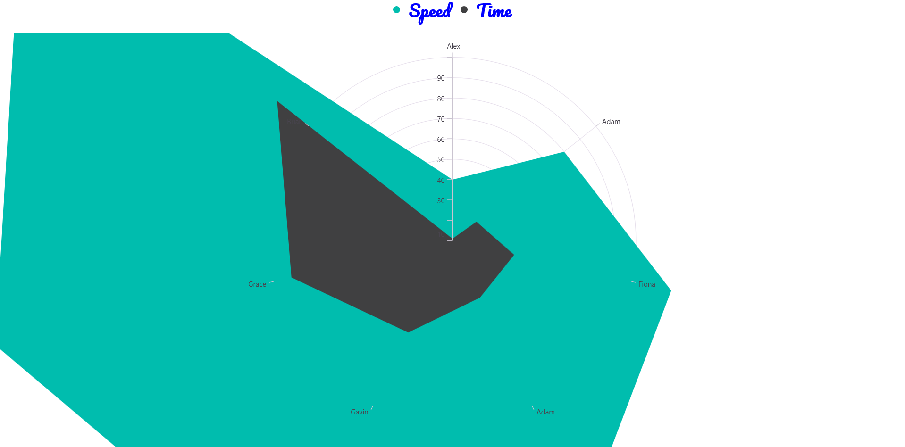
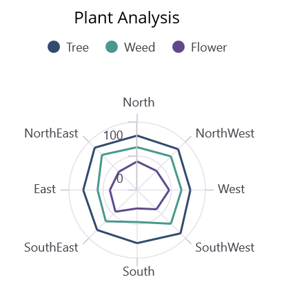

# Legend in .NET MAUI Polar Chart (SfPolarChart)
The [Legend](https://help.syncfusion.com/cr/maui/Syncfusion.Maui.Charts.ChartBase.html#Syncfusion_Maui_Charts_ChartBase_Legend) provides a list of polar series, helping to identify the corresponding data series in the chart. Here's a detailed guide on how to define and customize the legend in the polar chart.

## Defining the legend
To define the legend in the chart, initialize the [ChartLegend](https://help.syncfusion.com/cr/maui/Syncfusion.Maui.Charts.ChartLegend.html) class and assign it to the [Legend](https://help.syncfusion.com/cr/maui/Syncfusion.Maui.Charts.ChartBase.html#Syncfusion_Maui_Charts_ChartBase_Legend) property.





<chart:SfPolarChart>
    <chart:SfPolarChart.Legend>
        <chart:ChartLegend/>
    </chart:SfPolarChart.Legend>
    <!-- code omitted for brevity -->
</chart:SfPolarChart>





SfPolarChart chart = new SfPolarChart();
chart.Legend = new ChartLegend();
//code omitted for brevity
this.Content = chart;





N> Additionally, set a label for each series using the `Label` property of the chart series, which will be displayed in the corresponding legend. Set the BindingContext in the code-behind: `this.BindingContext = new PlantViewModel();`

 



<chart:SfPolarChart>
    <!-- code omitted for brevity -->
    <chart:PolarLineSeries ItemsSource="{Binding PlantDetails}" XBindingPath="Direction" YBindingPath="Tree"
                            Label="Tree"/>
    <chart:PolarLineSeries ItemsSource="{Binding PlantDetails}" XBindingPath="Direction" YBindingPath="Weed" 
                            Label="Weed"/>
    <chart:PolarLineSeries ItemsSource="{Binding PlantDetails}" XBindingPath="Direction" YBindingPath="Flower" 
                            Label="Flower"/>
</chart:SfPolarChart>





SfPolarChart chart = new SfPolarChart();
. . .
PolarLineSeries series1 = new PolarLineSeries(); 
series1.ItemsSource = (new PlantViewModel()).PlantDetails;
series1.XBindingPath = "Direction"; 
series1.YBindingPath = "Tree"; 
series1.Label = "Tree";

PolarLineSeries series2 = new PolarLineSeries();
series2.ItemsSource = (new PlantViewModel()).PlantDetails;
series2.XBindingPath = "Direction";
series2.YBindingPath = "Weed";
series2.Label = "Weed";

PolarLineSeries series3 = new PolarLineSeries();
series3.ItemsSource = (new PlantViewModel()).PlantDetails;
series3.XBindingPath = "Direction";
series3.YBindingPath = "Flower";
series3.Label = "Flower";

chart.Series.Add(series1);
chart.Series.Add(series2);
chart.Series.Add(series3);
this.Content = chart;



  

## Legend visibility
The visibility of the chart legend can be controlled using the [IsVisible](https://help.syncfusion.com/cr/maui/Syncfusion.Maui.Charts.ChartLegend.html#Syncfusion_Maui_Charts_ChartLegend_IsVisible) property. By default, the IsVisible property is set to `true`.




    
<chart:SfPolarChart>
    <chart:SfPolarChart.Legend>
        <chart:ChartLegend IsVisible = "True"/>
    </chart:SfPolarChart.Legend>
    <!-- code omitted for brevity -->
</chart:SfPolarChart>





SfPolarChart chart = new SfPolarChart();
chart.Legend = new ChartLegend()
{ 
    IsVisible = true 
};
. . .
this.Content = chart;





## Legend item visibility
The visibility of individual legend items for specific series can be controlled using the [IsVisibleOnLegend](https://help.syncfusion.com/cr/maui/Syncfusion.Maui.Charts.ChartSeries.html#Syncfusion_Maui_Charts_ChartSeries_IsVisibleOnLegend) property of the series. The default value for IsVisibleOnLegend is `true`.




    
<chart:SfPolarChart>
    <!-- code omitted for brevity -->
    <chart:SfPolarChart.Legend>
        <chart:ChartLegend/>
    </chart:SfPolarChart.Legend> 

    <chart:PolarAreaSeries ItemsSource="{Binding  PlantDetails}" 
                           XBindingPath="Direction" YBindingPath="Tree"
                           IsVisibleOnLegend="True" Label="Tree"/>

    <chart:PolarAreaSeries ItemsSource="{Binding PlantDetails}" 
                           XBindingPath="Direction" YBindingPath="Weed"
                           IsVisibleOnLegend="False" Label="Weed"/>
</chart:SfPolarChart>





SfPolarChart chart = new SfPolarChart();
PlantViewModel plantViewModel = new PlantViewModel();
. . .
chart.Legend = new ChartLegend();

PolarAreaSeries series1 = new PolarAreaSeries()
{
    ItemsSource = plantViewModel.PlantDetails,
    XBindingPath = "Direction",
    YBindingPath = "Tree",
    Label = "Tree",
    IsVisibleOnLegend = true,
};

PolarAreaSeries series2 = new PolarAreaSeries()
{
    ItemsSource = plantViewModel.PlantDetails,
    XBindingPath = "Direction",
    YBindingPath = "Tree",
    Label = "Weed",
    IsVisibleOnLegend = false,
};

chart.Series.Add(series1);
chart.Series.Add(series2);

this.Content = chart;





## Customizing Labels

The [`Label`](https://help.syncfusion.com/cr/maui/Syncfusion.Maui.Charts.PolarSeries.html#Syncfusion_Maui_Charts_PolarSeries_Label) property of [`PolarSeries`](https://help.syncfusion.com/cr/maui/Syncfusion.Maui.Charts.PolarSeries.html) is used to define the label for the corresponding polar series legend item. The appearance of the label can be customized using the [`LabelStyle`](https://help.syncfusion.com/cr/maui/Syncfusion.Maui.Charts.ChartLegend.html#Syncfusion_Maui_Charts_ChartLegend_LabelStyle) property.

* [`TextColor`](https://help.syncfusion.com/cr/maui/Syncfusion.Maui.Charts.ChartLegendLabelStyle.html#Syncfusion_Maui_Charts_ChartLegendLabelStyle_TextColor) – Gets or sets the color of the label.
* [`FontFamily`](https://help.syncfusion.com/cr/maui/Syncfusion.Maui.Charts.ChartLegendLabelStyle.html#Syncfusion_Maui_Charts_ChartLegendLabelStyle_FontFamily) - Gets or sets the font family for the legend label. 
* [`FontAttributes`](https://help.syncfusion.com/cr/maui/Syncfusion.Maui.Charts.ChartLegendLabelStyle.html#Syncfusion_Maui_Charts_ChartLegendLabelStyle_FontAttributes) - Gets or sets the font style for the legend label. 
* [`FontSize`](https://help.syncfusion.com/cr/maui/Syncfusion.Maui.Charts.ChartLegendLabelStyle.html#Syncfusion_Maui_Charts_ChartLegendLabelStyle_FontSize) - Gets or sets the font size for the legend label.
* [`Margin`](https://help.syncfusion.com/cr/maui/Syncfusion.Maui.Charts.ChartLegendLabelStyle.html#Syncfusion_Maui_Charts_ChartLegendLabelStyle_Margin) - Gets or sets the margin size of labels.

 



<chart:SfPolarChart>
    <chart:SfPolarChart.Legend>
        <chart:ChartLegend>
            <chart:ChartLegend.LabelStyle>
                <chart:ChartLegendLabelStyle TextColor="Blue" Margin="5" FontSize="18" FontAttributes="Bold" FontFamily="PlaywriteAR-Regular"/>
            </chart:ChartLegend.LabelStyle>
        </chart:ChartLegend>
    </chart:SfPolarChart.Legend>
    <!-- code omitted for brevity -->
</chart:SfPolarChart>





chart.Legend = new ChartLegend();
ChartLegendLabelStyle labelStyle = new ChartLegendLabelStyle()
{
    TextColor = Colors.Blue,
    FontSize = 18,
    FontAttributes = FontAttributes.Bold,
    Margin = 5,
    FontFamily = "PlaywriteAR-Regular"
};
chart.Legend.LabelStyle = labelStyle;
//code omitted for brevity
this.Content = chart;





## Legend icon
To specify the legend icon based on the associated series type, use the [LegendIcon](https://help.syncfusion.com/cr/maui/Syncfusion.Maui.Charts.ChartSeries.html#Syncfusion_Maui_Charts_ChartSeries_LegendIcon) property and change its type using the [ChartLegendIconType](https://help.syncfusion.com/cr/maui/Syncfusion.Maui.Charts.ChartLegendIconType.html) enum values. The default value of the LegendIcon property is `Circle`.





<chart:SfPolarChart>
    <!-- code omitted for brevity -->
    <chart:SfPolarChart.Legend>
        <chart:ChartLegend/>
    </chart:SfPolarChart.Legend> 

    <chart:PolarAreaSeries ItemsSource="{Binding  PlantDetails}" 
                           XBindingPath="Direction" 
                           YBindingPath="Tree"
                           LegendIcon = "Diamond" Label="Tree"/>
</chart:SfPolarChart>





SfPolarChart chart = new SfPolarChart();
PlantViewModel plantViewModel = new PlantViewModel();
. . .
chart.Legend = new ChartLegend();

PolarAreaSeries series = new PolarAreaSeries()
{
    ItemsSource = plantViewModel.PlantDetails,
    XBindingPath = "Direction",
    YBindingPath = "Tree",
    Label = "Tree",
    LegendIcon = ChartLegendIconType.Diamond,
};

chart.Series.Add(series);
this.Content = chart;





## Placement
The legend can be positioned to the left, right, top, or bottom of the chart area using the [Placement](https://help.syncfusion.com/cr/maui/Syncfusion.Maui.Charts.ChartLegend.html#Syncfusion_Maui_Charts_ChartLegend_Placement) property in the ChartLegend class. The default placement is `Top`.





<chart:SfPolarChart>
    <chart:SfPolarChart.Legend>
        <chart:ChartLegend Placement="Bottom"/>
    </chart:SfPolarChart.Legend>
    ...
</chart:SfPolarChart>





SfPolarChart chart = new SfPolarChart();
chart.Legend = new ChartLegend()
{ 
    Placement = LegendPlacement.Bottom
};
. . .
this.Content = chart;





## Toggle the series visibility
The visibility of polar series can be controlled by tapping the legend item using the [ToggleSeriesVisibility](https://help.syncfusion.com/cr/maui/Syncfusion.Maui.Charts.ChartLegend.html#Syncfusion_Maui_Charts_ChartLegend_ToggleSeriesVisibility) property. The default value of ToggleSeriesVisibility is `false`.




    
<chart:SfPolarChart>
    <!-- code omitted for brevity -->
    <chart:SfPolarChart.Legend>
        <chart:ChartLegend ToggleSeriesVisibility="True"/>
    </chart:SfPolarChart.Legend>
    
    <chart:PolarAreaSeries ItemsSource="{Binding  PlantDetails}" 
                           XBindingPath="Direction"
                           YBindingPath="Tree"
                           IsVisibleOnLegend="True" Label="Tree"/>

    <chart:PolarAreaSeries ItemsSource="{Binding PlantDetails}" 
                           XBindingPath="Direction" 
                           YBindingPath="Weed" 
                           IsVisibleOnLegend="False" Label="Weed"/>
</chart:SfPolarChart>





SfPolarChart chart = new SfPolarChart();
PlantViewModel plantViewModel = new PlantViewModel();
. . .
chart.Legend = new ChartLegend()
{ 
    ToggleSeriesVisibility = true 
};

PolarAreaSeries series1 = new PolarAreaSeries()
{
    ItemsSource = plantViewModel.PlantDetails,
    XBindingPath = "Direction",
    YBindingPath = "Tree",
    Label = "Tree",
};

PolarAreaSeries series2 = new PolarAreaSeries()
{
    ItemsSource = plantViewModel.PlantDetails,
    XBindingPath = "Direction",
    YBindingPath = "Tree",
    Label = "Weed",
};

chart.Series.Add(series1);
chart.Series.Add(series2);
this.Content = chart;





## Legend maximum size request
To set the maximum size request for the legend view, override the [GetMaximumSizeCoefficient](https://help.syncfusion.com/cr/maui/Syncfusion.Maui.Charts.ChartLegend.html#Syncfusion_Maui_Charts_ChartLegend_GetMaximumSizeCoefficient) protected method in [ChartLegend](https://help.syncfusion.com/cr/maui/Syncfusion.Maui.Charts.ChartLegend.html) class. The value should be between 0 and 1, representing the maximum size request, not the desired size for the legend items layout.





<chart:SfPolarChart>
    <chart:SfPolarChart.Legend>
        <chart:LegendExt/>
    </chart:SfPolarChart.Legend>
    . . .
</chart:SfPolarChart>





public class LegendExt : ChartLegend
{
    protected override double GetMaximumSizeCoefficient()
    {
        return 0.7;
    }
}

SfPolarChart chart = new SfPolarChart();
chart.Legend = new LegendExt();
this.Content = chart;





## Items layout
An [ItemsLayout](https://help.syncfusion.com/cr/maui/Syncfusion.Maui.Charts.ChartLegend.html#Syncfusion_Maui_Charts_ChartLegend_ItemsLayout) property is used to customize the arrangement and position for each legend item. The default value is `null`. It accepts any layout type in ItemsLayout property.





<chart:SfPolarChart>
    <!-- code omitted for brevity -->
    <chart:SfPolarChart.Legend>
        <chart:ChartLegend>
            <chart:ChartLegend.ItemsLayout>
                    <FlexLayout HorizontalOptions="Start" 
                                Margin="10"
                                WidthRequest="{Binding Width, Source={x:Reference Chart1}}">
                    </FlexLayout>
            </chart:ChartLegend.ItemsLayout>
        </chart:ChartLegend>
    </chart:SfPolarChart.Legend>

    <chart:PolarAreaSeries ItemsSource="{Binding PlantDetails}" 
                           XBindingPath="Direction"
                           YBindingPath="Tree"
                           Label="Tree"/>

    <chart:PolarAreaSeries ItemsSource="{Binding PlantDetails}"
                           XBindingPath="Direction" 
                           YBindingPath="Weed" 
                           Label="Weed"/>

    <chart:PolarLineSeries ItemsSource="{Binding PlantDetails}" 
                           XBindingPath="Direction"
                           YBindingPath="Flower" 
                           Label="Flower"/>
</chart:SfPolarChart>





SfPolarChart chart = new SfPolarChart();
PlantViewModel plantViewModel = new PlantViewModel();

ChartLegend legend = new ChartLegend();

FlexLayout layout = new FlexLayout();
layout.Wrap = FlexWrap.Wrap;
layout.HorizontalOptions = LayoutOptions.Start;
layout.SetBinding(WidthRequestProperty, nameof(SfPolarChart.WidthProperty));
legend.ItemsLayout = layout;

PolarAreaSeries series1 = new PolarAreaSeries()
{
    ItemsSource = plantViewModel.PlantDetails,
    XBindingPath = "Direction",
    YBindingPath = "Tree",
    Label = "Tree",
};

PolarAreaSeries series2 = new PolarAreaSeries()
{
    ItemsSource = plantViewModel.PlantDetails,
    XBindingPath = "Direction",
    YBindingPath = "Weed",
    Label = "Weed",
};

PolarAreaSeries series3 = new PolarAreaSeries()
{
    ItemsSource = plantViewModel.PlantDetails,
    XBindingPath = "Direction",
    YBindingPath = "Flower",
    Label = "Flower",
};

chart.Legend = legend;
chart.Series.Add(series1);
chart.Series.Add(series2);
chart.Series.Add(series3);
this.Content = chart;
        




## Item template
The [ChartLegend](https://help.syncfusion.com/cr/maui/Syncfusion.Maui.Charts.ChartLegend.html) supports customizing the appearance of legend items using the [ItemTemplate](https://help.syncfusion.com/cr/maui/Syncfusion.Maui.Charts.ChartLegend.html#Syncfusion_Maui_Charts_ChartLegend_ItemTemplate) property. The default value of ItemsTemplate is `null`.

N> The BindingContext of the template is the corresponding underlying legend item provided in the ChartLegendItem class.





<chart:SfPolarChart >
    <chart:SfPolarChart.Resources>
        <DataTemplate x:Key="legendTemplate">
            <StackLayout Orientation="Horizontal">
                <Rectangle HeightRequest="12" 
                           WidthRequest="12" Margin="3"
                           Background="{Binding IconBrush}"/>
                <Label Text="{Binding Text}" 
                       Margin="3"/>
            </StackLayout>
        </DataTemplate>
    </chart:SfPolarChart.Resources>  
    
    <chart:SfPolarChart.Legend>
        <chart:ChartLegend ItemTemplate="{StaticResource legendTemplate}">
        </chart:ChartLegend>
    </chart:SfPolarChart.Legend>

    <chart:PolarAreaSeries ItemsSource="{Binding  PlantDetails}" 
                           XBindingPath="Direction"
                           YBindingPath="Tree"
                           Label="Tree"/>

    <chart:PolarAreaSeries ItemsSource="{Binding PlantDetails}" 
                           XBindingPath="Direction" 
                           YBindingPath="Weed" 
                           Label="Weed"/>
</chart:SfPolarChart>





SfPolarChart chart = new SfPolarChart();
PlantViewModel plantViewModel = new PlantViewModel();
    
ChartLegend legend = new ChartLegend();
legend.ItemTemplate = chart.Resources["legendTemplate"] as DataTemplate;

PolarAreaSeries series1 = new PolarAreaSeries()
{
    ItemsSource = plantViewModel.PlantDetails,
    XBindingPath = "Direction",
    YBindingPath = "Tree",
    Label = "Tree",
};

PolarAreaSeries series2 = new PolarAreaSeries()
{
    ItemsSource = plantViewModel.PlantDetails,
    XBindingPath = "Direction",
    YBindingPath = "Weed",
    Label = "Weed",
};

chart.Legend = legend;
chart.Series.Add(series1);
chart.Series.Add(series2);
this.Content = chart;
        




## Event 

**LegendItemCreated**

The [`LegendItemCreated`](https://help.syncfusion.com/cr/maui/Syncfusion.Maui.Charts.ChartLegend.html#Syncfusion_Maui_Charts_ChartLegend_LegendItemCreated) event is triggered when the chart legend item is created. Use this event to customize legend item properties dynamically. The following example shows how to change the legend item text color based on conditions:



ChartLegend legend = new ChartLegend();
legend.LegendItemCreated += (sender, args) =>
{
    if (args.LegendItem.Text == "Tree")
    {
        args.LegendItem.TextColor = Colors.Green;
        args.LegendItem.IconBrush = new SolidColorBrush(Colors.DarkGreen);
    }
};

chart.Legend = legend;



The [`LegendItem`](https://help.syncfusion.com/cr/maui/Syncfusion.Maui.Core.LegendItemEventArgs.html#Syncfusion_Maui_Core_LegendItemEventArgs_LegendItem) object contains the following properties that can be modified in the event handler:

* [`Text`](https://help.syncfusion.com/cr/maui/Syncfusion.Maui.Core.ILegendItem.html#Syncfusion_Maui_Core_ILegendItem_Text) – used to get or set the text of the label.
* [`TextColor`](https://help.syncfusion.com/cr/maui/Syncfusion.Maui.Core.ILegendItem.html#Syncfusion_Maui_Core_ILegendItem_TextColor) – used to get or set the color of the label.
* [`FontFamily`](https://help.syncfusion.com/cr/maui/Syncfusion.Maui.Core.ILegendItem.html#Syncfusion_Maui_Core_ILegendItem_FontFamily) - used to get or set the font family for the legend label. 
* [`FontAttributes`](https://help.syncfusion.com/cr/maui/Syncfusion.Maui.Core.ILegendItem.html#Syncfusion_Maui_Core_ILegendItem_FontAttributes) - used to get or set the font style for the legend label. 
* [`FontSize`](https://help.syncfusion.com/cr/maui/Syncfusion.Maui.Core.ILegendItem.html#Syncfusion_Maui_Core_ILegendItem_FontSize) - used to get or set the font size for the legend label.
* [`TextMargin`](https://help.syncfusion.com/cr/maui/Syncfusion.Maui.Core.ILegendItem.html#Syncfusion_Maui_Core_ILegendItem_TextMargin) - used to get or set the margin size of labels.
* [`IconBrush`](https://help.syncfusion.com/cr/maui/Syncfusion.Maui.Core.ILegendItem.html#Syncfusion_Maui_Core_ILegendItem_IconBrush) - used to change the color of the legend icon.
* [`IconType`](https://help.syncfusion.com/cr/maui/Syncfusion.Maui.Core.ILegendItem.html#Syncfusion_Maui_Core_ILegendItem_IconType) - used to get or set the icon type for the legend icon.
* [`IconHeight`](https://help.syncfusion.com/cr/maui/Syncfusion.Maui.Core.ILegendItem.html#Syncfusion_Maui_Core_ILegendItem_IconHeight) - used to get or set the icon height of the legend icon.
* [`IconWidth`](https://help.syncfusion.com/cr/maui/Syncfusion.Maui.Core.ILegendItem.html#Syncfusion_Maui_Core_ILegendItem_IconWidth) - used to get or set the icon width of the legend icon.
* [`IsToggled`](https://help.syncfusion.com/cr/maui/Syncfusion.Maui.Core.ILegendItem.html#Syncfusion_Maui_Core_ILegendItem_IsToggled) - used to get or set the toggle visibility of the legend.
* [`DisableBrush`](https://help.syncfusion.com/cr/maui/Syncfusion.Maui.Core.ILegendItem.html#Syncfusion_Maui_Core_ILegendItem_DisableBrush) - used to get or set the color of the legend when toggled.
* [`Index`](https://help.syncfusion.com/cr/maui/Syncfusion.Maui.Core.ILegendItem.html#Syncfusion_Maui_Core_ILegendItem_Index) - used to get index position of the legend.
* [`Item`](https://help.syncfusion.com/cr/maui/Syncfusion.Maui.Core.ILegendItem.html#Syncfusion_Maui_Core_ILegendItem_Item) - used to get the corresponding series for the legend item.

## Limitations and Workarounds

| Limitation | Workaround |
|-----------|-----------|
| Cannot add items explicitly | Legend items are auto-generated from series; customize using LegendItemCreated event instead |
| Cannot bind ItemsSource when using BindableLayouts | Use ItemsLayout property directly without explicit ItemsSource binding |
| Space constraints with MaximumHeightRequest | Set MaximumHeightRequest to a reasonable percentage of chart height; enable scrolling for overflow items |
| Limited space when MaximumHeightRequest=1 | Increase MaximumHeightRequest value proportionally or use vertical orientation for better readability |

**Best Practices:**
- Arrange items vertically for left and right legend positions; horizontally for top and bottom
- Use LegendItemCreated event to dynamically style legend items based on series data
- Test legend layout on different screen sizes to ensure optimal visibility
