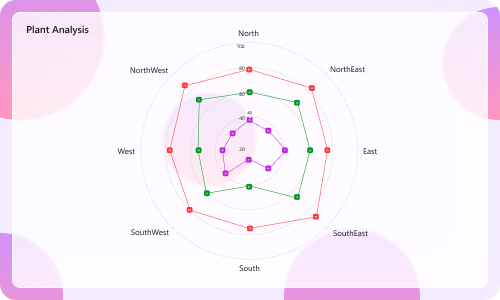

# Liquid Glass Effect in .NET MAUI Polar Chart

The Liquid Glass Effect is a modern design style that provides a sleek, minimalist appearance with clean lines, subtle visual effects, and elegant styling. It features smooth rounded corners and sophisticated visual treatments that create a polished, professional look for your charts.

N> The liquid glass effect is supported only on `.NET 10` and on `iOS` and `macOS` versions 26 or later

## How it Enhances Chart UI on macOS and iOS

The Liquid Glass Effect enhances MAUI [SfPolarChart](https://help.syncfusion.com/cr/maui/Syncfusion.Maui.Charts.SfPolarChart.html) with a sleek, glassy look and improved interactivity.

- **Tooltip:** Applies a glassy appearance to tooltips for clearer data highlights.
- **Chart Background:** Wrap the chart in an [SfGlassEffectView](https://help.syncfusion.com/cr/maui/Syncfusion.Maui.Core.SfGlassEffectView.html) to give the chart surface a blurred or clear glass background.

## Apply Liquid Glass Effect to SfPolarChart

Wrap the [SfPolarChart](https://help.syncfusion.com/cr/maui/Syncfusion.Maui.Charts.SfPolarChart.html) inside an [SfGlassEffectView](https://help.syncfusion.com/cr/maui/Syncfusion.Maui.Core.SfGlassEffectView.html) to give the chart surface a glass (blurred or clear) appearance. `SfGlassEffectView` is available in the [Syncfusion.Maui.Core](https://www.nuget.org/packages/Syncfusion.Maui.Core/) package.





<core:SfGlassEffectView CornerRadius="20"
                        Padding="12"
                        EffectType="Regular"
                        EnableShadowEffect="True">

    <chart:SfPolarChart>

        <chart:PolarLineSeries
            ItemsSource="{Binding Data}"
            XBindingPath="Category"
            YBindingPath="Value" />
    </chart:SfPolarChart>
</core:SfGlassEffectView>





SfPolarChart chart = new SfPolarChart();

chart.Series.Add(new PolarLineSeries
{
    ItemsSource = viewModel.Data,
    XBindingPath = "Category",
    YBindingPath = "Value"
});

var glass = new SfGlassEffectView
{
    CornerRadius = 20,
    Padding = 12,
    EffectType = GlassEffectType.Regular, // Regular (blurrier) or Clear (glassy)
    EnableShadowEffect = true,
    Content = chart
};





For detailed guidance on [SfGlassEffectView](https://help.syncfusion.com/cr/maui/Syncfusion.Maui.Core.SfGlassEffectView.html), refer to the Getting Started [documentation](https://help.syncfusion.com/maui/liquid-glass-ui/getting-started).

### Enable Liquid Glass Effect to SfPolarChart Tooltip

To Enable Liquid Glass Effect to the tooltip, set `True` to [EnableLiquidGlassEffect](https://help.syncfusion.com/cr/maui/Syncfusion.Maui.Charts.ChartBase.html#Syncfusion_Maui_Charts_ChartBase_EnableLiquidGlassEffect) property of [SfPolarChart](https://help.syncfusion.com/cr/maui/Syncfusion.Maui.Charts.SfPolarChart.html) and [EnableTooltip](https://help.syncfusion.com/cr/maui/Syncfusion.Maui.Charts.ChartSeries.html#Syncfusion_Maui_Charts_ChartSeries_EnableTooltip) property of [ChartSeries](https://help.syncfusion.com/cr/maui/Syncfusion.Maui.Charts.ChartSeries.html).





<chart:SfPolarChart EnableLiquidGlassEffect="True">
    . . .
    <chart:PolarLineSeries ItemsSource="{Binding Data}" 
                           XBindingPath="Category"
                           YBindingPath="Value"
                           EnableTooltip="True">
    </chart:PolarLineSeries>
</chart:SfPolarChart>





SfPolarChart chart = new SfPolarChart();
chart.EnableLiquidGlassEffect = true;
. . .
PolarLineSeries series = new PolarLineSeries()
{
    ItemsSource = viewModel.Data,
    XBindingPath = "Category",
    YBindingPath = "Value",
    EnableTooltip = true
};

chart.Series.Add(series);
this.Content = chart;





### Best Practices and Tips

- Host the chart inside an [SfGlassEffectView](https://help.syncfusion.com/cr/maui/Syncfusion.Maui.Core.SfGlassEffectView.html) to give the chart body a glass appearance.
- Liquid glass effects are most visible over images or colorful backgrounds.
- Set [EffectType](https://help.syncfusion.com/cr/maui/Syncfusion.Maui.Core.SfGlassEffectView.html#Syncfusion_Maui_Core_SfGlassEffectView_EffectType) property of [SfGlassEffectView](https://help.syncfusion.com/cr/maui/Syncfusion.Maui.Core.SfGlassEffectView.html) as `Regular` for a blurrier look and `Clear` for a crisper, glassy look.
- Tune CornerRadius and Padding to balance content density and visual polish.
- When using a custom template for tooltip using [TooltipTemplate](https://help.syncfusion.com/cr/maui/Syncfusion.Maui.Charts.ChartSeries.html#Syncfusion_Maui_Charts_ChartSeries_TooltipTemplate), set the background to `Transparent` to display the liquid glass effect.