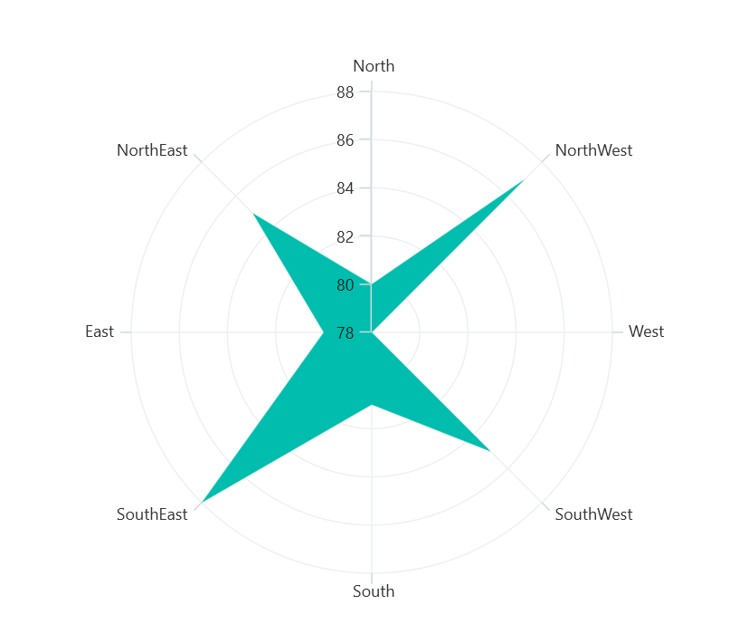
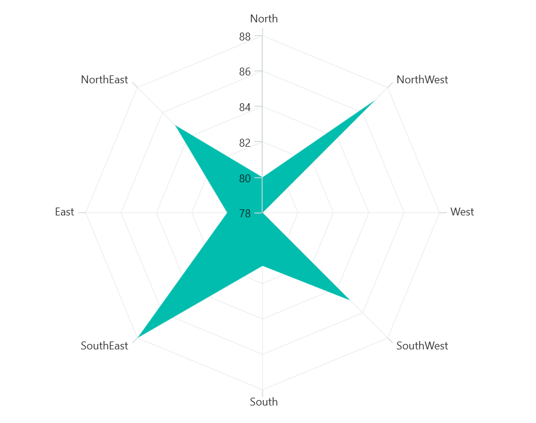
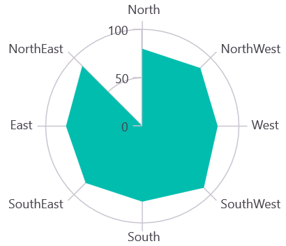

# Polar Area Chart in .NET MAUI Polar Chart

## Polar Area Chart

To display an area series in a polar chart, instantiate the [PolarAreaSeries](https://help.syncfusion.com/cr/maui/Syncfusion.Maui.Charts.PolarAreaSeries.html) and include it in the [Series](https://help.syncfusion.com/cr/maui/Syncfusion.Maui.Charts.SfPolarChart.html#Syncfusion_Maui_Charts_SfPolarChart_Series) collection property of [SfPolarChart](https://help.syncfusion.com/cr/maui/Syncfusion.Maui.Charts.SfPolarChart.html).





<chart:SfPolarChart> 
    <chart:SfPolarChart.PrimaryAxis>
        <chart:CategoryAxis/>
    </chart:SfPolarChart.PrimaryAxis>

    <chart:SfPolarChart.SecondaryAxis>
        <chart:NumericalAxis/>
    </chart:SfPolarChart.SecondaryAxis>   

    <chart:PolarAreaSeries ItemsSource="{Binding PlantDetails}" XBindingPath="Direction" YBindingPath="Tree"/>  
</chart:SfPolarChart>





SfPolarChart chart = new SfPolarChart();

CategoryAxis primaryAxis = new CategoryAxis();
chart.PrimaryAxis = primaryAxis;

NumericalAxis secondaryAxis = new NumericalAxis();
chart.SecondaryAxis = secondaryAxis;

PolarAreaSeries series = new PolarAreaSeries()
{
    ItemsSource = new PlantViewModel().PlantDetails,
    XBindingPath = "Direction",
    YBindingPath = "Tree"
};

chart.Series.Add(series);
this.Content = chart;





## Grid line Type

The [GridLineType](https://help.syncfusion.com/cr/maui/Syncfusion.Maui.Charts.SfPolarChart.html#Syncfusion_Maui_Charts_SfPolarChart_GridLineType) property customizes the rendering style of axis grid lines:

* **Circle** (default) — Renders concentric circular grid lines, creating a target-like appearance
* **Polygon** — Renders polygonal grid lines, creating a web or spider chart appearance





<chart:SfPolarChart GridLineType="Polygon"> 
    <!-- code omitted for brevity -->
    <chart:PolarAreaSeries ItemsSource="{Binding PlantDetails}" XBindingPath="Direction" YBindingPath="Tree"/>  
</chart:SfPolarChart>





SfPolarChart chart = new SfPolarChart();
chart.GridLineType = PolarChartGridLineType.Polygon;
//code omitted for brevity
PolarAreaSeries series = new PolarAreaSeries()
{
    ItemsSource = new PlantViewModel().PlantDetails,
    XBindingPath = "Direction",
    YBindingPath = "Tree"
};

chart.Series.Add(series);
this.Content = chart;





## Closed Series

The [IsClosed](https://help.syncfusion.com/cr/maui/Syncfusion.Maui.Charts.PolarSeries.html#Syncfusion_Maui_Charts_PolarSeries_IsClosed) property is used to render the series with or without a closed path. The default value is `true`, which creates a closed polygon shape. Set to `false` to create an open path that doesn't connect the last point to the first.

**Note:** Negative Y values are not recommended for polar area charts as they may produce unexpected visualizations. Ensure all Y values are non-negative for optimal results.





<chart:SfPolarChart> 
    <!-- code omitted for brevity -->
    <chart:PolarAreaSeries ItemsSource="{Binding PlantDetails}" XBindingPath="Direction" YBindingPath="Tree"
                           IsClosed="False"/>  
</chart:SfPolarChart>





SfPolarChart chart = new SfPolarChart();
//code omitted for brevity
PolarAreaSeries series = new PolarAreaSeries()
{
    ItemsSource = new PlantViewModel().PlantDetails,
    XBindingPath = "Direction",
    YBindingPath = "Tree",
    IsClosed  = false
};

chart.Series.Add(series);
this.Content = chart;





## Enable Marker

A marker, also known as a symbol, is used to determine or highlight the position of the data point. To enable markers in the series, set the [ShowMarkers](https://help.syncfusion.com/cr/maui/Syncfusion.Maui.Charts.PolarSeries.html#Syncfusion_Maui_Charts_PolarSeries_ShowMarkers) property to true.





<chart:SfPolarChart>
    ...
    <chart:PolarAreaSeries ItemsSource="{Binding PlantDetails}" XBindingPath="Direction"  YBindingPath="Tree"    
                           ShowMarkers="True"/>
</chart:SfPolarChart>





SfPolarChart chart = new SfPolarChart();
...
PolarAreaSeries series = new PolarAreaSeries()
{
    ItemsSource = new PlantViewModel().PlantDetails,
    XBindingPath = "Direction",
    YBindingPath = "Tree",
    ShowMarkers= true
 };

chart.Series.Add(series);
this.Content= chart;





### Marker customization

In order to change the series markers appearance, create an instance of the [MarkerSettings](https://help.syncfusion.com/cr/maui/Syncfusion.Maui.Charts.PolarSeries.html#Syncfusion_Maui_Charts_PolarSeries_MarkerSettings) property. The following properties are used to customize marker appearance.

* [Type](https://help.syncfusion.com/cr/maui/Syncfusion.Maui.Charts.ChartMarkerSettings.html#Syncfusion_Maui_Charts_ChartMarkerSettings_Type), of type `ShapeType`, describes the shape of the series marker. The default value of this property is `ShapeType.Circle`.
* [Stroke](https://help.syncfusion.com/cr/maui/Syncfusion.Maui.Charts.ChartMarkerSettings.html#Syncfusion_Maui_Charts_ChartMarkerSettings_Stroke), of type `Brush`, indicates the brush used to paint the marker border.
* [StrokeWidth](https://help.syncfusion.com/cr/maui/Syncfusion.Maui.Charts.ChartMarkerSettings.html#Syncfusion_Maui_Charts_ChartMarkerSettings_StrokeWidth), of type `double`, indicates the width of the marker border.
* [Fill](https://help.syncfusion.com/cr/maui/Syncfusion.Maui.Charts.ChartMarkerSettings.html#Syncfusion_Maui_Charts_ChartMarkerSettings_Fill), of type `Brush`, indicates the color of the marker.
* [Width](https://help.syncfusion.com/cr/maui/Syncfusion.Maui.Charts.ChartMarkerSettings.html#Syncfusion_Maui_Charts_ChartMarkerSettings_Width), of type `double`, indicates the width of the marker.
* [Height](https://help.syncfusion.com/cr/maui/Syncfusion.Maui.Charts.ChartMarkerSettings.html#Syncfusion_Maui_Charts_ChartMarkerSettings_Height), of type `double`, indicates the height of the marker.





<chart:SfPolarChart>
    ...
    <chart:PolarAreaSeries ItemsSource="{Binding PlantDetails}" XBindingPath="Direction" YBindingPath="Tree"
                           ShowMarkers="True">
        <chart:PolarAreaSeries.MarkerSettings>
            <chart:ChartMarkerSettings Type="Diamond" Fill="Brown" Stroke="Black"
                                       StrokeWidth="1" Height="8" Width="8"/>
        </chart:PolarAreaSeries.MarkerSettings>
    </chart:PolarAreaSeries>
</chart:SfPolarChart>





SfPolarChart chart = new SfPolarChart();
...
ChartMarkerSettings chartMarker = new ChartMarkerSettings()
{
    Type = ShapeType.Diamond,
    Fill = Colors.Brown,
    Stroke = Colors.Black,
    StrokeWidth = 1,
    Height = 8,
    Width = 8
};

PolarAreaSeries series = new PolarAreaSeries()
{
    ItemsSource = new PlantViewModel().PlantDetails,
    XBindingPath = "Direction",
    YBindingPath = "Tree",
    ShowMarkers = true,
    MarkerSettings = chartMarker
};

chart.Series.Add(series);
this.Content = chart;



