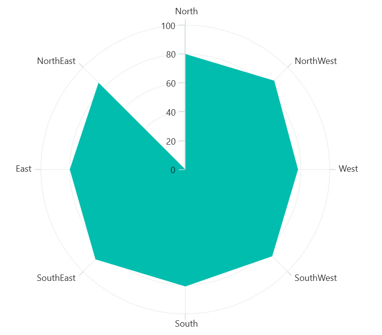

# Polar Area Chart in .NET MAUI Chart

## Polar Area Chart

To display an area series in a polar chart, instantiate the [PolarAreaSeries]() and include it in the [Series]() collection property of [SfPolarChart]().





<chart:SfPolarChart>
    
    <chart:SfPolarChart.PrimaryAxis>
        <chart:CategoryAxis />
    </chart:SfPolarChart.PrimaryAxis>

    <chart:SfPolarChart.SecondaryAxis>
        <chart:NumericalAxis />
    </chart:SfPolarChart.SecondaryAxis>   

    <chart:PolarAreaSeries ItemsSource="{Binding PlantDetails}"
					  XBindingPath="Direction"
					  YBindingPath="Tree"/>  

</chart:SfPolarChart>





SfPolarChart chart = new SfPolarChart();
CategoryAxis primaryAxis = new CategoryAxis();
chart.PrimaryAxis.Add(primaryAxis);
NumericalAxis secondaryAxis = new NumericalAxis();
chart.SecondaryAxis.Add(secondaryAxis);

PolarAreaSeries series = new PolarAreaSeries()
{
    ItemsSource = new ViewModel().PlantDetails,
    XBindingPath = "Direction",
    YBindingPath = "Tree",
};

chart.Series.Add(series);
this.Content = chart;





## Grid line Type

The [GridLineType]() property used to modify the rendering style of axis grid lines. The default [GridLineType]() is [Circle](). Switching to the [Polygon]() grid line type transforms the polar chart appearance, resembling a spider or web chart.





<chart:SfPolarChart GridLineType="Polygon"> 
. . .
    <chart:PolarAreaSeries ItemsSource="{Binding PlantDetails}"
					  XBindingPath="Direction"
					  YBindingPath="Tree"/>  

</chart:SfPolarChart>





SfPolarChart chart = new SfPolarChart();
chart.GridLineType = PolarChartGridLineType.Polygon;
. . .
PolarAreaSeries series = new PolarAreaSeries()
{
    ItemsSource = new ViewModel().PlantDetails,
    XBindingPath = "Direction",
    YBindingPath = "Tree",
};

chart.Series.Add(series);
this.Content = chart;





## Closed Series

The [IsClosed]() property used to render the series with or without closed path. The default value of [IsClosed]() is true.





<chart:SfPolarChart GridLineType="Polygon"> 
. . .
    <chart:PolarAreaSeries ItemsSource="{Binding PlantDetails}"
					  XBindingPath="Direction"
					  YBindingPath="Tree"
                      IsClosed="False"/>  

</chart:SfPolarChart>





SfPolarChart chart = new SfPolarChart();
chart.GridLineType = PolarChartGridLineType.Polygon;
. . .
PolarAreaSeries series = new PolarAreaSeries()
{
    ItemsSource = new ViewModel().PlantDetails,
    XBindingPath = "Direction",
    YBindingPath = "Tree",
    IsClosed = "False"
};

chart.Series.Add(series);
this.Content = chart;





