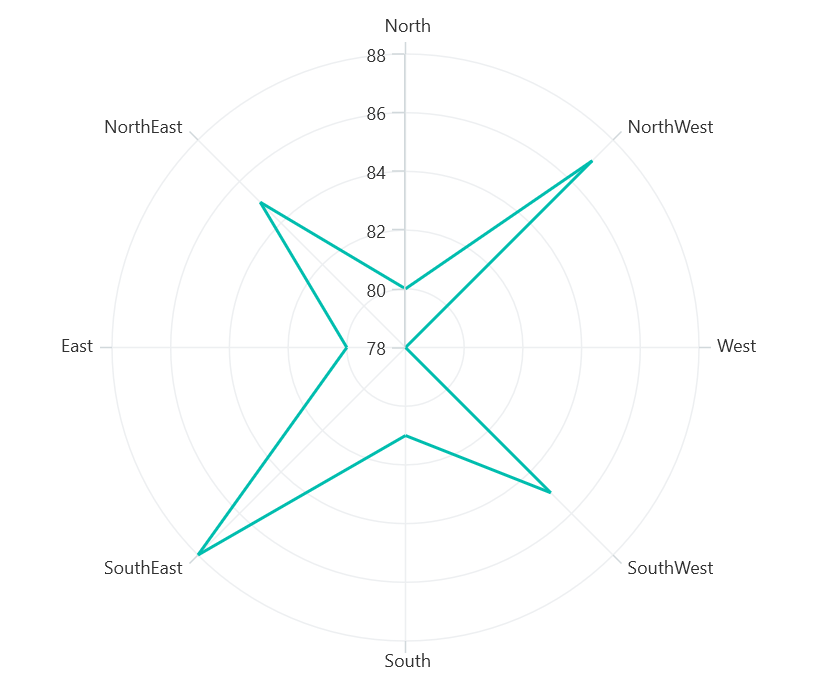
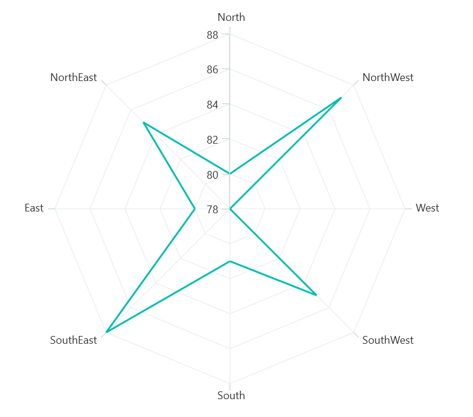
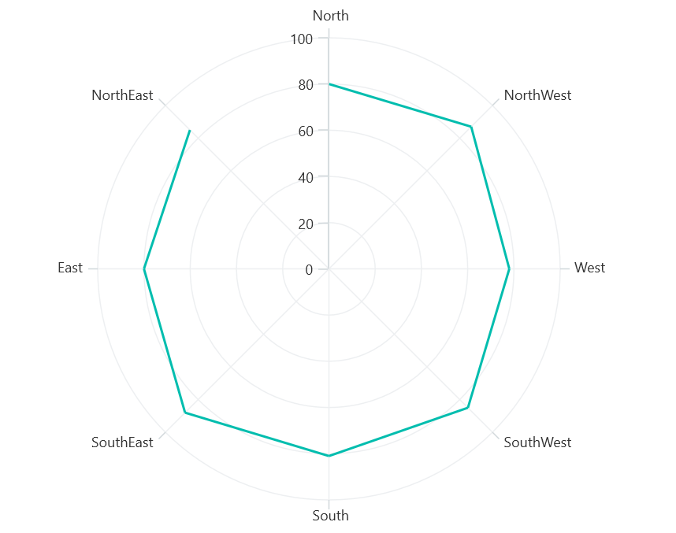

# Polar Line Chart in .NET MAUI Chart

## Polar Line Chart

To display a line series in a polar chart, instantiate the [PolarLineSeries](https://help.syncfusion.com/cr/maui/Syncfusion.Maui.Charts.PolarLineSeries.html) and include it in the [Series](https://help.syncfusion.com/cr/maui/Syncfusion.Maui.Charts.SfPolarChart.html#Syncfusion_Maui_Charts_SfPolarChart_Series) collection property of [SfPolarChart](https://help.syncfusion.com/cr/maui/Syncfusion.Maui.Charts.SfPolarChart.html).





<chart:SfPolarChart>
    <chart:SfPolarChart.PrimaryAxis>
        <chart:CategoryAxis/>
    </chart:SfPolarChart.PrimaryAxis>

    <chart:SfPolarChart.SecondaryAxis>
        <chart:NumericalAxis/>
    </chart:SfPolarChart.SecondaryAxis>   

    <chart:PolarLineSeries ItemsSource="{Binding PlantDetails}" XBindingPath="Direction" YBindingPath="Tree"/>  
</chart:SfPolarChart>





SfPolarChart chart = new SfPolarChart();
CategoryAxis primaryAxis = new CategoryAxis();
chart.PrimaryAxis = primaryAxis;
NumericalAxis secondaryAxis = new NumericalAxis();
chart.SecondaryAxis = secondaryAxis;
PolarLineSeries series = new PolarLineSeries()
{
    ItemsSource = new ViewModel().PlantDetails,
    XBindingPath = "Direction",
    YBindingPath = "Tree"
};

chart.Series.Add(series);
this.Content = chart;





## Grid line Type

The [GridLineType](https://help.syncfusion.com/cr/maui/Syncfusion.Maui.Charts.SfPolarChart.html#Syncfusion_Maui_Charts_SfPolarChart_GridLineType) property used to customize the rendering style of axis grid lines. The default [GridLineType](https://help.syncfusion.com/cr/maui/Syncfusion.Maui.Charts.SfPolarChart.html#Syncfusion_Maui_Charts_SfPolarChart_GridLineType) is [Circle](https://help.syncfusion.com/cr/maui/Syncfusion.Maui.Charts.PolarChartGridLineType.html#Syncfusion_Maui_Charts_PolarChartGridLineType_Circle). Switching to the [Polygon](https://help.syncfusion.com/cr/maui/Syncfusion.Maui.Charts.PolarChartGridLineType.html#Syncfusion_Maui_Charts_PolarChartGridLineType_Polygon) grid line type transforms the polar chart appearance, resembling a spider or web chart.





<chart:SfPolarChart GridLineType="Polygon"> 
    . . .
    <chart:PolarLineSeries ItemsSource="{Binding PlantDetails}" XBindingPath="Direction" YBindingPath="Tree"/>  
</chart:SfPolarChart>





SfPolarChart chart = new SfPolarChart();
chart.GridLineType = PolarChartGridLineType.Polygon;
. . .
PolarLineSeries series = new PolarLineSeries()
{
    ItemsSource = new ViewModel().PlantDetails,
    XBindingPath = "Direction",
    YBindingPath = "Tree"
};

chart.Series.Add(series);
this.Content = chart;





## Closed Series

The [IsClosed](https://help.syncfusion.com/cr/maui/Syncfusion.Maui.Charts.PolarSeries.html#Syncfusion_Maui_Charts_PolarSeries_IsClosed) property is used to render the series with or without closed path. The default value of [IsClosed](https://help.syncfusion.com/cr/maui/Syncfusion.Maui.Charts.PolarSeries.html#Syncfusion_Maui_Charts_PolarSeries_IsClosed) is `true`.





<chart:SfPolarChart> 
    . . .
    <chart:PolarLineSeries ItemsSource="{Binding PlantDetails}" XBindingPath="Direction" YBindingPath="Tree"
                           IsClosed="False"/>  
</chart:SfPolarChart>





SfPolarChart chart = new SfPolarChart();
. . .
PolarLineSeries series = new PolarLineSeries()
{
    ItemsSource = new ViewModel().PlantDetails,
    XBindingPath = "Direction",
    YBindingPath = "Tree",
    IsClosed = "False"
};

chart.Series.Add(series);
this.Content = chart;





## Enable Marker

A marker, also known as a symbol, is used to determine or highlight the position of the data point. To enable markers in the series, set the [ShowMarkers](https://help.syncfusion.com/cr/maui/Syncfusion.Maui.Charts.PolarSeries.html#Syncfusion_Maui_Charts_PolarSeries_ShowMarkers) property to true.





<chart:SfPolarChart>
    ...
    <chart:PolarLineSeries ItemsSource="{Binding PlantDetails}" XBindingPath="Direction" YBindingPath="Tree" 
                           ShowMarkers="True"/>
</chart:SfPolarChart>





SfPolarChart chart = new SfPolarChart();
...
PolarLineSeries series = new PolarLineSeries()
{
    ItemsSource = new ViewModel().PlantDetails,
    XBindingPath = "Direction",
    YBindingPath = "Tree",
    ShowMarkers= true
};

chart.Series.Add(series);
this.Content= chart;





### Marker customization

In order to change the series markers appearance, create an instance of the [MarkerSettings](https://help.syncfusion.com/cr/maui/Syncfusion.Maui.Charts.PolarSeries.html#Syncfusion_Maui_Charts_PolarSeries_MarkerSettings) property. The following properties are used to customize marker appearance.

* [Type](https://help.syncfusion.com/cr/maui/Syncfusion.Maui.Charts.ChartMarkerSettings.html#Syncfusion_Maui_Charts_ChartMarkerSettings_Type), of type `ShapeType`, describes the shape of the series marker. The default value of this property is `ShapeType.Circle`.
* [Stroke](https://help.syncfusion.com/cr/maui/Syncfusion.Maui.Charts.ChartMarkerSettings.html#Syncfusion_Maui_Charts_ChartMarkerSettings_Stroke), of type `Brush`, indicates the brush used to paint the marker border.
* [StrokeWidth](https://help.syncfusion.com/cr/maui/Syncfusion.Maui.Charts.ChartMarkerSettings.html#Syncfusion_Maui_Charts_ChartMarkerSettings_StrokeWidth), of type `double`, indicates the width of the marker border.
* [Fill](https://help.syncfusion.com/cr/maui/Syncfusion.Maui.Charts.ChartMarkerSettings.html#Syncfusion_Maui_Charts_ChartMarkerSettings_Fill), of type `Brush`, indicates the color of the marker.
* [Width](https://help.syncfusion.com/cr/maui/Syncfusion.Maui.Charts.ChartMarkerSettings.html#Syncfusion_Maui_Charts_ChartMarkerSettings_Width), of type `double`, indicates the width of the marker.
* [Height](https://help.syncfusion.com/cr/maui/Syncfusion.Maui.Charts.ChartMarkerSettings.html#Syncfusion_Maui_Charts_ChartMarkerSettings_Height), of type `double`, indicates the height of the marker.





<chart:SfPolarChart>
    ...
    <chart:PolarLineSeries ItemsSource="{Binding PlantDetails}" XBindingPath="Direction" YBindingPath="Tree"
                           ShowMarkers="True">
        <chart:PolarLineSeries.MarkerSettings>
            <chart:ChartMarkerSettings Type="Diamond" Fill="Brown" Stroke="Black"
                                       StrokeWidth="1" Height="8" Width="8"/>
        </chart:PolarLineSeries.MarkerSettings>
    </chart:PolarLineSeries>
</chart:SfPolarChart>





SfPolarChart chart = new SfPolarChart();
...
PolarLineSeries series = new PolarLineSeries()
{
    ItemsSource = new ViewModel().PlantDetails,
    XBindingPath = "Direction",
    YBindingPath = "Tree",
    ShowMarkers = true,
    MarkerSettings = chartMarker
 };

ChartMarkerSettings chartMarker= new ChartMarkerSettings();
chartMarker.Type = ShapeType.Diamond;
chartMarker.Fill = Colors.Brown;
chartMarker.Stroke = Colors.Black;
chartMarker.StrokeWidth= 1;
chartMarker.Height = 8;
chartMarker.Width = 8;
chart.Series.Add(series);
this.Content = chart;



