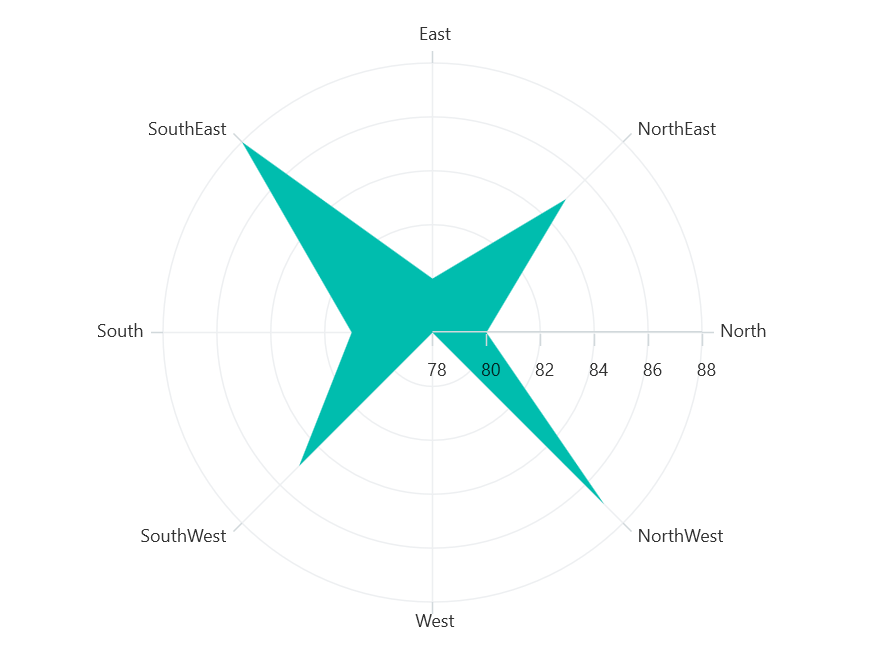

# Rendering Position in .NET MAUI Chart

## Start Angle

Adjust the rendering position of series on polar chart by leveraging the [StartAngle]() property, offering four degree values: 0, 90, 180, and 270. The default setting for the [StartAngle]() property is [Rotate270]().





<chart:SfPolarChart StartAngle="Rotate0">

    <chart:SfPolarChart.PrimaryAxis>
        <chart:CategoryAxis />
    </chart:SfPolarChart.PrimaryAxis>

    <chart:SfPolarChart.SecondaryAxis>
        <chart:NumericalAxis/>
    </chart:SfPolarChart.SecondaryAxis>   

    <chart:PolarAreaSeries ItemsSource="{Binding PlantDetails}" XBindingPath="Direction" YBindingPath="Tree"/>  

</chart:SfPolarChart>





SfPolarChart chart = new SfPolarChart();
chart.StartAngle = ChartPolarAngle.Rotate0;
CategoryAxis primaryAxis = new CategoryAxis();
chart.PrimaryAxis = primaryAxis;
NumericalAxis secondaryAxis = new NumericalAxis();
chart.SecondaryAxis = secondaryAxis;

PolarAreaSeries series = new PolarAreaSeries()
{
    ItemsSource = new ViewModel().PlantDetails,
    XBindingPath = "Direction",
    YBindingPath = "Tree",
};

chart.Series.Add(series);
this.Content = chart;





