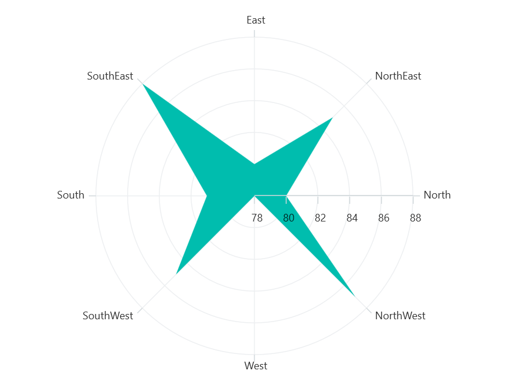

# Rendering Position in .NET MAUI Polar Chart

The rendering position in a .NET MAUI Polar Chart defines the starting angle from which the chart series is drawn on the polar coordinate system. By adjusting the rendering position, you can rotate the entire chart visualization to start from different angular points (0°, 90°, 180°, or 270°).

N> **Prerequisite:** Ensure that the required NuGet package is installed, the necessary namespaces are imported, and the **SfPolarChart** control is properly configured in your application. For detailed setup and configuration instructions, refer to the **[Getting Started](https://help.syncfusion.com/maui/polar-charts/getting-started)** guide.

## Start Angle

Adjust the rendering position of series on the polar chart by using the [StartAngle](https://help.syncfusion.com/cr/maui/Syncfusion.Maui.Charts.SfPolarChart.html#Syncfusion_Maui_Charts_SfPolarChart_StartAngle) property. The StartAngle property provides four rotation options: [Rotate0](https://help.syncfusion.com/cr/maui/Syncfusion.Maui.Charts.ChartPolarAngle.html#Syncfusion_Maui_Charts_ChartPolarAngle_Rotate0), [Rotate90](https://help.syncfusion.com/cr/maui/Syncfusion.Maui.Charts.ChartPolarAngle.html#Syncfusion_Maui_Charts_ChartPolarAngle_Rotate90), [Rotate180](https://help.syncfusion.com/cr/maui/Syncfusion.Maui.Charts.ChartPolarAngle.html#Syncfusion_Maui_Charts_ChartPolarAngle_Rotate180), and [Rotate270](https://help.syncfusion.com/cr/maui/Syncfusion.Maui.Charts.ChartPolarAngle.html#Syncfusion_Maui_Charts_ChartPolarAngle_Rotate270). The default value is [Rotate270](https://help.syncfusion.com/cr/maui/Syncfusion.Maui.Charts.ChartPolarAngle.html#Syncfusion_Maui_Charts_ChartPolarAngle_Rotate270).





<chart:SfPolarChart StartAngle = "Rotate0">
    <chart:SfPolarChart.PrimaryAxis>
        <chart:CategoryAxis/>
    </chart:SfPolarChart.PrimaryAxis>

    <chart:SfPolarChart.SecondaryAxis>
        <chart:NumericalAxis/>
    </chart:SfPolarChart.SecondaryAxis>   

    <!-- code omitted for brevity -->

    <chart:PolarAreaSeries ItemsSource = "{Binding PlantDetails}"
                           XBindingPath = "Direction" 
                           YBindingPath = "Tree"/>  
</chart:SfPolarChart>





SfPolarChart chart = new SfPolarChart();
chart.StartAngle = ChartPolarAngle.Rotate0;

CategoryAxis primaryAxis = new CategoryAxis();
chart.PrimaryAxis = primaryAxis;

NumericalAxis secondaryAxis = new NumericalAxis();
chart.SecondaryAxis = secondaryAxis;

PolarAreaSeries series = new PolarAreaSeries()
{
    ItemsSource = new PlantViewModel().PlantDetails,
    XBindingPath = "Direction",
    YBindingPath = "Tree"
};
// code omitted for brevity
chart.Series.Add(series);
this.Content = chart;





