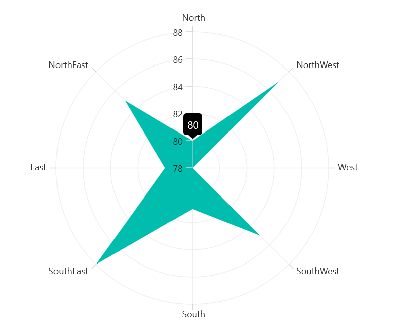
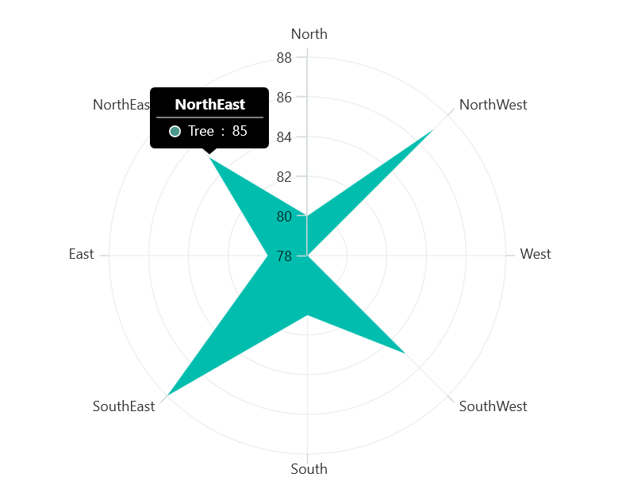

# Tooltip in .NET MAUI Chart

A tooltip is used to display information or metadata of the tapped segment. The Polar chart provides tooltip support for all series.

## Define Tooltip

To define the tooltip in the series, set the [EnableTooltip](https://help.syncfusion.com/cr/maui/Syncfusion.Maui.Charts.ChartSeries.html#Syncfusion_Maui_Charts_ChartSeries_EnableTooltip) property to true. The default value of [EnableTooltip](https://help.syncfusion.com/cr/maui/Syncfusion.Maui.Charts.ChartSeries.html#Syncfusion_Maui_Charts_ChartSeries_EnableTooltip) property is `false`.





<chart:SfPolarChart>
    . . .
    <chart:PolarAreaSeries ItemsSource="{Binding PlantDetails}" XBindingPath="Direction" YBindingPath="Tree" 
                EnableTooltip="True"/>
</chart:SfPolarChart>





SfPolarChart chart = new SfPolarChart();
. . .
PolarAreaSeries series = new PolarAreaSeries()
{
    ItemsSource = new ViewModel().PlantDetails,
    XBindingPath = "Direction",
    YBindingPath = "Tree",
    EnableTooltip = true
};
chart.Series.Add(series);

this.Content = chart;





The [ChartTooltipBehavior](https://help.syncfusion.com/cr/maui/Syncfusion.Maui.Charts.ChartTooltipBehavior.html) is used to customize the tooltip. For customizing the tooltip, create an instance [ChartTooltipBehavior](https://help.syncfusion.com/cr/maui/Syncfusion.Maui.Charts.ChartTooltipBehavior.html) and set it to the [TooltipBehavior](https://help.syncfusion.com/cr/maui/Syncfusion.Maui.Charts.ChartBase.html#Syncfusion_Maui_Charts_ChartBase_TooltipBehavior) property of [SfPolarChart](https://help.syncfusion.com/cr/maui/Syncfusion.Maui.Charts.SfPolarChart.html?tabs=tabid-1%2Ctabid-3%2Ctabid-6%2Ctabid-8%2Ctabid-10%2Ctabid-23%2Ctabid-18%2Ctabid-12%2Ctabid-14%2Ctabid-20%2Ctabid-16). The following properties are used to customize the tooltip:

* [Background](https://help.syncfusion.com/cr/maui/Syncfusion.Maui.Charts.ChartTooltipBehavior.html#Syncfusion_Maui_Charts_ChartTooltipBehavior_Background) - Gets or sets the background color to the tooltip label.
* [FontAttributes](https://help.syncfusion.com/cr/maui/Syncfusion.Maui.Charts.ChartTooltipBehavior.html#Syncfusion_Maui_Charts_ChartTooltipBehavior_FontAttributes) - Gets or sets the font style for the label.
* [FontFamily](https://help.syncfusion.com/cr/maui/Syncfusion.Maui.Charts.ChartTooltipBehavior.html#Syncfusion_Maui_Charts_ChartTooltipBehavior_FontFamily) - Gets or sets the font family name for the label.
* [FontSize](https://help.syncfusion.com/cr/maui/Syncfusion.Maui.Charts.ChartTooltipBehavior.html#Syncfusion_Maui_Charts_ChartTooltipBehavior_FontSize) - Gets or sets the font size for the label.
* [Duration](https://help.syncfusion.com/cr/maui/Syncfusion.Maui.Charts.ChartTooltipBehavior.html#Syncfusion_Maui_Charts_ChartTooltipBehavior_Duration) - Gets or sets the duration of the tooltip text in seconds.
* [Margin](https://help.syncfusion.com/cr/maui/Syncfusion.Maui.Charts.ChartTooltipBehavior.html#Syncfusion_Maui_Charts_ChartTooltipBehavior_Margin) - Gets or sets the margin of the label to customize the appearance of label.
* [TextColor](https://help.syncfusion.com/cr/maui/Syncfusion.Maui.Charts.ChartTooltipBehavior.html#Syncfusion_Maui_Charts_ChartTooltipBehavior_TextColor) - Used to set the color for the text of the label.





<chart:SfPolarChart.TooltipBehavior>
    <chart:ChartTooltipBehavior/>
</chart:SfPolarChart.TooltipBehavior>





SfPolarChart chart = new SfPolarChart();
chart.TooltipBehavior = new ChartTooltipBehavior();





## Duration

The [Duration](https://help.syncfusion.com/cr/maui/Syncfusion.Maui.Charts.ChartTooltipBehavior.html#Syncfusion_Maui_Charts_ChartTooltipBehavior_Duration) property is used to specify the duration time in milliseconds for which tooltip will be displayed.





<chart:SfPolarChart>
    . . .  
    <chart:SfPolarChart.TooltipBehavior>
        <chart:ChartTooltipBehavior Duration="5000"/>
    </chart:SfPolarChart.TooltipBehavior>

    <chart:PolarAreaSeries ItemsSource="{Binding PlantDetails}" XBindingPath="Direction" YBindingPath="Tree" 
                EnableTooltip="True"/>               
</chart:SfPolarChart>





SfPolarChart chart = new SfPolarChart();
. . .
chart.TooltipBehavior = new ChartTooltipBehavior();
chart.TooltipBehavior.Duration = 5000;

PolarAreaSeries series = new PolarAreaSeries()
{
    ItemsSource = new ViewModel().PlantDetails,
    XBindingPath = "Direction",
    YBindingPath = "Tree",
    EnableTooltip = true
};

chart.Series.Add(series);
this.Content = chart;





## Template

The [SfPolarChart](https://help.syncfusion.com/cr/maui/Syncfusion.Maui.Charts.SfPolarChart.html?tabs=tabid-1%2Ctabid-3%2Ctabid-6%2Ctabid-8%2Ctabid-10%2Ctabid-23%2Ctabid-18%2Ctabid-12%2Ctabid-14%2Ctabid-20%2Ctabid-16) provides support for customizing the appearance of the tooltip by using the [TooltipTemplate](https://help.syncfusion.com/cr/maui/Syncfusion.Maui.Charts.ChartSeries.html#Syncfusion_Maui_Charts_ChartSeries_TooltipTemplate) property.





<chart:SfPolarChart >
    <chart:SfPolarChart.Resources>
         <DataTemplate x:Key="tooltipTemplate1" x:Name="temp">
            <StackLayout>
                <Label Text="{Binding Item.Direction}" HorizontalTextAlignment="Center" HorizontalOptions="Center"             VerticalTextAlignment="Center" TextColor="White" FontAttributes="Bold" FontFamily="Helvetica" Margin="0,2,0,2" FontSize="12.5"/>
                <BoxView Color="Gray" HeightRequest="1" WidthRequest="90"/>
                    <StackLayout Orientation="Horizontal" VerticalOptions="Fill" Spacing="0" Padding="3" Margin="0" HorizontalOptions="Center">
                        <Ellipse Stroke="White" StrokeThickness="2" HeightRequest="10" 
                            WidthRequest="10" Fill="#48988B" Margin="0,1,3,0"/>
                        <Label Text="Tree"  VerticalTextAlignment="Center" HorizontalOptions="Start" 
                            TextColor="White" FontFamily="Helvetica" FontSize="12" Margin="3,0,3,0"/>
                        <Label Text="{Binding Item.Tree,StringFormat=' :  {0}'}" VerticalTextAlignment="Center" HorizontalOptions="End" TextColor="White" FontFamily="Helvetica" Margin="0,0,3,0" FontSize="12"/>
                    </StackLayout>
     </StackLayout>
 </DataTemplate>
        . . .          
    </chart:SfPolarChart.Resources>
    . . .
    <chart:SfPolarChart.TooltipBehavior>
        <chart:ChartTooltipBehavior/>
    </chart:SfPolarChart.TooltipBehavior>

    <chart:PolarAreaSeries ItemsSource="{Binding PlantDetails}"  XBindingPath="Direction" YBindingPath="Tree" 
                    TooltipTemplate="{StaticResource tooltipTemplate1}" EnableTooltip="True"/>

</chart:SfPolarChart>





SfPolarChart chart = new SfPolarChart();
. . .
PolarAreaSeries series = new PolarAreaSeries()
{
    ItemsSource = new ViewModel().PlantDetails,
    XBindingPath = "Direction",
    YBindingPath = "Tree",
    EnableTooltip = true,
    TooltipTemplate = chart.Resources["tooltipTemplate1"] as DataTemplate
};

chart.Series.Add(series);
this.Content = chart;
        




## Methods

You can programmatically show or hide the chart tooltip by using the show or hide method.

### Show method

The [Show](https://help.syncfusion.com/cr/maui/Syncfusion.Maui.Charts.ChartTooltipBehavior.html#Syncfusion_Maui_Charts_ChartTooltipBehavior_Show_System_Single_System_Single_System_Boolean_) method is used to activate the tooltip at the specified location.





<chart:SfPolarChart>
...
<chart:SfPolarChart.TooltipBehavior>
    <chart:ChartTooltipBehavior x:Name="tooltip">
    </chart:ChartTooltipBehavior>
</chart:SfPolarChart.TooltipBehavior>
...
</chart:SfPolarChart>

<Button Text="Show tooltip" Clicked="Button_Clicked">
</Button>









private void Button_Clicked(object sender, EventArgs e)
{
    //pointX - determines the x position of the tooltip, pointY - determines the y position of the tooltip and the boolean value determines whether the tooltip should be animated while displaying.
    
    tooltip.Show(pointX, pointY, true);
}
   




N> The tooltip will only be activated at the specified location if there is a data point under that location.

### Hide method

The [Hide](https://help.syncfusion.com/cr/maui/Syncfusion.Maui.Charts.ChartTooltipBehavior.html#Syncfusion_Maui_Charts_ChartTooltipBehavior_Hide) method is used to hide the tooltip programmatically.





//The argument determines whether the tooltip should be animated while hiding.

tooltip.Hide();



