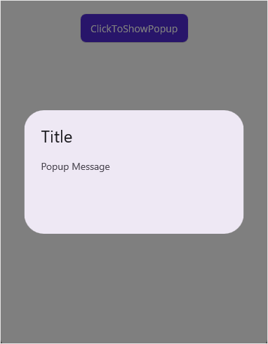
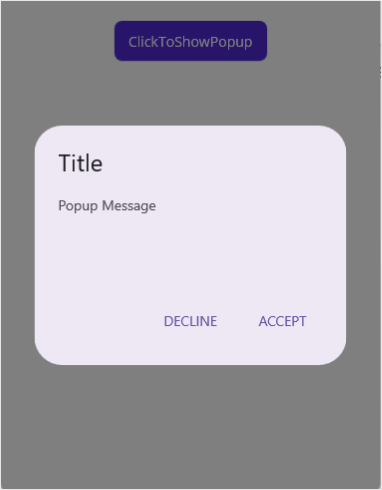
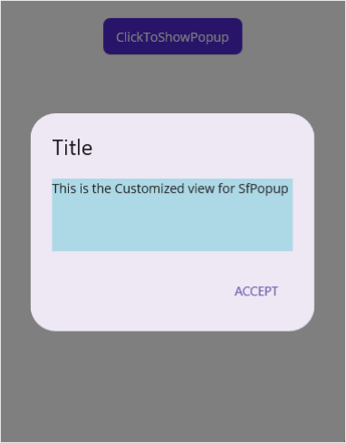

> **Notice**: After **Volume 3 2025 (Mid of Sep 2025)**, feature enhancements for this control will no longer be available in the Syncfusion® package. Please switch to the **Syncfusion® Toolkit for .NET MAUI** for continued support. For a smooth transition refer this [migration document](https://help.syncfusion.com/maui-toolkit/migration).

# Getting Started with .NET MAUI Popup

This section guides you through setting up and configuring a [Popup](https://help.syncfusion.com/cr/maui/Syncfusion.Maui.Popup.SfPopup.html) in your .NET MAUI application. Follow the steps below to add a basic Popup to your project.

To quickly get started with the .NET MAUI Popup, watch this video:
 <iframe id='MAUIPopupVideoTutorial' src='https://www.youtube.com/embed/HTk6JAGP-qE'></iframe>




## Prerequisites
Before proceeding, ensure the following are in place:

 1. Install [.NET 9 SDK](https://dotnet.microsoft.com/en-us/download/dotnet/9.0) or later.
 2. Set up a .NET MAUI environment with Visual Studio 2026 (v18.0.0 or later).

## Step 1: Create a .NET MAUI project

1. Go to **File > New > Project** and choose the **.NET MAUI App** template.
2. Name the project and choose a location. Then, click **Next.**
3. Select the .NET framework version and click **Create.**
 
## Step 2: Install the Syncfusion MAUI Popup NuGet Package
 
 1. In **Solution Explorer**, right-click the project and choose **Manage NuGet Packages**.
 2. Search for [Syncfusion.Maui.Popup](https://www.nuget.org/packages/Syncfusion.Maui.Popup) and install the latest version.
 3. Ensure the necessary dependencies are installed correctly, and the project is restored.

## Step 3: Register the handler

The [Syncfusion.Maui.Core](https://www.nuget.org/packages/Syncfusion.Maui.Core) is a dependent package for all Syncfusion controls of .NET MAUI. In the `MauiProgram.cs` file, register the handler for Syncfusion core.



using Microsoft.Maui.Controls.Hosting;
using Microsoft.Maui.Controls.Xaml;
using Microsoft.Maui.Hosting;
using Syncfusion.Maui.Core.Hosting;

namespace GettingStarted
{
    public class MauiProgram 
    {
        public static MauiApp CreateMauiApp()
        {
            var builder = MauiApp.CreateBuilder();
            builder
                .UseMauiApp<App>()
                .ConfigureFonts(fonts =>
                {
                    fonts.AddFont("OpenSans-Regular.ttf", "OpenSansRegular");
                });

            builder.ConfigureSyncfusionCore();
            return builder.Build();
        }
    }
}
 


## Step 4: Add a Basic Popup

 1. To initialize the control, import the `Syncfusion.Maui.Popup` namespace into your code.
 2. Initialize [SfPopup](https://help.syncfusion.com/cr/maui/Syncfusion.Maui.Popup.SfPopup.html).
 



<ContentPage   
    . . .
    xmlns:syncfusion="clr-namespace:Syncfusion.Maui.Popup;assembly=Syncfusion.Maui.Popup">

    <syncfusion:SfPopup />
</ContentPage>




using Syncfusion.Maui.Popup;
. . .

public partial class MainPage : ContentPage
{
    public MainPage()
    {
        InitializeComponent();
        SfPopup popup = new SfPopup();
    }
}




## Step 5: Displaying popup

Display a popup over your view by calling the [Show](https://help.syncfusion.com/cr/maui/Syncfusion.Maui.Popup.SfPopup.html#Syncfusion_Maui_Popup_SfPopup_Show_System_Boolean_) method.

Refer to the following code example for displaying popup using Button's Click event.





<?xml version="1.0" encoding="utf-8" ?>
<ContentPage xmlns="http://schemas.microsoft.com/dotnet/2021/maui"
             xmlns:x="http://schemas.microsoft.com/winfx/2009/xaml"
             xmlns:local="clr-namespace:GettingStarted"
			 xmlns:syncfusion="clr-namespace:Syncfusion.Maui.Popup;assembly=Syncfusion.Maui.Popup"
             x:Class="GettingStarted.MainPage" 
             Padding="0,40,0,0">
     <StackLayout x:Name="mainLayout">
       <Button x:Name="clickToShowPopup" Text="ClickToShowPopup" 
               VerticalOptions="Start" HorizontalOptions="Center"
               Clicked="ClickToShowPopup_Clicked" />
               <syncfusion:SfPopup x:Name="popup" />
     </StackLayout>
</ContentPage>




namespace GettingStarted
{
    public partial class MainPage : ContentPage
    {
        public MainPage()
        {
            InitializeComponent();
        }

        private void ClickToShowPopup_Clicked(object sender, EventArgs e)
        {
            popup.Show();
        }
    }
}





## Step 6: Running the Application

Press **F5** to build and run the application. Once compiled, click the button to open the Popup.

Here is the result of the previous codes.

Download the source code of this sample [here](https://github.com/SyncfusionExamples/getting-started-.net-maui-popup).




## Prerequisites
Before proceeding, ensure the following are in place:

1. Install [.NET 8 SDK](https://dotnet.microsoft.com/en-us/download/dotnet/8.0) or later is installed.
2. Set up a .NET MAUI environment with Visual Studio Code.
3. Ensure that the .NET MAUI extension is installed and configured as described [here.](https://learn.microsoft.com/en-us/dotnet/maui/get-started/installation?view=net-maui-8.0&tabs=visual-studio-code)

## Step 1: Create a new .NET MAUI project

1. Open the command palette by pressing `Ctrl+Shift+P` and type **.NET:New Project** and enter.
2. Choose the **.NET MAUI App** template.
3. Select the project location, type the project name and press **Enter.**
4. Then choose **Create project.**

## Step 2: Install the Syncfusion MAUI Popup NuGet Package
 
 1. In **Solution Explorer**, right-click the project and choose **Manage NuGet Packages**.
 2. Search for [Syncfusion.Maui.Popup](https://www.nuget.org/packages/Syncfusion.Maui.Popup) and install the latest version.
 3. Ensure the necessary dependencies are installed correctly, and the project is restored.

## Step 3: Register the handler

The [Syncfusion.Maui.Core](https://www.nuget.org/packages/Syncfusion.Maui.Core) is a dependent package for all Syncfusion controls of .NET MAUI. In the `MauiProgram.cs` file, register the handler for Syncfusion core.



using Microsoft.Maui.Controls.Hosting;
using Microsoft.Maui.Controls.Xaml;
using Microsoft.Maui.Hosting;
using Syncfusion.Maui.Core.Hosting;

namespace GettingStarted
{
    public class MauiProgram 
    {
        public static MauiApp CreateMauiApp()
        {
            var builder = MauiApp.CreateBuilder();
            builder
                .UseMauiApp<App>()
                .ConfigureFonts(fonts =>
                {
                    fonts.AddFont("OpenSans-Regular.ttf", "OpenSansRegular");
                });

            builder.ConfigureSyncfusionCore();
            return builder.Build();
        }
    }
}
 


## Step 4: Add a Basic Popup

 1. To initialize the control, import the `Syncfusion.Maui.Popup` namespace into your code.
 2. Initialize [SfPopup](https://help.syncfusion.com/cr/maui/Syncfusion.Maui.Popup.SfPopup.html).
 



<ContentPage   
    . . .
    xmlns:syncfusion="clr-namespace:Syncfusion.Maui.Popup;assembly=Syncfusion.Maui.Popup">

    <syncfusion:SfPopup />
</ContentPage>




using Syncfusion.Maui.Popup;
. . .

public partial class MainPage : ContentPage
{
    public MainPage()
    {
        InitializeComponent();
        SfPopup popup = new SfPopup();
    }
}




## Step 5: Displaying popup

Display a popup over your view by calling the [Show](https://help.syncfusion.com/cr/maui/Syncfusion.Maui.Popup.SfPopup.html#Syncfusion_Maui_Popup_SfPopup_Show_System_Boolean_) method.

Refer to the following code example for displaying popup using Button's Click event.





<?xml version="1.0" encoding="utf-8" ?>
<ContentPage xmlns="http://schemas.microsoft.com/dotnet/2021/maui"
             xmlns:x="http://schemas.microsoft.com/winfx/2009/xaml"
             xmlns:local="clr-namespace:GettingStarted"
			 xmlns:syncfusion="clr-namespace:Syncfusion.Maui.Popup;assembly=Syncfusion.Maui.Popup"
             x:Class="GettingStarted.MainPage" 
             Padding="0,40,0,0">
     <StackLayout x:Name="mainLayout">
       <Button x:Name="clickToShowPopup" Text="ClickToShowPopup" 
               VerticalOptions="Start" HorizontalOptions="Center"
               Clicked="ClickToShowPopup_Clicked" />
               <syncfusion:SfPopup x:Name="popup" />
     </StackLayout>
</ContentPage>




namespace GettingStarted
{
    public partial class MainPage : ContentPage
    {
        public MainPage()
        {
            InitializeComponent();
        }

        private void ClickToShowPopup_Clicked(object sender, EventArgs e)
        {
            popup.Show();
        }
    }
}





## Step 6: Running the Application

Press **F5** to build and run the application. Once compiled, click the button to open the Popup.

Here is the result of the previous codes.

Download the source code of this sample [here](https://github.com/SyncfusionExamples/getting-started-.net-maui-popup).





## Prerequisites

Before proceeding, ensure the following are set up:

1. Ensure you have the latest version of JetBrains Rider.
2. Install [.NET 8 SDK](https://dotnet.microsoft.com/en-us/download/dotnet/8.0) or later is installed.
3. Make sure the MAUI workloads are installed and configured as described [here.](https://www.jetbrains.com/help/rider/MAUI.html#before-you-start)

## Step 1: Create a new .NET MAUI Project

1. Go to **File > New Solution,** Select .NET (C#) and choose the .NET MAUI App template.
2. Enter the Project Name, Solution Name, and Location.
3. Select the .NET framework version and click Create.

## Step 2: Install the Syncfusion® MAUI Popup NuGet Package

1. In **Solution Explorer,** right-click the project and choose **Manage NuGet Packages.**
2. Search for [Syncfusion.Maui.Popup](https://www.nuget.org/packages/Syncfusion.Maui.Popup/) and install the latest version.
3. Ensure the necessary dependencies are installed correctly, and the project is restored. If not, Open the Terminal in Rider and manually run: `dotnet restore`

## Step 3: Register the handler

The [Syncfusion.Maui.Core](https://www.nuget.org/packages/Syncfusion.Maui.Core) is a dependent package for all Syncfusion controls of .NET MAUI. In the `MauiProgram.cs` file, register the handler for Syncfusion core.



using Microsoft.Maui.Controls.Hosting;
using Microsoft.Maui.Controls.Xaml;
using Microsoft.Maui.Hosting;
using Syncfusion.Maui.Core.Hosting;

namespace GettingStarted
{
    public class MauiProgram 
    {
        public static MauiApp CreateMauiApp()
        {
            var builder = MauiApp.CreateBuilder();
            builder
                .UseMauiApp<App>()
                .ConfigureFonts(fonts =>
                {
                    fonts.AddFont("OpenSans-Regular.ttf", "OpenSansRegular");
                });

            builder.ConfigureSyncfusionCore();
            return builder.Build();
        }
    }
}
 


## Step 4: Add a Basic Popup

 1. To initialize the control, import the `Syncfusion.Maui.Popup` namespace into your code.
 2. Initialize [SfPopup](https://help.syncfusion.com/cr/maui/Syncfusion.Maui.Popup.SfPopup.html).
 



<ContentPage   
    . . .
    xmlns:syncfusion="clr-namespace:Syncfusion.Maui.Popup;assembly=Syncfusion.Maui.Popup">

    <syncfusion:SfPopup />
</ContentPage>




using Syncfusion.Maui.Popup;
. . .

public partial class MainPage : ContentPage
{
    public MainPage()
    {
        InitializeComponent();
        SfPopup popup = new SfPopup();
    }
}






## Close the popup

To close the popup programmatically, you can call either the [Dismiss](https://help.syncfusion.com/cr/maui/Syncfusion.Maui.Popup.SfPopup.html#Syncfusion_Maui_Popup_SfPopup_Dismiss) method or set the IsOpen property to false.

Refer to the following code example for dismissing popup.



    
    private void ClickToDismissPopup_Clicked(object sender, EventArgs e)
    {
        // Dismiss SfPopup from the view.
        sfPopup.Dismiss();

        // Or
        sfPopup.IsOpen = false;
    }
 


## Customize positioning

The .NET MAUI Popup (SfPopup) allows showing the popup content at various positions.

The following list of options is available to position the SfPopup in the desired position:

* `Center Positioning`: Use the [IsOpen](https://help.syncfusion.com/cr/maui/Syncfusion.Maui.Popup.SfPopup.html#Syncfusion_Maui_Popup_SfPopup_IsOpen) property or [Show](https://help.syncfusion.com/cr/maui/Syncfusion.Maui.Popup.SfPopup.html#Syncfusion_Maui_Popup_SfPopup_Show_System_Boolean_) method to display the SfPopup at the center.
* `Absolute Positioning`: Use the [Show(x-position, y-position)](https://help.syncfusion.com/cr/maui/Syncfusion.Maui.Popup.SfPopup.html#Syncfusion_Maui_Popup_SfPopup_Show_System_Double_System_Double_) to display the SfPopup at the specified X and y position.
* `Relative Positioning`: Use the [ShowRelativeToView(View, RelativePosition)](https://help.syncfusion.com/cr/maui/Syncfusion.Maui.Popup.SfPopup.html#Syncfusion_Maui_Popup_SfPopup_ShowRelativeToView_Microsoft_Maui_Controls_View_Syncfusion_Maui_Popup_PopupRelativePosition_System_Double_System_Double_) to display the SfPopup at any of the 8 positions relative to the specified view.
* `Absolute relative positioning`: Use the [ShowRelativeToView(View, RelativePosition,x position,y position)](https://help.syncfusion.com/cr/maui/Syncfusion.Maui.Popup.SfPopup.html#Syncfusion_Maui_Popup_SfPopup_ShowRelativeToView_Microsoft_Maui_Controls_View_Syncfusion_Maui_Popup_PopupRelativePosition_System_Double_System_Double_) to display the SfPopup at an absolute x,y coordinate from the relative position of the specified view.

## Customizing layouts

By default, choose a layout from the following available layouts in the SfPopup by using the [AppearanceMode](https://help.syncfusion.com/cr/maui/Syncfusion.Maui.Popup.SfPopup.html#Syncfusion_Maui_Popup_SfPopup_AppearanceMode) property.

* [OneButton](https://help.syncfusion.com/cr/maui/Syncfusion.Maui.Popup.PopupButtonAppearanceMode.html#Syncfusion_Maui_Popup_PopupButtonAppearanceMode_OneButton): Shows the SfPopup with one button in the footer view. This is the default value.
* [TwoButton](https://help.syncfusion.com/cr/maui/Syncfusion.Maui.Popup.PopupButtonAppearanceMode.html#Syncfusion_Maui_Popup_PopupButtonAppearanceMode_TwoButton): Shows the SfPopup with two buttons in the footer view.

Also, customize the entire popup view by loading the templates or custom views for the header, body, and footer.

Refer to the following code example for displaying popup with appearance mode.




<?xml version="1.0" encoding="utf-8" ?>
<ContentPage xmlns="http://schemas.microsoft.com/dotnet/2021/maui"
             xmlns:x="http://schemas.microsoft.com/winfx/2009/xaml"
             xmlns:local="clr-namespace:GettingStarted"
			 xmlns:syncfusion="clr-namespace:Syncfusion.Maui.Popup;assembly=Syncfusion.Maui.Popup"
             x:Class="GettingStarted.MainPage" 
             Padding="0,40,0,0">
     <StackLayout x:Name="mainLayout">
       <Button x:Name="clickToShowPopup" Text="ClickToShowPopup" 
               VerticalOptions="Start" HorizontalOptions="FillAndExpand"
               Clicked="ClickToShowPopup_Clicked" />
        <syncfusion:SfPopup x:Name="popup"  ShowFooter="True" AppearanceMode="TwoButton"/>
     </StackLayout>
</ContentPage>




using Syncfusion.Maui.Popup;

namespace GettingStarted
{
    public partial class MainPage : ContentPage
    {
        SfPopup popup;

        public MainPage()
        {
            InitializeComponent();
            popup = new SfPopup();
            popup.ShowFooter = true;
            popup.AppearanceMode = Syncfusion.Maui.Popup.PopupButtonAppearanceMode.TwoButton;
        }

        private void ClickToShowPopup_Clicked(object sender, EventArgs e)
        {
            popup.Show();
        }
    }
}





##  Load template view in the popup body

Any view can be added as popup content by using the [ContentTemplate](https://help.syncfusion.com/cr/maui/Syncfusion.Maui.Popup.SfPopup.html#Syncfusion_Maui_Popup_SfPopup_ContentTemplate) property to refresh it. Refer to the following code example in which a label is added as popup content. 




<?xml version="1.0" encoding="utf-8" ?>
<ContentPage xmlns="http://schemas.microsoft.com/dotnet/2021/maui"
             xmlns:x="http://schemas.microsoft.com/winfx/2009/xaml"
             xmlns:local="clr-namespace:GettingStarted"
			 xmlns:syncfusion="clr-namespace:Syncfusion.Maui.Popup;assembly=Syncfusion.Maui.Popup"
             x:Class="GettingStarted.MainPage" 
             Padding="0,40,0,0">
    <StackLayout>
        <Button x:Name="clickToShowPopup"
                Text="ClickToShowPopup"
                VerticalOptions="Start"
                HorizontalOptions="FillAndExpand"
                Clicked="ClickToShowPopup_Clicked" />
        <syncfusion:SfPopup x:Name="popup">
            <syncfusion:SfPopup.ContentTemplate>
                <DataTemplate>
                    <Label Text="This is the Customized view for SfPopup"
                           BackgroundColor="SkyBlue"
                           VerticalTextAlignment="Center"
                           HorizontalTextAlignment="Center" />
                </DataTemplate>
            </syncfusion:SfPopup.ContentTemplate>
        </syncfusion:SfPopup>
    </StackLayout>
</ContentPage>




using Syncfusion.Maui.Popup;

namespace GettingStarted
{
    public partial class MainPage : ContentPage
    {
        DataTemplate templateView;
        Label popupContent;

        public MainPage()
        {
            InitializeComponent();            
            templateView = new DataTemplate(() =>
            {
                popupContent = new Label();
                popupContent.Text = "This is the Customized view for SfPopup";
                popupContent.BackgroundColor = Color.LightSkyBlue;
                popupContent.HorizontalTextAlignment = TextAlignment.Center;
                return popupContent;
            });

            // Adding ContentTemplate of the SfPopup
            popup.ContentTemplate = templateView;
        }

        private void ClickToShowPopup_Clicked(object sender, EventArgs e)
        {
            popup.Show();
        }
    } 
}





