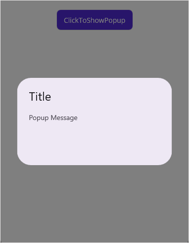

# Getting Started with .NET MAUI Popup

This section guides you through setting up and configuring a [Popup](https://help.syncfusion.com/cr/maui/Syncfusion.Maui.Popup.SfPopup.html) in your .NET MAUI application. Follow the steps below to add a basic Popup to your project.

To quickly get started with the .NET MAUI Popup, watch this video:
 <iframe id='MAUIPopupVideoTutorial' src='https://www.youtube.com/embed/HTk6JAGP-qE'></iframe>




## Prerequisites

Before proceeding, ensure the following are set up:

1. Install [.NET 9 SDK](https://dotnet.microsoft.com/en-us/download/dotnet/9.0) or later.
2. Set up a .NET MAUI environment with Visual Studio 2022 v17.12 or later.

## Step 1: Create a .NET MAUI project

1. Go to **File > New > Project** and choose the **.NET MAUI App** template.
2. Name the project and choose a location. Then, click **Next.**
3. Select the .NET framework version and click **Create.**
 
## Step 2: Install the Syncfusion MAUI Popup NuGet Package
 
 1. In **Solution Explorer**, right-click the project and choose **Manage NuGet Packages**.
 2. Search for [Syncfusion.Maui.Popup](https://www.nuget.org/packages/Syncfusion.Maui.Popup) and install the latest version.
 3. Ensure the necessary dependencies are installed correctly, and the project is restored.

## Step 3: Register the handler

The [Syncfusion.Maui.Core](https://www.nuget.org/packages/Syncfusion.Maui.Core) is a dependent package for all Syncfusion controls of .NET MAUI. In the `MauiProgram.cs` file, register the handler for Syncfusion core.



using Microsoft.Maui.Controls.Hosting;
using Microsoft.Maui.Controls.Xaml;
using Microsoft.Maui.Hosting;
using Syncfusion.Maui.Core.Hosting;

namespace GettingStarted
{
    public class MauiProgram 
    {
        public static MauiApp CreateMauiApp()
        {
            var builder = MauiApp.CreateBuilder();
            builder
                .UseMauiApp<App>()
                .ConfigureFonts(fonts =>
                {
                    fonts.AddFont("OpenSans-Regular.ttf", "OpenSansRegular");
                });

            builder.ConfigureSyncfusionCore();
            return builder.Build();
        }
    }
}
 


## Step 4: Add a Basic Popup

 1. To initialize the control, import the `Syncfusion.Maui.Popup` namespace into your code.
 2. Initialize [SfPopup](https://help.syncfusion.com/cr/maui/Syncfusion.Maui.Popup.SfPopup.html).
 



<ContentPage   
    . . .
    xmlns:syncfusion="clr-namespace:Syncfusion.Maui.Popup;assembly=Syncfusion.Maui.Popup">
    <syncfusion:SfPopup />
</ContentPage>




using Syncfusion.Maui.Popup;
. . .

public partial class MainPage : ContentPage
{
    public MainPage()
    {
        InitializeComponent();
        SfPopup popup = new SfPopup();
    }
}








## Prerequisites

Before proceeding, ensure the following are set up:

1. Install [.NET 9 SDK](https://dotnet.microsoft.com/en-us/download/dotnet/9.0) or later.
2. Set up a .NET MAUI environment with Visual Studio Code.
3. Ensure that the .NET MAUI workloads are installed and configured as described [here](https://learn.microsoft.com/en-us/dotnet/maui/get-started/installation?view=net-maui-9.0&tabs=visual-studio-code).

## Step 1: Create a new .NET MAUI project

1. Open the command palette by pressing `Ctrl+Shift+P` and type **.NET:New Project** and enter.
2. Choose the **.NET MAUI App** template.
3. Select the project location, type the project name and press **Enter.**
4. Then choose **Create project.**

## Step 2: Install the Syncfusion MAUI Popup NuGet Package
 
 1. In **Solution Explorer**, right-click the project and choose **Manage NuGet Packages**.
 2. Search for [Syncfusion.Maui.Popup](https://www.nuget.org/packages/Syncfusion.Maui.Popup) and install the latest version.
 3. Ensure the necessary dependencies are installed correctly, and the project is restored.

## Step 3: Register the handler

The [Syncfusion.Maui.Core](https://www.nuget.org/packages/Syncfusion.Maui.Core) is a dependent package for all Syncfusion controls of .NET MAUI. In the `MauiProgram.cs` file, register the handler for Syncfusion core.



using Microsoft.Maui.Controls.Hosting;
using Microsoft.Maui.Controls.Xaml;
using Microsoft.Maui.Hosting;
using Syncfusion.Maui.Core.Hosting;

namespace GettingStarted
{
    public class MauiProgram 
    {
        public static MauiApp CreateMauiApp()
        {
            var builder = MauiApp.CreateBuilder();
            builder
                .UseMauiApp<App>()
                .ConfigureFonts(fonts =>
                {
                    fonts.AddFont("OpenSans-Regular.ttf", "OpenSansRegular");
                });

            builder.ConfigureSyncfusionCore();
            return builder.Build();
        }
    }
}
 


## Step 4: Add a Basic Popup

 1. To initialize the control, import the `Syncfusion.Maui.Popup` namespace into your code.
 2. Initialize [SfPopup](https://help.syncfusion.com/cr/maui/Syncfusion.Maui.Popup.SfPopup.html).
 



<ContentPage   
    . . .
    xmlns:syncfusion="clr-namespace:Syncfusion.Maui.Popup;assembly=Syncfusion.Maui.Popup">
    <syncfusion:SfPopup />
</ContentPage>




using Syncfusion.Maui.Popup;
. . .

public partial class MainPage : ContentPage
{
    public MainPage()
    {
        InitializeComponent();
        SfPopup popup = new SfPopup();
    }
}








## Prerequisites

Before proceeding, ensure the following are set up:

1. Install [.NET 9 SDK](https://dotnet.microsoft.com/en-us/download/dotnet/9.0) or later.
2. Set up a .NET MAUI environment with JetBrains Rider 2024.3 or later.
3. Make sure the MAUI workloads are installed and configured as described [here.](https://www.jetbrains.com/help/rider/MAUI.html#before-you-start)

## Step 1: Create a new .NET MAUI Project

1. Go to **File > New Solution,** Select .NET (C#) and choose the .NET MAUI App template.
2. Enter the Project Name, Solution Name, and Location.
3. Select the .NET framework version and click Create.

## Step 2: Install the Syncfusion® MAUI Popup NuGet Package

1. In **Solution Explorer,** right-click the project and choose **Manage NuGet Packages.**
2. Search for [Syncfusion.Maui.Popup](https://www.nuget.org/packages/Syncfusion.Maui.Popup/) and install the latest version.
3. Ensure the necessary dependencies are installed correctly, and the project is restored. If not, Open the Terminal in Rider and manually run: `dotnet restore`

## Step 3: Register the handler

The [Syncfusion.Maui.Core](https://www.nuget.org/packages/Syncfusion.Maui.Core) is a dependent package for all Syncfusion controls of .NET MAUI. In the `MauiProgram.cs` file, register the handler for Syncfusion core.



using Microsoft.Maui.Controls.Hosting;
using Microsoft.Maui.Controls.Xaml;
using Microsoft.Maui.Hosting;
using Syncfusion.Maui.Core.Hosting;

namespace GettingStarted
{
    public class MauiProgram 
    {
        public static MauiApp CreateMauiApp()
        {
            var builder = MauiApp.CreateBuilder();
            builder
                .UseMauiApp<App>()
                .ConfigureFonts(fonts =>
                {
                    fonts.AddFont("OpenSans-Regular.ttf", "OpenSansRegular");
                });

            builder.ConfigureSyncfusionCore();
            return builder.Build();
        }
    }
}
 


## Step 4: Add a Basic Popup

 1. To initialize the control, import the `Syncfusion.Maui.Popup` namespace into your code.
 2. Initialize [SfPopup](https://help.syncfusion.com/cr/maui/Syncfusion.Maui.Popup.SfPopup.html).
 



<ContentPage   
    . . .
    xmlns:syncfusion="clr-namespace:Syncfusion.Maui.Popup;assembly=Syncfusion.Maui.Popup">
    <syncfusion:SfPopup />
</ContentPage>




using Syncfusion.Maui.Popup;

public partial class MainPage : ContentPage
{
    public MainPage()
    {
        InitializeComponent();
        SfPopup popup = new SfPopup();
    }
}






## Step 5: Displaying popup

Display a popup over your view by calling the [Show](https://help.syncfusion.com/cr/maui/Syncfusion.Maui.Popup.SfPopup.html#Syncfusion_Maui_Popup_SfPopup_Show_System_Boolean_) method.

Refer to the following code example for displaying popup using Button's Click event.





<?xml version="1.0" encoding="utf-8" ?>
<ContentPage xmlns="http://schemas.microsoft.com/dotnet/2021/maui"
             xmlns:x="http://schemas.microsoft.com/winfx/2009/xaml"
             xmlns:local="clr-namespace:GettingStarted"
			 xmlns:syncfusion="clr-namespace:Syncfusion.Maui.Popup;assembly=Syncfusion.Maui.Popup"
             x:Class="GettingStarted.MainPage" 
             Padding="0,40,0,0">
     <StackLayout x:Name="mainLayout">
       <Button x:Name="clickToShowPopup" Text="ClickToShowPopup" 
               VerticalOptions="Start" HorizontalOptions="Center"
               Clicked="ClickToShowPopup_Clicked" />
               <syncfusion:SfPopup x:Name="popup" />
     </StackLayout>
</ContentPage>




namespace GettingStarted
{
    public partial class MainPage : ContentPage
    {
        public MainPage()
        {
            InitializeComponent();
        }

        private void ClickToShowPopup_Clicked(object sender, EventArgs e)
        {
            popup.Show();
        }
    }
}





Download the source code of this sample [here](https://github.com/SyncfusionExamples/getting-started-.net-maui-popup).
