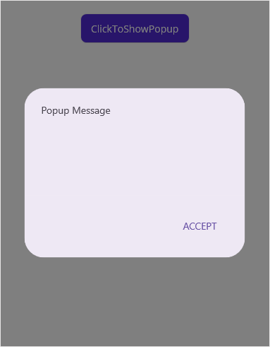
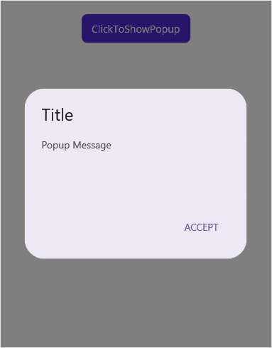
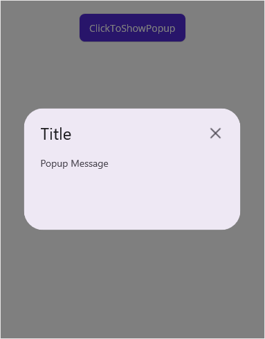
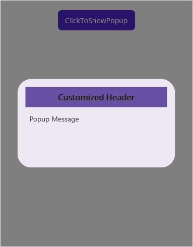
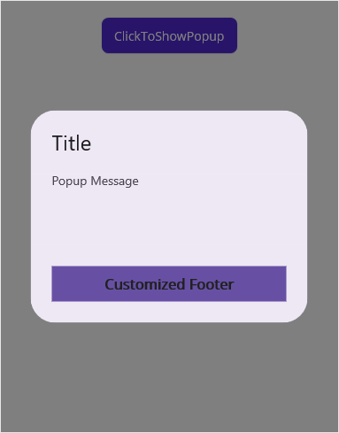
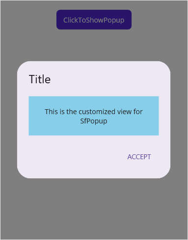
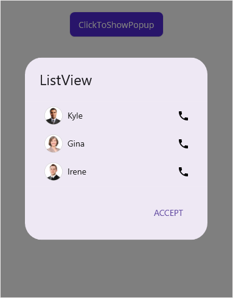

# Layout Customizations in MAUI Popup (SfPopup)

## Popup appearance mode for footer

The `SfPopup` supports two types of [AppearanceMode](https://help.syncfusion.com/cr/maui/Syncfusion.Maui.Popup.SfPopup.html#Syncfusion_Maui_Popup_SfPopup_AppearanceMode). By default, the [OneButton](https://help.syncfusion.com/cr/maui/Syncfusion.Maui.Popup.PopupButtonAppearanceMode.html#Syncfusion_Maui_Popup_PopupButtonAppearanceMode_OneButton) is set. Change the appearance by using the `AppearanceMode` property.

The two different appearance modes in the SfPopup are as follows:
<table>
<tr>
<th>Modes</th>
<th>Description</th></tr>
<tr>
<td>{{'[OneButton](https://help.syncfusion.com/cr/maui/Syncfusion.Maui.Popup.PopupButtonAppearanceMode.html#Syncfusion_Maui_Popup_PopupButtonAppearanceMode_OneButton)'| markdownify }}</td>
<td>Shows the <code>SfPopup</code> with one button (accept button) in the footer view. This is the default value.</td></tr>
<tr>
<td>{{'[TwoButton](https://help.syncfusion.com/cr/maui/Syncfusion.Maui.Popup.PopupButtonAppearanceMode.html#Syncfusion_Maui_Popup_PopupButtonAppearanceMode_TwoButton)'| markdownify }}</td>
<td>Shows the <code>SfPopup</code> with two buttons (accept & decline buttons) in the footer view.</td></tr>
</table>

In the following code example, set the `AppearanceMode` property as `OneButton`, which displays only the Accept button in the footer view.



<ContentPage xmlns="http://schemas.microsoft.com/dotnet/2021/maui"
             xmlns:x="http://schemas.microsoft.com/winfx/2009/xaml"
             xmlns:sfPopup="clr-namespace:Syncfusion.Maui.Popup;assembly=Syncfusion.Maui.Popup"
             x:Class="PopupMauiLayout.MainPage">
     <ContentPage.Content>
        <StackLayout Padding="20">
            <Button x:Name="clickToShowPopup" Text="ClickToShowPopup" 
                    VerticalOptions="Start" HorizontalOptions="Center" 
                    Clicked="ClickToShowPopup_Clicked" />
            <sfPopup:SfPopup x:Name="sfPopup" 
                             AppearanceMode="OneButton" 
                             ShowFooter="True">
            </sfPopup:SfPopup>
        </StackLayout>
    </ContentPage.Content>
</ContentPage>


using Syncfusion.Maui.Popup;

public partial class MainPage : ContentPage
{
    public MainPage()
    {
        InitializeComponent();
        sfPopup.ShowFooter = true;
        // Setting the AppearanceMode as OneButton
        sfPopup.AppearanceMode = PopupButtonAppearanceMode.OneButton;
    }

    private void ClickToShowPopup_Clicked(object sender, EventArgs e)
    {
        sfPopup.Show();
    }
}



In the following code example, set the `AppearanceMode` property as [TwoButton](https://help.syncfusion.com/cr/maui/Syncfusion.Maui.Popup.PopupButtonAppearanceMode.html#Syncfusion_Maui_Popup_PopupButtonAppearanceMode_TwoButton), which displays both Accept and Decline buttons in the footer view.



<ContentPage xmlns="http://schemas.microsoft.com/dotnet/2021/maui"
             xmlns:x="http://schemas.microsoft.com/winfx/2009/xaml"
             xmlns:sfPopup="clr-namespace:Syncfusion.Maui.Popup;assembly=Syncfusion.Maui.Popup"
             x:Class="PopupMauiLayout.MainPage">
     <ContentPage.Content>
        <StackLayout Padding="20">
            <Button x:Name="clickToShowPopup" Text="ClickToShowPopup" 
                    VerticalOptions="Start" HorizontalOptions="Center" 
                    Clicked="ClickToShowPopup_Clicked" />
            <sfPopup:SfPopup x:Name="sfPopup" 
                             AppearanceMode="TwoButton" 
                             ShowFooter="True">
            </sfPopup:SfPopup>
        </StackLayout>
    </ContentPage.Content>
</ContentPage>


using Syncfusion.Maui.Popup;

public partial class MainPage : ContentPage
{
    public MainPage()
    {
        InitializeComponent();
        sfPopup.ShowFooter = true;
        // Setting the AppearanceMode as TwoButton
        sfPopup.AppearanceMode = PopupButtonAppearanceMode.TwoButton;
    }

    private void ClickToShowPopup_Clicked(object sender, EventArgs e)
    {
        sfPopup.Show();
    }
}



## Popup region customization

### Disable header

Display the Popup without a header by using the property [ShowHeader](https://help.syncfusion.com/cr/maui/Syncfusion.Maui.Popup.SfPopup.html#Syncfusion_Maui_Popup_SfPopup_ShowHeader). The default value is true. Find the code example of the same as follows.



<ContentPage xmlns="http://schemas.microsoft.com/dotnet/2021/maui"
             xmlns:x="http://schemas.microsoft.com/winfx/2009/xaml"
             xmlns:sfPopup="clr-namespace:Syncfusion.Maui.Popup;assembly=Syncfusion.Maui.Popup"
             x:Class="PopupMauiLayout.MainPage">
     <ContentPage.Content>
        <StackLayout Padding="20">
            <Button x:Name="clickToShowPopup" Text="ClickToShowPopup" 
                    VerticalOptions="Start" HorizontalOptions="Center" 
                    Clicked="ClickToShowPopup_Clicked" />
            <sfPopup:SfPopup x:Name="sfPopup" 
                             ShowHeader="False"
                             ShowFooter="True">
            </sfPopup:SfPopup>
        </StackLayout>
    </ContentPage.Content>
</ContentPage>


using Syncfusion.Maui.Popup;

public partial class MainPage : ContentPage
{
    public MainPage()
    {
        InitializeComponent();
        sfPopup.ShowHeader = false;
        sfPopup.ShowFooter = true;
    }

    private void ClickToShowPopup_Clicked(object sender, EventArgs e)
    {
        sfPopup.Show();
    }
}



### Enable footer

Display the Popup with the footer by using the [ShowFooter](https://help.syncfusion.com/cr/maui/Syncfusion.Maui.Popup.SfPopup.html#Syncfusion_Maui_Popup_SfPopup_ShowFooter) property. The default value is false. Find the code example of the same as follows.



<ContentPage xmlns="http://schemas.microsoft.com/dotnet/2021/maui"
             xmlns:x="http://schemas.microsoft.com/winfx/2009/xaml"
             xmlns:sfPopup="clr-namespace:Syncfusion.Maui.Popup;assembly=Syncfusion.Maui.Popup"
             x:Class="PopupMauiLayout.MainPage">
     <ContentPage.Content>
        <StackLayout Padding="20">
            <Button x:Name="clickToShowPopup" Text="ClickToShowPopup" 
                    VerticalOptions="Start" HorizontalOptions="Center" 
                    Clicked="ClickToShowPopup_Clicked" />
            <sfPopup:SfPopup x:Name="sfPopup" 
                             ShowFooter="True">
            </sfPopup:SfPopup>
        </StackLayout>
    </ContentPage.Content>
</ContentPage>


using Syncfusion.Maui.Popup;

public partial class MainPage : ContentPage
{
    public MainPage()
    {
        InitializeComponent();
        sfPopup.ShowFooter = true;
    }

    private void ClickToShowPopup_Clicked(object sender, EventArgs e)
    {
        sfPopup.Show();
    }
}



## Enable close icon

Show the Popup with a close icon by using the [ShowCloseButton](https://help.syncfusion.com/cr/maui/Syncfusion.Maui.Popup.SfPopup.html#Syncfusion_Maui_Popup_SfPopup_ShowCloseButton) property. The default value is false. Find the code example of the same as follows. 



<ContentPage xmlns="http://schemas.microsoft.com/dotnet/2021/maui"
             xmlns:x="http://schemas.microsoft.com/winfx/2009/xaml"
             xmlns:sfPopup="clr-namespace:Syncfusion.Maui.Popup;assembly=Syncfusion.Maui.Popup"
             x:Class="PopupMauiLayout.MainPage">
     <ContentPage.Content>
        <StackLayout Padding="20">
            <Button x:Name="clickToShowPopup" Text="ClickToShowPopup" 
                    VerticalOptions="Start" HorizontalOptions="Center" 
                    Clicked="ClickToShowPopup_Clicked" />
            <sfPopup:SfPopup x:Name="sfPopup" 
                             ShowCloseButton="True">
            </sfPopup:SfPopup>
        </StackLayout>
    </ContentPage.Content>
</ContentPage>


using Syncfusion.Maui.Popup;

public partial class MainPage : ContentPage
{
    public MainPage()
    {
        InitializeComponent();
        sfPopup.ShowCloseButton = true;
    }

    private void ClickToShowPopup_Clicked(object sender, EventArgs e)
    {
        sfPopup.Show();
    }
}



## Customizing popup header

Any view can be added as the header content using the [HeaderTemplate](https://help.syncfusion.com/cr/maui/Syncfusion.Maui.Popup.SfPopup.html#Syncfusion_Maui_Popup_SfPopup_HeaderTemplate) property. Refer to the following code example in which a label is added as a header content.



<ContentPage xmlns="http://schemas.microsoft.com/dotnet/2021/maui"
             xmlns:x="http://schemas.microsoft.com/winfx/2009/xaml"
             xmlns:sfPopup="clr-namespace:Syncfusion.Maui.Popup;assembly=Syncfusion.Maui.Popup"
             x:Class="PopupMauiLayout.MainPage">
    <ContentPage.Content>
        <StackLayout Padding="20">
            <Button x:Name="clickToShowPopup" Text="ClickToShowPopup" 
                    VerticalOptions="Start" HorizontalOptions="Center" 
                    Clicked="ClickToShowPopup_Clicked" />
            <sfPopup:SfPopup x:Name="sfPopup">
                <sfPopup:SfPopup.HeaderTemplate>
                    <DataTemplate>
                        <Label Text="Customized Header" 
                               FontAttributes="Bold"
                               BackgroundColor="#6750A4"
                               FontSize="16"
                               HorizontalTextAlignment="Center"
                               VerticalTextAlignment="Center"/>                               
                    </DataTemplate>
                </sfPopup:SfPopup.HeaderTemplate>                
            </sfPopup:SfPopup>
        </StackLayout>
    </ContentPage.Content>
</ContentPage>


using Syncfusion.Maui.Popup;

public partial class MainPage : ContentPage
{
    DataTemplate headerTemplateView;
    Label headerContent;
    public MainPage()
    {
        InitializeComponent(); 
        clickToShowPopup.Clicked += ClickToShowPopup_Clicked;
        headerTemplateView = new DataTemplate(() =>
        {
            headerContent = new Label();
            headerContent.Text = "Customized Header";
            headerContent.FontAttributes = FontAttributes.Bold;
            headerContent.BackgroundColor = Color.FromArgb("#6750A4");
            headerContent.FontSize = 16;
            headerContent.HorizontalTextAlignment = TextAlignment.Center;
            headerContent.VerticalTextAlignment = TextAlignment.Center;
            return headerContent;
        });
        
        // Adding HeaderTemplate of the SfPopup
        sfPopup.HeaderTemplate = headerTemplateView;
    }

    private void ClickToShowPopup_Clicked(object sender, EventArgs e)
    {
        sfPopup.Show();
    }
}



### Popup header height

N>
When the HeaderTemplate is set, the HeaderHeight property customizes the header height.

Customize the popup header height using [HeaderHeight](https://help.syncfusion.com/cr/maui/Syncfusion.Maui.Popup.SfPopup.html#Syncfusion_Maui_Popup_SfPopup_HeaderHeight) property. Find the code example of the same as follows.



<ContentPage xmlns="http://schemas.microsoft.com/dotnet/2021/maui"
             xmlns:x="http://schemas.microsoft.com/winfx/2009/xaml"
             xmlns:sfPopup="clr-namespace:Syncfusion.Maui.Popup;assembly=Syncfusion.Maui.Popup"
             x:Class="PopupMauiLayout.MainPage">
    <ContentPage.Content>
        <StackLayout Padding="20">
            <Button x:Name="clickToShowPopup" Text="ClickToShowPopup" 
                    VerticalOptions="Start" HorizontalOptions="Center" 
                    Clicked="ClickToShowPopup_Clicked" />
            <sfPopup:SfPopup x:Name="sfPopup" 
                             HeaderHeight="150">                               
            </sfPopup:SfPopup>
        </StackLayout>
    </ContentPage.Content>
</ContentPage>


using Syncfusion.Maui.Popup;

public partial class MainPage : ContentPage
{
    public MainPage()
    {
        InitializeComponent();
        sfPopup.HeaderHeight = 150;
    }

    private void ClickToShowPopup_Clicked(object sender, EventArgs e)
    {
        sfPopup.Show();
    }
}



### Popup header title

Change the popup header title using [HeaderTitle](https://help.syncfusion.com/cr/maui/Syncfusion.Maui.Popup.SfPopup.html#Syncfusion_Maui_Popup_SfPopup_HeaderTitle) property. Find the code example of the same as follows.



<ContentPage xmlns="http://schemas.microsoft.com/dotnet/2021/maui"
             xmlns:x="http://schemas.microsoft.com/winfx/2009/xaml"
             xmlns:sfPopup="clr-namespace:Syncfusion.Maui.Popup;assembly=Syncfusion.Maui.Popup"
             x:Class="PopupMauiLayout.MainPage">
    <ContentPage.Content>
        <StackLayout Padding="20">
            <Button x:Name="clickToShowPopup" Text="ClickToShowPopup" 
                    VerticalOptions="Start" HorizontalOptions="Center" 
                    Clicked="ClickToShowPopup_Clicked" />
            <sfPopup:SfPopup x:Name="sfPopup" 
                             HeaderTitle="Header Title">                               
            </sfPopup:SfPopup>
        </StackLayout>
    </ContentPage.Content>
</ContentPage>


using Syncfusion.Maui.Popup;

public partial class MainPage : ContentPage
{
    public MainPage()
    {
        InitializeComponent();
        sfPopup.HeaderTitle = "Header Title";
    }

    private void ClickToShowPopup_Clicked(object sender, EventArgs e)
    {
        sfPopup.Show();
    }
}



## Customizing popup footer

Any view can be added as the footer content using the [FooterTemplate](https://help.syncfusion.com/cr/maui/Syncfusion.Maui.Popup.SfPopup.html#Syncfusion_Maui_Popup_SfPopup_FooterTemplate) property. Refer to the following code example in which a label is added as a footer content.



<ContentPage xmlns="http://schemas.microsoft.com/dotnet/2021/maui"
             xmlns:x="http://schemas.microsoft.com/winfx/2009/xaml"
             xmlns:sfPopup="clr-namespace:Syncfusion.Maui.Popup;assembly=Syncfusion.Maui.Popup"
             x:Class="PopupMauiLayout.MainPage">
    <ContentPage.Content>
        <StackLayout Padding="20">
            <Button x:Name="clickToShowPopup" Text="ClickToShowPopup" 
                    VerticalOptions="Start" HorizontalOptions="Center" 
                    Clicked="ClickToShowPopup_Clicked" />
            <sfPopup:SfPopup x:Name="sfPopup" ShowFooter="True">
                <sfPopup:SfPopup.FooterTemplate>
                    <DataTemplate>
                        <Label Text="Customized Footer" 
                               FontAttributes="Bold"
                               BackgroundColor="#6750A4"
                               FontSize="16"
                               HorizontalTextAlignment="Center"
                               VerticalTextAlignment="Center"/>
                    </DataTemplate>
                </sfPopup:SfPopup.FooterTemplate>
            </sfPopup:SfPopup>
        </StackLayout>
    </ContentPage.Content>
</ContentPage>


using Syncfusion.Maui.Popup;

public partial class MainPage : ContentPage
{
    DataTemplate footerTemplateView;
    Label footerContent;
    public MainPage()
    {
        InitializeComponent(); 
        clickToShowPopup.Clicked += ClickToShowPopup_Clicked;
        sfPopup.ShowFooter = true;
        footerTemplateView = new DataTemplate(() =>
        {
            footerContent = new Label();
            footerContent.Text = "Customized Footer";
            footerContent.FontAttributes = FontAttributes.Bold;
            footerContent.BackgroundColor = Color.FromArgb("#6750A4");
            footerContent.FontSize = 16;
            footerContent.HorizontalTextAlignment = TextAlignment.Center;
            footerContent.VerticalTextAlignment = TextAlignment.Center;
            return footerContent;
        });

        // Adding FooterTemplate of the SfPopup
        sfPopup.FooterTemplate = footerTemplateView;
    }

    private void ClickToShowPopup_Clicked(object sender, EventArgs e)
    {
        sfPopup.Show();
    }
}



### Popup footer height

Customize the popup footer height using [FooterHeight](https://help.syncfusion.com/cr/maui/Syncfusion.Maui.Popup.SfPopup.html#Syncfusion_Maui_Popup_SfPopup_FooterHeight) property. Find the code example of the same as follows.



<ContentPage xmlns="http://schemas.microsoft.com/dotnet/2021/maui"
             xmlns:x="http://schemas.microsoft.com/winfx/2009/xaml"
             xmlns:sfPopup="clr-namespace:Syncfusion.Maui.Popup;assembly=Syncfusion.Maui.Popup"
             x:Class="PopupMauiLayout.MainPage">
    <ContentPage.Content>
        <StackLayout Padding="20">
            <Button x:Name="clickToShowPopup" Text="ClickToShowPopup" 
                    VerticalOptions="Start" HorizontalOptions="Center" 
                    Clicked="ClickToShowPopup_Clicked" />
            <sfPopup:SfPopup x:Name="sfPopup" ShowFooter="True" 
                             FooterHeight="150">                               
            </sfPopup:SfPopup>
        </StackLayout>
    </ContentPage.Content>
</ContentPage>


using Syncfusion.Maui.Popup;

public partial class MainPage : ContentPage
{
    public MainPage()
    {
        InitializeComponent();
        sfPopup.ShowFooter = true;
        sfPopup.FooterHeight = 150;
    }

    private void ClickToShowPopup_Clicked(object sender, EventArgs e)
    {
        sfPopup.Show();
    }
}



### Popup accept and decline buttons text

Change the popup accept and decline buttons text using [AcceptButtonText](https://help.syncfusion.com/cr/maui/Syncfusion.Maui.Popup.SfPopup.html#Syncfusion_Maui_Popup_SfPopup_AcceptButtonText) and [DeclineButtonText](https://help.syncfusion.com/cr/maui/Syncfusion.Maui.Popup.SfPopup.html#Syncfusion_Maui_Popup_SfPopup_DeclineButtonText) properties. Find the code example of the same as follows.



<ContentPage xmlns="http://schemas.microsoft.com/dotnet/2021/maui"
             xmlns:x="http://schemas.microsoft.com/winfx/2009/xaml"
             xmlns:sfPopup="clr-namespace:Syncfusion.Maui.Popup;assembly=Syncfusion.Maui.Popup"
             x:Class="PopupMauiLayout.MainPage">
    <ContentPage.Content>
        <StackLayout Padding="20">
            <Button x:Name="clickToShowPopup" Text="ClickToShowPopup" 
                    VerticalOptions="Start" HorizontalOptions="Center" 
                    Clicked="ClickToShowPopup_Clicked" />
            <sfPopup:SfPopup x:Name="sfPopup" ShowFooter="True" AppearanceMode="TwoButton"
                             AcceptButtonText="Accept Button Text" DeclineButtonText="Decline Button Text">                               
            </sfPopup:SfPopup>
        </StackLayout>
    </ContentPage.Content>
</ContentPage>


using Syncfusion.Maui.Popup;

public partial class MainPage : ContentPage
{
    public MainPage()
    {
        InitializeComponent();
        sfPopup.ShowFooter = true;
        sfPopup.AppearanceMode = PopupButtonAppearanceMode.TwoButton;
        sfPopup.AcceptButtonText = "Accept Button Text";
        sfPopup.DeclineButtonText = "Decline Button Text";
    }

    private void ClickToShowPopup_Clicked(object sender, EventArgs e)
    {
        sfPopup.Show();
    }
}



## Customizing popup content

Any view can be added as popup content by using the [ContentTemplate](https://help.syncfusion.com/cr/maui/Syncfusion.Maui.Popup.SfPopup.html#Syncfusion_Maui_Popup_SfPopup_ContentTemplate) property. Refer to the following code example in which a label is added as a popup content.



<ContentPage xmlns="http://schemas.microsoft.com/dotnet/2021/maui"
             xmlns:x="http://schemas.microsoft.com/winfx/2009/xaml"
             xmlns:sfPopup="clr-namespace:Syncfusion.Maui.Popup;assembly=Syncfusion.Maui.Popup"
             x:Class="PopupMauiLayout.MainPage">
    <ContentPage.Content>
        <StackLayout Padding="20">
            <Button x:Name="clickToShowPopup" Text="ClickToShowPopup" 
                    VerticalOptions="Start" HorizontalOptions="Center" 
                    Clicked="ClickToShowPopup_Clicked" />
            <sfPopup:SfPopup x:Name="sfPopup" ShowFooter="True">
                <sfPopup:SfPopup.ContentTemplate>
                    <DataTemplate>
                        <Label Text="This is the customized view for SfPopup" 
                               VerticalTextAlignment="Center" BackgroundColor="SkyBlue"
                               HorizontalTextAlignment="Center" Padding="10"/>
                    </DataTemplate>
                </sfPopup:SfPopup.ContentTemplate>
            </sfPopup:SfPopup>
        </StackLayout>
    </ContentPage.Content>
</ContentPage>


using Syncfusion.Maui.Popup;

public partial class MainPage : ContentPage
{
    DataTemplate contentTemplateView;
    Label popupContent;
    public MainPage()
    {
        InitializeComponent(); 
        clickToShowPopup.Clicked += ClickToShowPopup_Clicked;
        sfPopup.ShowFooter = true;
        contentTemplateView = new DataTemplate(() =>
        {
            popupContent = new Label();
            popupContent.Text = "This is the customized view for SfPopup";            
            popupContent.BackgroundColor = Colors.SkyBlue;          
            popupContent.HorizontalTextAlignment = TextAlignment.Center;
            popupContent.VerticalTextAlignment = TextAlignment.Center;
            popupContent.Padding = 10;
            return popupContent;
        });

       // Adding ContentTemplate of the SfPopup
        sfPopup.ContentTemplate = contentTemplateView;
    }

    private void ClickToShowPopup_Clicked(object sender, EventArgs e)
    {
        sfPopup.Show();
    }
}



### Popup message

Change the popup content message using [Message](https://help.syncfusion.com/cr/maui/Syncfusion.Maui.Popup.SfPopup.html#Syncfusion_Maui_Popup_SfPopup_Message) property. Find the code example of the same as follows.



<ContentPage xmlns="http://schemas.microsoft.com/dotnet/2021/maui"
             xmlns:x="http://schemas.microsoft.com/winfx/2009/xaml"
             xmlns:sfPopup="clr-namespace:Syncfusion.Maui.Popup;assembly=Syncfusion.Maui.Popup"
             x:Class="PopupMauiLayout.MainPage">
    <ContentPage.Content>
        <StackLayout Padding="20">
            <Button x:Name="clickToShowPopup" Text="ClickToShowPopup" 
                    VerticalOptions="Start" HorizontalOptions="Center" 
                    Clicked="ClickToShowPopup_Clicked" />
            <sfPopup:SfPopup x:Name="sfPopup" 
                             Message="Popup Message">                               
            </sfPopup:SfPopup>
        </StackLayout>
    </ContentPage.Content>
</ContentPage>


using Syncfusion.Maui.Popup;

public partial class MainPage : ContentPage
{
    public MainPage()
    {
        InitializeComponent();        
        sfPopup.Message = "Popup Message";
    }

    private void ClickToShowPopup_Clicked(object sender, EventArgs e)
    {
        sfPopup.Show();
    }
}



## How to

### Disable the overlay background in .NET MAUI Popup?

Disable the overlay background by using the [SfPopup.ShowOverlayAlways](https://help.syncfusion.com/cr/maui/Syncfusion.Maui.Popup.SfPopup.html#Syncfusion_Maui_Popup_SfPopup_ShowOverlayAlways) property as `False`. The default value of the [SfPopup.ShowOverlayAlways](https://help.syncfusion.com/cr/maui/Syncfusion.Maui.Popup.SfPopup.html#Syncfusion_Maui_Popup_SfPopup_ShowOverlayAlways) is `True`.



        <sfPopup:SfPopup x:Name="popup" 
            ShowOverlayAlways="False"
            IsOpen="True">
        </sfPopup:SfPopup>


using Syncfusion.Maui.Popup;
public partial class MainPage : ContentPage
{
    SfPopup popup;
    public MainPage()
    {
        InitializeComponent();
        popup = new SfPopup();
        popup.ShowOverlayAlways = false;
        popup.Show();
    }
}



### Show listView as a popup

The `SfPopup` allows loading the `SfListView` as the content of the popup.



<ContentPage xmlns="http://schemas.microsoft.com/dotnet/2021/maui"
             xmlns:x="http://schemas.microsoft.com/winfx/2009/xaml"
             xmlns:sfListView="clr-namespace:Syncfusion.Maui.ListView;assembly=Syncfusion.Maui.ListView"
             xmlns:sfPopup="clr-namespace:Syncfusion.Maui.Popup;assembly=Syncfusion.Maui.Popup"
             xmlns:local="clr-namespace:PopupMauiLayout"
             x:Class="PopupMauiLayout.MainPage">
    <ContentPage.BindingContext>
        <local:ContactsViewModel x:Name="viewModel"/>
    </ContentPage.BindingContext>
    <ContentPage.Content>
        <StackLayout Padding="20">
            <Button Text="Click to show popup" 
                    Clicked="OpenButton_Clicked"
                    HorizontalOptions="Center"/>
            <sfPopup:SfPopup x:Name="sfPopup" 
                             HeaderTitle="ListView"
                             ShowFooter="True"
                             HeightRequest="300" WidthRequest="300">
                <sfPopup:SfPopup.ContentTemplate>
                    <DataTemplate>
                        <sfListView:SfListView x:Name="listView" ItemSize="46"
                                               ItemsSource="{Binding Items}">
                            <sfListView:SfListView.ItemTemplate>
                                <DataTemplate>                                
                                    <Grid x:Name="grid">                                           
                                        <Grid.ColumnDefinitions>
                                            <ColumnDefinition Width="46" />
                                            <ColumnDefinition Width="*" />
                                            <ColumnDefinition Width="*" />
                                        </Grid.ColumnDefinitions>
                                        <Image Source="{Binding ContactImage}"
                                               VerticalOptions="Center"
                                               HorizontalOptions="Center"
                                               HeightRequest="30"
                                               WidthRequest="30"/>
                                        <Label Grid.Column="1"
                                               VerticalTextAlignment="Center"
                                               LineBreakMode="NoWrap"
                                               Text="{Binding ContactName}" 
                                               FontSize="14" FontFamily="Roboto"/>
                                        <Image Grid.Column="2" 
                                               Source="{Binding ContactType}"
                                               VerticalOptions="Center"
                                               HorizontalOptions="End"
                                               HeightRequest="15"
                                               WidthRequest="15" Margin="0,0,8,0"/>
                                    </Grid>                                   
                                </DataTemplate>
                            </sfListView:SfListView.ItemTemplate>
                        </sfListView:SfListView>
                    </DataTemplate>
                </sfPopup:SfPopup.ContentTemplate>
            </sfPopup:SfPopup>
        </StackLayout>
    </ContentPage.Content> 
</ContentPage>

 
namespace PopupMauiPositioning;
using Syncfusion.Maui.ListView;
using Syncfusion.Maui.Popup;

public partial class MainPage : ContentPage
{
    SfListView listView;
    ContactsViewModel viewModel;
    SfPopup sfPopup;

    public MainPage()
    {
        InitializeComponent();
        listView = new SfListView();        
        listView.ItemTemplate = new DataTemplate(() =>
        {            
            var grid = new Grid();
            grid.ColumnDefinitions.Add(new ColumnDefinition() { Width = 46 });
            grid.ColumnDefinitions.Add(new ColumnDefinition() { Width = GridLength.Star });
            grid.ColumnDefinitions.Add(new ColumnDefinition() { Width = GridLength.Star });
            var contactImage = new Image()
            {
                VerticalOptions = LayoutOptions.Center,
                HorizontalOptions = LayoutOptions.Center,
                HeightRequest = 30,
                WidthRequest = 30
            };
            contactImage.SetBinding(Image.SourceProperty, new Binding("ContactImage"));
            var contactName = new Label()
            {
                VerticalTextAlignment = TextAlignment.Center,
                LineBreakMode = LineBreakMode.NoWrap,
                FontSize = 14
            };
            contactName.SetBinding(Label.TextProperty, new Binding("ContactName"));
            var contactType = new Image()
            {
                VerticalOptions = LayoutOptions.Center,
                HorizontalOptions = LayoutOptions.End,
                HeightRequest = 15,
                WidthRequest = 15,
                Margin = new Thickness(0, 0, 8, 0)
            };
            contactType.SetBinding(Image.SourceProperty, new Binding("ContactType"));
            grid.Children.Add(contactImage);
            Grid.SetColumn(contactImage, 0);
            Grid.SetRow(contactImage, 0);
            grid.Children.Add(contactName);
            Grid.SetColumn(contactName, 1);
            Grid.SetRow(contactName, 0);
            grid.Children.Add(contactType);
            Grid.SetColumn(contactType, 2);
            Grid.SetRow(contactType, 0);           
            return grid;
        });
        viewModel = new ContactsViewModel();
        listView.ItemsSource = viewModel.Items;
        listView.ItemSize = 46;
        sfPopup = new SfPopup();
        sfPopup.HeaderTitle = "ListView";
        sfPopup.ShowFooter = true;
        sfPopup.HeightRequest = 300;
        sfPopup.WidthRequest = 300;
        sfPopup.ContentTemplate = new DataTemplate(() =>
        {
            return listView;
        });
        StackLayout stackLayout = new StackLayout() { Padding = 20};
        Button OpenButton = new Button();
        OpenButton.HorizontalOptions = LayoutOptions.Center;
        OpenButton.Clicked += OpenButton_Clicked;
        OpenButton.Text = "Click to show popup";
        stackLayout.Children.Add(OpenButton); 
        this.Content = stackLayout;
    }  
}





private void OpenButton_Clicked(object sender, EventArgs e)
{
    sfPopup.Show();
}



Download the entire source code from GitHub [here](https://github.com/SyncfusionExamples/how-to-show-a-.net-maui-listview-in-content-template-of-.net-maui-popup).
