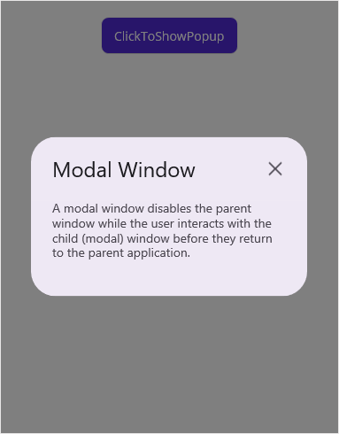

# Modal Window in MAUI Popup (SfPopup)

You can use the popup as a modal window using the built-in close icon and the [SfPopup.StaysOpen](https://help.syncfusion.com/cr/maui/Syncfusion.Maui.Popup.SfPopup.html#Syncfusion_Maui_Popup_SfPopup_StaysOpen) property prevents interaction with your application until you close the window.

`Modal`: Window loads under the parent window surrounded by an overlay which prevents clicking anywhere else on the screen apart from the control of the modal.

Modal does not require any action to open. It opens in the same window and gives callbacks when closing or opening the window.

Refer to the following code example: the popup will only close if you click on the close icon.



<ContentPage xmlns="http://schemas.microsoft.com/dotnet/2021/maui"
             xmlns:x="http://schemas.microsoft.com/winfx/2009/xaml"
             xmlns:sfPopup="clr-namespace:Syncfusion.Maui.Popup;assembly=Syncfusion.Maui.Popup"
             x:Class="PopupMauiModalWindow.MainPage">
  <ContentPage.Content>
    <StackLayout Padding="20">
        <Button x:Name="clickToShowPopup" Text="ClickToShowPopup" 
                VerticalOptions="Start" HorizontalOptions="Center" 
                Clicked="ClickToShowPopup_Clicked" />
        <sfPopup:SfPopup x:Name="sfPopup"     
                         StaysOpen="True"
                         HeaderTitle="Modal Window"
                         ShowCloseButton="True"
                         WidthRequest="312"
                         HeightRequest="180"
                         HeaderHeight="72">
            <sfPopup:SfPopup.ContentTemplate>
                <DataTemplate>
                    <Label Text="A modal window disables the parent window while the user interacts with the child (modal) window before they return to the parent application."
                            LineBreakMode="WordWrap" LineHeight="1.2"
                            TextColor="#49454E" FontSize="14" 
                            FontFamily="Roboto"/>
                </DataTemplate>
            </sfPopup:SfPopup.ContentTemplate>
        </sfPopup:SfPopup>
    </StackLayout>
  </ContentPage.Content>
</ContentPage>


using Syncfusion.Maui.Popup;

public partial class MainPage : ContentPage
{
    SfPopup sfPopup;
    DataTemplate contentTemplateView;
    Label popupContent;
    public MainPage()
    {
        InitializeComponent(); 
        clickToShowPopup.Clicked += ClickToShowPopup_Clicked;
        sfPopup = new SfPopup();
        sfPopup.StaysOpen = true;
        sfPopup.ShowCloseButton = true;
        sfPopup.HeaderTitle = "Modal Window";
        sfPopup.WidthRequest = 312;
        sfPopup.HeightRequest = 180;
        sfPopup.HeaderHeight = 72;
        contentTemplateView = new DataTemplate(()=>
        {
            popupContent = new Label();
            popupContent.Text = "A modal window disables the parent window while the user interacts with the child (modal) window before they return to the parent application.";
            popupContent.LineBreakMode = LineBreakMode.WordWrap;
            popupContent.LineHeight = 1.2;
            popupContent.FontSize = 14;
            popupContent.FontFamily = "Roboto";
            popupContent.TextColor = Color.FromArgb("#49454E");
            return popupContent;
        });

        sfPopup.ContentTemplate = contentTemplateView;
    }    
}





private void ClickToShowPopup_Clicked(object sender, EventArgs e)
{
    sfPopup.IsOpen = true;
}



