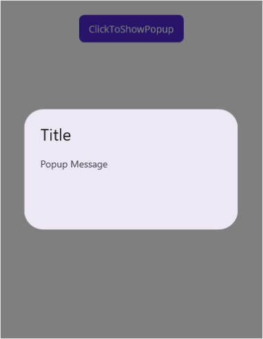
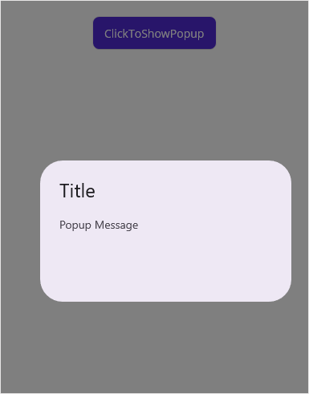
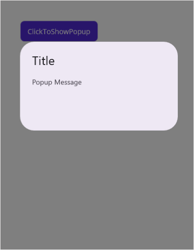
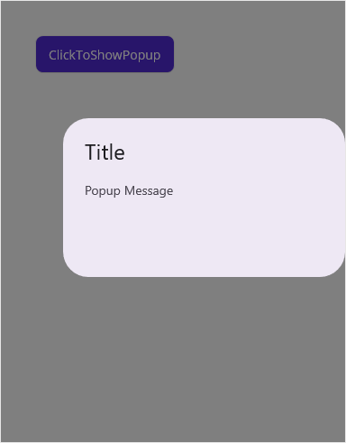
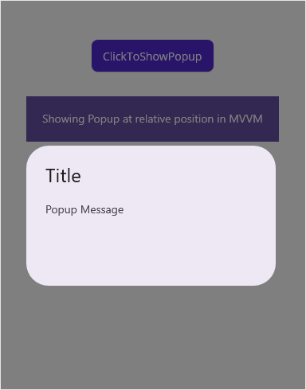
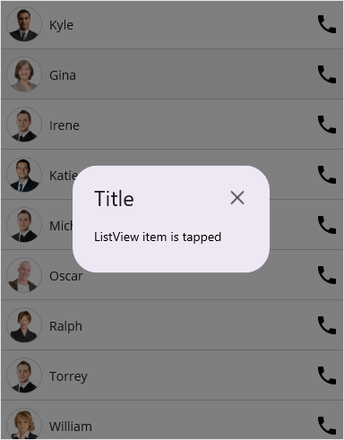

# Popup Positioning in MAUI Popup (SfPopup)

The `SfPopup` allows showing the popup content at various available positions.

Following are the list of options available to show SfPopup at various positions.

<table>
<tr>
<th>Methods / Properties</th>
<th>Description</th></tr>
<tr>
<td>SfPopup.IsOpen</td>
<td>Show the <code>SfPopup</code> at the center.</td></tr>
<tr>
<td>SfPopup.Show</td>
<td>Similar as <code>SfPopup.IsOpen</code> property.</td></tr>
<tr>
<td>SfPopup.Show(x-position, y-position)</td>
<td>Show the <code>SfPopup</code> at the specified X and y positions.</td></tr>
<tr>
<td>SfPopup.ShowRelativeToView(View, RelativePosition)</td>
<td>Show the <code>SfPopup</code> at the position relative to the specified view.</td></tr>
<tr>
<td>SfPopup.ShowRelativeToView(View, RelativePosition, x-position, y-position)</td>
<td>Show the <code>SfPopup</code> at an absolute x, y coordinate from the relative position of the specified view.</td></tr>
<tr>
<td>SfPopup.IsFullScreen</td>
<td>Show the <code>SfPopup</code> in full width and height of the screen.</td></tr>
<tr>
<td>SfPopup.Show(bool)</td>
<td>Similar as <code>SfPopup.IsFullScreen</code> property.</td></tr>
</table>

## Center positioning

The `SfPopup` can be shown at the center by using the following options.

 * IsOpen property
 * SfPopup.Show

To open the `SfPopup`, use the `SfPopup.IsOpen` property as in the following code sample.



<ContentPage xmlns="http://schemas.microsoft.com/dotnet/2021/maui"
             xmlns:x="http://schemas.microsoft.com/winfx/2009/xaml"
             xmlns:sfPopup="clr-namespace:Syncfusion.Maui.Popup;assembly=Syncfusion.Maui.Popup"
             x:Class="PopupMauiPositioning.MainPage">
  <ContentPage.Content>
    <StackLayout Padding="20">
      <Button x:Name="clickToShowPopup" Text="ClickToShowPopup" 
              VerticalOptions="Start" HorizontalOptions="Center" 
              Clicked="ClickToShowPopup_Clicked" />
      <sfPopup:SfPopup x:Name="sfPopup">
      </sfPopup:SfPopup>
    </StackLayout>
  </ContentPage.Content>
</ContentPage>


private void ClickToShowPopup_Clicked(object sender, EventArgs e)
{
  // Shows SfPopup at the center of the view.
  sfPopup.IsOpen = true;
}



To open the SfPopup, use the `SfPopup.Show` method as in the following code sample.



<ContentPage xmlns="http://schemas.microsoft.com/dotnet/2021/maui"
             xmlns:x="http://schemas.microsoft.com/winfx/2009/xaml"
             xmlns:sfPopup="clr-namespace:Syncfusion.Maui.Popup;assembly=Syncfusion.Maui.Popup"
             x:Class="PopupMauiPositioning.MainPage">
  <ContentPage.Content>
    <StackLayout Padding="20">
      <Button x:Name="clickToShowPopup" Text="ClickToShowPopup" 
              VerticalOptions="Start" HorizontalOptions="Center" 
              Clicked="ClickToShowPopup_Clicked" />
      <sfPopup:SfPopup x:Name="sfPopup">
      </sfPopup:SfPopup>
    </StackLayout>
  </ContentPage.Content>
</ContentPage>


private void ClickToShowPopup_Clicked(object sender, EventArgs e)
{
  // Shows SfPopup at the center of the view.
  sfPopup.Show();
}



## Absolute positioning

To open the `SfPopup` in specific X and Y coordinates, use the `SfPopup.Show(x-position, y-position)` method as in the following code sample.



<ContentPage xmlns="http://schemas.microsoft.com/dotnet/2021/maui"
             xmlns:x="http://schemas.microsoft.com/winfx/2009/xaml"
             xmlns:sfPopup="clr-namespace:Syncfusion.Maui.Popup;assembly=Syncfusion.Maui.Popup"
             x:Class="PopupMauiPositioning.MainPage">
  <ContentPage.Content>
    <StackLayout Padding="20">
      <Button x:Name="clickToShowPopup" Text="ClickToShowPopup" 
              VerticalOptions="Start" HorizontalOptions="Center" 
              Clicked="ClickToShowPopup_Clicked" />
      <sfPopup:SfPopup x:Name="sfPopup">
      </sfPopup:SfPopup>
    </StackLayout>
  </ContentPage.Content>
</ContentPage>


private void ClickToShowPopup_Clicked(object sender, EventArgs e)
{
  // Shows SfPopup at x-position 50 and y position 200.
  sfPopup.Show(50, 200);
}



## Relative positioning

`SfPopup` can be shown at the relative position by using the following method.

### Display popup relative to a view

To open the `SfPopup` relative to a view, use the `SfPopup.ShowRelativeToView(View, RelativePosition)` method.



<ContentPage.Content>       
  <StackLayout VerticalOptions="Start" HorizontalOptions="Center" Padding="20">
    <Button x:Name="clickToShowPopup" Text="ClickToShowPopup"
            VerticalOptions="Start" HorizontalOptions="Start"
            Clicked="ClickToShowPopup_Clicked" />   
    <sfPopup:SfPopup x:Name="sfPopup">
    </sfPopup:SfPopup>
  </StackLayout>
</ContentPage.Content>


private void ClickToShowPopup_Clicked(object sender, EventArgs e)
{
  // Shows SfPopup at the bottom of the button.
  sfPopup.ShowRelativeToView(clickToShowPopup, PopupRelativePosition.AlignBottom);
}



### Display popup relatively to a view with absolute coordinates

The `SfPopup` can be displayed at an absolute x, y coordinate from the relative position of the specified view by using the following method.

To open the `SfPopup` in the specific x and y coordinate relative to a view, use the `SfPopup.ShowRelativeToView(View, RelativePosition, x-position, y-position)` method.



<ContentPage.Content>       
  <StackLayout VerticalOptions="Start" HorizontalOptions="Start" Padding="20">
    <Button x:Name="clickToShowPopup" Text="ClickToShowPopup"
            VerticalOptions="Center" HorizontalOptions="Start"
            Clicked="ClickToShowPopup_Clicked" />
    <sfPopup:SfPopup x:Name="sfPopup">
    </sfPopup:SfPopup>
  </StackLayout>
</ContentPage.Content>


private void ClickToShowPopup_Clicked(object sender, EventArgs e)
{
  // Show the SfPopup at the bottom of the button and with an absolute relative position.
  sfPopup.ShowRelativeToView(clickToShowPopup, PopupRelativePosition.AlignBottom, 50, 50);
}



You can pass both negative and positive values as parameters to the `SfPopup.ShowRelativeToView(View, RelativePosition, x-position, y-position)`. The popup will be positioned by considering the relative position as (0, 0) the center point. For example, if you have set the `RelativePosition` as `PopupRelativePosition.AlignBottomRight` and `RelativeView` as a button, bottom right corner of the button will be considered as the 0, 0 point and a negative x-position value will place the popup to the left of that point and a positive x-position value will place the popup to the right of that point. The same applies for y-position also.

### Show relative to view in MVVM

To open the SfPopup relative to a view in MVVM assign values to the `SfPopup.RelativeView` and `SfPopup.RelativePosition` properties and use the `SfPopup.IsOpen` property to open or close the popup using binding.



<ContentPage xmlns="http://schemas.microsoft.com/dotnet/2021/maui"
             xmlns:x="http://schemas.microsoft.com/winfx/2009/xaml"
             xmlns:sfPopup="clr-namespace:Syncfusion.Maui.Popup;assembly=Syncfusion.Maui.Popup"
             xmlns:local="clr-namespace:PopupMauiPositioning"
             x:Class="PopupMauiPositioning.MainPage">
  <ContentPage.BindingContext>
    <local:ViewModel/>
  </ContentPage.BindingContext>
  <ContentPage.Content>       
    <StackLayout>
      <Button x:Name="clickToShowPopup" Text="ClickToShowPopup" Margin="0,30,0,30"
              HorizontalOptions="Center"
              Clicked="ClickToShowPopup_Clicked" />
      <Label x:Name="relativeView" Text="Showing Popup at relative position in MVVM" 
             VerticalOptions="StartAndExpand" HorizontalOptions="Center" 
             HorizontalTextAlignment="Center" FontFamily="Roboto" Padding="20"
             LineBreakMode="WordWrap" FontSize="14" BackgroundColor="#6750A4" TextColor="White"/>
      <sfPopup:SfPopup x:Name="sfPopup" 
                       IsOpen="{Binding DisplayPopup}"
                       RelativeView="{x:Reference relativeView}" RelativePosition="AlignBottom"
                       AbsoluteX="0" AbsoluteY="5">
      </sfPopup:SfPopup>
    </StackLayout>
  </ContentPage.Content>
</ContentPage>

 
private void ClickToShowPopup_Clicked(object sender, EventArgs e)
{
  // Show the SfPopup at the bottom of the label and with absolute relative position.
  (this.BindingContext as ViewModel).DisplayPopup = true;	
}





public class ViewModel : INotifyPropertyChanged
{
  private bool displayPopup;
  public bool DisplayPopup
  {
      get { return displayPopup; }
      set { displayPopup = value; RaisePropertyChanged("DisplayPopup"); }
  }
  public ViewModel()
  {
      this.DisplayPopup = false;
  }
  public void RaisePropertyChanged(string propName)
  {
      if (this.PropertyChanged != null)
          this.PropertyChanged(this, new PropertyChangedEventArgs(propName));
  }
  public event PropertyChangedEventHandler PropertyChanged;
}



## How to

### Load the SfPopup in CellTappedEvent of the SfDataGrid

The `SfPopup` allows opening it in the `CellTapped` event of the `SfDataGrid`.



<ContentPage xmlns="http://schemas.microsoft.com/dotnet/2021/maui"
             xmlns:x="http://schemas.microsoft.com/winfx/2009/xaml"
             xmlns:sfDatagrid="clr-namespace:Syncfusion.Maui.DataGrid;assembly=Syncfusion.Maui.DataGrid"
             xmlns:sfPopup="clr-namespace:Syncfusion.Maui.Popup;assembly=Syncfusion.Maui.Popup"
             xmlns:local="clr-namespace:PopupMauiPositioning"
             x:Class="PopupMauiPositioning.MainPage">
  <ContentPage.BindingContext>
    <local:ViewModel x:Name="viewModel" />
  </ContentPage.BindingContext>  
  <ContentPage.Content>
    <Grid>
      <sfDatagrid:SfDataGrid x:Name="dataGrid"
                             ItemsSource="{Binding OrdersInfo}"
                             CellTapped="OnDataGridCellTapped"    
                             ColumnWidthMode="Fill">
      </sfDatagrid:SfDataGrid>
      <sfPopup:SfPopup x:Name="sfPopup" 
                       HeaderTitle="Popup" 
                       AutoSizeMode="Height"
                       ShowCloseButton="True">
        <sfPopup:SfPopup.ContentTemplate>
          <DataTemplate>
            <Label Text="A pop-up is a graphical user interface display area that suddenly appears in the foreground of the visual interface. Pop-up can be initiated by single or double tap or can simply be timed to occur. A pop-up window should be smaller than the background window or interface; otherwise, its a replacement interface."                               
                   TextColor="Black" 
                   FontSize="14" 
                   FontFamily="Roboto" 
                   Padding="0,0,0,24" />
          </DataTemplate>
        </sfPopup:SfPopup.ContentTemplate>
      </sfPopup:SfPopup>
    </Grid>
  </ContentPage.Content> 
</ContentPage>

 
namespace PopupMauiPositioning;
using Syncfusion.Maui.DataGrid;
using Syncfusion.Maui.Popup;

public partial class MainPage : ContentPage
{
  SfDataGrid dataGrid;
  ViewModel viewModel;
  SfPopup sfPopup;

  public MainPage()
  {
    InitializeComponent();
    dataGrid = new SfDataGrid();
    viewModel = new ViewModel();
    dataGrid.ItemsSource = viewModel.OrdersInfo;
    dataGrid.CellTapped += OnDataGridCellTapped;
    dataGrid.ColumnWidthMode = ColumnWidthMode.Fill;

    sfPopup = new SfPopup();
    sfPopup.HeaderTitle = "Popup";
    sfPopup.ShowCloseButton = true;
    sfPopup.AutoSizeMode = PopupAutoSizeMode.Height;
    sfPopup.ContentTemplate = new DataTemplate(() =>
    {
        var label = new Label();
        label.Text = "A pop-up is a graphical user interface display area that suddenly appears in the foreground of the visual interface. Pop-up can be initiated by single or double tap or can simply be timed to occur. A pop-up window should be smaller than the background window or interface; otherwise, its a replacement interface.";
        label.TextColor = Colors.Black;
        label.FontSize = 14;
        label.FontFamily = "Roboto";
        label.Padding = new Thickness(0, 0, 0, 24);
        return label;
    });
    this.Content = dataGrid;
  }  
}





private void OnDataGridCellTapped(object sender, Syncfusion.Maui.DataGrid.DataGridCellTappedEventArgs e)
{
  sfPopup.Show();
}



Download the entire source code from GitHub [here](https://github.com/SyncfusionExamples/how-to-show-a-.net-maui-popup-when-tap-.net-maui-datagrid-cell).

### Open SfPopup in ItemTapped event of SfListView

The `SfPopup` allows opening it in the `ItemTapped` event of the `SfListView`.



<ContentPage xmlns="http://schemas.microsoft.com/dotnet/2021/maui"
             xmlns:x="http://schemas.microsoft.com/winfx/2009/xaml"
             xmlns:sfListView="clr-namespace:Syncfusion.Maui.ListView;assembly=Syncfusion.Maui.ListView"
             xmlns:sfPopup="clr-namespace:Syncfusion.Maui.Popup;assembly=Syncfusion.Maui.Popup"
             xmlns:local="clr-namespace:PopupMauiPositioning"
             x:Class="PopupMauiPositioning.MainPage">
  <ContentPage.BindingContext>
    <local:ContactsViewModel x:Name="viewModel" />
  </ContentPage.BindingContext>  
  <ContentPage.Content>
    <Grid>
      <sfListView:SfListView x:Name="listView" ItemSize="56"
                             ItemsSource="{Binding Items}" 
                             SelectionMode="None"
                             ItemTapped="OnListViewItemTapped">
        <sfListView:SfListView.ItemTemplate>
          <DataTemplate>
            <Grid x:Name="grid">
              <Grid.RowDefinitions>
                  <RowDefinition Height="*" />
                  <RowDefinition Height="1"/>
              </Grid.RowDefinitions>
              <Grid.ColumnDefinitions>
                  <ColumnDefinition Width="56" />
                  <ColumnDefinition Width="*" />
                  <ColumnDefinition Width="*" />
              </Grid.ColumnDefinitions>
              <Image Source="{Binding ContactImage}"
                     VerticalOptions="Center"
                     HorizontalOptions="Center"
                     HeightRequest="40"
                     WidthRequest="40"/>
              <Label Grid.Column="1"
                     VerticalTextAlignment="Center"
                     LineBreakMode="NoWrap"
                     Text="{Binding ContactName}" 
                     FontSize="14" />
              <Image Grid.Column="2"
                     Source="{Binding ContactType}"
                     VerticalOptions="Center"
                     HorizontalOptions="End"
                     HeightRequest="20"
                     WidthRequest="20" Margin="0,0,8,0"/>
              <StackLayout BackgroundColor="LightGray" 
                           HeightRequest="1" 
                           Grid.Row="1" Grid.ColumnSpan="3"/>
            </Grid>
          </DataTemplate>
        </sfListView:SfListView.ItemTemplate>
      </sfListView:SfListView>
      <sfPopup:SfPopup x:Name="sfPopup" 
                       WidthRequest="220" HeightRequest="120"
                       ShowCloseButton="True">
        <sfPopup:SfPopup.ContentTemplate>
          <DataTemplate>
            <Label Text="ListView item is tapped"                           
                   TextColor="Black"
                   FontSize="14"
                   FontFamily="Roboto"/>
          </DataTemplate>
        </sfPopup:SfPopup.ContentTemplate>
      </sfPopup:SfPopup>
    </Grid>
  </ContentPage.Content> 
</ContentPage>

 
namespace PopupMauiPositioning;
using Syncfusion.Maui.ListView;
using Syncfusion.Maui.Popup;

public partial class MainPage : ContentPage
{
  SfListView listView;
  ContactsViewModel viewModel;
  SfPopup sfPopup;

  public MainPage()
  {
    InitializeComponent();  
    listView = new SfListView();
    listView.ItemTemplate = new DataTemplate(() =>
    {
      var grid = new Grid();
      grid.ColumnDefinitions.Add(new ColumnDefinition() { Width = 56 });
      grid.ColumnDefinitions.Add(new ColumnDefinition() { Width = GridLength.Star });
      grid.ColumnDefinitions.Add(new ColumnDefinition() { Width = GridLength.Star });
      grid.RowDefinitions.Add(new RowDefinition() { Height = GridLength.Star });
      grid.RowDefinitions.Add(new RowDefinition() { Height = 1 });
      
      var contactImage = new Image()
      {
          VerticalOptions = LayoutOptions.Center,
          HorizontalOptions = LayoutOptions.Center,
          HeightRequest = 40,
          WidthRequest = 40
      };
      contactImage.SetBinding(Image.SourceProperty, new Binding("ContactImage"));
      var contactName = new Label()
      {
          VerticalTextAlignment = TextAlignment.Center,
          LineBreakMode = LineBreakMode.NoWrap,
          FontSize = 14
      };
      contactName.SetBinding(Label.TextProperty, new Binding("ContactName"));
      var contactType = new Image()
      {
          VerticalOptions = LayoutOptions.Center,
          HorizontalOptions = LayoutOptions.End,
          HeightRequest = 20,
          WidthRequest = 20,
          Margin = new Thickness(0, 0, 8, 0)
      };
      contactType.SetBinding(Image.SourceProperty, new Binding("ContactType"));
      var stackLayout = new StackLayout()
      {
          BackgroundColor = Colors.LightGray,
          HeightRequest = 1,                
      };      
      grid.Children.Add(contactImage);
      Grid.SetColumn(contactImage, 0);
      Grid.SetRow(contactImage, 0);
      grid.Children.Add(contactName);
      Grid.SetColumn(contactName, 1);
      Grid.SetRow(contactName, 0);
      grid.Children.Add(contactType);
      Grid.SetColumn(contactType, 2);
      Grid.SetRow(contactType, 0);
      grid.Children.Add(stackLayout);
      Grid.SetColumn(stackLayout, 0);
      Grid.SetRow(stackLayout, 1);
      Grid.SetColumnSpan(stackLayout, 3);
      return grid;
    });
    viewModel = new ContactsViewModel();
    listView.ItemsSource = viewModel.Items;
    listView.ItemSize = 56;
    listView.SelectionMode = Syncfusion.Maui.ListView.SelectionMode.None;
    listView.ItemTapped += OnListViewItemTapped;
    sfPopup = new SfPopup();
    sfPopup.WidthRequest = 220;
    sfPopup.HeightRequest = 120; ;
    sfPopup.ShowCloseButton = true;
    sfPopup.ContentTemplate = new DataTemplate(() =>
    {
      return new Label()
      {
        Text = "ListView item is tapped",
        FontSize = 14,
        TextColor = Colors.Black,
        FontFamily = "Roboto"
      };
    });        
    this.Content = listView;  
  }  
}





private void OnListViewItemTapped(object sender, Syncfusion.Maui.ListView.ItemTappedEventArgs e)
{
  sfPopup.Show();
}



Download the entire source code from GitHub [here](https://github.com/SyncfusionExamples/how-to-show-a-.net-maui-popup-when-tap-.net-maui-listview-item).

### Display popup when interacting with a switch

`SfPopup.IsOpen` is a bindable property and hence can be binded to any property and based on its value the popup will open or close. In the below code example, we have binded the `IsOpen` property with the `IsToggled` property of the the switch and the popup will be opened or closed as the switch toggles.



<ContentPage xmlns="http://schemas.microsoft.com/dotnet/2021/maui"
             xmlns:x="http://schemas.microsoft.com/winfx/2009/xaml"             
             xmlns:sfPopup="clr-namespace:Syncfusion.Maui.Popup;assembly=Syncfusion.Maui.Popup"            
             x:Class="PopupMauiPositioning.MainPage">
  <ContentPage.Content>
    <StackLayout Padding="20">
      <Switch x:Name="popupSwitch" 
              IsToggled="False" 
              VerticalOptions="Start" HorizontalOptions="Center"/>
      <sfPopup:SfPopup x:Name="sfPopup"
                       IsOpen="{Binding Source={x:Reference popupSwitch},Path=IsToggled}"/>
    </StackLayout>
  </ContentPage.Content>
</ContentPage>

