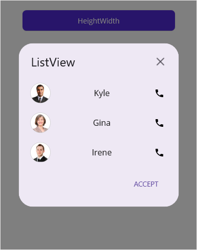
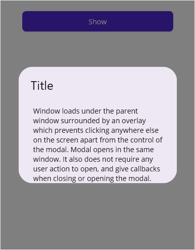
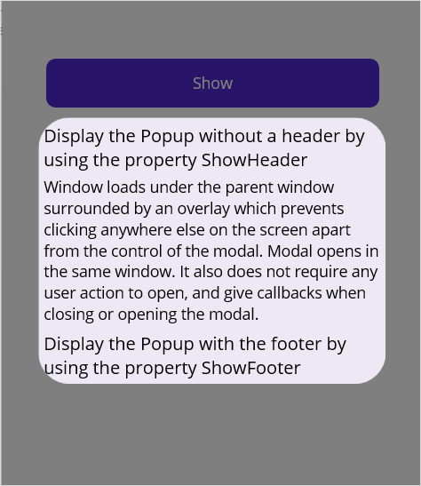

# Popup size in .NET Maui Popup (SfPopup)

The SfPopup allows the display of the Popup at any desired width and height by setting the `SfPopup.WidthRequest` and `SfPopup.HeightRequest`. The Popup size can also be changed by setting the width request and height request to the views loaded inside the templates of the Popup.

In the following code snippet the Popup is loaded in 320x320 pixels, where width request is set for the ListView that is loaded as template content and height request is set for the `PopupView`.



<?xml version="1.0" encoding="utf-8" ?>
<ContentPage xmlns="http://schemas.microsoft.com/dotnet/2021/maui"
             xmlns:x="http://schemas.microsoft.com/winfx/2009/xaml"
             x:Class="PopupMaui.HeightWidthPage"
             xmlns:local="clr-namespace:PopupMaui"
             xmlns:listView="clr-namespace:Syncfusion.Maui.ListView;assembly=Syncfusion.Maui.ListView"
             xmlns:popup="clr-namespace:Syncfusion.Maui.Popup;assembly=Syncfusion.Maui.Popup">
    <ContentPage.BindingContext>
        <local:ContactsViewModel x:Name="viewModel"/>
    </ContentPage.BindingContext>
    <ContentPage.Content>
        <StackLayout Padding="20">
            <Button x:Name="heightWidth" Text="HeightWidth" Clicked="heightWidth_Clicked" WidthRequest="300"/>
            <popup:SfPopup x:Name="popup" HeaderTitle="ListView"
             HeightRequest="320" 
             ShowCloseButton="True" 
             ShowFooter="True">
                <popup:SfPopup.ContentTemplate>
                    <DataTemplate>
                        <listView:SfListView  x:Name="listView"  
                        ScrollBarVisibility="Never" 
                        ItemSpacing="5"
                        WidthRequest="320" 
                        ItemsSource="{Binding contactsinfo}">
                          .......
                        </listView:SfListView>
                    </DataTemplate>
                </popup:SfPopup.ContentTemplate>
            </popup:SfPopup>
        </StackLayout>
    </ContentPage.Content>
</ContentPage>




using Syncfusion.Maui.ListView;
using Syncfusion.Maui.Popup;
namespace PopupMaui
{
    public partial class MainPage : ContentPage
    {
         SfListView listView;
        ContactsViewModel viewModel;
        SfPopup popup;
        public MainPage()
        {
            InitializeComponent();
            listView = new SfListView() { ItemSpacing = 5 };
            listView.WidthRequest = 350;
            listView.ScrollBarVisibility = ScrollBarVisibility.Never;
            listView.ItemTemplate = new DataTemplate(() =>
            {
                .......
            });
            viewModel = new ContactsViewModel();
            listView.ItemsSource = viewModel.contactsinfo;
            popup = new SfPopup();
            popup.HeaderTitle = "ListView";
            popup.HeightRequest = 320;
            popup.ContentTemplate = new DataTemplate(() =>
            {
                return listView;
            });
            StackLayout stackLayout = new StackLayout();
            Button heightWidth = new Button();
            heightWidth.Clicked += heightWidth_Clicked;
            heightWidth.Text = "Click to show popup";
            stackLayout.Children.Add(heightWidth);
            this.Content = popup;
        }

        private void heightWidth_Clicked(object sender, EventArgs e)
        {
            popup.Show();
        }
    }
}




## Full screen

The SfPopup can be shown in full width and height of the screen using,

  * [IsFullScreen](https://help.syncfusion.com/cr/maui/Syncfusion.Maui.Popup.SfPopup.html#Syncfusion_Maui_Popup_SfPopup_IsFullScreen)
  * [Show(bool isFullScreen)](https://help.syncfusion.com/cr/maui/Syncfusion.Maui.Popup.SfPopup.html#Syncfusion_Maui_Popup_SfPopup_Show_System_Boolean_)

Refer to the following code example to open the popup in full screen.


<?xml version="1.0" encoding="utf-8" ?>
<ContentPage xmlns="http://schemas.microsoft.com/dotnet/2021/maui"
             xmlns:x="http://schemas.microsoft.com/winfx/2009/xaml"
             x:Class="PopupMaui.FullScreenPage"
             xmlns:local="clr-namespace:PopupMaui"
             xmlns:inputLayout="clr-namespace:Syncfusion.Maui.Core;assembly=Syncfusion.Maui.Core"
             xmlns:popup="clr-namespace:Syncfusion.Maui.Popup;assembly=Syncfusion.Maui.Popup">
    <ContentPage.Content>
        <StackLayout Padding="20">
            <Button x:Name="show" Text="Show Popup" Clicked="show_Clicked"/>
            <popup:SfPopup x:Name="popup" AppearanceMode="TwoButton" AcceptButtonText="SAVE"  DeclineButtonText="CANCEL" ShowCloseButton="True" ShowFooter="True">
                <popup:SfPopup.HeaderTemplate>
                    <DataTemplate>
                        <Label Text="ADD EVENT" VerticalTextAlignment="Center" FontSize="18" HorizontalTextAlignment="Start" FontAttributes="Bold"/>
                    </DataTemplate>
                </popup:SfPopup.HeaderTemplate>
                <popup:SfPopup.ContentTemplate>
                .......
                </popup:SfPopup.ContentTemplate>
                <popup:SfPopup.PopupStyle>
                    <popup:PopupStyle CornerRadius="0"/>
                </popup:SfPopup.PopupStyle>
            </popup:SfPopup>
        </StackLayout>
    </ContentPage.Content>
</ContentPage>




using Syncfusion.Maui.Popup;
namespace PopupMaui
{
    public partial class MainPage : ContentPage
    {
        public MainPage()
        {
            InitializeComponent();
        }

        private void show_Clicked(object sender, EventArgs e)
        {
            // Show the SfPopup in full width and height of the screen using the SfPopup.IsFullScreen property.
            popup.IsFullScreen = true;
            popup.IsOpen = true;
            
            // Show the SfPopup in full width and height of the screen using the SfPopup.IsFullScreen property.
            // popup.Show(true);
        }
    }
}


Executing the above codes renders the following output in windows.

## Auto-size popup

The [SfPopup](https://help.syncfusion.com/cr/maui/Syncfusion.Maui.Popup.SfPopup.html) can auto-size the popup view based on the contents loaded inside its templates using the [AutoSizeMode](https://help.syncfusion.com/cr/maui/Syncfusion.Maui.Popup.PopupAutoSizeMode.html) and `PopupAutoSizeTarget` properties. The default value is [AutoSizeMode.None](https://help.syncfusion.com/cr/maui/Syncfusion.Maui.Popup.PopupAutoSizeMode.html#Syncfusion_Maui_Popup_PopupAutoSizeMode_None). You can choose to auto-size the Popup in the height, width or in both (height and width) of its contents. By default, the `HeightRequest` and `WidthRequest` set to the `SfPopup` or the views loaded inside the template are given higher priority than the `AutoSizeMode`.

### PopupAutoSizeTarget
The `PopupAutoSizeTarget` property specifies which template(s) should be considered for auto-sizing. The default value is `PopupAutoSizeTarget.Content`.

* `Content`: Auto-sizes based on the content template.
* `Header`: Auto-sizes based on the header template.
* `Footer`: Auto-sizes based on the footer template.
* `All`: Auto-sizes based on header, content, and footer templates.

To auto-size the popup using any two templates, use the following code example:


<ContentPage xmlns:popup="clr-namespace:Syncfusion.Maui.Popup;assembly=Syncfusion.Maui.Popup">
  <popup:SfPopup x:Name="popup" 
                 AutoSizeMode="Both"
                 AutoSizeTarget="Header,Footer" />
</ContentPage>


popup.AutoSizeMode = PopupAutoSizeMode.Both;
popup.AutoSizeTarget= Syncfusion.Maui.Popup.PopupAutoSizeTarget.Header | Syncfusion.Maui.Popup.PopupAutoSizeTarget.Footer;



In the following code sample, the Popup is auto-sized in the height based on the content loaded inside the [ContentTemplate](https://help.syncfusion.com/cr/maui/Syncfusion.Maui.Popup.SfPopup.html#Syncfusion_Maui_Popup_SfPopup_ContentTemplate) property.



<?xml version="1.0" encoding="utf-8" ?>
<ContentPage xmlns="http://schemas.microsoft.com/dotnet/2021/maui"
             xmlns:x="http://schemas.microsoft.com/winfx/2009/xaml"
             x:Class="PopupMaui.AutoSizePage"
              xmlns:popup="clr-namespace:Syncfusion.Maui.Popup;assembly=Syncfusion.Maui.Popup">
    <ContentPage.Content>
        <StackLayout Padding="20">
            <Button x:Name="show" Text="Show" WidthRequest="300" ShowFooter="True" Clicked="show_Clicked"/>
            <popup:SfPopup x:Name="popup" 
                           AutoSizeMode="Height">
                <popup:SfPopup.ContentTemplate>
                    <DataTemplate>
                        <StackLayout Padding="5,5,5,0">
                            <Label Text="Window loads under the parent window surrounded by an overlay which prevents clicking anywhere else on the screen apart from the control of the modal. Modal opens in the same window. It also does not require any user action to open, and give callbacks when closing or opening the modal."
                                   FontSize="14"
                            LineBreakMode="WordWrap"/>
                        </StackLayout>
                    </DataTemplate>
                </popup:SfPopup.ContentTemplate>
            </popup:SfPopup>
        </StackLayout>
    </ContentPage.Content>
</ContentPage>



popup.AutoSizeMode = PopupAutoSizeMode.Height;




Executing the above codes renders the following output in windows.

In the following code sample, the Popup is auto-sized in the height based on the content loaded inside the [HeaderTemplate](https://help.syncfusion.com/cr/maui/Syncfusion.Maui.Popup.SfPopup.html#Syncfusion_Maui_Popup_SfPopup_HeaderTemplate), [ContentTemplate](https://help.syncfusion.com/cr/maui/Syncfusion.Maui.Popup.SfPopup.html#Syncfusion_Maui_Popup_SfPopup_ContentTemplate), [FooterTemplate](https://help.syncfusion.com/cr/maui/Syncfusion.Maui.Popup.SfPopup.html#Syncfusion_Maui_Popup_SfPopup_FooterTemplate) properties.



<?xml version="1.0" encoding="utf-8" ?>
<ContentPage xmlns="http://schemas.microsoft.com/dotnet/2021/maui"
             xmlns:x="http://schemas.microsoft.com/winfx/2009/xaml"
             x:Class="PopupMaui.AutoSizePage"
              xmlns:popup="clr-namespace:Syncfusion.Maui.Popup;assembly=Syncfusion.Maui.Popup">
    <ContentPage.Content>
        <StackLayout Padding="20">
    <Button x:Name="show" Text="Show" WidthRequest="300" Clicked="show_Clicked"/>
    <popup:SfPopup x:Name="popup"
                   ShowFooter="True" 
                   AutoSizeMode="Height" 
                   AutoSizeTarget="All">

        <popup:SfPopup.HeaderTemplate>
            <DataTemplate>
                <StackLayout Padding="5,5,5,0">
                <Label Text="Display the Popup without a header by using the property ShowHeader" 
                       FontSize="16"/>
                </StackLayout>
            </DataTemplate>
        </popup:SfPopup.HeaderTemplate>

        <popup:SfPopup.ContentTemplate>
            <DataTemplate>
                <StackLayout Padding="5,5,5,5">
                    <Label Text="Window loads under the parent window surrounded by an overlay which prevents clicking anywhere else on the screen apart from the       control of the modal. Modal opens in the same window. It also does not require any user action to open, and give callbacks when closing or opening the modal."
                          FontSize="14"
                LineBreakMode="WordWrap"/>
                </StackLayout>
            </DataTemplate>
        </popup:SfPopup.ContentTemplate>

        <popup:SfPopup.FooterTemplate>
            <DataTemplate>
                <StackLayout Padding="5,0,5,5">
                <Label Text="Display the Popup with the footer by using the property ShowFooter" 
                       FontSize="16"/>
                </StackLayout>
            </DataTemplate>
        </popup:SfPopup.FooterTemplate>

    </popup:SfPopup>
</StackLayout>
    </ContentPage.Content>
</ContentPage>



popup.AutoSizeMode = PopupAutoSizeMode.Height;
popup.AutoSizeTarget = Syncfusion.Maui.Popup.PopupAutoSizeTarget.All;



Executing the above codes renders the following output in windows.

