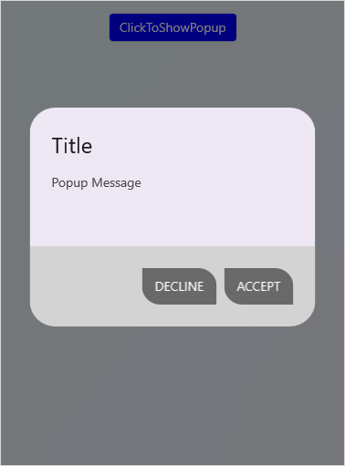
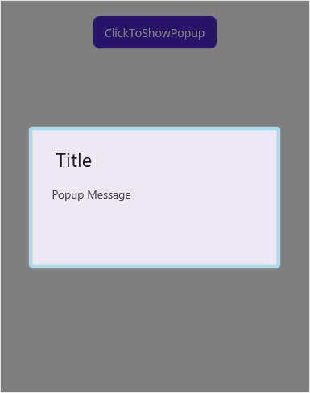
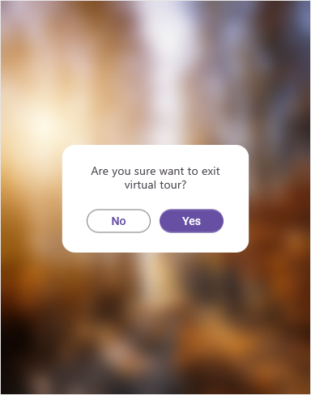

---
layout: post
title: Styles in .NET MAUI Popup control | Syncfusion
description: Learn about Styles support in Syncfusion .NET MAUI Popup (SfPopup) control, its elements, and more.
platform: MAUI
control: SfPopup
documentation: ug
--- 

# Styles in .NET MAUI Popup (SfPopup)

The `SfPopup` applies style to all of its elements by using the [PopupStyle](https://help.syncfusion.com/cr/maui/Syncfusion.Maui.Popup.PopupStyle.html) property.

## Styling popup header

The `SfPopup` allows customizing the header appearance using the following properties.

<table>
<tr>
<th> Property </th>
<th> Description </th>
</tr>
<tr>
<td> {{'[HeaderBackground](https://help.syncfusion.com/cr/maui/Syncfusion.Maui.Popup.PopupStyle.html#Syncfusion_Maui_Popup_PopupStyle_HeaderBackground)'| markdownify }} </td>
<td> Gets or sets the background color for the header.</td>
</tr>
<tr>
<td> {{'[HeaderFontAttribute](https://help.syncfusion.com/cr/maui/Syncfusion.Maui.Popup.PopupStyle.html#Syncfusion_Maui_Popup_PopupStyle_HeaderFontAttribute)'| markdownify }} </td>
<td> Gets or sets the font attribute for the header title.</td>
</tr>
<tr>
<td> {{'[HeaderFontFamily](https://help.syncfusion.com/cr/maui/Syncfusion.Maui.Popup.PopupStyle.html#Syncfusion_Maui_Popup_PopupStyle_HeaderFontFamily)'| markdownify }} </td>
<td> Gets or sets the font style for the header title.</td>
</tr>
<tr>
<td> {{'[HeaderFontSize](https://help.syncfusion.com/cr/maui/Syncfusion.Maui.Popup.PopupStyle.html#Syncfusion_Maui_Popup_PopupStyle_HeaderFontSize)'| markdownify }} </td>
<td> Gets or sets the font size for the header title.</td>
</tr>
<tr>
<td> {{'[HeaderTextAlignment](https://help.syncfusion.com/cr/maui/Syncfusion.Maui.Popup.PopupStyle.html#Syncfusion_Maui_Popup_PopupStyle_HeaderTextAlignment)'| markdownify }} </td>
<td> Gets or sets the text alignment for the header.</td>
</tr>
<tr>
<td> {{'[HeaderTextColor](https://help.syncfusion.com/cr/maui/Syncfusion.Maui.Popup.PopupStyle.html#Syncfusion_Maui_Popup_PopupStyle_HeaderTextColor)'| markdownify }} </td>
<td> Gets or sets the text color to be applied for the header title.</td>
</tr>
</table>

Refer to the following code example for customizing the header elements.



<sfPopup:SfPopup x:Name="popup" >
    <sfPopup:SfPopup.PopupStyle>
        <sfPopup:PopupStyle HeaderBackground="DimGray"
                            HeaderFontAttribute="Bold"
                            HeaderFontFamily="Roboto-Medium"
                            HeaderFontSize="25"
                            HeaderTextAlignment="Center"
                            HeaderTextColor="White"/>
    </sfPopup:SfPopup.PopupStyle>
</sfPopup:SfPopup>


public partial class MainPage : ContentPage
{
    SfPopup popup;
    public MainPage()
    {
        InitializeComponent();
        popup = new SfPopup();
        popup.PopupStyle.HeaderBackground = Color.FromRgb(105,105,105);
        popup.PopupStyle.HeaderFontAttribute = FontAttributes.Bold;
        popup.PopupStyle.HeaderFontFamily = "Roboto-Medium";
        popup.PopupStyle.HeaderFontSize = 25;
        popup.PopupStyle.HeaderTextAlignment = TextAlignment.Center;
        popup.PopupStyle.HeaderTextColor = Color.White;
    }
}



## Styling popup footer

The SfPopup allows customizing the footer appearance using the following properties.

<table>
<tr>
<th> Property </th>
<th> Description </th>
</tr>
<tr>
<td> {{'[FooterBackground](https://help.syncfusion.com/cr/maui/Syncfusion.Maui.Popup.PopupStyle.html#Syncfusion_Maui_Popup_PopupStyle_FooterBackground)'| markdownify }} </td>
<td> Gets or sets the background color for the footer.</td>
</tr>
<tr>
<td> {{'[AcceptButtonBackground](https://help.syncfusion.com/cr/maui/Syncfusion.Maui.Popup.PopupStyle.html#Syncfusion_Maui_Popup_PopupStyle_AcceptButtonBackground)'| markdownify }} </td>
<td> Gets or sets the background color for the Accept button in the footer.</td>
</tr>
<tr>
<td> {{'[AcceptButtonTextColor](https://help.syncfusion.com/cr/maui/Syncfusion.Maui.Popup.PopupStyle.html#Syncfusion_Maui_Popup_PopupStyle_AcceptButtonTextColor)'| markdownify }} </td>
<td> Gets or sets the foreground color for the Accept button in the footer.</td>
</tr>
<tr>
<td> {{'[DeclineButtonBackground](https://help.syncfusion.com/cr/maui/Syncfusion.Maui.Popup.PopupStyle.html#Syncfusion_Maui_Popup_PopupStyle_DeclineButtonBackground)'| markdownify }} </td>
<td> Gets or sets the background color for the Decline button in the footer.</td>
</tr>
<tr>
<td> {{'[DeclineButtonTextColor](https://help.syncfusion.com/cr/maui/Syncfusion.Maui.Popup.PopupStyle.html#Syncfusion_Maui_Popup_PopupStyle_DeclineButtonTextColor)'| markdownify }} </td>
<td> Gets or sets the foreground color for the Decline button in the footer.</td>
</tr>
</table>

Refer to the following code example for customizing the footer elements.



<sfPopup:SfPopup x:Name="popup" AppearanceMode="TwoButton" ShowFooter="True" >
    <sfPopup:SfPopup.PopupStyle>
        <sfPopup:PopupStyle FooterBackground="LightGray"
                            AcceptButtonBackground ="DimGray"
                            AcceptButtonTextColor="White"
                            DeclineButtonBackground="DimGray"
                            DeclineButtonTextColor="White" />
    </sfPopup:SfPopup.PopupStyle>
</sfPopup:SfPopup>


public partial class MainPage : ContentPage
{
    SfPopup popup;
    public MainPage()
    {
        InitializeComponent();
        popup = new SfPopup();

        // Setting the AppearanceMode as TwoButton
        popup.ShowFooter = true;
        popup.AppearanceMode = Syncfusion.Maui.Popup.PopupButtonAppearanceMode.TwoButton;

        // Footer customization
        popup.PopupStyle.FooterBackground = Color.LightGray;
        popup.PopupStyle.AcceptButtonBackground = Color.FromRgb(105, 105, 105);
        popup.PopupStyle.AcceptButtonTextColor = Color.White;
        popup.PopupStyle.DeclineButtonBackground = Color.FromRgb(105, 105, 105);
        popup.PopupStyle.DeclineButtonTextColor = Color.White;
    }
}



## Styling popup message

The `SfPopup` allows customizing the message appearance using the following properties.

<table>
<tr>
<th> Property </th>
<th> Description </th>
</tr>
<tr>
<td> {{'[MessageBackground](https://help.syncfusion.com/cr/maui/Syncfusion.Maui.Popup.PopupStyle.html#Syncfusion_Maui_Popup_PopupStyle_MessageBackground)'| markdownify }} </td>
<td> Gets or sets the background color of content.</td>
</tr>
<tr>
<td> {{'[MessageFontAttribute](https://help.syncfusion.com/cr/maui/Syncfusion.Maui.Popup.PopupStyle.html#Syncfusion_Maui_Popup_PopupStyle_MessageFontAttribute)'| markdownify }} </td>
<td> Gets or sets the font attribute to be applied for the content.</td>
</tr>
<tr>
<td> {{'[MessageFontFamily](https://help.syncfusion.com/cr/maui/Syncfusion.Maui.Popup.PopupStyle.html#Syncfusion_Maui_Popup_PopupStyle_MessageFontFamily)'| markdownify }} </td>
<td> Gets or sets the font style to be applied for the content.</td>
</tr>
<tr>
<td> {{'[MessageFontSize](https://help.syncfusion.com/cr/maui/Syncfusion.Maui.Popup.PopupStyle.html#Syncfusion_Maui_Popup_PopupStyle_MessageFontSize)'| markdownify }} </td>
<td> Gets or sets the font size of the content.</td>
</tr>
<tr>
<td> {{'[MessageTextAlignment](https://help.syncfusion.com/cr/maui/Syncfusion.Maui.Popup.PopupStyle.html#Syncfusion_Maui_Popup_PopupStyle_MessageTextAlignment)'| markdownify }} </td>
<td> Gets or sets the text alignment of the content.</td>
</tr>
<tr>
<td> {{'[MessageTextColor](https://help.syncfusion.com/cr/maui/Syncfusion.Maui.Popup.PopupStyle.html#Syncfusion_Maui_Popup_PopupStyle_MessageTextColor)'| markdownify }} </td>
<td> Gets or sets the foreground color of content.</td>
</tr>
</table>

Refer to the following code example for customizing the message elements.



<sfPopup:SfPopup x:Name="popup">
    <sfPopup:SfPopup.PopupStyle>
        <sfPopup:PopupStyle MessageBackground="#4F6750A4"
                            MessageFontAttribute="Bold"
                            MessageFontFamily="Roboto-Medium"
                            MessageFontSize="18"
                            MessageTextAlignment="Center"
                            MessageTextColor="Gray"/>
    </sfPopup:SfPopup.PopupStyle>
</sfPopup:SfPopup>


public partial class MainPage : ContentPage
{
    SfPopup popup;
    public MainPage()
    {
        InitializeComponent();
        popup = new SfPopup();
        popup.PopupStyle.MessageBackground = Color.FromArgb("#4F6750A4");
        popup.PopupStyle.MessageFontAttribute = FontAttributes.Bold;
        popup.PopupStyle.MessageFontFamily = "Roboto-Medium";
        popup.PopupStyle.MessageFontSize = 18;
        popup.PopupStyle.MessageTextAlignment = TextAlignment.Center;
        popup.PopupStyle.MessageTextColor = Colors.Gray;
    }
}



## Stroke customization

The `SfPopup` allows customizing the stroke appearance using the following properties.

<table>
<tr>
<th> Property </th>
<th> Description </th>
</tr>
<tr>
<td> {{'[Stroke](https://help.syncfusion.com/cr/maui/Syncfusion.Maui.Popup.PopupStyle.html#Syncfusion_Maui_Popup_PopupStyle_Stroke)'| markdownify }} </td>
<td> Gets or sets the stroke color for the PopupView.</td>
</tr>
<tr>
<td> {{'[StrokeThickness](https://help.syncfusion.com/cr/maui/Syncfusion.Maui.Popup.PopupStyle.html#Syncfusion_Maui_Popup_PopupStyle_StrokeThickness)'| markdownify }} </td>
<td> Gets or sets the stroke thickness for the PopupView.</td>
</tr>
<tr>
<td> {{'[CornerRadius](https://help.syncfusion.com/cr/maui/Syncfusion.Maui.Popup.PopupStyle.html#Syncfusion_Maui_Popup_PopupStyle_CornerRadius)'| markdownify }} </td>
<td> Gets or sets the corner radius for the PopupView.</td>
</tr>
</table>

N> On Android 33 and above, it is possible to set different corner radii for each corner using the [CornerRadius](https://help.syncfusion.com/cr/maui/Syncfusion.Maui.Popup.PopupStyle.html#Syncfusion_Maui_Popup_PopupStyle_CornerRadius) class. However, on versions below Android 33, a corner radius will be applied if the same value is provided for all corners. The corner radius may not be applied if different values are provided for each corner.

Refer to the following code example for customizing the stroke elements.



<sfPopup:SfPopup x:Name="popup">
    <sfPopup:SfPopup.PopupStyle>
        <sfPopup:PopupStyle Stroke="LightBlue"
                            StrokeThickness="10"
                            CornerRadius="5" />
    </sfPopup:SfPopup.PopupStyle>
<sfPopup:SfPopup>


public partial class MainPage : ContentPage
{
    SfPopup popup;
    public MainPage()
    {
        InitializeComponent();
        popup = new SfPopup();
        popup.PopupStyle.Stroke = Colors.LightBlue;
        popup.PopupStyle.StrokeThickness = 10;
        popup.PopupStyle.CornerRadius = 5;
    }
}



### popup background

The `SfPopup` allows to customize the background color of popupview using the `PopupBackground` property.



    <sfPopup:SfPopup x:Name="popup">
        <sfPopup:SfPopup.PopupStyle>
            <sfPopup:PopupStyle PopupBackground="#C3B0D6" />
        </sfPopup:SfPopup.PopupStyle>
    </sfPopup:SfPopup>


public partial class MainPage : ContentPage
{
    SfPopup popup;
    public MainPage()
    {
        InitializeComponent();
        popup = new SfPopup();
        popup.PopupStyle.PopupBackground = Color.FromArgb("C3B0D6");
    }
}



## Styling overlay background

The SfPopup allows to customize the background color of overlay using the [OverlayColor](https://help.syncfusion.com/cr/maui/Syncfusion.Maui.Popup.PopupStyle.html#Syncfusion_Maui_Popup_PopupStyle_OverlayColor) property.



        <sfPopup:SfPopup x:Name="popup">
            <sfPopup:SfPopup.PopupStyle>
                    <sfPopup:PopupStyle OverlayColor="LightPink" />
            </sfPopup:Sfpopup.PopupStyle>
        </sfPopup:SfPopup>


public partial class MainPage : ContentPage
{
    SfPopup popup;
    public MainPage()
    {
        InitializeComponent();
        popup = new SfPopup();
        popup.PopupStyle.OverlayColor = Colors.LightPink;
    }
}



### Set overlay opacity

The `SfPopup` allows you adjust the opacity of the overlay color by setting the color value as rgba in hexadecimal value.



        <sfPopup:SfPopup x:Name="popup">
            <sfPopup:SfPopup.PopupStyle>
                    <sfPopup:PopupStyle OverlayColor="#30FF0000" />
            </sfPopup:Sfpopup.PopupStyle>
        </sfPopup:SfPopup>


public partial class MainPage : ContentPage
{
    SfPopup popup;
    public MainPage()
    {
        InitializeComponent();
        popup = new SfPopup();
        popup.PopupStyle.OverlayColor = Color.FromArgb("#30FF0000");
    }
}



### Blurred background

The `SfPopup` allows blurring of the background using the [OverlayMode](https://help.syncfusion.com/cr/maui/Syncfusion.Maui.Popup.SfPopup.html#Syncfusion_Maui_Popup_SfPopup_OverlayMode) and [BlurIntensity](https://help.syncfusion.com/cr/maui/Syncfusion.Maui.Popup.PopupStyle.html#Syncfusion_Maui_Popup_PopupStyle_BlurIntensity) properties respectively.



<?xml version="1.0" encoding="utf-8" ?>
<ContentPage xmlns="http://schemas.microsoft.com/dotnet/2021/maui"
             xmlns:x="http://schemas.microsoft.com/winfx/2009/xaml"
             x:Class="GettingStarted.MainPage"
             xmlns:sfPopup="clr-namespace:Syncfusion.Maui.Popup;assembly=Syncfusion.Maui.Popup">
    <StackLayout x:Name="layout">
        <Image Source="Blurred_Background.png" Aspect="Fill" >
             <Image.GestureRecognizers>
                 <TapGestureRecognizer Tapped="TapGestureRecognizer_Tapped"/>
             </Image.GestureRecognizers>
        </Image>
        <sfPopup:SfPopup x:Name="popup" 
                        OverlayMode="Blur" 
                        ShowCloseButton="True">
            <sfPopup:SfPopup.PopupStyle>
                <sfPopup:PopupStyle BlurIntensity="ExtraDark" />
            </sfPopup:SfPopup.PopupStyle>
        </sfPopup:SfPopup>
   </StackLayout>
</ContentPage>


using Syncfusion.Maui.Popup;
namespace GettingStarted
{
    public partial class MainPage : ContentPage
    {
        SfPopup popup;
        public MainPage()
        {
            InitializeComponent();
            popup = new SfPopup();
            popup.ShowCloseButton = true;
            popup.OverlayMode = Syncfusion.Maui.Popup.PopupOverlayMode.Blur;
            popup.PopupStyle.BlurIntensity = Syncfusion.Maui.Popup.PopupBlurIntensity.ExtraDark;
            var layout = new StackLayout();
            var image = new Image() { Source = "Blurred_Background.png", Aspect = Aspect.Fill };
            TapGestureRecognizer tapGestureRecognizer = new TapGestureRecognizer();
            tapGestureRecognizer.Tapped += TapGestureRecognizer_Tapped;
            image.GestureRecognizers.Add(tapGestureRecognizer);
            layout.Children.Add(image);
            Content = layout;
        }

        private void TapGestureRecognizer_Tapped(object sender, System.EventArgs e)
        {
            popup.Show();
        }
    }
}



### Set custom blur intensity

The `SfPopup` allows customization of the blur effect by setting the `BlurIntensity` property to [Custom](https://help.syncfusion.com/cr/maui/Syncfusion.Maui.Popup.PopupBlurIntensity.html#Syncfusion_Maui_Popup_PopupBlurIntensity_Custom) and the [BlurRadius](https://help.syncfusion.com/cr/maui/Syncfusion.Maui.Popup.PopupStyle.html#Syncfusion_Maui_Popup_PopupStyle_BlurRadius), which adjusts the blur effect according to the specified value.



<?xml version="1.0" encoding="utf-8" ?>
<ContentPage xmlns="http://schemas.microsoft.com/dotnet/2021/maui"
             xmlns:x="http://schemas.microsoft.com/winfx/2009/xaml"
             x:Class="GettingStarted.MainPage"
             xmlns:sfPopup="clr-namespace:Syncfusion.Maui.Popup;assembly=Syncfusion.Maui.Popup">
    <StackLayout x:Name="layout">
        <Image Source="Blurred_Background.png" Aspect="Fill" >
             <Image.GestureRecognizers>
                 <TapGestureRecognizer Tapped="TapGestureRecognizer_Tapped"/>
             </Image.GestureRecognizers>
        </Image>
        <sfPopup:SfPopup x:Name="popup" 
                        OverlayMode="Blur" 
                        ShowCloseButton="True">
            <sfPopup:SfPopup.PopupStyle>
                <sfPopup:PopupStyle BlurIntensity="Custom"
                                    BlurRadius="3" />
            </sfPopup:SfPopup.PopupStyle>
        </sfPopup:SfPopup>
   </StackLayout>
</ContentPage>


using Syncfusion.Maui.Popup;
namespace GettingStarted
{
    public partial class MainPage : ContentPage
    {
        SfPopup popup;
        public MainPage()
        {
            InitializeComponent();
            popup = new SfPopup();
            popup.OverlayMode = OverlayMode.Blur;
            popup.PopupStyle.BlurIntensity = Syncfusion.Maui.Popup.PopupBlurIntensity.Custom;
            popup.PopupStyle.BlurRadius = 3;
            var layout = new StackLayout();
            var image = new Image() { Source = "Blurred_Background.png", Aspect = Aspect.Fill };
            TapGestureRecognizer tapGestureRecognizer = new TapGestureRecognizer();
            tapGestureRecognizer.Tapped += TapGestureRecognizer_Tapped;
            image.GestureRecognizers.Add(tapGestureRecognizer);
            layout.Children.Add(image);
            Content = layout;
        }

        private void TapGestureRecognizer_Tapped(object sender, System.EventArgs e)
        {
            popup.Show();
        }
    }
}



### Change the close button icon

You can change the close button icon of the [SfPopup](https://help.syncfusion.com/cr/maui/Syncfusion.Maui.Popup.SfPopup.html), please find the code example of the same below.



<?xml version="1.0" encoding="utf-8" ?>
<ContentPage xmlns="http://schemas.microsoft.com/dotnet/2021/maui"
             xmlns:x="http://schemas.microsoft.com/winfx/2009/xaml"
             xmlns:local="clr-namespace:PopupDemo"
             xmlns:sfPopup="clr-namespace:Syncfusion.Maui.Popup;assembly=Syncfusion.Maui.Popup"
             x:Class="PopupDemo.MainPage">
    <StackLayout>
        <Button x:Name="clickToShowPopup"
                Text="ClickToShowPopup"
                VerticalOptions="Start"
                HorizontalOptions="Center"
                Clicked="ClickToShowPopup_Clicked" />
        <sfPopup:SfPopup x:Name="popup"
                         ShowCloseButton="True">
            <sfPopup:SfPopup.PopupStyle>
                <sfPopup:PopupStyle CloseButtonIcon="closeicon.png" />
            </sfPopup:SfPopup.PopupStyle>
        </sfPopup:SfPopup>
    </StackLayout>
</ContentPage>


public partial class MainPage : ContentPage
{
    SfPopup popup;
    public MainPage()
    {
        InitializeComponent();
        popup = new SfPopup();
        popup.PopupStyle.ShowCloseButtonIcon = "closeicon.png";
    }
}



### Set Shadow

The `SfPopup` allows you to add a shadow effect to the popup view. Refer to the code example below for reference.



<?xml version="1.0" encoding="utf-8" ?>
<ContentPage xmlns="http://schemas.microsoft.com/dotnet/2021/maui"
             xmlns:x="http://schemas.microsoft.com/winfx/2009/xaml"
             xmlns:local="clr-namespace:PopupDemo"
             xmlns:sfPopup="clr-namespace:Syncfusion.Maui.Popup;assembly=Syncfusion.Maui.Popup"
             x:Class="PopupDemo.MainPage">
    <StackLayout>
        <Button x:Name="clickToShowPopup"
                Text="ClickToShowPopup"
                VerticalOptions="Start"
                HorizontalOptions="Center"
                Clicked="ClickToShowPopup_Clicked" />
        <sfPopup:SfPopup x:Name="popup">
            <sfPopup:SfPopup.PopupStyle>
                <sfPopup:PopupStyle HasShadow="True" />
            </sfPopup:SfPopup.PopupStyle>
        </sfPopup:SfPopup>
    </StackLayout>
</ContentPage>


public partial class MainPage : ContentPage
{
    SfPopup popup;
    public MainPage()
    {
        InitializeComponent();
        popup = new SfPopup();
        popup.PopupStyle.HasShadow = true;
    }
}



