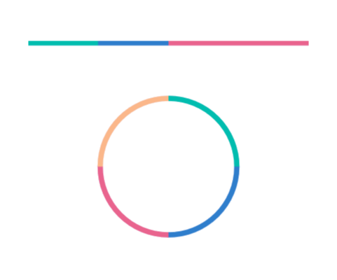
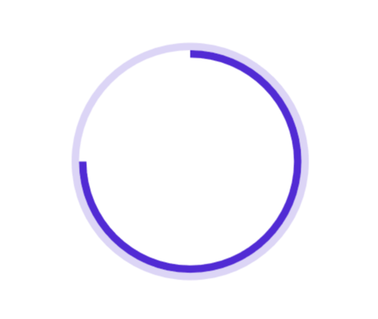
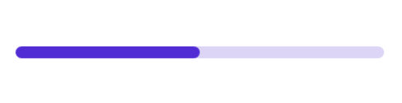
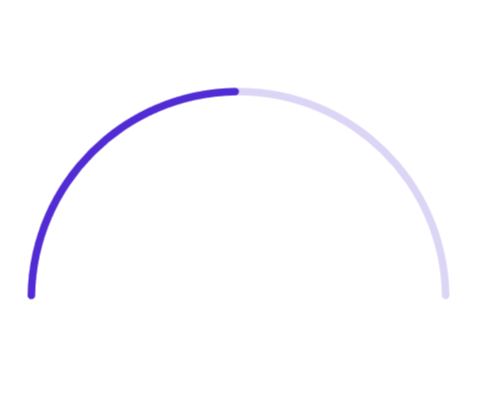
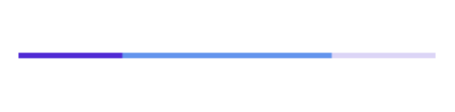

# Appearance in .NET MAUI ProgressBar (Progress Bar)

## Angle

The appearance of the circular progress bar can be customized to semi-circle, arc, etc. The start and end angles can be customized using the `StartAngle` and `EndAngle` properties. 

The following code sample demonstrates how to change the appearance of the circular progress bar to semi-circle.

 



<progressBar:SfCircularProgressBar Progress="75" 
                                   StartAngle="180" 
                                   EndAngle="360" />





SfCircularProgressBar circularProgressBar = new SfCircularProgressBar();
circularProgressBar.Progress = 75;
circularProgressBar.StartAngle = 180;
circularProgressBar.EndAngle = 360;
this.Content = circularProgressBar;



 

## Range colors

You can visualize the multiple ranges with different colors that are mapped to each range to enhance the readability of progress. 

The colors can be mapped to the specific ranges using the `GradientStops` property, which holds a collection of `ProgressGradientStop`. 

The following properties in the `GradientStops` are used to map the colors to a range:

* `Color`: Represents the color to the specified range.
* `Value`: Represents the start or end value for the specified color.

The following code sample demonstrates how to map the solid color range in the progress bar.

 



<!--Using linear progress bar-->

<progressBar:SfLinearProgressBar Progress="100">
    <progressBar:SfLinearProgressBar.GradientStops>
        <progressBar:ProgressGradientStop Color="#00bdaf" Value="0"/>
        <progressBar:ProgressGradientStop Color="#00bdaf" Value="25"/>
        <progressBar:ProgressGradientStop Color="#2f7ecc" Value="25"/>
        <progressBar:ProgressGradientStop Color="#2f7ecc" Value="50"/>
        <progressBar:ProgressGradientStop Color="#e9648e" Value="50"/>
        <progressBar:ProgressGradientStop Color="#e9648e" Value="75"/>
        <progressBar:ProgressGradientStop Color="#e9648e" Value="75"/>
        <progressBar:ProgressGradientStop Color="#e9648e" Value="100"/>
    </progressBar:SfLinearProgressBar.GradientStops>
</progressBar:SfLinearProgressBar>

<!--Using circular progress bar-->

<progressBar:SfCircularProgressBar Progress="100" >
    <progressBar:SfCircularProgressBar.GradientStops>
        <progressBar:ProgressGradientStop Color="#00bdaf" Value="0"/>
        <progressBar:ProgressGradientStop Color="#00bdaf" Value="25"/>
        <progressBar:ProgressGradientStop Color="#2f7ecc" Value="25"/>
        <progressBar:ProgressGradientStop Color="#2f7ecc" Value="50"/>
        <progressBar:ProgressGradientStop Color="#e9648e" Value="50"/>
        <progressBar:ProgressGradientStop Color="#e9648e" Value="75"/>
        <progressBar:ProgressGradientStop Color="#fbb78a" Value="75"/>
        <progressBar:ProgressGradientStop Color="#fbb78a" Value="100"/>
    </progressBar:SfCircularProgressBar.GradientStops>
</progressBar:SfCircularProgressBar>





// Using linear progress bar

SfLinearProgressBar linearProgressBar = new SfLinearProgressBar();
linearProgressBar.Progress = 100;
linearProgressBar.GradientStops.Add(new ProgressGradientStop { Color = Color.FromArgb("00bdaf"), Value = 0 });
linearProgressBar.GradientStops.Add(new ProgressGradientStop { Color = Color.FromArgb("00bdaf"), Value = 25 });
linearProgressBar.GradientStops.Add(new ProgressGradientStop { Color = Color.FromArgb("2f7ecc"), Value = 25 });
linearProgressBar.GradientStops.Add(new ProgressGradientStop { Color = Color.FromArgb("2f7ecc"), Value = 50 });
linearProgressBar.GradientStops.Add(new ProgressGradientStop { Color = Color.FromArgb("e9648e"), Value = 50 });
linearProgressBar.GradientStops.Add(new ProgressGradientStop { Color = Color.FromArgb("e9648e"), Value = 75 });
linearProgressBar.GradientStops.Add(new ProgressGradientStop { Color = Color.FromArgb("fbb78a"), Value = 75 });
linearProgressBar.GradientStops.Add(new ProgressGradientStop { Color = Color.FromArgb("fbb78a"), Value = 100 });
this.Content = linearProgressBar;

// Using circular progress bar

SfCircularProgressBar circularProgressBar = new SfCircularProgressBar();
circularProgressBar.Progress = 100;
circularProgressBar.GradientStops.Add(new ProgressGradientStop { Color = Color.FromArgb("00bdaf"), Value = 0 });
circularProgressBar.GradientStops.Add(new ProgressGradientStop { Color = Color.FromArgb("00bdaf"), Value = 25 });
circularProgressBar.GradientStops.Add(new ProgressGradientStop { Color = Color.FromArgb("2f7ecc"), Value = 25 });
circularProgressBar.GradientStops.Add(new ProgressGradientStop { Color = Color.FromArgb("2f7ecc"), Value = 50 });
circularProgressBar.GradientStops.Add(new ProgressGradientStop { Color = Color.FromArgb("e9648e"), Value = 50 });
circularProgressBar.GradientStops.Add(new ProgressGradientStop { Color = Color.FromArgb("e9648e"), Value = 75 });
circularProgressBar.GradientStops.Add(new ProgressGradientStop { Color = Color.FromArgb("fbb78a"), Value = 75 });
circularProgressBar.GradientStops.Add(new ProgressGradientStop { Color = Color.FromArgb("fbb78a"), Value = 100 });
this.Content = circularProgressBar;



 

The following code sample demonstrates how to apply gradient transition effect to the range colors in the progress bar.

 



<progressBar:SfLinearProgressBar Progress="100" >
    <progressBar:SfLinearProgressBar.GradientStops>
        <progressBar:ProgressGradientStop Color="#88A0D9EF" Value="0"/>
        <progressBar:ProgressGradientStop Color="#AA62C1E5" Value="25"/>
        <progressBar:ProgressGradientStop Color="#DD20A7DB" Value="50"/>
        <progressBar:ProgressGradientStop Color="#FF1C96C5" Value="75"/>
    </progressBar:SfLinearProgressBar.GradientStops>
</progressBar:SfLinearProgressBar>

<progressBar:SfCircularProgressBar Progress="100">
    <progressBar:SfCircularProgressBar.GradientStops>
        <progressBar:ProgressGradientStop Color="#88A0D9EF" Value="0"/>
        <progressBar:ProgressGradientStop Color="#AA62C1E5" Value="25"/>
        <progressBar:ProgressGradientStop Color="#DD20A7DB" Value="50"/>
        <progressBar:ProgressGradientStop Color="#FF1C96C5" Value="75"/>
    </progressBar:SfCircularProgressBar.GradientStops>
</progressBar:SfCircularProgressBar>





SfLinearProgressBar linearProgressBar = new SfLinearProgressBar();
linearProgressBar.Progress = 100;
linearProgressBar.GradientStops.Add(new ProgressGradientStop { Color = Color.FromArgb("88A0D9EF"), Value = 0 });
linearProgressBar.GradientStops.Add(new ProgressGradientStop { Color = Color.FromArgb("AA62C1E5"), Value = 25 });
linearProgressBar.GradientStops.Add(new ProgressGradientStop { Color = Color.FromArgb("DD20A7DB"), Value = 50 });
linearProgressBar.GradientStops.Add(new ProgressGradientStop { Color = Color.FromArgb("FF1C96C5"), Value = 75 });
this.Content = linearProgressBar;

SfCircularProgressBar circularProgressBar = new SfCircularProgressBar();
circularProgressBar.Progress = 100;
circularProgressBar.GradientStops.Add(new ProgressGradientStop { Color = Color.FromArgb("88A0D9EF"), Value = 0 });
circularProgressBar.GradientStops.Add(new ProgressGradientStop { Color = Color.FromArgb("AA62C1E5"), Value = 25 });
circularProgressBar.GradientStops.Add(new ProgressGradientStop { Color = Color.FromArgb("DD20A7DB"), Value = 50 });
circularProgressBar.GradientStops.Add(new ProgressGradientStop { Color = Color.FromArgb("FF1C96C5"), Value = 75 });
this.Content = circularProgressBar;



 

## Thickness

### Linear progress bar

In the linear progress bar, the height of the track, progress and secondary progress can be customized using the `TrackHeight` and `ProgressHeight` and `SecondaryProgressHeight` properties, respectively.

 



<progressBar:SfLinearProgressBar Progress="100" 
                                 TrackHeight="10" 
                                 ProgressHeight="10"
                                 SecondaryProgressHeight="10">

</progressBar:SfLinearProgressBar>





SfLinearProgressBar linearProgressBar = new SfLinearProgressBar();
linearProgressBar.Progress = 100;
linearProgressBar.TrackHeight = 10;
linearProgressBar.ProgressHeight = 10;
linearProgressBar.SecondaryProgressHeight = 10;
this.Content = linearProgressBar;



 

### Circular progress bar

The following properties are used to customize the appearance of the circular progress bar:

* `ProgressRadiusFactor`: Defines the outer radius of the progress indicator.
* `ProgressThickness`: Defines the thickness of the progress indicator.
* `TrackRadiusFactor`: Defines the outer radius of the track indicator.
* `TrackThickness`: Defines the thickness of the track indicator.
* `ThicknessUnit`: Specifies whether the `ProgressThickness` or `TrackThickness` are defined in pixel or factor.

The `ProgressThickness` or `TrackThickness` of the progress bar can be specified either in pixel or factor. If the `ThicknessUnit` is specified as Pixel, then the range will be rendered based on the provided pixel value. If the `ThicknessUnit` is set as factor, the provided factor value will be multiplied with outer radius. For example, if the thickness width is set as 0.1, then 10% of outer radius is considered as thickness.

The following code sample demonstrates how to customize the appearance of circular progress bar.

 



<!--Circular progress bar with radius customization -->

<progressBar:SfCircularProgressBar Progress="75"
                                   TrackRadiusFactor="0.8" 
                                   ProgressRadiusFactor="0.75"
                                   ThicknessUnit="Factor"
                                   TrackThickness="0.05"
                                   ProgressThickness="0.05">
</progressBar:SfCircularProgressBar>   





SfCircularProgressBar circularProgressBar = new SfCircularProgressBar();
circularProgressBar.Progress = 75;
circularProgressBar.TrackRadiusFactor = 0.8;
circularProgressBar.ProgressRadiusFactor = 0.75;
circularProgressBar.TrackThickness = 0.05;
circularProgressBar.ProgressThickness = 0.05;
circularProgressBar.ThicknessUnit = SizeUnit.Factor;
this.Content = circularProgressBar;



 

## Corner radius

The `CornerRadius` property is used to customize the rounded edges in the linear progress bar as demonstrated in the following code sample.

 



<progressBar:SfLinearProgressBar Progress="50"
                                 TrackHeight="10" 
                                 TrackCornerRadius="5"
                                 ProgressHeight="10"
                                 ProgressCornerRadius="5">
    
</progressBar:SfLinearProgressBar>





SfLinearProgressBar linearProgressBar = new SfLinearProgressBar();
linearProgressBar.Progress = 50;
linearProgressBar.TrackHeight = 10;
linearProgressBar.ProgressHeight = 10;
linearProgressBar.ProgressCornerRadius = 5;
linearProgressBar.TrackCornerRadius = 5;
this.Content = linearProgressBar;



 

## Corner style customization

The `ProgressCornerStyle` and `TrackCornerStyle` property of circular progress bar specifies the corner type for the progress and track. The corners can be customized using the `BothFlat`, `BothCurve`, `StartCurve`, and `EndCurve` options. The default value of this property is `BothFlat`.

The following code sample demonstrates the corner style customization in progress and track indicator.

 



<progressBar:SfCircularProgressBar Progress="50"
                                   TrackCornerStyle="BothCurve"
                                   ProgressCornerStyle="BothCurve"
                                   StartAngle="180"
                                   EndAngle="360">
    
</progressBar:SfCircularProgressBar>





SfCircularProgressBar circularProgressBar = new SfCircularProgressBar();
circularProgressBar.Progress = 50;
circularProgressBar.TrackCornerStyle = CornerStyle.BothCurve;
circularProgressBar.ProgressCornerStyle = CornerStyle.BothCurve;
circularProgressBar.StartAngle = 180;
circularProgressBar.EndAngle = 360;
this.Content = circularProgressBar;



 

## Color customization

The following properties are used to customize the color in the progress bar:

* `ProgressFill`: Represents the color of the progress indicator.
* `TrackFill`: Represents the color of the track indicator.

The following code sample demonstrates the color customization in progress and track indicator.

 



<progressBar:SfLinearProgressBar Progress="75" 
                                 TrackFill="#3351483a" 
                                 ProgressFill="#FF51483a"
                                 SecondaryProgressFill="CornflowerBlue"
                                 Margin="20">

</progressBar:SfLinearProgressBar>





SfLinearProgressBar linearProgressBar = new SfLinearProgressBar();
linearProgressBar.Progress = 75;
linearProgressBar.TrackFill = Color.FromArgb("3351483a");
linearProgressBar.ProgressFill = Color.FromArgb("FF51483a");
linearProgressBar.SecondaryProgressFill = Colors.CornflowerBlue;
this.Content = linearProgressBar;



 

The linear progress bar provides support to customize the color for the secondary progress bar using the `SecondaryProgressFill` property as demonstrated in the following code sample.

 



<progressBar:SfLinearProgressBar Progress="25" 
                                 SecondaryProgress="75" 
                                 SecondaryProgressFill="CornflowerBlue">
</progressBar:SfLinearProgressBar>





SfLinearProgressBar linearProgressBar = new SfLinearProgressBar();
linearProgressBar.Progress = 25;
linearProgressBar.SecondaryProgress = 75;
linearProgressBar.SecondaryProgressFill = Colors.CornflowerBlue;
this.Content = linearProgressBar;



 

