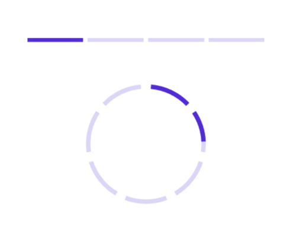

# Segments in .NET MAUI ProgressBar (Progress Bar)

To visualize the progress of multiple sequential tasks, split the progress bar into multiple segments by setting the `SegmentCount` property as demonstrated in the following code sample.

 



<!--Using the linear progress bar-->

<progressBar:SfLinearProgressBar Progress="25" 
                                 SegmentCount="4" />

<!--Using the circular progress bar-->

<progressBar:SfCircularProgressBar Progress="25" 
                                   SegmentCount="7" />





// Using the linear progress bar.

SfLinearProgressBar linearProgressBar = new SfLinearProgressBar();
linearProgressBar.Progress = 25;
linearProgressBar.SegmentCount = 4;
this.Content = linearProgressBar;

// Using the circular progress bar.

SfCircularProgressBar circularProgressBar = new SfCircularProgressBar();
circularProgressBar.Progress = 25;
circularProgressBar.SegmentCount = 7;
this.Content = circularProgressBar;



 

## Gap customization

Customize the default spacing between the segments using the GapWidth property as demonstrated in the following code sample.

 


<!--Using linear progress bar-->

<progressBar:SfLinearProgressBar Progress="25" 
                                 SegmentCount="4"
                                 SegmentGapWidth="5" />

<!--Using circular progress bar-->

<progressBar:SfCircularProgressBar Progress="25"
                                   SegmentCount="7" 
                                   SegmentGapWidth="10" />




// Using linear progress bar.

SfLinearProgressBar linearProgressBar = new SfLinearProgressBar();
linearProgressBar.Progress = 25;
linearProgressBar.SegmentCount = 4;
linearProgressBar.SegmentGapWidth = 5;
this.Content = linearProgressBar;

// Using circular progress bar.

SfCircularProgressBar circularProgressBar = new SfCircularProgressBar();
circularProgressBar.Progress = 25;
circularProgressBar.SegmentCount = 7;
circularProgressBar.SegmentGapWidth = 10;
this.Content = circularProgressBar;



 

