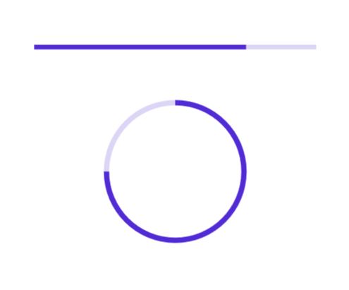

# Getting started with .NET MAUI ProgressBar (Progress Bar)

This section explains the steps required to add the progress bar control with the progress and its customizable elements such as indeterminate, segment, progress fill, and track fill. This section covers only the basic features needed to know to get started with the Syncfusion progress bar.

## Creating an application using the .NET MAUI ProgressBar

* Create a new .NET MAUI application in the Visual Studio.

* The Syncfusion .NET MAUI components are available on [nuget.org](https://www.nuget.org/). To add ProgressBar to your project, open the NuGet package manager in Visual Studio, and search for [Syncfusion.Maui.ProgressBar] then install that.

### Register the handler

The Syncfusion.Maui.Core NuGet is a dependent package for all Syncfusion controls of .NET MAUI. In the MauiProgram.cs file, register the handler for the Syncfusion core.



using Microsoft.Maui;
using Microsoft.Maui.Hosting;
using Microsoft.Maui.Controls.Compatibility;
using Microsoft.Maui.Controls.Hosting;
using Microsoft.Maui.Controls.Xaml;
using Syncfusion.Maui.Core.Hosting;

namespace MyProject
{
    public static class MauiProgram
    {
        public static MauiApp CreateMauiApp()
        {
            var builder = MauiApp.CreateBuilder();
            builder
            .UseMauiApp<App>()
            .ConfigureSyncfusionCore()
            .ConfigureFonts(fonts =>
            {
                fonts.AddFont("OpenSans-Regular.ttf", "OpenSansRegular");
            });

            return builder.Build();
        }
    }
}



## Adding namespace

Add the following namespace.





xmlns:progressBar="clr-namespace:Syncfusion.Maui.ProgressBar;assembly=Syncfusion.Maui.ProgressBar"





using Syncfusion.Maui.ProgressBar;





## Initializing progress bar

Create an instance for the progress bar control, and add it as content. The progress bar control has two variants: The `SfLinearProgressBar` and `SfCircularProgressBar`. Each renders the progress in its own shape, such as rectangle and circle, respectively. Initialize both progress bars with a progress value using the Progress property as demonstrated in the following code sample.





<!--Using the linear progress bar-->
<progressBar:SfLinearProgressBar Progress="75"/>

<!--Using the circular progress bar-->
<progressBar:SfCircularProgressBar Progress="75"/>





// Using the linear progress bar. 

SfLinearProgressBar linearProgressBar = new SfLinearProgressBar { Progress = 75 };
this.Content = linearProgressBar;

// Using the circular progress bar.

SfCircularProgressBar circularProgressBar = new SfCircularProgressBar { Progress = 75 };
this.Content = circularProgressBar;





N> By default, the value of progress should be specified between 0 and 100. To determine the progress value between 0 and 1, set the Minimum property to 0 and the Maximum property to 1.

Run the project, and check if you get following output to make sure that the project has been configured properly to add the progress bar.

## Enabling indeterminate state

When the progress of a task cannot be shown determinately, you can enable the indeterminate state using the `IsIndeterminate` property to know if any progress is happening in the background.

 

 

<!--Using the linear progress bar-->
<progressBar:SfLinearProgressBar IsIndeterminate="True"/>

<!--Using the circular progress bar-->
<progressBar:SfCircularProgressBar IsIndeterminate="True"/>



 

// Using the linear progress bar.

SfLinearProgressBar linearProgressBar = new SfLinearProgressBar { IsIndeterminate = true };
this.Content = linearProgressBar;

// Using the circular progress bar.

SfCircularProgressBar circularProgressBar = new SfCircularProgressBar { IsIndeterminate = true };
this.Content = circularProgressBar;



 

## Enable segments

To visualize the progress of a multiple sequential task, split the progress bar into the multiple segments by defining the `SegmentCount` property as demonstrated in the following code sample.

 

 

<!--Using the linear progress bar-->

<progressBar:SfLinearProgressBar SegmentCount="4" Progress="75"/>

<!--Using the circular progress bar-->

<progressBar:SfCircularProgressBar SegmentCount="4" Progress="75"/>



 

// Using the linear progress bar.

SfLinearProgressBar linearProgressBar = new SfLinearProgressBar { Progress = 75, SegmentCount = 4 };
this.Content = linearProgressBar;

// Using the circular progress bar.

SfCircularProgressBar circularProgressBar = new SfCircularProgressBar { Progress = 75, SegmentCount = 4 };
this.Content = circularProgressBar;





## Apply colors

Customize the color of the progress indicator and track by defining the `ProgressFill` and `TrackFill` properties, respectively.

 

 

<!--Using the linear progress bar-->

<progressBar:SfLinearProgressBar Progress="75" 
                                 TrackFill="#33ffbe06" 
                                 ProgressFill="#FFffbe06"/>

<progressBar:SfLinearProgressBar Progress="75"  
                                 TrackFill="#3351483a" 
                                 ProgressFill="#FF51483a"/>

<!--Using the circular progress bar-->

 <progressBar:SfCircularProgressBar Progress="75" 
                                    TrackFill="#33c15244" 
                                    ProgressFill="#FFc15244"/>

<progressBar:SfCircularProgressBar Progress="75" 
                                   TrackFill="#3390a84e" 
                                   ProgressFill="#FF90a84e"/>



 

// Using the linear progress bar.

SfLinearProgressBar linearProgressBar = new SfLinearProgressBar
{
    Progress = 75, 
    TrackFill = new SolidColorBrush(Color.FromArgb("#33ffbe06")), 
    ProgressFill = new SolidColorBrush(Color.FromArgb("#FFffbe06"))
};

SfLinearProgressBar sfLinearProgressBar = new SfLinearProgressBar
{
    Progress = 75, 
    TrackFill = new SolidColorBrush(Color.FromArgb("#3351483a")), 
    ProgressFill = new SolidColorBrush(Color.FromArgb("#FF51483a"))
};

// Using the circular progress bar.

SfCircularProgressBar circularProgressBar = new SfCircularProgressBar
{
    Progress = 75, 
    TrackFill = new SolidColorBrush(Color.FromArgb("#33c15244")), 
    ProgressFill = new SolidColorBrush(Color.FromArgb("#FFc15244"))
};

SfCircularProgressBar sfCircularProgressBar = new SfCircularProgressBar
{
    Progress = 75, 
    TrackFill = new SolidColorBrush(Color.FromArgb("#3390a84e")), 
    ProgressFill = new SolidColorBrush(Color.FromArgb("#FF90a84e"))
};



 

N> 
* Get the complete getting started sample from `GitHub` link.
* You can refer to our `.NET MAUI progress bar` feature tour page for its groundbreaking feature representations.