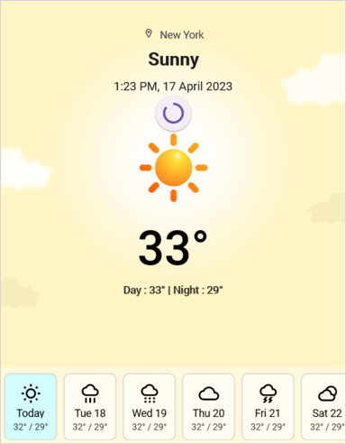
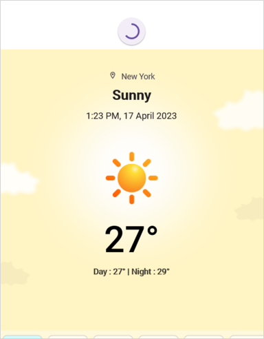
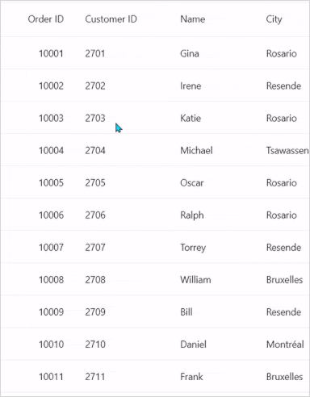
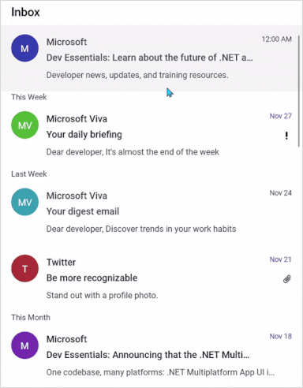
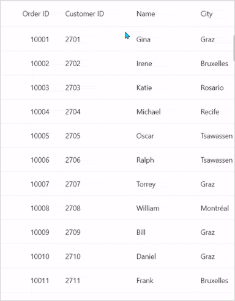

# Customization in .NET MAUI PullToRefresh (SfPullToRefresh)

The .NET MAUI PullToRefresh control supports customization of various features, including TransitionMode, PullingThreshold, ProgressBackground, ProgressColor, and more. The control can be personalized using the following properties.

## PullableContent

The [PullableContent](https://help.syncfusion.com/cr/maui/Syncfusion.Maui.PullToRefresh.SfPullToRefresh.html#Syncfusion_Maui_PullToRefresh_SfPullToRefresh_PullableContent) is the main view of the [PullToRefresh](https://help.syncfusion.com/cr/maui/Syncfusion.Maui.PullToRefresh.SfPullToRefresh.html) control on which the desired items can be placed.




<syncfusion:SfPullToRefresh x:Name="pullToRefresh"
                            PullingThreshold="120"
                            RefreshViewHeight="30"
                            RefreshViewThreshold="30"
                            RefreshViewWidth="30">
    <syncfusion:SfPullToRefresh.PullableContent>
            <Label x:Name="Monthlabel" 
                    TextColor="White" 
                    HorizontalTextAlignment="Center"   
                    VerticalTextAlignment="Start" />
    </syncfusion:SfPullToRefresh.PullableContent>
</syncfusion:SfPullToRefresh>




## TransitionMode

The [TransitionMode](https://help.syncfusion.com/cr/maui/Syncfusion.Maui.PullToRefresh.SfPullToRefresh.html#Syncfusion_Maui_PullToRefresh_SfPullToRefresh_TransitionMode) property specifies the mode of the animations. It has the following two modes:

* [SlideOnTop](https://help.syncfusion.com/cr/maui/Syncfusion.Maui.PullToRefresh.PullToRefreshTransitionType.html#Syncfusion_Maui_PullToRefresh_PullToRefreshTransitionType_SlideOnTop)
* [Push](https://help.syncfusion.com/cr/maui/Syncfusion.Maui.PullToRefresh.PullToRefreshTransitionType.html#Syncfusion_Maui_PullToRefresh_PullToRefreshTransitionType_Push)

The default transition is `SlideOnTop` that draws the RefreshView on top of the `PullableContent`. Choose `Push` when you want the refresh content and the main content to move together.




<syncfusion:SfPullToRefresh x:Name="pullToRefresh"
                            TransitionMode="SlideOnTop" />




pullToRefresh.TransitionMode = PullToRefreshTransitionType.SlideOnTop;




The following code example shows how to set the `TransitionMode` as `Push` to PullToRefresh. This transition moves the refresh content and main content simultaneously.




<syncfusion:SfPullToRefresh x:Name="pullToRefresh"
                            TransitionMode="Push" />




pullToRefresh.TransitionMode = PullToRefreshTransitionType.Push;




## RefreshViewThreshold

The threshold value for the refresh view, indicating the starting position of the progress indicator within the view.This is a `double` value; the default is `50`.




<syncfusion:SfPullToRefresh x:Name="pullToRefresh"
                            RefreshViewThreshold="50"/>




pullToRefresh.RefreshViewThreshold = 50d;




## PullingThreshold

The threshold value for the refresh view, indicating the progress indicator's maximum pulling position in view. This is a `double` value; the default is `200`.




<syncfusion:SfPullToRefresh x:Name="pullToRefresh"
                            PullingThreshold="200"/>




pullToRefresh.PullingThreshold = 200d;




## IsRefreshing

The view gets refreshed while the [IsRefreshing](https://help.syncfusion.com/cr/maui/Syncfusion.Maui.PullToRefresh.SfPullToRefresh.html#Syncfusion_Maui_PullToRefresh_SfPullToRefresh_IsRefreshing) property is set to `true`, and view refreshing is stopped when you set `IsRefreshing` to `false`. Use this together with the [Refreshing](https://help.syncfusion.com/cr/maui/Syncfusion.Maui.PullToRefresh.SfPullToRefresh.html) event to refresh your data.




<syncfusion:SfPullToRefresh x:Name="pullToRefresh"
                            IsRefreshing="True"/>




pullToRefresh.IsRefreshing = true;




## ProgressBackground

The color of the progress indicator's background.



<syncfusion:SfPullToRefresh x:Name="pullToRefresh"
                            ProgressBackground = "White"/>




pullToRefresh.ProgressBackground = Color.White;




## ProgressColor

The color of the progress indicator's arc.




<syncfusion:SfPullToRefresh x:Name="pullToRefresh"
                            ProgressColor = "Blue"/>




pullToRefresh.ProgressColor = Color.Blue;





## ProgressThickness

The width of the progress indicator's arc. This is a `double` value; the default is `3`.




<syncfusion:SfPullToRefresh x:Name="pullToRefresh"
                            ProgressThickness="5"/>




pullToRefresh.ProgressThickness = 5d;




## RefreshViewWidth

The width of the refresh view. This is a `double` value; the default is `48`.




<syncfusion:SfPullToRefresh x:Name="pullToRefresh"
                            RefreshViewWidth="50"/>




pullToRefresh.RefreshViewWidth = 50d;





## RefreshViewHeight

The height of the refresh view. This is a `double` value; the default is `48`.




<syncfusion:SfPullToRefresh x:Name="pullToRefresh"
                            RefreshViewHeight="50"/>




pullToRefresh.RefreshViewHeight = 50d;




## Programmatic Support 

Use the programmatic API to start or stop the refresh indicator without user interaction. After the data has been refreshed, call `EndRefreshing()` (or set `IsRefreshing` to `false`) to hide the progress indicator.

### StartRefreshing()

The [StartRefreshing](https://help.syncfusion.com/cr/maui/Syncfusion.Maui.PullToRefresh.SfPullToRefresh.html#Syncfusion_Maui_PullToRefresh_SfPullToRefresh_StartRefreshing) method is used to refresh the content without user interaction on the pullable content. When you invoke the `StartRefreshing()` method, the progress indicator is shown and the [Refreshing](https://help.syncfusion.com/cr/maui/Syncfusion.Maui.PullToRefresh.SfPullToRefresh.html) event is raised.




private async void OnStartRefreshingClicked(object sender, EventArgs e)
{
    pullToRefresh.StartRefreshing();
    await LoadDataAsync();
    pullToRefresh.EndRefreshing();
}




### EndRefreshing()

The [EndRefreshing](https://help.syncfusion.com/cr/maui/Syncfusion.Maui.PullToRefresh.SfPullToRefresh.html#Syncfusion_Maui_PullToRefresh_SfPullToRefresh_EndRefreshing) method is used to end the progress animation of the `PullToRefresh`.




pullToRefresh.EndRefreshing();




## Host .NET MAUI DataGrid as pullable content

The `PullToRefresh` control provides support for loading any custom control as pullable content. To host the .NET MAUI DataGrid inside the `PullToRefresh`, follow these steps.
<ol>
    <li> Add the required assembly references as discussed in the <a href="https://help.syncfusion.com/maui/datagrid/getting-started">DataGrid</a> and PullToRefresh.</li>
    <li> Define the `OrdersInfo` collection in a ViewModel and implement a `Refresh Item source(int count)` method that updates it. See the <a href="https://github.com/SyncfusionExamples/load-datagrid-as-pullable-content-of-.net-maui-pull-to-refresh">View sample in GitHub</a> for a complete example.</li>
    <li> Import PullToRefresh and DataGrid control namespace as follows.</li>
     



xmlns:sfgrid="clr-namespace:Syncfusion.Maui.DataGrid;assembly=Syncfusion.Maui.DataGrid"
xmlns:pulltoRefresh="clr-namespace:Syncfusion.Maui.PullToRefresh;assembly=Syncfusion.Maui.PullToRefresh"




using Syncfusion.Maui.DataGrid;
using Syncfusion.Maui.PullToRefresh;



     
    <li> Define the DataGrid as PullableContent of the PullToRefresh.</li> 
    <li> Handle the pull to refresh events for refreshing the data. </li>
    <li> Customize the required properties of the DataGrid and PullToRefresh based on your requirement.</li>
</ol>

This is how the final output will look like when hosting a Datagrid control as pullable content.




<ContentPage xmlns="http://schemas.microsoft.com/dotnet/2021/maui"
            xmlns:x="http://schemas.microsoft.com/winfx/2009/xaml"
            x:Class="PullToRefreshTemplate.MainPage"
            xmlns:sfgrid="clr-namespace:Syncfusion.Maui.DataGrid;assembly=Syncfusion.Maui.DataGrid"
            xmlns:pulltoRefresh="clr-namespace:Syncfusion.Maui.PullToRefresh;assembly=Syncfusion.Maui.PullToRefresh"
            xmlns:local="clr-namespace:PullToRefreshTemplate">

    <ContentPage.Behaviors>
        <local:PullToRefreshTemplateBehavior />
    </ContentPage.Behaviors>

    <ContentPage.Content>
        <Grid>
            <pulltoRefresh:SfPullToRefresh x:Name="pullToRefresh"
                                        RefreshViewHeight="50"
                                        RefreshViewThreshold="30"
                                        PullingThreshold="150"
                                        RefreshViewWidth="50"
                                        ProgressThickness='{OnPlatform Android="3", Default="2"}'
                                        TransitionMode="SlideOnTop"
                                        Margin="{StaticResource margin}"
                                        IsRefreshing="False">
                <pulltoRefresh:SfPullToRefresh.PullableContent>
                    <sfgrid:SfDataGrid x:Name="dataGrid"
                                    HeaderRowHeight="52"
                                    RowHeight="48"
                                    SortingMode="Single"
                                    ItemsSource="{Binding OrdersInfo}"
                                    AutoGenerateColumnsMode="None"
                                    ColumnWidthMode="Fill"
                                    HorizontalScrollBarVisibility="Always"
                                    VerticalScrollBarVisibility="Always">

                    </sfgrid:SfDataGrid>
                </pulltoRefresh:SfPullToRefresh.PullableContent>
            </pulltoRefresh:SfPullToRefresh>
        </Grid>
    </ContentPage.Content>
</ContentPage>




using Syncfusion.Maui.DataGrid;
using Syncfusion.Maui.ProgressBar;
using Syncfusion.Maui.PullToRefresh;

namespace PullToRefreshTemplate
{
    public class PullToRefreshTemplateBehavior : Behavior<ContentPage>
    {
        protected override void OnAttachedTo(ContentPage bindable)
        {
            this.viewModel = new OrderInfoViewModel();
            bindable.BindingContext = this.viewModel;
            this.pullToRefresh = bindable.FindByName<Syncfusion.Maui.PullToRefresh.SfPullToRefresh>("pullToRefresh");
            this.dataGrid = bindable.FindByName<SfDataGrid>("dataGrid");
            this.dataGrid.ItemsSource = this.viewModel.OrdersInfo;
            this.pullToRefresh.Refreshing += this.PullToRefresh_Refreshing;
            this.pullToRefresh.Pulling += this.PullToRefresh_Pulling;
            base.OnAttachedTo(bindable);
        }

        private async void PullToRefresh_Refreshing(object? sender, EventArgs e)
        {
            this.viewModel!.RefreshItemsource(10);
            await Task.Delay(10);
            this.pullToRefresh.IsRefreshing = false;
        }
    }
}




If you run the above sample with the TransitionMode as Push, the output will look as follows.

N> [View sample in GitHub](https://github.com/SyncfusionExamples/load-datagrid-as-pullable-content-of-.net-maui-pull-to-refresh).

## Host .NET MAUI ListView as pullable content

To host the .NET MAUI `ListView` inside the `PullToRefresh` to update items in the list while performing the pull to refresh action, follow these steps.
<ol>
    <li>	Add the required assembly references as discussed in the <a href="https://help.syncfusion.com/maui/listview/getting-started">ListView</a> and PullToRefresh.</li>
    <li>	Define the `InboxInfos` collection in a `ListViewInboxInfoViewModel` and implement an `AddItemsRefresh(int count)` method that adds new items. See the <a href="https://github.com/SyncfusionExamples/load-listview-as-pullable-content-of-.net-maui-pull-to-refresh">View sample in GitHub</a> for a complete example.</li>
    <li>	Import the SfPullToRefresh control and SfListView control namespace as follows.</li>
     



xmlns:ListView="clr-namespace:Syncfusion.Maui.ListView;assembly=Syncfusion.Maui.ListView"
xmlns:pulltoRefresh="clr-namespace:Syncfusion.Maui.PullToRefresh;assembly=Syncfusion.Maui.PullToRefresh"




using Syncfusion.Maui.ListView;
using Syncfusion.Maui.PullToRefresh;



     
    <li>	Define the ListView as PullableContent of the SfPullToRefresh.</li>
    <li>	Handle the pull to refresh events for refreshing the data. </li>
    <li>	Customize the required properties of ListView and PullToRefresh based on your requirement.</li>
</ol>

This is how the final output will look like when hosting a SfListView control as pullable content.




<ContentPage xmlns="http://schemas.microsoft.com/dotnet/2021/maui"
            xmlns:x="http://schemas.microsoft.com/winfx/2009/xaml"
            x:Class="RefreshableListView.MainPage"
            xmlns:ListView="clr-namespace:Syncfusion.Maui.ListView;assembly=Syncfusion.Maui.ListView"
            xmlns:pulltoRefresh="clr-namespace:Syncfusion.Maui.PullToRefresh;assembly=Syncfusion.Maui.PullToRefresh"
            xmlns:local="clr-namespace:RefreshableListView">

    <ContentPage.Behaviors>
        <local:ListViewPullToRefreshBehavior />
    </ContentPage.Behaviors>

    <ContentPage.Content>
        <Grid>
            <pulltoRefresh:SfPullToRefresh x:Name="pullToRefresh"
                                        RefreshViewHeight="50"
                                        RefreshViewThreshold="30"
                                        PullingThreshold="150"
                                        RefreshViewWidth="50"
                                        TransitionMode="SlideOnTop"
                                        IsRefreshing="False">
                <pulltoRefresh:SfPullToRefresh.PullableContent>
                    <Grid x:Name="mainGrid">
                        <ListView:SfListView Grid.Row="1"
                                            x:Name="listView"
                                            ItemsSource="{Binding InboxInfos}"
                                            ItemSize="102"
                                            SelectionMode="Single"
                                            ScrollBarVisibility="Always"
                                            AutoFitMode="Height">
                            . . . 
                            . . . .

                        </ListView:SfListView>
                    </Grid>
                </pulltoRefresh:SfPullToRefresh.PullableContent>
            </pulltoRefresh:SfPullToRefresh>
        </Grid>
    </ContentPage.Content>
</ContentPage>
    



using Syncfusion.Maui.DataSource;
using Syncfusion.Maui.DataSource.Extensions;
using Syncfusion.Maui.ListView;
using Syncfusion.Maui.PullToRefresh;
namespace RefreshableListView
{
    public class ListViewPullToRefreshBehavior : Behavior<ContentPage>
    {
        private SfPullToRefresh pullToRefresh;
        private SfListView listView;
        private ListViewInboxInfoViewModel ViewModel;

        protected override void OnAttachedTo(ContentPage bindable)
        {
            ViewModel = new ListViewInboxInfoViewModel();
            bindable.BindingContext = ViewModel;
            pullToRefresh = bindable.FindByName<SfPullToRefresh>("pullToRefresh");
            listView = bindable.FindByName<SfListView>("listView");
            pullToRefresh.Refreshing += PullToRefresh_Refreshing;

            base.OnAttachedTo(bindable);
        }

    private async void PullToRefresh_Refreshing(object? sender, EventArgs e)
    {
        pullToRefresh!.IsRefreshing = true;
        await Task.Delay(2500);
        ViewModel!.AddItemsRefresh(3);
        pullToRefresh.IsRefreshing = false;
    }
}




N> [View sample in GitHub](https://github.com/SyncfusionExamples/load-listview-as-pullable-content-of-.net-maui-pull-to-refresh).

If you run the above sample with the [TransitionMode](https://help.syncfusion.com/cr/maui/Syncfusion.Maui.PullToRefresh.SfPullToRefresh.html#Syncfusion_Maui_PullToRefresh_SfPullToRefresh_TransitionMode) as Push, the output will look as follows.

## Pulling and refreshing template

The `PullToRefresh` allows you to set a template for the pulling and refreshing view. The pulling and refreshing templates can be set using the [SfPullToRefresh.PullingViewTemplate](https://help.syncfusion.com/cr/maui/Syncfusion.Maui.PullToRefresh.SfPullToRefresh.html#Syncfusion_Maui_PullToRefresh_SfPullToRefresh_PullingViewTemplate) and [SfPullToRefresh.RefreshingViewTemplate](https://help.syncfusion.com/cr/maui/Syncfusion.Maui.PullToRefresh.SfPullToRefresh.html#Syncfusion_Maui_PullToRefresh_SfPullToRefresh_RefreshingViewTemplate) properties, respectively. Both templates accept a `DataTemplate` and can be assigned independently if you need different views for each state. During the pulling gesture, the `Pulling` event provides a [PullingEventArgs](https://help.syncfusion.com/cr/maui/Syncfusion.Maui.PullToRefresh.PullingEventArgs.html) `Progress` value whose sign indicates the direction; use `Math.Abs(e.Progress)` for an absolute value.

Refer to the following code example in which a [SfCircularProgressBar](https://help.syncfusion.com/cr/maui/Syncfusion.Maui.ProgressBar.SfCircularProgressBar.html?tabs=tabid-1) is loaded in the pulling view template and refreshing view template.




<ContentPage xmlns="http://schemas.microsoft.com/dotnet/2021/maui"
            xmlns:x="http://schemas.microsoft.com/winfx/2009/xaml"
            x:Class="PullToRefreshTemplate.MainPage"
            xmlns:sfgrid="clr-namespace:Syncfusion.Maui.DataGrid;assembly=Syncfusion.Maui.DataGrid"
            xmlns:pulltoRefresh="clr-namespace:Syncfusion.Maui.PullToRefresh;assembly=Syncfusion.Maui.PullToRefresh"
            xmlns:local="clr-namespace:PullToRefreshTemplate">

    <ContentPage.Behaviors>
        <local:PullToRefreshTemplateBehavior />
    </ContentPage.Behaviors>

    <ContentPage.Content>
        <Grid>
            <pulltoRefresh:SfPullToRefresh x:Name="pullToRefresh"
                                        RefreshViewHeight="50"
                                        RefreshViewThreshold="30"
                                        PullingThreshold="150"
                                        RefreshViewWidth="50"
                                        ProgressThickness='{OnPlatform Android="3", Default="2"}'
                                        TransitionMode="SlideOnTop"
                                        Margin="{StaticResource margin}"
                                        IsRefreshing="False">
                <pulltoRefresh:SfPullToRefresh.PullableContent>
                    <sfgrid:SfDataGrid x:Name="dataGrid"
                                    HeaderRowHeight="52"
                                    RowHeight="48"
                                    SortingMode="Single"
                                    ItemsSource="{Binding OrdersInfo}"
                                    AutoGenerateColumnsMode="None"
                                    ColumnWidthMode="Fill"
                                    HorizontalScrollBarVisibility="Always"
                                    VerticalScrollBarVisibility="Always">
                        . . .
                        . . . .

                    </sfgrid:SfDataGrid>
                </pulltoRefresh:SfPullToRefresh.PullableContent>
            </pulltoRefresh:SfPullToRefresh>
        </Grid>
    </ContentPage.Content>
</ContentPage>




public class PullToRefreshTemplateBehavior : Behavior<ContentPage>
{        
    protected override void OnAttachedTo(ContentPage bindable)
    {
        this.viewModel = new OrderInfoViewModel();
        this.progressbar = new SfCircularProgressBar();
        this.frame = new Border();
        this.progressContent = new Label();

        this.progressContent.TextColor = Color.FromRgb(0, 124, 238);
        this.progressContent.FontSize = 9;
        this.progressContent.WidthRequest = 20;
        this.progressContent.HorizontalTextAlignment = TextAlignment.Center;

        this.frame.Stroke = Colors.LightGray;
        this.frame.Background = Colors.White;
        this.frame.StrokeShape = new RoundRectangle { CornerRadius = new CornerRadius(30) };
        this.frame.Content = this.progressbar;
        this.frame.Padding = 0;
        this.frame.Shadow = null;

        this.progressbar.SegmentCount = 10;
        this.progressbar.ProgressThickness = 6;
        this.progressbar.ProgressRadiusFactor = 0.7;
        this.progressbar.SegmentGapWidth = 1;
        this.progressbar.WidthRequest = 55;
        this.progressbar.HeightRequest = 55;
        this.progressbar.IndeterminateAnimationDuration = 750;
        this.progressbar.Content = this.progressContent;

        bindable.BindingContext = this.viewModel;
        this.pullToRefresh = bindable.FindByName<Syncfusion.Maui.PullToRefresh.SfPullToRefresh>("pullToRefresh");
        this.dataGrid = bindable.FindByName<SfDataGrid>("dataGrid");
        this.dataGrid.ItemsSource = this.viewModel.OrdersInfo;
        this.pullToRefresh.Refreshing += this.PullToRefresh_Refreshing;
        this.pullToRefresh.Pulling += this.PullToRefresh_Pulling;

        var pullingTemplate = new DataTemplate(() =>
        {
            return this.frame;
        });

        this.pullToRefresh.PullingViewTemplate = pullingTemplate;
        this.pullToRefresh.RefreshingViewTemplate = pullingTemplate;

        base.OnAttachedTo(bindable);
    }

    private void PullToRefresh_Pulling(object? sender, PullingEventArgs e)
    {
        this.progressbar!.TrackThickness = 0.8;
        this.progressbar.TrackRadiusFactor = 0.1;
        this.progressbar.IsIndeterminate = false;
        this.progressbar.ProgressFill = Color.FromRgb(0, 124, 238);
        this.progressbar.TrackFill = Colors.White;

        var absoluteProgress = Convert.ToInt32(Math.Abs(e.Progress));
        this.progressbar.Progress = absoluteProgress;
        this.progressbar.SetProgress(absoluteProgress, 1, Easing.CubicInOut);
        this.progressContent!.Text = e.Progress.ToString();
    }

    private async void PullToRefresh_Refreshing(object? sender, EventArgs e)
    {
        this.progressContent!.IsVisible = false;
        this.pullToRefresh!.IsRefreshing = true;
        await Task.Delay(10);
        await this.AnimateRefresh();
        this.viewModel!.RefreshItemsource(10);
        await Task.Delay(10);
        this.pullToRefresh.IsRefreshing = false;
        this.progressContent.IsVisible = true;
    }

    private async Task AnimateRefresh()
    {
        this.progressbar!.Progress = 0;
        this.progressbar.IsIndeterminate = true;

        await Task.Delay(750);
        this.progressbar.ProgressFill = Colors.Red;

        await Task.Delay(750);
        this.progressbar.ProgressFill = Colors.Green;

        await Task.Delay(750);
        this.progressbar.ProgressFill = Colors.Orange;

        await Task.Delay(750);
    }

}




