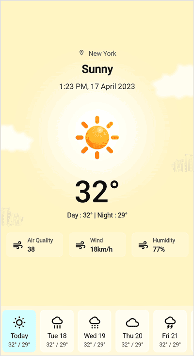
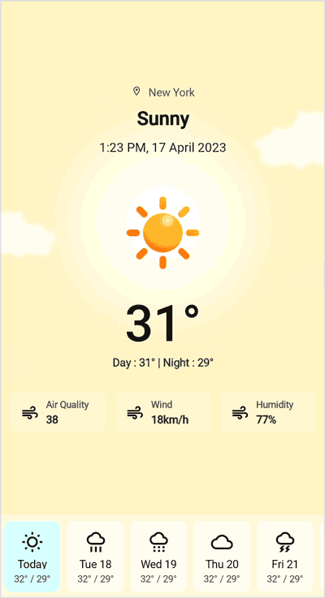

# Getting Started with .NET MAUI PullToRefresh (SfPullToRefresh)

This section provides a quick overview of how to get started with the .NET MAUI PullToRefresh (SfPullToRefresh) for MAUI and a walk-through to configure the .NET MAUI PullToRefresh control in a real-time scenario.

## Creating an application using the .NET MAUI PullToRefresh

 1. Create a new .NET MAUI application in Visual Studio.
 2. Syncfusion .NET MAUI components are available on [nuget.org](https://www.nuget.org/). To add SfPullToRefresh to your project, open the NuGet package manager in Visual Studio, search for Syncfusion.Maui.PullToRefresh and install it.
 3. Import the control namespace `Syncfusion.Maui.PullToRefresh` in XAML or C# code.
 4. Initialize the `SfPullToRefresh` control.
 



    <ContentPage
        xmlns:syncfusion="clr-namespace:Syncfusion.Maui.PullToRefresh;assembly=Syncfusion.Maui.PullToRefresh">
        <syncfusion:SfPullToRefresh />
    </ContentPage>




    using Syncfusion.Maui.PullToRefresh;
    . . .

    public partial class MainPage : ContentPage
    {
        public MainPage()
        {
            InitializeComponent();
            SfPullToRefresh pullToRefresh = new SfPullToRefresh();
            this.Content = pullToRefresh;
        }
    }




## Register the handler

The `Syncfusion.Maui.Core` NuGet is a dependent package for all Syncfusion controls of .NET MAUI. In the `MauiProgram.cs` file, register the handler for Syncfusion core.




    using Microsoft.Maui.Controls.Hosting;
    using Microsoft.Maui.Controls.Xaml;
    using Microsoft.Maui.Hosting;
    using Syncfusion.Maui.Core.Hosting;

    namespace GettingStarted
    {
        public class MauiProgram 
        {
            public static MauiApp CreateMauiApp()
            {
                var builder = MauiApp.CreateBuilder();
                builder
                    .UseMauiApp<App>()
                    .ConfigureFonts(fonts =>
                    {
                        fonts.AddFont("OpenSans-Regular.ttf", "OpenSansRegular");
                    });

                builder.ConfigureSyncfusionCore();
                return builder.Build();
            }
        }
    }

 


## Defining PullableConent

`SfPullToRefresh.PullableContent` view serves as the designated area where users can initiate the pull-to-refresh action, enabling them to refresh and update the content within the view.

Refer to the following code example for PulltoRefresh.




    <ContentPage xmlns="http://schemas.microsoft.com/dotnet/2021/maui"
                xmlns:x="http://schemas.microsoft.com/winfx/2009/xaml"
                x:Class="GettingStarted.MainPage"
                xmlns:syncfusion="clr-namespace:Syncfusion.Maui.PullToRefresh;assembly=Syncfusion.Maui.PullToRefresh">

        <syncfusion:SfPullToRefresh x:Name="pullToRefresh">
            <syncfusion:SfPullToRefresh.PullableContent>
                <StackLayout>
                    <Label Text="sample page" />
                </StackLayout>
            </syncfusion:SfPullToRefresh.PullableContent>
        </syncfusion:SfPullToRefresh>
    </ContentPage>




    namespace GettingStarted
    {
        public partial class MainPage : ContentPage
        {
            public MainPage()
            {
                InitializeComponent();
                this.pullToRefresh.Refreshing += PullToRefresh_Refreshing;
            }

            private async void PullToRefresh_Refreshing(object sender, EventArgs e)
            {
                this.pullToRefresh.IsRefreshing = true;
                await Task.Delay(2000);
                this.pullToRefresh.IsRefreshing = false;
            }
        }
    }




N> [View sample in GitHub](https://github.com/SyncfusionExamples/getting-started-with-.net-maui-pull-to-refresh/tree/master).

If we run the above sample with `TransitionMode` set to `Push`, the output will be as shown in the following.

.

N> PullToRefresh does not have a view. So, it is mandatory to set size or LayoutOptions when loaded inside any layouts.