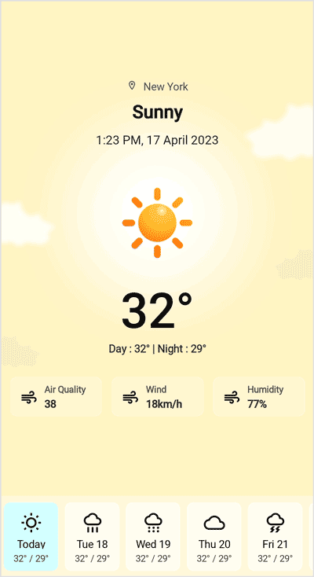
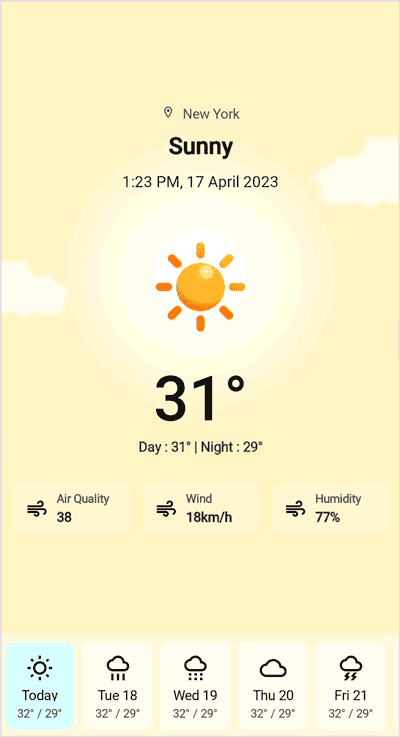

# Getting Started with .NET MAUI PullToRefresh

This section guides you through setting up and configuring a [PullToRefresh](https://help.syncfusion.com/cr/maui/Syncfusion.Maui.PullToRefresh.SfPullToRefresh.html) in your .NET MAUI application. Follow the steps below to add a basic PullToRefresh to your project.




## Prerequisites

Before proceeding, ensure the following are set up:

1. Install [.NET 9 SDK](https://dotnet.microsoft.com/en-us/download/dotnet/9.0) or later.
2. Set up a .NET MAUI environment with Visual Studio 2022 v17.12 or later.

## Step 1: Create a new .NET MAUI project

1. Go to **File > New > Project** and choose the **.NET MAUI App** template.
2. Name the project and choose a location, then click **Next**.
3. Select the .NET framework version and click **Create**.

## Step 2: Install the Syncfusion® MAUI PullToRefresh NuGet package

1. In **Solution Explorer**, right-click the project and choose **Manage NuGet Packages**.
2. Search for [Syncfusion.Maui.PullToRefresh](https://www.nuget.org/packages/Syncfusion.Maui.PullToRefresh/) and install the latest version.
3. Ensure the necessary dependencies are installed correctly and the project is restored. If not, open the **Package Manager Console** and run `dotnet restore`.




## Prerequisites

Before proceeding, ensure the following are set up:

1. Install [.NET 9 SDK](https://dotnet.microsoft.com/en-us/download/dotnet/9.0) or later.
2. Set up a .NET MAUI environment with Visual Studio Code.
3. Ensure that the .NET MAUI workloads are installed and configured as described [here](https://learn.microsoft.com/en-us/dotnet/maui/get-started/installation?view=net-maui-9.0&tabs=visual-studio-code).

## Step 1: Create a .NET MAUI project

1. Open the command palette by pressing <kbd>Ctrl</kbd>+<kbd>Shift</kbd>+<kbd>P</kbd> and type **.NET: New Project**, then press <kbd>Enter</kbd>.
2. Choose the **.NET MAUI App** template.
3. Select the project location, type the project name, and press <kbd>Enter</kbd>.
4. Then choose **Create project**.

## Step 2: Install the Syncfusion® MAUI PullToRefresh NuGet package

1. Press <kbd>Ctrl</kbd>+<kbd>`</kbd> (backtick) to open the integrated terminal in Visual Studio Code.
2. Ensure you are in the project root directory where your `.csproj` file is located.
3. Run the command `dotnet add package Syncfusion.Maui.PullToRefresh` to install the Syncfusion® .NET MAUI PullToRefresh package.
4. To ensure all dependencies are installed, run `dotnet restore`.



## Prerequisites

Before proceeding, ensure the following are set up:

1. Install [.NET 9 SDK](https://dotnet.microsoft.com/en-us/download/dotnet/9.0) or later.
2. Set up a .NET MAUI environment with JetBrains Rider 2024.3 or later.
3. Make sure the MAUI workloads are installed and configured as described [here](https://www.jetbrains.com/help/rider/MAUI.html#before-you-start).

## Step 1: Create a new .NET MAUI project

1. Go to **File > New Solution**, select **.NET (C#)**, and choose the **.NET MAUI App** template.
2. Enter the project name, solution name, and location.
3. Select the .NET framework version and click **Create**.

## Step 2: Install the Syncfusion® MAUI PullToRefresh NuGet package

1. In **Solution Explorer**, right-click the project and choose **Manage NuGet Packages**.
2. Search for [Syncfusion.Maui.PullToRefresh](https://www.nuget.org/packages/Syncfusion.Maui.PullToRefresh/) and install the latest version.
3. Ensure the necessary dependencies are installed correctly and the project is restored. If not, open the integrated terminal and run `dotnet restore`.




The following steps apply to all three IDEs.

## Step 3: Register the Syncfusion handler

Make sure to add the namespace.



using Syncfusion.Maui.Core.Hosting;



Register the Syncfusion core handler in your `CreateMauiApp` method of `MauiProgram.cs` file to use Syncfusion controls.



builder.ConfigureSyncfusionCore();
 


## Step 4: Add the PullToRefresh namespace

Add the following namespace in your XAML or C#.




xmlns:syncfusion="clr-namespace:Syncfusion.Maui.PullToRefresh;assembly=Syncfusion.Maui.PullToRefresh"




using Syncfusion.Maui.PullToRefresh;




## Step 5: Add the SfPullToRefresh component

The `SfPullToRefresh` component lets users refresh content with a pull-down gesture. The [PullableContent](https://help.syncfusion.com/cr/maui/Syncfusion.Maui.PullToRefresh.SfPullToRefresh.html#Syncfusion_Maui_PullToRefresh_SfPullToRefresh_PullableContent) property defines the area where the gesture is recognized. By default, the [TransitionMode](https://help.syncfusion.com/cr/maui/Syncfusion.Maui.PullToRefresh.SfPullToRefresh.html#Syncfusion_Maui_PullToRefresh_SfPullToRefresh_TransitionMode) is [SlideOnTop](https://help.syncfusion.com/cr/maui/Syncfusion.Maui.PullToRefresh.PullToRefreshTransitionType.html#Syncfusion_Maui_PullToRefresh_PullToRefreshTransitionType_SlideOnTop).

Add the following code to `MainPage.xaml` inside the existing root layout. The `x:Name` field is auto-generated in `MainPage.xaml.cs` by `InitializeComponent()`:




<syncfusion:SfPullToRefresh x:Name="pullToRefresh">
    <syncfusion:SfPullToRefresh.PullableContent>
        <StackLayout>
            <Label Text="sample page" />
        </StackLayout>
    </syncfusion:SfPullToRefresh.PullableContent>
</syncfusion:SfPullToRefresh>




public MainPage()
{
    InitializeComponent();
    this.pullToRefresh.Refreshing += PullToRefresh_Refreshing;
}

private async void PullToRefresh_Refreshing(object? sender, EventArgs e)
{
    this.pullToRefresh.IsRefreshing = true;

    // Simulate fetching updated data here.
    await Task.Delay(2000);

    this.pullToRefresh.IsRefreshing = false;
}




Handle the [Refreshing](https://help.syncfusion.com/cr/maui/Syncfusion.Maui.PullToRefresh.SfPullToRefresh.html#Syncfusion_Maui_PullToRefresh_SfPullToRefresh_Refreshing) event to update your data, set [IsRefreshing](https://help.syncfusion.com/cr/maui/Syncfusion.Maui.PullToRefresh.SfPullToRefresh.html#Syncfusion_Maui_PullToRefresh_SfPullToRefresh_IsRefreshing) to `true` while data is being loaded, and back to `false` when the update completes to dismiss the progress indicator.

For MVVM scenarios, you can also bind `IsRefreshing` to a boolean property on your ViewModel and toggle it from the `Refreshing` command.

The following image shows the default `SlideOnTop` transition behavior:

You can download the PullToRefresh Getting Started sample from [GitHub](https://github.com/SyncfusionExamples/getting-started-with-.net-maui-pull-to-refresh/tree/master).

To use the [Push](https://help.syncfusion.com/cr/maui/Syncfusion.Maui.PullToRefresh.PullToRefreshTransitionType.html#Syncfusion_Maui_PullToRefresh_PullToRefreshTransitionType_Push) transition mode instead, set the [TransitionMode](https://help.syncfusion.com/cr/maui/Syncfusion.Maui.PullToRefresh.SfPullToRefresh.html#Syncfusion_Maui_PullToRefresh_SfPullToRefresh_TransitionMode) property as shown below.




<syncfusion:SfPullToRefresh x:Name="pullToRefresh"
                            TransitionMode="Push"
                            VerticalOptions="FillAndExpand">
    <syncfusion:SfPullToRefresh.PullableContent>
        <StackLayout>
            <Label Text="sample page" />
        </StackLayout>
    </syncfusion:SfPullToRefresh.PullableContent>
</syncfusion:SfPullToRefresh>




For details on additional properties such as `ProgressColor`, `PullingThreshold`, and `RefreshContent`, see the [Customization](customization.md) page.

## Step 6: Run the application

1. Select the target platform (Android, iOS, Windows, or macOS) in the IDE run menu.
2. Press **F5** (Visual Studio / Visual Studio Code) or click **Run** in JetBrains Rider to build and deploy the app.
3. On the page hosting `SfPullToRefresh`, swipe down from the top of the `PullableContent` to trigger a refresh.

## Layout considerations

`SfPullToRefresh` does not render any content of its own, so you must set an explicit size or `LayoutOptions` when loading it inside a layout. Otherwise, the control will collapse to zero height.